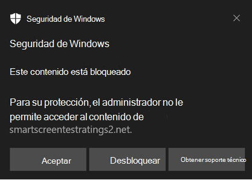
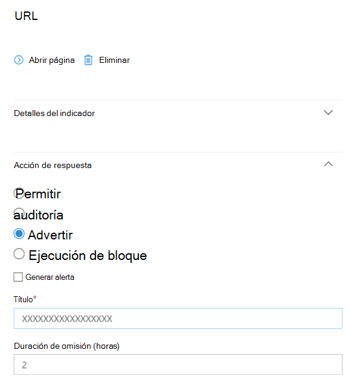

# <a name="protect-your-network"></a>Proteger la red

[!INCLUDE [Microsoft 365 Defender rebranding](../../includes/microsoft-defender.md)]

**Se aplica a:**

- [Microsoft Defender para punto de conexión Plan 2](https://go.microsoft.com/fwlink/p/?linkid=2154037)
- [Microsoft 365 Defender](https://go.microsoft.com/fwlink/?linkid=2118804)
- Antivirus de Microsoft Defender

**Plataformas**
- Windows

> ¿Quiere experimentar Microsoft Defender para punto de conexión? [Regístrese para obtener una prueba gratuita.](https://signup.microsoft.com/create-account/signup?products=7f379fee-c4f9-4278-b0a1-e4c8c2fcdf7e&ru=https://aka.ms/MDEp2OpenTrial?ocid=docs-wdatp-exposedapis-abovefoldlink)

## <a name="overview-of-network-protection"></a>Introducción a la protección de red

La protección de red ayuda a proteger los dispositivos frente a eventos basados en Internet. La protección de red es una capacidad de reducción de la superficie expuesta a ataques. Ayuda a evitar que los empleados accedan a dominios peligrosos a través de aplicaciones. Los dominios que hospedan estafas de phishing, vulnerabilidades de seguridad y otro contenido malintencionado en Internet se consideran peligrosos. La protección de red expande el ámbito de [SmartScreen de Microsoft Defender](/windows/security/threat-protection/microsoft-defender-smartscreen/microsoft-defender-smartscreen-overview) para bloquear todo el tráfico HTTP saliente que intenta conectarse a orígenes de baja reputación (en función del dominio o el nombre de host).

La protección de red amplía la protección de la [protección web](web-protection-overview.md) al nivel del sistema operativo. Proporciona la funcionalidad de protección web que se encuentra en Microsoft Edge a otros exploradores y aplicaciones que no son de explorador compatibles. La protección de red también proporciona visibilidad y bloqueo de indicadores de riesgo (IOC) cuando se usan con la [detección y respuesta de puntos de conexión](overview-endpoint-detection-response.md). Por ejemplo, la protección de red funciona con [los indicadores personalizados](manage-indicators.md) que puede usar para bloquear dominios o nombres de host específicos.

> [!TIP]
> Consulte Microsoft Defender para punto de conexión sitio de prueba en [demo.wd.microsoft.com](https://demo.wd.microsoft.com?ocid=cx-wddocs-testground) para ver cómo funciona la protección de red.

> [!NOTE]
> El sitio de demostración de Defender para punto de conexión en demo.wd.microsoft.com está en desuso y se eliminará en el futuro.

## <a name="requirements-for-network-protection"></a>Requisitos para la protección de red

La protección de red requiere Windows 10 Pro o Enterprise y Antivirus de Microsoft Defender protección en tiempo real.

****

| Versión de Windows | Antivirus de Microsoft Defender |
|:---|:---|
| Windows 10 versión 1709 o posterior <br> Windows 11 <br> Windows Server 1803 o posterior | [Antivirus de Microsoft Defender protección en tiempo real](configure-real-time-protection-microsoft-defender-antivirus.md) <br> y la [protección entregada en la nube](enable-cloud-protection-microsoft-defender-antivirus.md) debe estar habilitada (activa)|

## <a name="why-network-protection-is-important"></a>Por qué es importante la protección de red

> [!IMPORTANT]
> Parte de la información se refiere a productos preliminares que pueden ser modificados sustancialmente antes de su lanzamiento comercial. Microsoft no otorga garantías, expresas o implícitas, con respecto a la información que aquí se proporciona.
>
> La información sobre las características que están disponibles comercialmente sigue la información de la versión preliminar pública.

La protección de red forma parte del grupo de soluciones de reducción de superficie expuesta a ataques en Microsoft Defender para punto de conexión. La protección de red permite el bloqueo de nivel 3 (capa de red) de direcciones URL e direcciones IP. La protección de red puede bloquear el acceso a las direcciones URL desde exploradores de terceros y conexiones de red estándar.

De forma predeterminada, la protección de red protege los equipos de direcciones URL malintencionadas conocidas mediante la fuente de pantalla inteligente, que bloquea las direcciones URL malintencionadas de forma similar a SmartScreen en Microsoft Edge explorador. La funcionalidad de protección de red se puede ampliar a:

- Bloquear ip/dirección URL de su propio Intel de amenazas (indicadores)
- Bloquear servicios no autorizadas de Microsoft Cloud App Security (MCAS)
- Bloquear sitios en función de la categoría (filtrado de contenido web)

Network Protections es una parte fundamental de la pila de protección y respuesta de Microsoft.

Para obtener más información sobre Network Protection para Windows Server, Linux, MacOS y MTD, consulte [Búsqueda proactiva de amenazas con búsqueda avanzada](advanced-hunting-overview.md).

### <a name="block-command-and-control-c2-attacks"></a>Bloquear ataques de comando y control (C2)

Los equipos de servidor C2 los usan usuarios malintencionados para enviar comandos a sistemas en peligro por malware y, a continuación, ejercen algún tipo de control sobre sistemas en peligro. Los ataques C2 normalmente se ocultan en servicios basados en la nube, como el uso compartido de archivos y los servicios de correo web, lo que permite que los servidores C2 eviten la detección combinando con el tráfico típico.

Los servidores C2 se pueden usar para iniciar comandos que pueden:

- robar datos (por ejemplo, mediante phishing)
- controlar equipos en peligro en una botnet
- interrumpir aplicaciones legítimas
- propagar malware, como ransomware

El componente Protección de red de Microsoft Defender para punto de conexión identifica y bloquea las conexiones a las infraestructuras C2 usadas en ataques de ransomware operados por personas, mediante técnicas como el aprendizaje automático y la identificación inteligente del indicador de riesgo (IoC).

#### <a name="network-protection-new-toast-notifications"></a>Protección de red: nuevas notificaciones del sistema

| Nueva asignación  | Categoría de respuesta  | Fuentes |
| :--- | :--- | :--- |
| suplantación de identidad (phishing) | Suplantación de identidad (phishing) | SmartScreen |
| Maliciosos | Malintencionado | SmartScreen |
| comando y control | C2 | SmartScreen |
| comando y control | COCO | SmartScreen |
| Maliciosos | Untrusted | SmartScreen |
| por el administrador de TI | CustomBlockList |   |
| por el administrador de TI | CustomPolicy |   |

> [!NOTE]
> **customAllowList** no genera notificaciones en los puntos de conexión.

### <a name="new-notifications-for-network-protection-determination"></a>Nuevas notificaciones para la determinación de la protección de red

Una nueva funcionalidad disponible públicamente en la protección de red usa funciones en SmartScreen para bloquear las actividades de suplantación de identidad (phishing) de sitios de control y comandos malintencionados.

Cuando un usuario final intenta visitar un sitio web en un entorno en el que está habilitada la protección de red, son posibles tres escenarios:

- La dirección URL tiene una **buena reputación conocida** : en este caso, el usuario tiene acceso permitido sin obstrucción y no se presenta ninguna notificación del sistema en el punto de conexión. De hecho, el dominio o la dirección URL se establecen en _Permitido_.
- La dirección URL tiene una **reputación desconocida o incierta** : el acceso del usuario está bloqueado, pero con la capacidad de eludir (desbloquear) el bloque. De hecho, el dominio o la dirección URL se establece en _Auditar_.
- La dirección URL tiene una **reputación mal conocida (malintencionada):** se impide el acceso al usuario. De hecho, el dominio o la dirección URL se establece en _Bloquear_.

#### <a name="warn-experience"></a>Experiencia de advertencia

Un usuario visita un sitio web:

- Si la dirección URL tiene una reputación desconocida o incierta, una notificación del sistema presentará al usuario las siguientes opciones:

  - **Aceptar** : la notificación del sistema se publica (se quita) y el intento de acceder al sitio finaliza.
  - **Desbloquear**: el usuario no tendrá que acceder al portal Windows Defender Security Intelligence (WDSI) para obtener acceso al sitio. El usuario tendrá acceso al sitio durante 24 horas; momento en el que el bloque se vuelve a habilitar durante otras 24 horas. El usuario puede seguir usando **Desbloquear** para acceder al sitio hasta el momento en que el administrador prohíba (bloquea) el sitio, lo que elimina la opción **de Desbloquear**.
  - **Comentarios** : la notificación del sistema presenta al usuario un vínculo para enviar una incidencia, que el usuario puede usar para enviar comentarios al administrador en un intento de justificar el acceso al sitio.

  > [!div class="mx-imgBorder"]
  > 

  > [NOTA!] Las imágenes que se muestran aquí para la experiencia de advertencia y la experiencia de bloqueo (a continuación) muestran **"url bloqueada"** como texto de marcador de posición de ejemplo; en un entorno que funciona, se mostrará la dirección URL o el dominio reales.  

#### <a name="block-experience"></a>Experiencia en bloques

Un usuario visita un sitio web:

- Si la dirección URL tiene mala reputación, una notificación del sistema presentará al usuario las siguientes opciones:
  - **Vale** La notificación del sistema se publica (quita) y finaliza el intento de acceder al sitio.
  - **Comentarios** La notificación del sistema presenta al usuario un vínculo para enviar una incidencia, que el usuario puede usar para enviar comentarios al administrador en un intento de justificar el acceso al sitio.
  
  > [!div class="mx-imgBorder"]
  > 

### <a name="network-protection-c2-detection-and-remediation"></a>Protección de red: detección y corrección de C2

En su forma inicial, ransomware es una amenaza de mercancía, preprogramada y centrada en resultados limitados y específicos (por ejemplo, el cifrado de un equipo). Sin embargo, el ransomware ha evolucionado hasta convertirse en una amenaza sofisticada que es controlada por el ser humano, adaptable y centrada en resultados a mayor escala y más extendidos; como mantener activos o datos completos de una organización para el rescate.

La compatibilidad con comandos y control (C2) es una parte clave de esta evolución de ransomware y es lo que permite que estos ataques se adapten al entorno al que se dirigen. Romper el vínculo a la infraestructura de comandos y control significa detener la progresión de un ataque a su siguiente fase.

#### <a name="detecting-and-remediating-cobaltstrike-public-preview"></a>Detección y corrección de CobaltStrike (versión preliminar pública)

Uno de los marcos de post-explotación más comunes utilizados en ataques de ransomware operados por el hombre es CobaltStrike. Los equipos de Inteligencia sobre amenazas de Microsoft realizan un seguimiento de _tácticas, técnicas y procedimientos_ (TTP) en varios grupos de actividad que implementan ransomware para identificar patrones de comportamiento que se pueden usar para defenderse de estrategias específicas y vectores de amenazas utilizados por actores malintencionados. Estos grupos de actividad de ransomware, en algún momento del ciclo de vida del ataque, implican la implementación de una baliza CobaltStrike en el equipo de una víctima para habilitar la actividad práctica del teclado.

CobaltStrike permite personalizar varios aspectos del ataque, desde la capacidad de hospedar varios agentes de escucha que responden a distintos protocolos, hasta cómo el componente principal del lado cliente (Beacon) debe realizar la inserción de código y ejecutar trabajos posteriores a la explotación. Cuando Microsoft Defender detecta CobaltStrike, puede buscar y recopilar de forma inteligente indicadores clave de riesgo (IoC). Una vez capturados, estos indicadores se comparten en toda la pila de productos de Microsoft con fines de detección y protección.

La detección de comandos y controles de Microsoft Defender no se limita a CobaltStrike. Microsoft Defender puede capturar los ioC clave de varias familias de malware. Los indicadores se comparten en la pila de protección de Microsoft para proteger a los clientes y alertarlos si hay un riesgo.

Bloquear la comunicación de comandos y controles puede impedir gravemente un ataque dirigido, lo que proporciona a los defensores tiempo para encontrar los vectores de entrada iniciales y cerrarlos antes de otro intento de ataque.

<!-- Hide {this intro with no subsequent list items}
[For additional details about Microsoft Defender's command and control detection, see **ADD LINK TO BLOG**.]
-->

## <a name="smart-screen-unblock"></a>Desbloqueo de pantalla inteligente

Una nueva característica de indicadores de Microsoft Defender para punto de conexión permite a los administradores permitir a los usuarios finales omitir las "advertencias" generadas para algunas direcciones URL e direcciones IP. En función de por qué se bloqueó la dirección URL, cuando se encuentra un bloque de pantalla inteligente, puede ofrecer a los administradores la capacidad de desbloquear el sitio durante un máximo de 24 horas. En tales casos, aparecerá una notificación del sistema de Seguridad de Windows, lo que permite al usuario final **desbloquear** la dirección URL o la dirección IP durante el período de tiempo definido.  

 > [!div class="mx-imgBorder"]
 > 

Microsoft Defender para punto de conexión Los administradores pueden configurar la funcionalidad de desbloqueo de pantalla inteligente en [Microsoft 365 Defender](https://security.microsoft.com/), mediante la siguiente herramienta de configuración. En el portal de Microsoft 365 Defender, vaya a la ruta de acceso a ConfigToolName.

<!-- Hide {this intro with no subsequent list items}
[Line 171: Delete the colon and the right angle-brackets. The resulting sentence will be "From the [MS365 Defender] portal, navigate to path to ConfigToolName." Delete "to" and add "the" before path unless a specific description is available. Would a screenshot help? Normally angle brackets or arrows are used in place of certain text rather than in addition.]
-->

 > [!div class="mx-imgBorder"]
 > 

## <a name="using-network-protection"></a>Uso de la protección de red

La protección de red está habilitada por dispositivo, que normalmente se realiza mediante la infraestructura de administración. Para ver los métodos admitidos, consulte [Activar la protección de red](enable-network-protection.md).

> [!NOTE]
> Antivirus de Microsoft Defender debe estar activo para habilitar la protección de red.

Puede habilitar protección de red en modo **auditoría** o **modo de bloqueo** . Si desea evaluar el impacto de habilitar Protección de red antes de bloquear direcciones IP o direcciones URL, puede habilitarla en modo auditoría durante un período de tiempo para recopilar datos sobre lo que se bloquearía. Registros de modo de auditoría cuando los usuarios finales se han conectado a una dirección o sitio que, de lo contrario, habrían sido bloqueados por la protección de red.

## <a name="advanced-hunting"></a>Búsqueda avanzada

Si usa búsqueda avanzada para identificar eventos de auditoría, tendrá un historial de hasta 30 días disponible en la consola. Consulte [Búsqueda avanzada](advanced-hunting-overview.md).

Puede encontrar los datos de auditoría en **Búsqueda avanzada** en el portal de Microsoft Defender para punto de conexión.  

Los eventos se encuentran en DeviceEvents con un ActionType de ExploitGuardNetworkProtectionAudited. ExploitGuardNetworkProtectionBlocked muestra los bloques.  

En el ejemplo siguiente se incluyen las acciones bloqueadas:

DeviceEvents

- Where ActionType in ('ExploitGuardNetworkProtectionAudited','ExploitGuardNetworkProtectionBlocked')

 > [!div class="mx-imgBorder"]
 > 

> [!TIP]
> Estas entradas tienen datos en la columna AdditionalFields, lo que proporciona una gran información sobre la acción; si expande AdditionalFields, también puede obtener los campos **IsAudit**, **ResponseCategory** y **DisplayName**.

DeviceEvents:

- donde ActionType contiene "ExploitGuardNetworkProtection"
- extend ParsedFields=parse_json(AdditionalFields)
- project DeviceName, ActionType, Timestamp, RemoteUrl, InitiatingProcessFileName, IsAudit=tostring(ParsedFields.IsAudit), ResponseCategory=tostring(ParsedFields.ResponseCategory), DisplayName=tostring(ParsedFields.DisplayName)
- ordenar por timestamp desc

La categoría de respuesta indica lo que causó el evento, por ejemplo:

| ResponseCategory | Característica responsable del evento |
|:---|:---|
| CustomPolicy |  WCF  |
| CustomBlockList  |   Indicadores personalizados   |
| CasbPolicy   |   Defender for Cloud Apps   |
| Malintencionado   |   Amenazas web  |
| Suplantación de identidad (phishing)  |   Amenazas web  |

Para obtener más información, consulte [Solución de problemas de bloques de puntos de conexión](web-protection-overview.md#troubleshoot-endpoint-blocks).

Puede usar la lista resultante de direcciones URL y direcciones IP para determinar qué se habría bloqueado si el dispositivo estuviera en modo de bloque, así como qué característica las bloqueó. Revise cada elemento de la lista para identificar direcciones URL o direcciones IP si son necesarias para su entorno. Si encuentra entradas auditadas que son críticas para su entorno, cree un indicador para permitirlas en la red. Los indicadores de dirección URL/IP permitidos tienen prioridad sobre cualquier bloque.

Una vez que haya creado un indicador, puede examinar la resolución del problema subyacente:

- Pantalla inteligente: revisión de solicitudes
- Indicador: modificación del indicador existente
- MCA: revisión de una aplicación no autorizada
- WCF: recategorización de solicitudes

Con estos datos, puede tomar una decisión informada sobre la habilitación de la protección de red en modo de bloque. Consulte [Orden de precedencia de los bloques de protección de red](web-protection-overview.md#order-of-precedence).

> [!NOTE]
> Dado que se trata de una configuración por dispositivo si hay dispositivos que no pueden pasar al modo de bloqueo, simplemente puede dejarlos en auditoría hasta que pueda rectificar el desafío y seguirá recibiendo los eventos de auditoría.

Para obtener información sobre cómo notificar falsos positivos, vea [Notificar falsos positivos](web-protection-overview.md#report-false-positives).

Para obtener más información sobre cómo crear sus propios informes de Power BI, consulte [Creación de informes personalizados mediante Power BI](api-power-bi.md).

## <a name="configuring-network-protection"></a>Configuración de la protección de red

Para obtener más información sobre cómo habilitar la protección de red, consulte **[Habilitación de la protección de red](enable-network-protection.md)**. Use los CSP de directiva de grupo, PowerShell o MDM para habilitar y administrar la protección de red en la red.

Después de habilitar los servicios, es posible que tenga que configurar la red o el firewall para permitir las conexiones entre los servicios y los dispositivos (también conocidos como puntos de conexión).

- `.smartscreen.microsoft.com`
- `.smartscreen-prod.microsoft.com`

## <a name="viewing-network-protection-events"></a>Visualización de eventos de protección de red

La protección de red funciona mejor con [Microsoft Defender para punto de conexión](microsoft-defender-endpoint.md), lo que proporciona informes detallados sobre eventos y bloques de protección contra vulnerabilidades como parte de [escenarios de investigación de alertas](investigate-alerts.md).

Cuando la protección de red bloquea una conexión, se muestra una notificación desde el Centro de acciones. El equipo de operaciones de seguridad puede [personalizar la notificación con los](attack-surface-reduction-rules-deployment-implement.md#customize-attack-surface-reduction-rules) detalles de la organización y la información de contacto. Además, las reglas de reducción de superficie expuesta a ataques individuales se pueden habilitar y personalizar para adaptarse a ciertas técnicas de supervisión.

También puede usar [el modo de auditoría](audit-windows-defender.md) para evaluar cómo afectaría la protección de red a su organización si estuviera habilitada.

## <a name="review-network-protection-events-in-the-microsoft-365-defender-portal"></a>Revisión de eventos de protección de red en el portal de Microsoft 365 Defender

Microsoft Defender para punto de conexión proporciona informes detallados sobre eventos y bloques como parte de sus escenarios de investigación de [alertas](investigate-alerts.md). Puede ver estos detalles en el portal de Microsoft 365 Defender ([https://security.microsoft.com](https://security.microsoft.com)) de la cola de [alertas](review-alerts.md) o mediante la [búsqueda avanzada](advanced-hunting-overview.md). Si usa el [modo de auditoría](audit-windows-defender.md), puede usar la búsqueda avanzada para ver cómo afectaría la configuración de protección de red a su entorno si estuvieran habilitadas.

Esta es una consulta de ejemplo para la búsqueda avanzada:

```kusto
DeviceNetworkEvents
|where ActionType in ('ExploitGuardNetworkProtectionAudited','ExploitGuardNetworkProtectionBlocked', 'ConnectionSuccess')
```

## <a name="review-network-protection-events-in-windows-event-viewer"></a>Revisión de eventos de protección de red en Windows Visor de eventos

Puede revisar el registro de eventos Windows para ver los eventos que se crean cuando la protección de red bloquea (o audita) el acceso a una dirección IP o dominio malintencionados:

1. [Copie el XML directamente](event-views.md).

2. Seleccione **Aceptar**.

Este procedimiento crea una vista personalizada que filtra para mostrar solo los siguientes eventos relacionados con la protección de red:

****

|Id. de evento|Descripción|
|---|---|
|5007|Evento cuando se cambia la configuración|
|1125|Evento cuando se activa la protección de red en modo de auditoría|
|1126|Evento cuando se activa la protección de red en modo de bloque|
|

## <a name="network-protection-and-the-tcp-three-way-handshake"></a>Protección de red y protocolo de enlace de tres vías TCP

Con la protección de red, la determinación de si permitir o bloquear el acceso a un sitio se realiza después de la finalización del [protocolo de enlace triple a través de TCP/IP](/troubleshoot/windows-server/networking/three-way-handshake-via-tcpip). Por lo tanto, cuando la protección de red bloquea un sitio, es posible que vea un tipo de acción de `ConnectionSuccess` `NetworkConnectionEvents` en en el portal de Microsoft 365 Defender, aunque el sitio se haya bloqueado realmente. `NetworkConnectionEvents` se notifican desde la capa TCP y no desde la protección de red. Una vez completado el protocolo de enlace triple, la protección de red permite o bloquea el acceso al sitio.

Este es un ejemplo de cómo funciona:

1. Supongamos que un usuario intenta acceder a un sitio web en su dispositivo. El sitio se hospeda en un dominio peligroso y debe estar bloqueado por la protección de red.  

2. Comienza el protocolo de enlace triple a través de TCP/IP. Antes de que se complete, se registra una `NetworkConnectionEvents` acción y su `ActionType` aparece como `ConnectionSuccess`. Sin embargo, tan pronto como se complete el proceso de protocolo de enlace de tres vías, la protección de red bloquea el acceso al sitio. Todo esto sucede muy rápidamente. Se produce un proceso similar con [SmartScreen de Microsoft Defender](/windows/security/threat-protection/microsoft-defender-smartscreen/microsoft-defender-smartscreen-overview); es cuando se completa el protocolo de enlace triple que se realiza una determinación y se bloquea o se permite el acceso a un sitio.

3. En el portal de Microsoft 365 Defender, se muestra una alerta en la cola de [alertas](alerts-queue.md). Los detalles de esa alerta incluyen tanto `NetworkConnectionEvents` como `AlertEvents`. Puede ver que el sitio se bloqueó, aunque también tenga un `NetworkConnectionEvents` elemento con actiontype de `ConnectionSuccess`.

## <a name="considerations-for-windows-virtual-desktop-running-windows-10-enterprise-multi-session"></a>Consideraciones para Windows escritorio virtual que ejecuta Windows 10 Enterprise sesión múltiple

Debido a la naturaleza multiusuario de Windows 10 Enterprise, tenga en cuenta los siguientes puntos:

1. La protección de red es una característica de todo el dispositivo y no se puede dirigir a sesiones de usuario específicas.

2. Las directivas de filtrado de contenido web también están en todo el dispositivo.

3. Si necesita diferenciar entre grupos de usuarios, considere la posibilidad de crear asignaciones y grupos de hosts de Virtual Desktop independientes Windows.

4. Pruebe la protección de red en modo de auditoría para evaluar su comportamiento antes de su implementación.

5. Considere la posibilidad de cambiar el tamaño de la implementación si tiene un gran número de usuarios o un gran número de sesiones de varios usuarios.

### <a name="alternative-option-for-network-protection"></a>Opción alternativa para la protección de red

Para Windows 10 Enterprise multisesión 1909 o posterior, que se usa en Windows Virtual Desktop en Azure, la protección de red para Microsoft Edge se puede habilitar mediante el método siguiente:

1. Use [Activar la protección de red](enable-network-protection.md) y siga las instrucciones para aplicar la directiva.

2. Ejecute los siguientes comandos de PowerShell:
  - `Set-MpPreference -EnableNetworkProtection Enabled`
  - `Set-MpPreference -AllowNetworkProtectionOnWinServer 1`
  - `Set-MpPreference -AllowNetworkProtectionDownLevel 1`
  - `Set-MpPreference -AllowDatagramProcessingOnWinServer 1`

## <a name="network-protection-troubleshooting"></a>Solución de problemas de protección de red

Debido al entorno donde se ejecuta la protección de red, es posible que Microsoft no pueda detectar la configuración del proxy del sistema operativo. En algunos casos, los clientes de protección de red no pueden acceder a Cloud Service. Para resolver el problema de conectividad, los clientes con licencias E5 deben configurar una de las siguientes claves del Registro:

```console
reg add "HKLM\Software\Microsoft\Windows Defender" /v ProxyServer /d "<proxy IP address: Port>" /f
reg add "HKLM\Software\Microsoft\Windows Defender" /v ProxyPacUrl /d "<Proxy PAC url>" /f

```

## <a name="see-also"></a>Consulte también

- [Evaluación de la protección de red](evaluate-network-protection.md) | Realice un escenario rápido que muestre cómo funciona la característica y qué eventos se crearían normalmente.
- [Habilitar la protección de red](enable-network-protection.md) | Use los CSP de directiva de grupo, PowerShell o MDM para habilitar y administrar la protección de red en la red.
- [Configuración de capacidades de reducción de superficie expuesta a ataques en Microsoft Intune](/mem/intune/protect/endpoint-security-asr-policy)
