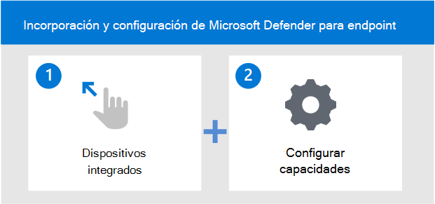

# Incorporar dispositivos y configurar las funcionalidades de Microsoft Defender para punto de conexión

[!INCLUDE [Microsoft 365 Defender rebranding](../../includes/microsoft-defender.md)]

**Se aplica a:**
- [Microsoft Defender para punto de conexión Plan 2](https://go.microsoft.com/fwlink/p/?linkid=2154037)
- [Microsoft 365 Defender](https://go.microsoft.com/fwlink/?linkid=2118804)

[!include[Prerelease information](../../includes/prerelease.md)]

> ¿Desea experimentar Defender for Endpoint? [Regístrese para obtener una prueba gratuita.](https://signup.microsoft.com/create-account/signup?products=7f379fee-c4f9-4278-b0a1-e4c8c2fcdf7e&ru=https://aka.ms/MDEp2OpenTrial?ocid=docs-wdatp-onboardconfigure-abovefoldlink)

La implementación de Microsoft Defender para endpoint es un proceso de dos pasos.

- Dispositivos incorporados al servicio
- Configurar funcionalidades del servicio

## Dispositivos incorporados al servicio
Tendrás que ir a la sección de incorporación del portal de Defender for Endpoint para incorporar cualquiera de los dispositivos compatibles. Según el dispositivo, se te guiará con los pasos adecuados y te ofrecerán opciones de herramientas de administración e implementación adecuadas para el dispositivo. 

En general, para incorporar dispositivos al servicio:

- Comprobar que el dispositivo cumple los [requisitos mínimos](minimum-requirements.md)
- Según el dispositivo, siga los pasos de configuración proporcionados en la sección incorporación del portal de Defender para endpoints
- Usar la herramienta de administración y el método de implementación adecuados para los dispositivos
- Ejecutar una prueba de detección para comprobar que los dispositivos están correctamente incorporados e informando al servicio

## Opciones de herramientas de incorporación y configuración
En la tabla siguiente se enumeran las herramientas disponibles en función del extremo que necesita incorporar.

| Punto de conexión     | Opciones de herramientas                       |
|--------------|------------------------------------------|
| **Windows**  |  [Script local (hasta 10 dispositivos)](configure-endpoints-script.md)    [Directiva de grupo](configure-endpoints-gp.md)    [Microsoft Endpoint Manager/ Administrador de dispositivos móviles](configure-endpoints-mdm.md)     [Microsoft Endpoint Configuration Manager](configure-endpoints-sccm.md)   [Scripts VDI](configure-endpoints-vdi.md)   [Integración con Microsoft Defender for Cloud](configure-server-endpoints.md#integration-with-azure-defender)  |
| **macOS**    | [Scripts locales](mac-install-manually.md)   [Microsoft Endpoint Manager](mac-install-with-intune.md)   [JAMF Pro](mac-install-with-jamf.md)   [Administración de dispositivos móviles](mac-install-with-other-mdm.md) |
| **Servidor Linux** | [Script local](linux-install-manually.md)   [Puppet](linux-install-with-puppet.md)   [Ansible](linux-install-with-ansible.md)|
| **iOS**      | [Microsoft Endpoint Manager](ios-install.md)               |
| **Android**  | [Microsoft Endpoint Manager](android-intune.md)            | 

En la tabla siguiente se enumeran las herramientas disponibles en función del extremo que necesita incorporar.

## Configurar funcionalidades del servicio
Los dispositivos de incorporación permiten la detección y respuesta de puntos de conexión de Micorosft Defender para Endpoint.

Después de incorporar los dispositivos, tendrás que configurar las otras funcionalidades del servicio. En la tabla siguiente se enumeran las capacidades que puede configurar para obtener la mejor protección para su entorno.

| Funcionalidad | Descripción |
|-|-|
| [Configuración de la & de vulnerabilidades (TVM)](tvm-prerequisites.md) | Threat & Vulnerability Management es un componente de Microsoft Defender para endpoint y proporciona a los administradores de seguridad y a los equipos de operaciones de seguridad un valor único, incluidos:    - Información en tiempo detección y respuesta de puntos de conexión (EDR) correlacionada con vulnerabilidades de punto de conexión.    - Contexto de vulnerabilidad de dispositivo incalculable durante las investigaciones de incidentes.    - Procesos de corrección integrados a Microsoft Intune y Microsoft System Center Configuration Manager.  |
| [Configurar la protección de última generación (NGP)](configure-microsoft-defender-antivirus-features.md) | Antivirus de Microsoft Defender es una solución antimalware integrada que proporciona protección de última generación para escritorios, equipos portátiles y servidores. El Antivirus de Microsoft Defender incluye:   -Protección entregada en la nube para la detección casi instantánea y el bloqueo de amenazas nuevas y emergentes. Junto con Intelligent Security Graph y el aprendizaje automático, la protección en la nube forma parte de las tecnologías de última generación utilizadas por el Antivirus de Microsoft Defender.    - Análisis siempre continuo mediante la supervisión avanzada del comportamiento de procesos y archivos y otras heurísticas (también conocida como "protección en tiempo real").   - Actualizaciones de protección dedicadas basadas en aprendizaje automático, análisis de big-data humanos y automatizados e investigación detallada de resistencia a amenazas. |
| [Configurar la reducción de superficie de ataque (ASR)](overview-attack-surface-reduction.md) | Las capacidades de reducción de superficie de ataque en Microsoft Defender para endpoint ayudan a proteger los dispositivos y aplicaciones de la organización frente a amenazas nuevas y emergentes. |
| [Configurar las capacidades de & de investigación automática (AIR)](configure-automated-investigations-remediation.md) | Microsoft Defender para endpoint usa investigaciones automatizadas para reducir significativamente el volumen de alertas que deben investigarse individualmente. La característica de investigación automatizada aprovecha varios algoritmos de inspección y procesos usados por analistas (como playbooks) para examinar alertas y tomar medidas de corrección inmediatas para resolver infracciones. Esto reduce considerablemente el volumen de alertas, lo que facilita que los expertos de operaciones de seguridad puedan centrarse en amenazas más complejas y otras iniciativas de alto valor. |
| [Configurar Expertos en amenazas de Microsoft (MTE)](configure-microsoft-threat-experts.md) | Expertos en amenazas de Microsoft es un servicio de búsqueda administrado que proporciona a los Centros de operaciones de seguridad (SOC) supervisión y análisis de nivel de experto para ayudarles a garantizar que las amenazas críticas en sus entornos únicos no se pierden.      |

## Funcionalidades admitidas para Windows dispositivos

|Sistema operativo  |Windows 10 & 11  |Windows Server 2012 R2 [[1](#fn1)]  |Windows Server 2016[[1](#fn1)]   |Windows Server 2019 & 2022|Windows Server 1803+|
|---------|---------|---------|---------|---------|---------|
|**Prevención**    |         |         |         |         |         |
|Reglas de reducción de superficie de ataque     |    v     |   v      |    v     |    v     |    v     |
|Control de dispositivo     |     v    |    N     |    N     |    N     |    N     |  
|Firewall     |      v   |    v     |     v    |    v    |    v   |
|Protección de red     |      v   |    v     |     v    |    v    |    v   |
|Protección de última generación     |      v   |    v     |     v    |    v    |    v   |
|Protección contra alteraciones     |        v   |    v     |     v    |    v    |    v   |
|Protección web     |       v   |    v     |     v    |    v    |    v   |
|||||||
|**Detección**     |         |         |         |||
|Búsqueda avanzada de amenazas     |      v   |    v     |     v    |    v    |    v   |
|Indicadores de archivo personalizados     |      v   |    v     |     v    |    v    |    v   |
|Indicadores de red personalizados     |      v   |    v     |     v    |    v    |    v   |
|EDR bloquear & modo pasivo     |      v   |    v     |     v    |    v    |    v   |
|Sensor de detección de sensores     |      v   |    v     |     v    |    v    |    v   |
|Detección & de dispositivos de red de endpoint     |      v   |    N     |     N    |    N    |    N   |
|||||||
|**Respuesta**     |         |         |         |||
|Respuesta automática de & investigación (AIR)    |      v   |    v     |     v    |    v    |    v   |
|Capacidades de respuesta de dispositivos: aislamiento, recopilación de paquetes de investigación, ejecución de análisis antivirus     |      v   |    v     |     v    |    v    |    v   |
|Capacidades de respuesta de archivos: recopilar archivos, análisis profundo, bloquear archivos, detener y poner en cuarentena procesos     |      v   |    v     |     v    |    v    |    v   |
|Respuesta en directo    |      v   |    v     |     v    |    v    |    v   |

(<a id="fn1">1</a>) Hace referencia a la solución moderna y unificada para Windows Server 2012 y 2016. Para obtener más información, consulte [Onboard Windows Servers to the Defender for Endpoint service](configure-server-endpoints.md).

>[!NOTE]
>Windows 7, 8.1, Windows Server 2008 R2 incluyen compatibilidad con el sensor EDR y ANTIVIRUS con System Center Endpoint Protection (SCEP).
