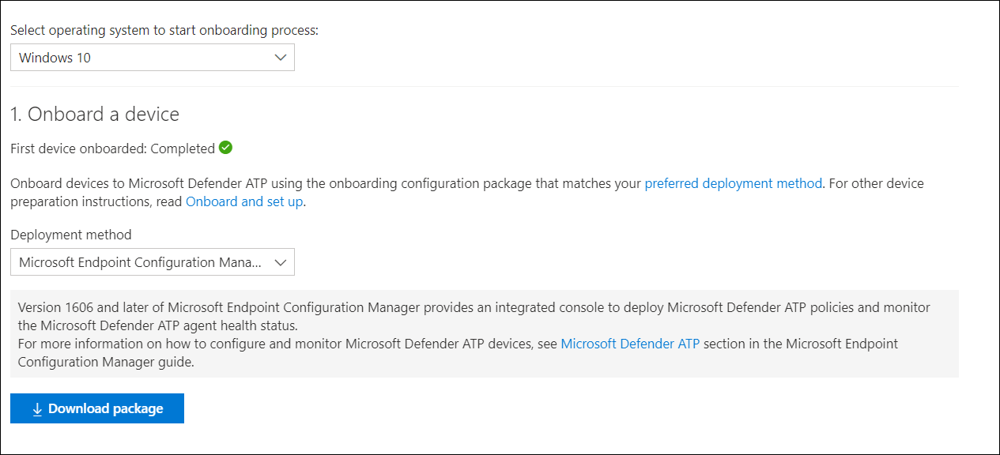
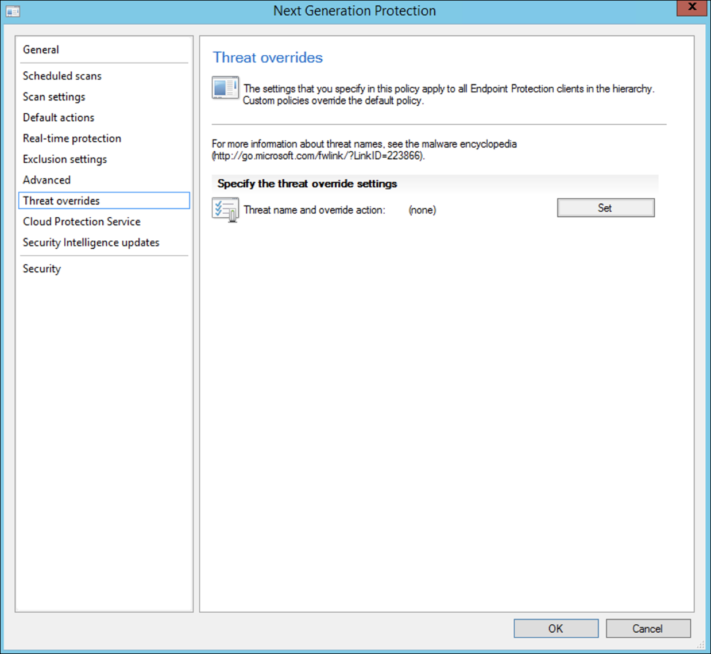

# Incorporación mediante Microsoft Endpoint Configuration ManagerOnboarding using Microsoft Endpoint Configuration Manager

[!INCLUDE [Microsoft 365 Defender rebranding](../../includes/microsoft-defender.md)]

**Se aplica a:****Applies to:**
- [Microsoft Defender para punto de conexiónMicrosoft Defender for Endpoint](https://go.microsoft.com/fwlink/p/?linkid=2154037)
- [Microsoft 365 DefenderMicrosoft 365 Defender](https://go.microsoft.com/fwlink/?linkid=2118804)

> ¿Desea experimentar Microsoft Defender para endpoint?Want to experience Microsoft Defender for Endpoint? [Regístrate para obtener una versión de prueba gratuita.Sign up for a free trial.](https://www.microsoft.com/microsoft-365/windows/microsoft-defender-atp?ocid=docs-wdatp-exposedapis-abovefoldlink)

Este artículo forma parte de la guía de implementación y actúa como un método de incorporación de ejemplo.This article is part of the Deployment guide and acts as an example onboarding method. 

En el [tema Planeación,](deployment-strategy.md) se proporcionaron varios métodos para incorporar dispositivos al servicio.In the [Planning](deployment-strategy.md) topic, there were several methods provided to onboard devices to the service. En este tema se trata la arquitectura de administración en colaboración.This topic covers the co-management architecture. 

 *Diagrama de arquitecturas de entorno*
*Diagram of environment architectures*

Aunque Defender para endpoint admite la incorporación de varios puntos de conexión y herramientas, este artículo no los cubre.While Defender for Endpoint supports onboarding of various endpoints and tools, this article does not cover them. Para obtener información sobre la incorporación general con otras herramientas y métodos de implementación compatibles, vea [Onboarding overview](onboarding.md).For information on general onboarding using other supported deployment tools and methods, see [Onboarding overview](onboarding.md).

En este tema se guía a los usuarios en:This topic guides users in:
- Paso 1: Incorporación de dispositivos Windows al servicioStep 1: Onboarding Windows devices to the service 
- Paso 2: Configuración de las capacidades de Defender para puntos de conexiónStep 2: Configuring Defender for Endpoint capabilities

Esta guía de incorporación le ayudará a seguir los siguientes pasos básicos que debe seguir al usar Microsoft Endpoint Configuration Manager:This onboarding guidance will walk you through the following basic steps that you need to take when using Microsoft Endpoint Configuration Manager:
- **Creación de una colección en Microsoft Endpoint Configuration Manager****Creating a collection in Microsoft Endpoint Configuration Manager**
- **Configuración de Las capacidades de Microsoft Defender para endpoints con Microsoft Endpoint Configuration Manager****Configuring Microsoft Defender for Endpoint capabilities using Microsoft Endpoint Configuration Manager**

>[!NOTE]
>Solo los dispositivos Windows se tratan en esta implementación de ejemplo.Only Windows devices are covered in this example deployment. 

## Paso 1: Incorporar dispositivos Windows con Microsoft Endpoint Configuration ManagerStep 1: Onboard Windows devices using Microsoft Endpoint Configuration Manager

### Creación de coleccionesCollection creation
Para incorporar dispositivos Windows 10 con Microsoft Endpoint Configuration Manager, la implementación puede dirigirse a una colección existente o se puede crear una nueva colección para pruebas.To onboard Windows 10 devices with Microsoft Endpoint Configuration Manager, the deployment can target an existing collection or a new collection can be created for testing. 

La incorporación mediante herramientas como la directiva de grupo o el método manual no instala ningún agente en el sistema.Onboarding using tools such as Group policy or manual method does not install any agent on the system. 

En la consola de Microsoft Endpoint Configuration Manager, el proceso de incorporación se configurará como parte de la configuración de cumplimiento de la consola.Within the Microsoft Endpoint Configuration Manager console the onboarding process will be configured as part of the compliance settings within the console.

Cualquier sistema que reciba esta configuración necesaria mantendrá esa configuración mientras el cliente de Configuration Manager siga recibiendo esta directiva desde el punto de administración.Any system that receives this required configuration will maintain that configuration for as long as the Configuration Manager client continues to receive this policy from the management point. 

Siga los pasos siguientes para incorporar puntos de conexión con Microsoft Endpoint Configuration Manager.Follow the steps below to onboard endpoints using Microsoft Endpoint Configuration Manager.

1. En la consola de Microsoft Endpoint Configuration Manager, vaya a **Assets and Compliance Overview Device \> \> Collections**.In Microsoft Endpoint Configuration Manager console, navigate to **Assets and Compliance \> Overview \> Device Collections**.            

    

2. Haga clic con el **botón secundario en Colección de** dispositivos y seleccione Crear colección de **dispositivos**.Right Click **Device Collection** and select **Create Device Collection**.

    

3. Proporcione una **colección Name** y **Limiting y,** a continuación, **seleccione Siguiente**.Provide a **Name** and **Limiting Collection**, then select **Next**.

    

4. Seleccione **Agregar regla** y elija Regla de **consulta**.Select **Add Rule** and choose **Query Rule**.

    

5.  Haga **clic en Siguiente** en el Asistente para pertenencia **directa** y haga clic en Editar **instrucción query**.Click **Next** on the **Direct Membership Wizard** and click on **Edit Query Statement**.

     

6. Seleccione **Criterios** y, a continuación, elija el icono de estrella.Select **Criteria** and then choose the star icon.

     

7. Mantenga el tipo de criterio como valor **simple**,  elija dónde como Sistema operativo **-** número de compilación , operador como mayor o igual que y valor **14393** y haga clic en **Aceptar**.Keep criterion type as **simple value**, choose where as **Operating System - build number**, operator as **is greater than or equal to** and value **14393** and click on **OK**.

    

8. Seleccione **Siguiente** y **Cerrar**.Select **Next** and **Close**.

    

9. Seleccione **Siguiente**.Select **Next**.

    

Después de completar esta tarea, ahora tienes una colección de dispositivos con todos los puntos de conexión de Windows 10 en el entorno.After completing this task, you now have a device collection with all the Windows 10 endpoints in the environment. 

## Paso 2: Configurar Microsoft Defender para las funcionalidades de punto de conexiónStep 2: Configure Microsoft Defender for Endpoint capabilities 
En esta sección se le guía en la configuración de las siguientes funcionalidades con Microsoft Endpoint Configuration Manager en dispositivos Windows:This section guides you in configuring the following capabilities using Microsoft Endpoint Configuration Manager on Windows devices:

- [**EDR****Endpoint detection and response**](#endpoint-detection-and-response)
- [**Protección de última generación****Next-generation protection**](#next-generation-protection)
- [**Reducción de la superficie expuesta a ataques****Attack surface reduction**](#attack-surface-reduction)

### EDREndpoint detection and response
#### Windows 10Windows 10
Desde el Centro de seguridad de Microsoft Defender es posible descargar la directiva ".onboarding" que se puede usar para crear la directiva en System Center Configuration Manager e implementarla en dispositivos Windows 10.From within the Microsoft Defender Security Center it is possible to download the '.onboarding' policy that can be used to create the policy in System Center Configuration Manager and deploy that policy to Windows 10 devices.

1. En un Portal del Centro de seguridad de Microsoft Defender, seleccione Configuración y, a [continuación, Incorporación](https://securitycenter.windows.com/preferences2/onboarding).From a Microsoft Defender Security Center Portal, select [Settings and then Onboarding](https://securitycenter.windows.com/preferences2/onboarding).

2. En Método de implementación, seleccione la versión compatible de **Microsoft Endpoint Configuration Manager**.Under Deployment method select the supported version of **Microsoft Endpoint Configuration Manager**.

    

3. Seleccione **Descargar paquete**.Select **Download package**.

    

4. Guarde el paquete en una ubicación accesible.Save the package to an accessible location.
5. En Microsoft Endpoint Configuration Manager, vaya a: **Assets and Compliance > Overview > Endpoint Protection > Directivas de ATP** de Microsoft Defender .In  Microsoft Endpoint Configuration Manager, navigate to: **Assets and Compliance > Overview > Endpoint Protection > Microsoft Defender ATP Policies**.

6. Haga clic con el botón **secundario en Directivas de ATP de Microsoft Defender** y seleccione Crear directiva de ATP de Microsoft **Defender**.Right-click **Microsoft Defender ATP Policies** and select **Create Microsoft Defender ATP Policy**.

    

7. Escriba el nombre y la descripción, compruebe **que la incorporación** está seleccionada y, a continuación, seleccione **Siguiente**.Enter the name and description, verify **Onboarding** is selected, then select **Next**.

    

8. Haga clic en **Examinar**.Click **Browse**.

9. Vaya a la ubicación del archivo descargado desde el paso 4 anterior.Navigate to the location of the downloaded file from step 4 above.

10. Haga clic en **Siguiente**.Click **Next**.
11. Configure el agente con los ejemplos adecuados (**Ninguno** o **Todos los tipos de archivo**).Configure the Agent with the appropriate samples (**None** or **All file types**).

    

12. Seleccione la telemetría adecuada (**Normal** o **Expedited**) y, a continuación, haga clic **en Siguiente**.Select the appropriate telemetry (**Normal** or **Expedited**) then click **Next**.

    

14. Compruebe la configuración y, a continuación, haga clic **en Siguiente**.Verify the configuration, then click **Next**.

     

15. Haga **clic en** Cerrar cuando se complete el Asistente.Click **Close** when the Wizard completes.

16.  En la consola de Microsoft Endpoint Configuration Manager, haga clic con el botón secundario en la directiva defender para puntos de conexión que acaba de crear y seleccione **Implementar**.In the Microsoft Endpoint Configuration Manager console, right-click the Defender for Endpoint policy you just created and select **Deploy**.

     

17. En el panel derecho, seleccione la colección creada anteriormente y haga clic en **Aceptar**.On the right panel, select the previously created collection and click **OK**.

    

#### Versiones anteriores de Windows Client (Windows 7 y Windows 8.1)Previous versions of Windows Client (Windows 7 and Windows 8.1)
Siga los pasos siguientes para identificar el identificador del área de trabajo de punto de conexión y la clave de área de trabajo de Defender for Endpoint, que serán necesarios para la incorporación de versiones anteriores de Windows.Follow the steps below to identify the Defender for Endpoint Workspace ID and Workspace Key, that will be required for the onboarding of previous versions of Windows.

1. En un Portal del Centro de seguridad de Microsoft Defender, seleccione **Configuración > incorporación**.From a Microsoft Defender Security Center Portal, select **Settings > Onboarding**.

2. En sistema operativo, **elija Windows 7 SP1 y 8.1**.Under operating system choose **Windows 7 SP1 and 8.1**.

3. Copie el **identificador del área de trabajo** y la clave de área de **trabajo** y guárdelos.Copy the **Workspace ID** and **Workspace Key** and save them. Se usarán más adelante en el proceso.They will be used later in the process.

    

4. Instale Microsoft Monitoring Agent (MMA).Install the Microsoft Monitoring Agent (MMA).  
    MMA actualmente (a partir de enero de 2019) es compatible con los siguientes sistemas operativos Windows:MMA is currently (as of January 2019) supported on the following Windows Operating Systems:

    -   SKU de servidor: Windows Server 2008 SP1 o versiones posterioresServer SKUs: Windows Server 2008 SP1 or Newer

    -   SKU de cliente: Windows 7 SP1 y versiones posterioresClient SKUs: Windows 7 SP1 and later

    El agente mma tendrá que instalarse en dispositivos Windows.The MMA agent will need to be installed on Windows devices. Para instalar el agente, algunos sistemas  tendrán que descargar la actualización para la experiencia del cliente y la telemetría de diagnóstico para recopilar los datos con MMA.To install the agent, some systems will need to download the [Update for customer experience and diagnostic telemetry](https://support.microsoft.com/help/3080149/update-for-customer-experience-and-diagnostic-telemetry) in order to collect the data with MMA. Estas versiones del sistema incluyen, pero no pueden limitarse a:These system versions include but may not be limited to:

    -   Windows 8.1Windows 8.1

    -   Windows 7Windows 7

    -   Windows Server 2016Windows Server 2016

    -   Windows Server 2012 R2Windows Server 2012 R2

    -   Windows Server 2008 R2Windows Server 2008 R2

    Específicamente, para Windows 7 SP1, deben instalarse las siguientes revisiones:Specifically, for Windows 7 SP1, the following patches must be installed:

    -   Instalar [KB4074598](https://support.microsoft.com/help/4074598/windows-7-update-kb4074598)Install [KB4074598](https://support.microsoft.com/help/4074598/windows-7-update-kb4074598)

    -   Instale .NET Framework [4.5](https://www.microsoft.com/download/details.aspx?id=30653) (o posterior) **o** 
         [KB3154518](https://support.microsoft.com/help/3154518/support-for-tls-system-default-versions-included-in-the-net-framework).Install either [.NET Framework 4.5](https://www.microsoft.com/download/details.aspx?id=30653) (or later) **or**
        [KB3154518](https://support.microsoft.com/help/3154518/support-for-tls-system-default-versions-included-in-the-net-framework).
        No instale ambos en el mismo sistema.Do not install both on the same system.

5. Si usa un proxy para conectarse a Internet, consulte la sección Configurar opciones de proxy.If you're using a proxy to connect to the Internet see the Configure proxy settings section.

Una vez completado, debería ver puntos de conexión incorporados en el portal en una hora.Once completed, you should see onboarded endpoints in the portal within an hour.

### Protección de última generaciónNext generation protection 
El Antivirus de Microsoft Defender es una solución antimalware integrada que proporciona una protección de última generación para equipos de escritorio, equipos portátiles y servidores.Microsoft Defender Antivirus is a built-in antimalware solution that provides next generation protection for desktops, portable computers, and servers.

1. En la consola de Microsoft Endpoint Configuration Manager, vaya a **Assets and Compliance Overview Endpoint Protection \> \> \> Antimalware Polices** y elija **Create Antimalware Policy**.In the Microsoft Endpoint Configuration Manager console, navigate to **Assets and Compliance \> Overview \> Endpoint Protection \> Antimalware Polices** and choose **Create Antimalware Policy**.

    

2. Seleccione **Exámenes programados,** Configuración del examen **,** Acciones predeterminadas **,** Protección en tiempo **real** **,** Configuración de exclusión **,** Avanzadas , Invalidaciones de **amenazas,** Servicio **de protección** en la nube y Actualizaciones de inteligencia de **seguridad** y elija **Aceptar**.Select **Scheduled scans**, **Scan settings**, **Default actions**, **Real-time protection**, **Exclusion settings**, **Advanced**, **Threat overrides**, **Cloud Protection Service** and **Security intelligence   updates** and choose **OK**.

    

    En determinados sectores o en algunos clientes empresariales selectos puede haber necesidades específicas sobre cómo se configura Antivirus.In certain industries or some select enterprise customers might have specific needs on how Antivirus is configured.

  
    [Examen rápido frente a examen completo y examen personalizadoQuick scan versus full scan and custom scan](https://docs.microsoft.com/windows/security/threat-protection/microsoft-defender-antivirus/scheduled-catch-up-scans-microsoft-defender-antivirus#quick-scan-versus-full-scan-and-custom-scan)

    Para obtener más información, consulta [Marco de configuración de seguridad de Windows](https://docs.microsoft.com/windows/security/threat-protection/windows-security-configuration-framework/windows-security-configuration-framework)For more details, see [Windows Security configuration framework](https://docs.microsoft.com/windows/security/threat-protection/windows-security-configuration-framework/windows-security-configuration-framework)
  
    

    

    

    

    

    

    

    

3. Haga clic con el botón secundario en la directiva antimalware recién creada y seleccione **Implementar**.Right-click on the newly created antimalware policy and select **Deploy**.

    

4. Dirigir la nueva directiva antimalware a la colección de Windows 10 y haga clic en **Aceptar**.Target the new antimalware policy to your Windows 10 collection and click **OK**.

     

Después de completar esta tarea, ahora ha configurado correctamente Windows Defender Antivirus.After completing this task, you now have successfully configured Windows Defender Antivirus.

### Reducción de la superficie expuesta a ataquesAttack surface reduction
El pilar de reducción de superficie de ataque de Defender para endpoint incluye el conjunto de características que está disponible en Protección contra vulnerabilidades de seguridad.The attack surface reduction pillar of Defender for Endpoint includes the feature set that is available under Exploit Guard. Reglas de reducción de superficie de ataque (ASR), Acceso controlado a carpetas, Protección de red y Protección contra vulnerabilidades de seguridad.Attack surface reduction (ASR) rules, Controlled Folder Access, Network Protection and Exploit Protection. 

Todas estas características proporcionan un modo de auditoría y un modo de bloqueo.All these features provide an audit mode and a block mode. En el modo de auditoría no hay ningún impacto para el usuario final.In audit mode there is no end-user impact. Todo lo que hace es recopilar telemetría adicional y hacer que esté disponible en el Centro de seguridad de Microsoft Defender.All it does is collect additional telemetry and make it available in the Microsoft Defender Security Center. El objetivo con una implementación es mover paso a paso los controles de seguridad al modo de bloqueo.The goal with a deployment is to step-by-step move security controls into block mode.

Para establecer reglas ASR en modo auditoría:To set ASR rules in Audit mode:

1. En la consola de Microsoft Endpoint Configuration Manager, vaya a **Assets and Compliance Overview Endpoint Protection Windows Defender Exploit \> \> \> Guard** y elija **Create Exploit Guard Policy**.In the Microsoft Endpoint Configuration Manager console, navigate to **Assets and Compliance \> Overview \> Endpoint Protection \> Windows Defender Exploit Guard** and choose **Create Exploit Guard Policy**.

   

2.  Selecciona **Reducción de superficie de ataque**.Select **Attack Surface Reduction**.
   

3. Establezca reglas en **Auditar** y haga clic **en Siguiente**.Set rules to **Audit** and click **Next**.

    

4. Para confirmar la nueva directiva de Protección contra vulnerabilidades de seguridad, haga clic en **Siguiente**.Confirm the new Exploit Guard policy by clicking on **Next**.

    

    
5. Una vez creada la directiva, haga clic **en Cerrar**.Once the policy is created click **Close**.

    

    
   

6.  Haga clic con el botón secundario en la directiva recién creada y elija **Implementar**.Right-click on the newly created policy and choose **Deploy**.
    
    

7. Dirigir la directiva a la colección de Windows 10 recién creada y hacer clic en **Aceptar**.Target the policy to the newly created Windows 10 collection and click **OK**.

    

Después de completar esta tarea, ahora ha configurado correctamente las reglas de ASR en el modo de auditoría.After completing this task, you now have successfully configured ASR rules in audit mode.  
  
A continuación se indican pasos adicionales para comprobar si las reglas ASR se aplican correctamente a los puntos de conexión.Below are additional steps to verify whether ASR rules are correctly applied to endpoints. (Esto puede tardar unos minutos)(This may take few minutes)

1. Desde un explorador web, vaya a <https://securitycenter.windows.com> .From a web browser, navigate to <https://securitycenter.windows.com>.

2.  Seleccione **Administración de configuración** en el menú del lado izquierdo.Select **Configuration management** from left side menu.

3. Haz **clic en Ir a la administración de superficies de** ataque en el panel Administración de superficie de ataque.Click **Go to attack surface management** in the Attack surface management panel. 
    
    

4. Haga clic **en la pestaña** Configuración en Informes de reglas de reducción de superficie de ataque.Click **Configuration** tab in Attack surface reduction rules reports. Muestra información general sobre la configuración de reglas ASR y el estado de las reglas ASR en cada dispositivo.It shows ASR rules configuration overview and ASR rules status on each devices.

    

5. Haga clic en cada dispositivo para ver los detalles de configuración de las reglas de ASR.Click each device shows configuration details of ASR rules.

    

Consulte [Optimizar la implementación y detecciones](https://docs.microsoft.com/microsoft-365/security/defender-endpoint/configure-machines-asr)   de reglas ASR para obtener más información.See [Optimize ASR rule deployment and detections](https://docs.microsoft.com/microsoft-365/security/defender-endpoint/configure-machines-asr)   for more details.  

#### Establecer reglas de protección de red en modo auditoría:Set Network Protection rules in Audit mode:
1. En la consola de Microsoft Endpoint Configuration Manager, vaya a **Assets and Compliance Overview Endpoint Protection Windows Defender Exploit \> \> \> Guard** y elija **Create Exploit Guard Policy**.In the Microsoft Endpoint Configuration Manager console, navigate to **Assets and  Compliance \> Overview \> Endpoint Protection \> Windows Defender Exploit Guard** and choose **Create Exploit Guard Policy**.

    

2. Seleccione **Protección de red**.Select **Network protection**.

3. Establezca la configuración en **Auditar** y haga clic en **Siguiente**.Set the setting to **Audit** and click **Next**. 

    

4. Para confirmar la nueva directiva de Protección contra vulnerabilidades de seguridad, haga clic en **Siguiente**.Confirm the new Exploit Guard Policy by clicking **Next**.
    
    

5. Una vez creada la directiva, haga clic en **Cerrar**.Once the policy is created click on **Close**.

    

6. Haga clic con el botón secundario en la directiva recién creada y elija **Implementar**.Right-click on the newly created policy and choose **Deploy**.

    

7. Selecciona la directiva de la colección de Windows 10 recién creada y elige **Aceptar**.Select the policy to the newly created Windows 10 collection and choose **OK**.

    

Después de completar esta tarea, ahora ha configurado correctamente Protección de red en modo auditoría.After completing this task, you now have successfully configured Network Protection in audit mode.

#### Para establecer reglas de acceso controlado a carpetas en modo auditoría:To set Controlled Folder Access rules in Audit mode:

1. En la consola de Microsoft Endpoint Configuration Manager, vaya a **Assets and Compliance Overview Endpoint Protection Windows Defender Exploit \> \> \> Guard** y elija **Create Exploit Guard Policy**.In the Microsoft Endpoint Configuration Manager console, navigate to **Assets and Compliance \> Overview \> Endpoint Protection \> Windows Defender Exploit Guard** and choose **Create Exploit Guard Policy**.

    

2. Seleccione **Acceso controlado a carpetas**.Select **Controlled folder access**.
    
3. Establezca la configuración en **Auditar** y haga clic **en Siguiente**.Set the configuration to **Audit** and click **Next**.

        
    
4. Confirme la nueva directiva de Protección contra vulnerabilidades de seguridad haciendo clic en **Siguiente**.Confirm the new Exploit Guard Policy by clicking on **Next**.

    

5. Una vez creada la directiva, haga clic en **Cerrar**.Once the policy is created click on **Close**.

    

6. Haga clic con el botón secundario en la directiva recién creada y elija **Implementar**.Right-click on the newly created policy and choose **Deploy**.

    

7.  Dirigir la directiva a la colección de Windows 10 recién creada y hacer clic en **Aceptar**.Target the policy to the newly created Windows 10 collection and click **OK**.

    

Ahora ha configurado correctamente Acceso controlado a carpetas en modo auditoría.You have now successfully configured Controlled folder access in audit mode.

## Tema relacionadoRelated topic
- [Incorporación con Microsoft Endpoint ManagerOnboarding using Microsoft Endpoint Manager](onboarding-endpoint-manager.md)
