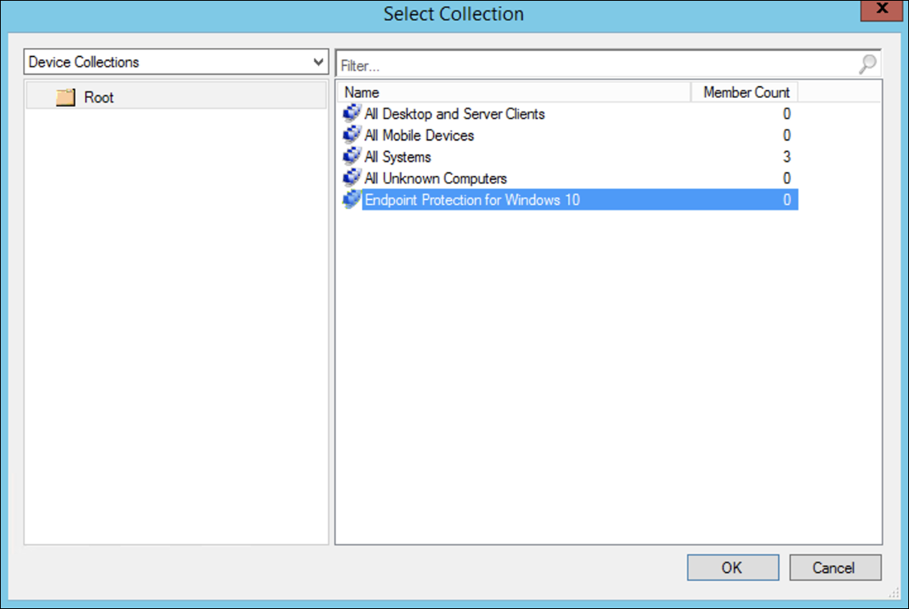

# Incorporación mediante Microsoft Endpoint Configuration Manager

[!INCLUDE [Microsoft 365 Defender rebranding](../../includes/microsoft-defender.md)]

**Se aplica a:**
- [Microsoft Defender para punto de conexión](https://go.microsoft.com/fwlink/p/?linkid=2154037)
- [Microsoft 365 Defender](https://go.microsoft.com/fwlink/?linkid=2118804)

> ¿Quiere experimentar Microsoft Defender para punto de conexión? [Regístrese para obtener una prueba gratuita.](https://signup.microsoft.com/create-account/signup?products=7f379fee-c4f9-4278-b0a1-e4c8c2fcdf7e&ru=https://aka.ms/MDEp2OpenTrial?ocid=docs-wdatp-exposedapis-abovefoldlink)

Este artículo forma parte de la guía de implementación y actúa como un método de incorporación de ejemplo.

En el [tema Planeación,](deployment-strategy.md) se proporcionaron varios métodos para incorporar dispositivos al servicio. En este tema se trata la arquitectura de administración en colaboración.

 *Diagrama de arquitecturas de entorno*

Aunque Defender para endpoint admite la incorporación de varios puntos de conexión y herramientas, este artículo no los cubre. Para obtener información sobre la incorporación general con otras herramientas y métodos de implementación compatibles, vea [Onboarding overview](onboarding.md).

En este tema se guía a los usuarios en:

- Paso 1: Incorporación de Windows dispositivos al servicio
- Paso 2: Configuración de las capacidades de Defender para puntos de conexión

Esta guía de incorporación le ayudará a seguir los siguientes pasos básicos que debe seguir al usar Microsoft Endpoint Configuration Manager:

- **Crear una colección en Microsoft Endpoint Configuration Manager**
- **Configurar Las capacidades de Microsoft Defender para puntos de conexión mediante Microsoft Endpoint Configuration Manager**

> [!NOTE]
> Solo Windows dispositivos se tratan en este ejemplo de implementación.

## Paso 1: Incorporación Windows dispositivos con Microsoft Endpoint Configuration Manager

### Creación de colecciones

Para incorporar Windows dispositivos con Microsoft Endpoint Configuration Manager, la implementación puede dirigirse a una colección existente o se puede crear una nueva colección para pruebas.

La incorporación mediante herramientas como la directiva de grupo o el método manual no instala ningún agente en el sistema.

Dentro de Microsoft Endpoint Configuration Manager consola, el proceso de incorporación se configurará como parte de la configuración de cumplimiento dentro de la consola.

Cualquier sistema que reciba esta configuración necesaria mantendrá esa configuración mientras el cliente de Configuration Manager siga recibiendo esta directiva desde el punto de administración.

Siga los pasos siguientes para incorporar puntos de conexión mediante Microsoft Endpoint Configuration Manager.

1. En Microsoft Endpoint Configuration Manager consola, vaya a **Assets and Compliance Overview Device \> \> Collections**.

    

2. Haga clic con el **botón secundario en Colección de** dispositivos y seleccione Crear colección de **dispositivos**.

    

3. Proporcione una **colección Name** y **Limiting y,** a continuación, **seleccione Siguiente**.

    

4. Seleccione **Agregar regla** y elija Regla de **consulta**.

    

5. Haga **clic en Siguiente** en el Asistente para pertenencia **directa** y haga clic en Editar **instrucción query**.

     

6. Seleccione **Criterios** y, a continuación, elija el icono de estrella.

     

7. Mantenga el tipo de criterio como valor **simple**,  elija dónde como Sistema operativo **-** número de compilación , operador como mayor o igual que y valor **14393** y haga clic en **Aceptar**.

    

8. Seleccione **Siguiente** y **Cerrar**.

    

9. Seleccione **Siguiente**.

    

Después de completar esta tarea, ahora tienes una colección de dispositivos con todos los Windows en el entorno.

## Paso 2: Configurar Microsoft Defender para las funcionalidades de punto de conexión

En esta sección se le guía en la configuración de las siguientes funcionalidades mediante Microsoft Endpoint Configuration Manager en Windows dispositivos:

- [**Detección y respuesta de puntos de conexión**](#endpoint-detection-and-response)
- [**Protección de última generación**](#next-generation-protection)
- [**Reducción de la superficie expuesta a ataques**](#attack-surface-reduction)

### Detección y respuesta de puntos de conexión

#### Windows 10 y Windows 11

Desde el portal de Microsoft 365 Defender es posible descargar la directiva ".onboarding" que se puede usar para crear la directiva en System Center Configuration Manager e implementarla en Windows 10 y Windows 11 dispositivos.

1. En un portal Microsoft 365 Defender, [seleccione Configuración y,](https://security.microsoft.com/preferences2/onboarding)a continuación, Incorporación .

2. En Método de implementación, seleccione la versión compatible **de Microsoft Endpoint Configuration Manager**.

    

3. Seleccione **Descargar paquete**.

    

4. Guarde el paquete en una ubicación accesible.
5. En Microsoft Endpoint Configuration Manager, vaya a: **Assets and Compliance > Overview > Endpoint Protection > Microsoft Defender ATP Policies**.

6. Haga clic con el botón **secundario en Directivas de ATP de Microsoft Defender** y seleccione Crear directiva de ATP de Microsoft **Defender**.

    

7. Escriba el nombre y la descripción, compruebe **que la incorporación** está seleccionada y, a continuación, seleccione **Siguiente**.

    

8. Haga clic en **Examinar**.

9. Vaya a la ubicación del archivo descargado desde el paso 4 anterior.

10. Haga clic en **Siguiente**.
11. Configure el agente con los ejemplos adecuados (**Ninguno** o **Todos los tipos de archivo**).

    

12. Seleccione la telemetría adecuada (**Normal** o **Expedited**) y, a continuación, haga clic **en Siguiente**.

    

13. Compruebe la configuración y, a continuación, haga clic **en Siguiente**.

     

14. Haga **clic en** Cerrar cuando se complete el Asistente.

15. En la Microsoft Endpoint Configuration Manager, haga clic con el botón secundario en la directiva defender para extremo que acaba de crear y seleccione **Implementar**.

     

16. En el panel derecho, seleccione la colección creada anteriormente y haga clic en **Aceptar**.

    

#### Versiones anteriores de Windows Client (Windows 7 y Windows 8.1)

Siga los pasos que se indican a continuación para identificar el identificador del área de trabajo de endpoint y la clave de área de trabajo de Defender for Endpoint, que serán necesarios para la incorporación de versiones anteriores de Windows.

1. En un portal Microsoft 365 Defender, seleccione **Configuración** incorporación de puntos de conexión \>  \>  (en **Administración de dispositivos).**

2. En sistema operativo, **elija Windows 7 SP1 y 8.1**.

3. Copie el **identificador del área de trabajo** y la clave de área de **trabajo** y guárdelos. Se usarán más adelante en el proceso.

    

4. Instale el Microsoft Monitoring Agent (MMA).

   MMA actualmente (a partir de enero de 2019) es compatible con los siguientes sistemas Windows operativos:

   - SKU del servidor: Windows Server 2008 SP1 o versiones posteriores
   - SKU de cliente: Windows 7 SP1 y versiones posteriores

   El agente mma tendrá que instalarse en Windows dispositivos. Para instalar el agente, algunos sistemas  tendrán que descargar la actualización para la experiencia del cliente y la telemetría de diagnóstico para recopilar los datos con MMA. Estas versiones del sistema incluyen, pero no pueden limitarse a:

   - Windows 8.1
   - Windows 7
   - Windows Server 2016
   - Windows Server 2012 R2
   - Windows Server 2008 R2

   En concreto, para Windows 7 SP1, deben instalarse las siguientes revisiones:

   - Instalar [KB4074598](https://support.microsoft.com/help/4074598/windows-7-update-kb4074598)
   - Instale .NET Framework [4.5](https://www.microsoft.com/download/details.aspx?id=30653) (o posterior) **o** [KB3154518](https://support.microsoft.com/help/3154518/support-for-tls-system-default-versions-included-in-the-net-framework). No instale ambos en el mismo sistema.

5. Si usa un proxy para conectarse a Internet, consulte la sección Configurar opciones de proxy.

Una vez completado, debería ver puntos de conexión incorporados en el portal en una hora.

### Protección de última generación

El Antivirus de Microsoft Defender es una solución antimalware integrada que proporciona una protección de última generación para equipos de escritorio, equipos portátiles y servidores.

1. En la Microsoft Endpoint Configuration Manager, vaya a **Assets and Compliance Overview Endpoint Protection \> \> \> Antimalware Polices** y elija **Create Antimalware Policy**.

    

2. Seleccione **Exámenes programados,** Configuración del examen **,** Acciones predeterminadas **,** Protección en tiempo **real** **,** Configuración de exclusión **,** Avanzadas , Invalidaciones de **amenazas,** Servicio **de protección** en la nube y Actualizaciones de inteligencia de **seguridad** y elija **Aceptar**.

    

    En determinados sectores o en algunos clientes empresariales selectos puede haber necesidades específicas sobre cómo se configura Antivirus.

    [Examen rápido frente a examen completo y examen personalizado](/windows/security/threat-protection/microsoft-defender-antivirus/scheduled-catch-up-scans-microsoft-defender-antivirus#quick-scan-versus-full-scan-and-custom-scan)

    Para obtener más información, [vea Seguridad de Windows de configuración](/windows/security/threat-protection/windows-security-configuration-framework/windows-security-configuration-framework).
  
    

    

    

    

    

    

    

    

3. Haga clic con el botón secundario en la directiva antimalware recién creada y seleccione **Implementar**.

    

4. Dirigir la nueva directiva antimalware a la colección Windows y haga clic en **Aceptar**.

     

Después de completar esta tarea, ahora ha configurado correctamente Antivirus de Windows Defender.

### Reducción de la superficie expuesta a ataques

El pilar de reducción de superficie de ataque de Defender para endpoint incluye el conjunto de características que está disponible en Protección contra vulnerabilidades de seguridad. Reglas de reducción de superficie de ataque (ASR), Acceso controlado a carpetas, Protección de red y Protección contra vulnerabilidades de seguridad.

Todas estas características proporcionan un modo de auditoría y un modo de bloqueo. En el modo de auditoría no hay ningún impacto para el usuario final. Todo lo que hace es recopilar telemetría adicional y hacer que esté disponible en el portal Microsoft 365 Defender web. El objetivo con una implementación es mover paso a paso los controles de seguridad al modo de bloqueo.

Para establecer reglas ASR en modo auditoría:

1. En la Microsoft Endpoint Configuration Manager, vaya a **Assets and Compliance Overview Endpoint Protection Windows Defender Exploit \> \> \> Guard** y elija **Create Exploit Guard Policy**.

   

2. Selecciona **Reducción de superficie de ataque**.

3. Establezca reglas en **Auditar** y haga clic **en Siguiente**.

    

4. Para confirmar la nueva directiva de Protección contra vulnerabilidades de seguridad, haga clic en **Siguiente**.

    

5. Una vez creada la directiva, haga clic **en Cerrar**.

    

6. Haga clic con el botón secundario en la directiva recién creada y elija **Implementar**.

    

7. Dirigir la directiva a la colección de Windows recién creada y haga clic en **Aceptar**.

    

Después de completar esta tarea, ahora ha configurado correctamente las reglas de ASR en el modo de auditoría.

A continuación se indican pasos adicionales para comprobar si las reglas ASR se aplican correctamente a los puntos de conexión. (Esto puede tardar unos minutos)

1. Desde un explorador web, vaya a <https://security.microsoft.com> .

2. Seleccione **Administración de configuración** en el menú del lado izquierdo.

3. Haz **clic en Ir a la administración de superficies de** ataque en el panel Administración de superficie de ataque.

    

4. Haga clic **en la pestaña** Configuración en Informes de reglas de reducción de superficie de ataque. Muestra información general sobre la configuración de reglas ASR y el estado de las reglas ASR en cada dispositivo.

    

5. Haga clic en cada dispositivo para ver los detalles de configuración de las reglas de ASR.

    

Consulte [Optimizar la implementación y detecciones](/microsoft-365/security/defender-endpoint/configure-machines-asr) de reglas ASR para obtener más información.

#### Establecer reglas de protección de red en modo auditoría

1. En la Microsoft Endpoint Configuration Manager, vaya a **Assets and Compliance Overview Endpoint Protection Windows Defender Exploit \> \> \> Guard** y elija **Create Exploit Guard Policy**.

    

2. Seleccione **Protección de red**.

3. Establezca la configuración en **Auditar** y haga clic en **Siguiente**.

    

4. Para confirmar la nueva directiva de Protección contra vulnerabilidades de seguridad, haga clic en **Siguiente**.

    

5. Una vez creada la directiva, haga clic en **Cerrar**.

    

6. Haga clic con el botón secundario en la directiva recién creada y elija **Implementar**.

    

7. Seleccione la directiva para la colección de archivos Windows y elija **Aceptar**.

    

Después de completar esta tarea, ahora ha configurado correctamente Protección de red en modo auditoría.

#### Para establecer reglas de acceso controlado a carpetas en modo auditoría

1. En la Microsoft Endpoint Configuration Manager, vaya a **Assets and Compliance Overview Endpoint Protection Windows Defender Exploit \> \> \> Guard** y elija **Create Exploit Guard Policy**.

    

2. Seleccione **Acceso controlado a carpetas**.

3. Establezca la configuración en **Auditar** y haga clic **en Siguiente**.

    

4. Confirme la nueva directiva de Protección contra vulnerabilidades de seguridad haciendo clic en **Siguiente**.

    

5. Una vez creada la directiva, haga clic en **Cerrar**.

    

6. Haga clic con el botón secundario en la directiva recién creada y elija **Implementar**.

    

7. Dirigir la directiva a la colección de Windows recién creada y haga clic en **Aceptar**.

    

Ahora ha configurado correctamente Acceso controlado a carpetas en modo auditoría.

## Tema relacionado

- [Incorporación con Microsoft Endpoint Manager](onboarding-endpoint-manager.md)
