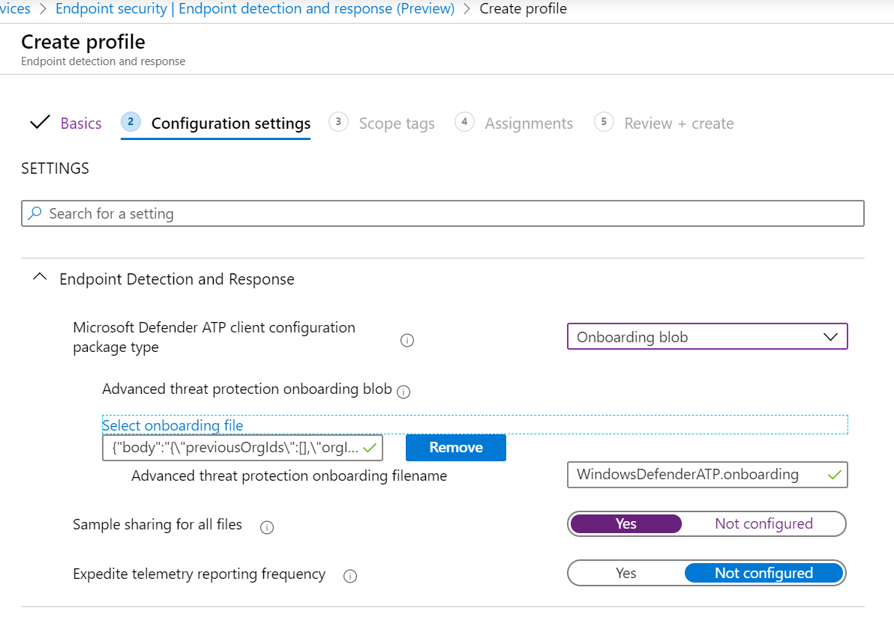
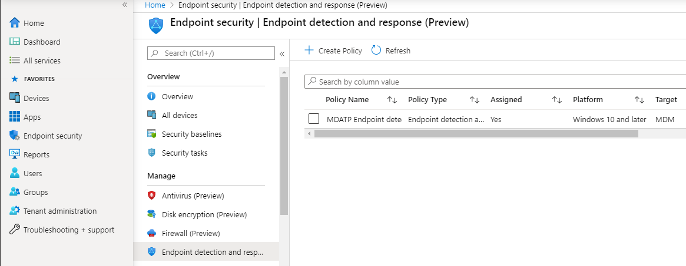
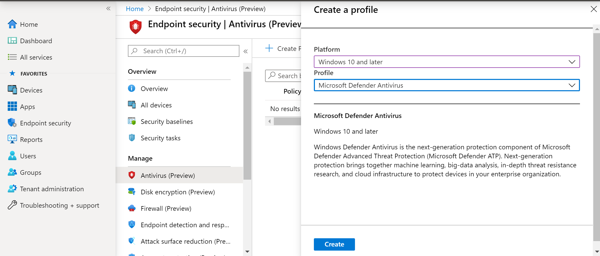
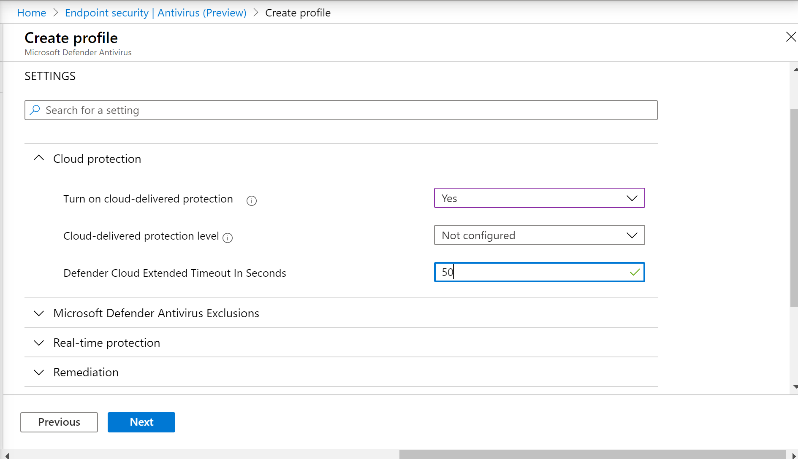
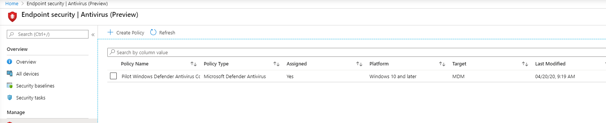
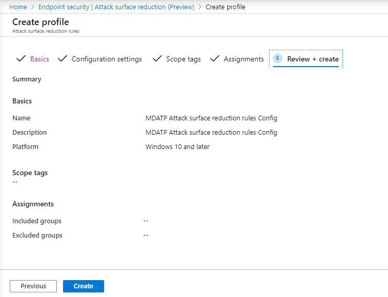
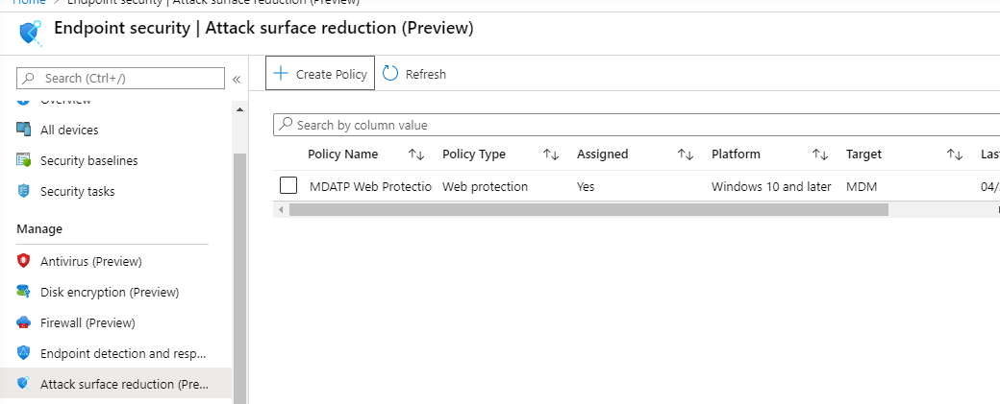
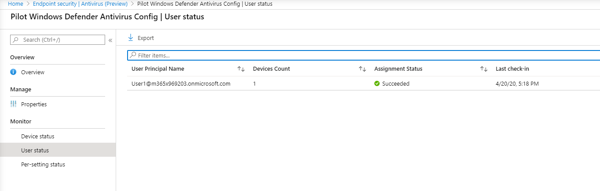

# Incorporación con Microsoft Endpoint Manager

[!INCLUDE [Microsoft 365 Defender rebranding](../../includes/microsoft-defender.md)]

**Se aplica a:**
- [Microsoft Defender para punto de conexión](https://go.microsoft.com/fwlink/p/?linkid=2154037)
- [Microsoft 365 Defender](https://go.microsoft.com/fwlink/?linkid=2118804)

> ¿Desea experimentar Microsoft Defender para endpoint? [Regístrate para obtener una versión de prueba gratuita.](https://www.microsoft.com/microsoft-365/windows/microsoft-defender-atp?ocid=docs-wdatp-exposedapis-abovefoldlink)

Este artículo forma parte de la guía de implementación y actúa como un método de incorporación de ejemplo. 

En el [tema Planeación,](deployment-strategy.md) se proporcionaron varios métodos para incorporar dispositivos al servicio. En este tema se trata la arquitectura nativa de la nube. 

 *Diagrama de arquitecturas de entorno*

Aunque Defender para endpoint admite la incorporación de varios puntos de conexión y herramientas, este artículo no los cubre. Para obtener información sobre la incorporación general con otras herramientas y métodos de implementación compatibles, vea [Onboarding overview](onboarding.md).

[Microsoft Endpoint Manager es](https://docs.microsoft.com/mem/endpoint-manager-overview) una plataforma de soluciones que unifica varios servicios. Incluye [Microsoft Intune para](https://docs.microsoft.com/mem/intune/fundamentals/what-is-intune) la administración de dispositivos basados en la nube.

En este tema se guía a los usuarios en:
- Paso 1: Incorporación de dispositivos al servicio mediante la creación de un grupo en Microsoft Endpoint Manager (MEM) para asignar configuraciones en
- Paso 2: Configuración de las capacidades de Defender para endpoints con Microsoft Endpoint Manager

Esta guía de incorporación le ayudará a seguir los siguientes pasos básicos que debe seguir al usar Microsoft Endpoint Manager:

-   [Identificación de dispositivos o usuarios de destino](#identify-target-devices-or-users)

    -   Creación de un grupo de Azure Active Directory (usuario o dispositivo)

-   [Creación de un perfil de configuración](#step-2-create-configuration-policies-to-configure-microsoft-defender-for-endpoint-capabilities)

    -   En Microsoft Endpoint Manager, le guiaremos en la creación de una directiva independiente para cada funcionalidad.

## Recursos

Estos son los vínculos que necesitará para el resto del proceso:

-   [Portal MEM](https://aka.ms/memac)

-   [Centro de seguridad](https://securitycenter.windows.com/)

-   [Líneas base de seguridad de Intune](https://docs.microsoft.com/mem/intune/protect/security-baseline-settings-defender-atp#microsoft-defender)

Para obtener más información acerca de Microsoft Endpoint Manager, consulte estos recursos:
- [Página de Microsoft Endpoint Manager](https://docs.microsoft.com/mem/)
- [Entrada de blog sobre la convergencia de Intune y ConfigMgr](https://www.microsoft.com/microsoft-365/blog/2019/11/04/use-the-power-of-cloud-intelligence-to-simplify-and-accelerate-it-and-the-move-to-a-modern-workplace/)
- [Vídeo de introducción en MEM](https://www.microsoft.com/microsoft-365/blog/2019/11/04/use-the-power-of-cloud-intelligence-to-simplify-and-accelerate-it-and-the-move-to-a-modern-workplace)

## Paso 1: Incorporar dispositivos mediante la creación de un grupo en MEM para asignar configuraciones en
### Identificar dispositivos o usuarios de destino
En esta sección, crearemos un grupo de prueba para asignar las configuraciones.

>[!NOTE]
>Intune usa grupos de Azure Active Directory (Azure AD) para administrar dispositivos y usuarios. Como administrador de Intune, puede configurar grupos que se adapten a sus necesidades organizativas. 
Para obtener más información, consulta [Agregar grupos para organizar usuarios y dispositivos.](https://docs.microsoft.com/mem/intune/fundamentals/groups-add)

### Crear un grupo

1.  Abra el portal de MEM.

2.  Abra **Grupos > Nuevo grupo**.

    > [!div class="mx-imgBorder"]
    > 

3.  Escriba los detalles y cree un nuevo grupo.

    > [!div class="mx-imgBorder"]
    > 

4.  Agrega el usuario o dispositivo de prueba.

5.  En el **panel > todos los grupos,** abra el nuevo grupo.

6.  Seleccione  **Miembros > Agregar miembros**.

7.  Busca el usuario o dispositivo de prueba y selecciónelo.

    > [!div class="mx-imgBorder"]
    > 

8.  El grupo de pruebas ahora tiene un miembro que probar.

## Paso 2: Crear directivas de configuración para configurar las capacidades de Microsoft Defender para puntos de conexión
En la siguiente sección, creará una serie de directivas de configuración.

Primero es una directiva de configuración para seleccionar qué grupos de usuarios o dispositivos se incorporarán a Defender for Endpoint:

- [Detección y respuesta de puntos de conexión.](#endpoint-detection-and-response) 

A continuación, seguirá creando varios tipos diferentes de directivas de seguridad de extremo:

- [Protección de última generación](#next-generation-protection)
- [Reducción de la superficie expuesta a ataques](#attack-surface-reduction--attack-surface-reduction-rules)

### Detección y respuesta de puntos de conexión.

1.  Abra el portal de MEM.

2.  Vaya a **Seguridad de > de detección y respuesta del extremo**. Haga clic en **Crear perfil**.

    > [!div class="mx-imgBorder"]
    > 

3.  En **Plataforma, selecciona Windows 10 y versiones posteriores, Perfil: detección de puntos de** conexión y respuesta > Crear .

4.  Escriba un nombre y una descripción y, a continuación,  **seleccione Siguiente**.

    > [!div class="mx-imgBorder"]
    > 

5.  Seleccione la configuración según sea necesario y, a continuación,  **seleccione Siguiente**.

    > [!div class="mx-imgBorder"]
    > 

    > [!NOTE]
    > En este caso, esto se ha rellenado automáticamente como Defender para endpoint ya se ha integrado con Intune. Para obtener más información sobre la integración, vea [Enable Microsoft Defender for Endpoint in Intune](https://docs.microsoft.com/mem/intune/protect/advanced-threat-protection-configure#to-enable-microsoft-defender-atp).
    > 
    > La siguiente imagen es un ejemplo de lo que verá cuando Microsoft Defender para Endpoint no esté integrado con Intune:
    >
    > 

6.  Agregue etiquetas de ámbito si es necesario y, a continuación,  **seleccione Siguiente**.

    > [!div class="mx-imgBorder"]
    > 

7.  Para agregar un grupo de prueba, haga clic en **Seleccionar grupos para incluir** y elegir el grupo y, a continuación, seleccione  **Siguiente**.

    > [!div class="mx-imgBorder"]
    > 

8.  Revise y acepte y, a continuación,  **seleccione Crear**.

    > [!div class="mx-imgBorder"]
    > 

9.  Puede ver la directiva completada.

    > [!div class="mx-imgBorder"]
    > 

### Protección de última generación

1.  Abra el portal de MEM.

2.  Vaya a **Endpoint security > Antivirus > Create Policy**.

    > [!div class="mx-imgBorder"]
    > 

3.  Seleccione **Plataforma - Windows 10 y versiones posteriores - Windows y Perfil : Antivirus** de Microsoft Defender > Crear .

4.  Escriba el nombre y la descripción y, a continuación,  **seleccione Siguiente**.

    > [!div class="mx-imgBorder"]
    > 

5.  En la **página Configuración:** establezca las configuraciones que necesita para Antivirus de Microsoft Defender (protección en la nube, exclusiones, Real-Time protección y corrección).

    > [!div class="mx-imgBorder"]
    > 

6.  Agregue etiquetas de ámbito si es necesario y, a continuación,  **seleccione Siguiente**.

    > [!div class="mx-imgBorder"]
    > 

7.  Seleccione los grupos que desea incluir, asígnelos al grupo de prueba y, a continuación,  **seleccione Siguiente**.

    > [!div class="mx-imgBorder"]
    > 

8.  Revise y cree y, a continuación,  **seleccione Crear**.

    > [!div class="mx-imgBorder"]
    > 

9.  Verá la directiva de configuración que creó.

    > [!div class="mx-imgBorder"]
    > 

### Reducción de superficie de ataque: reglas de reducción de superficie de ataque

1.  Abra el portal de MEM.

2.  Navegue hasta **Endpoint security > Reducción de superficie de ataque**.

3.  Seleccione  **Crear directiva**.

4.  Selecciona **Plataforma - Windows 10 y versiones posteriores: Perfil: reglas de** reducción de superficie > Crear .

    > [!div class="mx-imgBorder"]
    > 

5.  Escriba un nombre y una descripción y, a continuación,  **seleccione Siguiente**.

    > [!div class="mx-imgBorder"]
    > 

6.  En la **página Configuración:** Establezca las configuraciones que necesita para las reglas de reducción de superficie de ataque y, a continuación,  **seleccione Siguiente**.

    > [!NOTE]
    > Configuraremos todas las reglas de reducción de superficie de ataque en Auditar.
    > 
    > Para obtener más información, consulta [Reglas de reducción de superficie de ataque](attack-surface-reduction.md).

    > [!div class="mx-imgBorder"]
    > 

7.  Agregue etiquetas de ámbito según sea necesario y, a continuación,  **seleccione Siguiente**.

    > [!div class="mx-imgBorder"]
    > 

8.  Seleccione los grupos que desea incluir y asignar al grupo de prueba y, a continuación,  **seleccione Siguiente**.

    > [!div class="mx-imgBorder"]
    > 

9. Revise los detalles y, a continuación,  **seleccione Crear**.

    > [!div class="mx-imgBorder"]
    > 

10. Ver la directiva.

    > [!div class="mx-imgBorder"]
    > 

### Reducción de superficie de ataque: protección web

1.  Abra el portal de MEM.

2.  Navegue hasta **Endpoint security > Reducción de superficie de ataque**.

3.  Seleccione  **Crear directiva**.

4.  Seleccione **Windows 10 y versiones posteriores: protección > Crear**.

    > [!div class="mx-imgBorder"]
    > 

5.  Escriba un nombre y una descripción y, a continuación,  **seleccione Siguiente**.

    > [!div class="mx-imgBorder"]
    > 

6.  En la **página Configuración:** Establezca las configuraciones que necesita para Protección web y, a continuación,  **seleccione Siguiente**.

    > [!NOTE]
    > Estamos configurando Protección web para bloquear.
    > 
    > Para obtener más información, vea [Web Protection](web-protection-overview.md).

    > [!div class="mx-imgBorder"]
    > 

7.  Agregue **etiquetas de ámbito según > Siguiente**.

    > [!div class="mx-imgBorder"]
    > 

8.  Seleccione **Asignar a grupo de prueba > Siguiente**.

    > [!div class="mx-imgBorder"]
    > 

9.  Seleccione **Revisar y Crear > Crear**.

    > [!div class="mx-imgBorder"]
    > 

10. Ver la directiva.

    > [!div class="mx-imgBorder"]
    > 

## Validar opciones de configuración

### Confirmar que se han aplicado directivas

Una vez asignada la directiva de configuración, llevará algún tiempo aplicarla.

Para obtener información sobre el tiempo, consulta [Información de configuración de Intune](https://docs.microsoft.com/mem/intune/configuration/device-profile-troubleshoot#how-long-does-it-take-for-devices-to-get-a-policy-profile-or-app-after-they-are-assigned).

Para confirmar que la directiva de configuración se ha aplicado al dispositivo de prueba, siga el siguiente proceso para cada directiva de configuración.

1.  Abra el portal de MEM y vaya a la directiva correspondiente, como se muestra en los pasos anteriores. En el ejemplo siguiente se muestra la configuración de protección de próxima generación.

    > [!div class="mx-imgBorder"]
    > 

2.  Seleccione la **directiva de configuración** para ver el estado de la directiva.

    > [!div class="mx-imgBorder"]
    > 

3.  Selecciona  **Estado del dispositivo** para ver el estado.

    > [!div class="mx-imgBorder"]
    > 

4.  Seleccione  **Estado de usuario** para ver el estado.

    > [!div class="mx-imgBorder"]
    > 

5.  Seleccione  **Estado por configuración para** ver el estado.

    >[!TIP]
    >Esta vista es muy útil para identificar cualquier configuración que entre en conflicto con otra directiva.

    > [!div class="mx-imgBorder"]
    > 

### Detección y respuesta de puntos de conexión.

1.  Antes de aplicar la configuración, no se debe iniciar el servicio defender para Endpoint Protection.

    > [!div class="mx-imgBorder"]
    > 

2.  Una vez aplicada la configuración, debe iniciarse el servicio defender para Endpoint Protection.

    > [!div class="mx-imgBorder"]
    > 

3.  Una vez que los servicios se ejecutan en el dispositivo, el dispositivo aparece en el Centro de seguridad de Microsoft Defender.

    > [!div class="mx-imgBorder"]
    > 

### Protección de última generación

1.  Antes de aplicar la directiva en un dispositivo de prueba, debes poder administrar manualmente la configuración como se muestra a continuación.

    > [!div class="mx-imgBorder"]
    > 

2.  Después de aplicar la directiva, no debería poder administrar manualmente la configuración.

    > [!NOTE]
    > En la siguiente **imagen, se muestran como administrados Activar** la protección entregada en la nube y Activar la protección en tiempo real. 

    > [!div class="mx-imgBorder"]
    > 

### Reducción de superficie de ataque: reglas de reducción de superficie de ataque

1.  Antes de aplicar la directiva en un dispositivo de prueba, escriba una ventana de PowerShell y escriba `Get-MpPreference` .

2.  Esto debe responder con las siguientes líneas sin contenido:

    > AttackSurfaceReductionOnlyExclusions:
    > 
    > AttackSurfaceReductionRules_Actions:
    > 
    > AttackSurfaceReductionRules_Ids:

    

3.  Después de aplicar la directiva en un dispositivo de prueba, abra un Windows de PowerShell y escriba `Get-MpPreference` .

4.  Esto debe responder con las siguientes líneas con contenido como se muestra a continuación:

    

### Reducción de superficie de ataque: protección web

1.  En el dispositivo de prueba, abra un Windows de PowerShell y escriba `(Get-MpPreference).EnableNetworkProtection` .

2.  Esto debe responder con un 0 como se muestra a continuación.

    

3.  Después de aplicar la directiva, abra un Windows de PowerShell y escriba `(Get-MpPreference).EnableNetworkProtection` .

4.  Esto debe responder con un 1 como se muestra a continuación.

    
