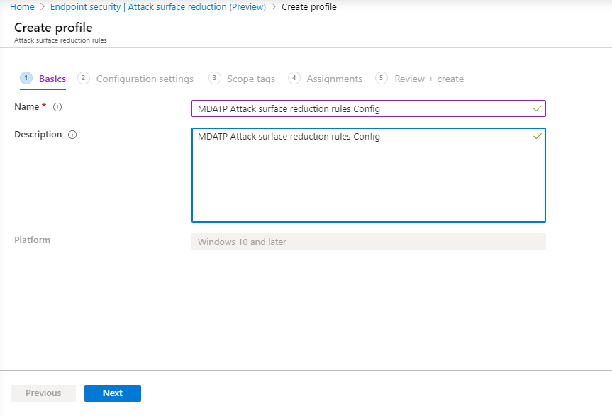
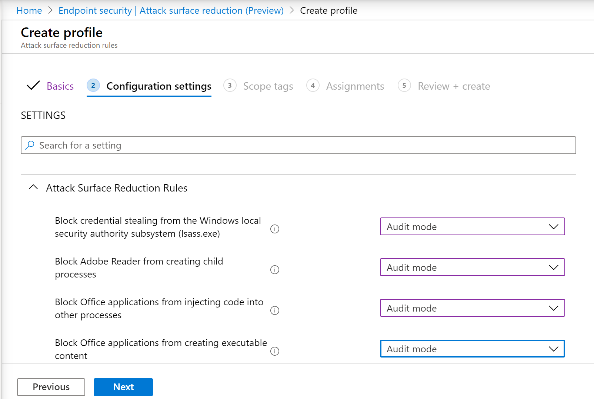

# Incorporación con Microsoft Endpoint ManagerOnboarding using Microsoft Endpoint Manager

[!INCLUDE [Microsoft 365 Defender rebranding](../../includes/microsoft-defender.md)]

**Se aplica a:****Applies to:**
- [Microsoft Defender para punto de conexiónMicrosoft Defender for Endpoint](https://go.microsoft.com/fwlink/p/?linkid=2154037)
- [Microsoft 365 DefenderMicrosoft 365 Defender](https://go.microsoft.com/fwlink/?linkid=2118804)

> ¿Desea experimentar Microsoft Defender para endpoint?Want to experience Microsoft Defender for Endpoint? [Regístrate para obtener una versión de prueba gratuita.Sign up for a free trial.](https://www.microsoft.com/microsoft-365/windows/microsoft-defender-atp?ocid=docs-wdatp-exposedapis-abovefoldlink)

Este artículo forma parte de la guía de implementación y actúa como un método de incorporación de ejemplo.This article is part of the Deployment guide and acts as an example onboarding method. 

En el [tema Planeación,](deployment-strategy.md) se proporcionaron varios métodos para incorporar dispositivos al servicio.In the [Planning](deployment-strategy.md) topic, there were several methods provided to onboard devices to the service. En este tema se trata la arquitectura nativa de la nube.This topic covers the cloud-native architecture. 

 *Diagrama de arquitecturas de entorno*
*Diagram of environment architectures*

Aunque Defender para endpoint admite la incorporación de varios puntos de conexión y herramientas, este artículo no los cubre.While Defender for Endpoint supports onboarding of various endpoints and tools, this article does not cover them. Para obtener información sobre la incorporación general con otras herramientas y métodos de implementación compatibles, vea [Onboarding overview](onboarding.md).For information on general onboarding using other supported deployment tools and methods, see [Onboarding overview](onboarding.md).

[Microsoft Endpoint Manager es](https://docs.microsoft.com/mem/endpoint-manager-overview) una plataforma de soluciones que unifica varios servicios.[Microsoft Endpoint Manager](https://docs.microsoft.com/mem/endpoint-manager-overview) is a solution platform that unifies several services. Incluye [Microsoft Intune para](https://docs.microsoft.com/mem/intune/fundamentals/what-is-intune) la administración de dispositivos basados en la nube.It includes [Microsoft Intune](https://docs.microsoft.com/mem/intune/fundamentals/what-is-intune) for cloud-based device management.

En este tema se guía a los usuarios en:This topic guides users in:
- Paso 1: Incorporación de dispositivos al servicio mediante la creación de un grupo en Microsoft Endpoint Manager (MEM) para asignar configuraciones enStep 1: Onboarding devices to the service by creating a group in Microsoft Endpoint Manager (MEM) to assign configurations on
- Paso 2: Configuración de las capacidades de Defender para endpoints con Microsoft Endpoint ManagerStep 2: Configuring Defender for Endpoint capabilities using Microsoft Endpoint Manager

Esta guía de incorporación le ayudará a seguir los siguientes pasos básicos que debe seguir al usar Microsoft Endpoint Manager:This onboarding guidance will walk you through the following basic steps that you need to take when using Microsoft Endpoint Manager:

-   [Identificación de dispositivos o usuarios de destinoIdentifying target devices or users](#identify-target-devices-or-users)

    -   Creación de un grupo de Azure Active Directory (usuario o dispositivo)Creating an Azure Active Directory group (User or Device)

-   [Creación de un perfil de configuraciónCreating a Configuration Profile](#step-2-create-configuration-policies-to-configure-microsoft-defender-for-endpoint-capabilities)

    -   En Microsoft Endpoint Manager, le guiaremos en la creación de una directiva independiente para cada funcionalidad.In Microsoft Endpoint Manager, we'll guide you in creating a separate policy for each capability.

## RecursosResources

Estos son los vínculos que necesitará para el resto del proceso:Here are the links you'll need for the rest of the process:

-   [Portal MEMMEM portal](https://aka.ms/memac)

-   [Centro de seguridadSecurity Center](https://securitycenter.windows.com/)

-   [Líneas base de seguridad de IntuneIntune Security baselines](https://docs.microsoft.com/mem/intune/protect/security-baseline-settings-defender-atp#microsoft-defender)

Para obtener más información acerca de Microsoft Endpoint Manager, consulte estos recursos:For more information about Microsoft Endpoint Manager, check out these resources:
- [Página de Microsoft Endpoint ManagerMicrosoft Endpoint Manager page](https://docs.microsoft.com/mem/)
- [Entrada de blog sobre la convergencia de Intune y ConfigMgrBlog post on convergence of Intune and ConfigMgr](https://www.microsoft.com/microsoft-365/blog/2019/11/04/use-the-power-of-cloud-intelligence-to-simplify-and-accelerate-it-and-the-move-to-a-modern-workplace/)
- [Vídeo de introducción en MEMIntroduction video on MEM](https://www.microsoft.com/microsoft-365/blog/2019/11/04/use-the-power-of-cloud-intelligence-to-simplify-and-accelerate-it-and-the-move-to-a-modern-workplace)

## Paso 1: Incorporar dispositivos mediante la creación de un grupo en MEM para asignar configuraciones enStep 1: Onboard devices by creating a group in MEM to assign configurations on
### Identificar dispositivos o usuarios de destinoIdentify target devices or users
En esta sección, crearemos un grupo de prueba para asignar las configuraciones.In this section, we will create a test group to assign your configurations on.

>[!NOTE]
>Intune usa grupos de Azure Active Directory (Azure AD) para administrar dispositivos y usuarios.Intune uses Azure Active Directory (Azure AD) groups to manage devices and users. Como administrador de Intune, puede configurar grupos que se adapten a sus necesidades organizativas.As an Intune admin, you can set up groups to suit your organizational needs. 
Para obtener más información, consulta [Agregar grupos para organizar usuarios y dispositivos.](https://docs.microsoft.com/mem/intune/fundamentals/groups-add)For more information, see [Add groups to organize users and devices](https://docs.microsoft.com/mem/intune/fundamentals/groups-add).

### Crear un grupoCreate a group

1.  Abra el portal de MEM.Open the MEM portal.

2.  Abra **Grupos > Nuevo grupo**.Open **Groups > New Group**.

    > [!div class="mx-imgBorder"]
    > 

3.  Escriba los detalles y cree un nuevo grupo.Enter details and create a new group.

    > [!div class="mx-imgBorder"]
    > 

4.  Agrega el usuario o dispositivo de prueba.Add your test user or device.

5.  En el **panel > todos los grupos,** abra el nuevo grupo.From the **Groups > All groups** pane, open your new group.

6.  Seleccione  **Miembros > Agregar miembros**.Select  **Members > Add members**.

7.  Busca el usuario o dispositivo de prueba y selecciónelo.Find your test user or device and select it.

    > [!div class="mx-imgBorder"]
    > 

8.  El grupo de pruebas ahora tiene un miembro que probar.Your testing group now has a member to test.

## Paso 2: Crear directivas de configuración para configurar las capacidades de Microsoft Defender para puntos de conexiónStep 2: Create configuration policies to configure Microsoft Defender for Endpoint capabilities
En la siguiente sección, creará una serie de directivas de configuración.In the following section, you'll create a number of configuration policies.

Primero es una directiva de configuración para seleccionar qué grupos de usuarios o dispositivos se incorporarán a Defender for Endpoint:First is a configuration policy to select which groups of users or devices will be onboarded to Defender for Endpoint:

- [EDREndpoint detection and response](#endpoint-detection-and-response) 

A continuación, seguirá creando varios tipos diferentes de directivas de seguridad de extremo:Then you will continue by creating several different types of endpoint security policies:

- [Protección de última generaciónNext-generation protection](#next-generation-protection)
- [Reducción de la superficie expuesta a ataquesAttack surface reduction](#attack-surface-reduction--attack-surface-reduction-rules)

### EDREndpoint detection and response

1.  Abra el portal de MEM.Open the MEM portal.

2.  Vaya a **Seguridad de > de detección y respuesta del extremo**.Navigate to **Endpoint security > Endpoint detection and response**. Haga clic en **Crear perfil**.Click on **Create Profile**.

    > [!div class="mx-imgBorder"]
    > 

3.  En **Plataforma, selecciona Windows 10 y versiones posteriores, Perfil: detección de puntos de** conexión y respuesta > Crear .Under **Platform, select Windows 10 and Later, Profile - Endpoint detection and response > Create**.

4.  Escriba un nombre y una descripción y, a continuación,  **seleccione Siguiente**.Enter a name and description, then select  **Next**.

    > [!div class="mx-imgBorder"]
    > 

5.  Seleccione la configuración según sea necesario y, a continuación,  **seleccione Siguiente**.Select settings as required, then select  **Next**.

    > [!div class="mx-imgBorder"]
    > 

    > [!NOTE]
    > En este caso, esto se ha rellenado automáticamente como Defender para endpoint ya se ha integrado con Intune.In this instance, this has been auto populated as Defender for Endpoint has already been integrated with Intune. Para obtener más información sobre la integración, vea [Enable Microsoft Defender for Endpoint in Intune](https://docs.microsoft.com/mem/intune/protect/advanced-threat-protection-configure#to-enable-microsoft-defender-atp).For more information on the integration, see [Enable Microsoft Defender for Endpoint in Intune](https://docs.microsoft.com/mem/intune/protect/advanced-threat-protection-configure#to-enable-microsoft-defender-atp).
    > 
    > La siguiente imagen es un ejemplo de lo que verá cuando Microsoft Defender para Endpoint no esté integrado con Intune:The following image is an example of what you'll see when Microsoft Defender for Endpoint is NOT integrated with Intune:
    >
    > 

6.  Agregue etiquetas de ámbito si es necesario y, a continuación,  **seleccione Siguiente**.Add scope tags if necessary, then select  **Next**.

    > [!div class="mx-imgBorder"]
    > 

7.  Para agregar un grupo de prueba, haga clic en **Seleccionar grupos para incluir** y elegir el grupo y, a continuación, seleccione  **Siguiente**.Add test group by clicking on **Select groups to include** and choose your group, then select  **Next**.

    > [!div class="mx-imgBorder"]
    > 

8.  Revise y acepte y, a continuación,  **seleccione Crear**.Review and accept, then select  **Create**.

    > [!div class="mx-imgBorder"]
    > 

9.  Puede ver la directiva completada.You can view your completed policy.

    > [!div class="mx-imgBorder"]
    > 

### Protección de última generaciónNext-generation protection

1.  Abra el portal de MEM.Open the MEM portal.

2.  Vaya a **Endpoint security > Antivirus > Create Policy**.Navigate to **Endpoint security > Antivirus > Create Policy**.

    > [!div class="mx-imgBorder"]
    > 

3.  Seleccione **Plataforma - Windows 10 y versiones posteriores - Windows y Perfil : Antivirus** de Microsoft Defender > Crear .Select **Platform - Windows 10 and Later - Windows and Profile – Microsoft Defender Antivirus > Create**.

4.  Escriba el nombre y la descripción y, a continuación,  **seleccione Siguiente**.Enter name and description, then select  **Next**.

    > [!div class="mx-imgBorder"]
    > 

5.  En la **página Configuración:** establezca las configuraciones que necesita para Antivirus de Microsoft Defender (protección en la nube, exclusiones, Real-Time protección y corrección).In the **Configuration settings page**: Set the configurations you require for Microsoft Defender Antivirus (Cloud Protection, Exclusions, Real-Time Protection, and Remediation).

    > [!div class="mx-imgBorder"]
    > 

6.  Agregue etiquetas de ámbito si es necesario y, a continuación,  **seleccione Siguiente**.Add scope tags if necessary, then select  **Next**.

    > [!div class="mx-imgBorder"]
    > 

7.  Seleccione los grupos que desea incluir, asígnelos al grupo de prueba y, a continuación,  **seleccione Siguiente**.Select groups to include, assign to your test group, then select  **Next**.

    > [!div class="mx-imgBorder"]
    > 

8.  Revise y cree y, a continuación,  **seleccione Crear**.Review and create, then select  **Create**.

    > [!div class="mx-imgBorder"]
    > 

9.  Verá la directiva de configuración que creó.You'll see the configuration policy you created.

    > [!div class="mx-imgBorder"]
    > 

### Reducción de superficie de ataque: reglas de reducción de superficie de ataqueAttack Surface Reduction – Attack surface reduction rules

1.  Abra el portal de MEM.Open the MEM portal.

2.  Navegue hasta **Endpoint security > Reducción de superficie de ataque**.Navigate to **Endpoint security > Attack surface reduction**.

3.  Seleccione  **Crear directiva**.Select  **Create Policy**.

4.  Selecciona **Plataforma - Windows 10 y versiones posteriores: Perfil: reglas de** reducción de superficie > Crear .Select **Platform - Windows 10 and Later – Profile - Attack surface reduction rules > Create**.

    > [!div class="mx-imgBorder"]
    > 

5.  Escriba un nombre y una descripción y, a continuación,  **seleccione Siguiente**.Enter a name and description, then select  **Next**.

    > [!div class="mx-imgBorder"]
    > 

6.  En la **página Configuración:** Establezca las configuraciones que necesita para las reglas de reducción de superficie de ataque y, a continuación,  **seleccione Siguiente**.In the **Configuration settings page**: Set the configurations you require for Attack surface reduction rules, then select  **Next**.

    > [!NOTE]
    > Configuraremos todas las reglas de reducción de superficie de ataque en Auditar.We will be configuring all of the Attack surface reduction rules to Audit.
    > 
    > Para obtener más información, consulta [Reglas de reducción de superficie de ataque](attack-surface-reduction.md).For more information, see [Attack surface reduction rules](attack-surface-reduction.md).

    > [!div class="mx-imgBorder"]
    > 

7.  Agregue etiquetas de ámbito según sea necesario y, a continuación,  **seleccione Siguiente**.Add Scope Tags as required, then select  **Next**.

    > [!div class="mx-imgBorder"]
    > 

8.  Seleccione los grupos que desea incluir y asignar al grupo de prueba y, a continuación,  **seleccione Siguiente**.Select groups to include and assign to test group, then select  **Next**.

    > [!div class="mx-imgBorder"]
    > 

9. Revise los detalles y, a continuación,  **seleccione Crear**.Review the details, then select  **Create**.

    > [!div class="mx-imgBorder"]
    > 

10. Ver la directiva.View the policy.

    > [!div class="mx-imgBorder"]
    > 

### Reducción de superficie de ataque: protección webAttack Surface Reduction – Web Protection

1.  Abra el portal de MEM.Open the MEM portal.

2.  Navegue hasta **Endpoint security > Reducción de superficie de ataque**.Navigate to **Endpoint security > Attack surface reduction**.

3.  Seleccione  **Crear directiva**.Select  **Create Policy**.

4.  Seleccione **Windows 10 y versiones posteriores: protección > Crear**.Select **Windows 10 and Later – Web protection > Create**.

    > [!div class="mx-imgBorder"]
    > 

5.  Escriba un nombre y una descripción y, a continuación,  **seleccione Siguiente**.Enter a name and description, then select  **Next**.

    > [!div class="mx-imgBorder"]
    > 

6.  En la **página Configuración:** Establezca las configuraciones que necesita para Protección web y, a continuación,  **seleccione Siguiente**.In the **Configuration settings page**: Set the configurations you require for Web Protection, then select  **Next**.

    > [!NOTE]
    > Estamos configurando Protección web para bloquear.We are configuring Web Protection to Block.
    > 
    > Para obtener más información, vea [Web Protection](web-protection-overview.md).For more information, see [Web Protection](web-protection-overview.md).

    > [!div class="mx-imgBorder"]
    > 

7.  Agregue **etiquetas de ámbito según > Siguiente**.Add **Scope Tags as required > Next**.

    > [!div class="mx-imgBorder"]
    > 

8.  Seleccione **Asignar a grupo de prueba > Siguiente**.Select **Assign to test group > Next**.

    > [!div class="mx-imgBorder"]
    > 

9.  Seleccione **Revisar y Crear > Crear**.Select **Review and Create > Create**.

    > [!div class="mx-imgBorder"]
    > 

10. Ver la directiva.View the policy.

    > [!div class="mx-imgBorder"]
    > 

## Validar opciones de configuraciónValidate configuration settings

### Confirmar que se han aplicado directivasConfirm Policies have been applied

Una vez asignada la directiva de configuración, llevará algún tiempo aplicarla.Once the Configuration policy has been assigned, it will take some time to apply.

Para obtener información sobre el tiempo, consulta [Información de configuración de Intune](https://docs.microsoft.com/mem/intune/configuration/device-profile-troubleshoot#how-long-does-it-take-for-devices-to-get-a-policy-profile-or-app-after-they-are-assigned).For information on timing, see [Intune configuration information](https://docs.microsoft.com/mem/intune/configuration/device-profile-troubleshoot#how-long-does-it-take-for-devices-to-get-a-policy-profile-or-app-after-they-are-assigned).

Para confirmar que la directiva de configuración se ha aplicado al dispositivo de prueba, siga el siguiente proceso para cada directiva de configuración.To confirm that the configuration policy has been applied to your test device, follow the following process for each configuration policy.

1.  Abra el portal de MEM y vaya a la directiva correspondiente, como se muestra en los pasos anteriores.Open the MEM portal and navigate to the relevant policy as shown in the steps above. En el ejemplo siguiente se muestra la configuración de protección de próxima generación.The following example shows the next generation protection settings.

    > [!div class="mx-imgBorder"]
    > 

2.  Seleccione la **directiva de configuración** para ver el estado de la directiva.Select  the **Configuration Policy** to view the policy status.

    > [!div class="mx-imgBorder"]
    > 

3.  Selecciona  **Estado del dispositivo** para ver el estado.Select  **Device Status** to see the status.

    > [!div class="mx-imgBorder"]
    > 

4.  Seleccione  **Estado de usuario** para ver el estado.Select  **User Status** to see the status.

    > [!div class="mx-imgBorder"]
    > 

5.  Seleccione  **Estado por configuración para** ver el estado.Select  **Per-setting status** to see the status.

    >[!TIP]
    >Esta vista es muy útil para identificar cualquier configuración que entre en conflicto con otra directiva.This view is very useful to identify any settings that conflict with another policy.

    > [!div class="mx-imgBorder"]
    > 

### EDREndpoint detection and response

1.  Antes de aplicar la configuración, no se debe iniciar el servicio defender para Endpoint Protection.Before applying the configuration, the Defender for Endpoint Protection service should not be started.

    > [!div class="mx-imgBorder"]
    > 

2.  Una vez aplicada la configuración, debe iniciarse el servicio defender para Endpoint Protection.After the configuration has been applied, the Defender for Endpoint Protection Service should be started.

    > [!div class="mx-imgBorder"]
    > 

3.  Una vez que los servicios se ejecutan en el dispositivo, el dispositivo aparece en el Centro de seguridad de Microsoft Defender.After the services are running on the device, the device appears in Microsoft Defender Security Center.

    > [!div class="mx-imgBorder"]
    > 

### Protección de última generaciónNext-generation protection

1.  Antes de aplicar la directiva en un dispositivo de prueba, debes poder administrar manualmente la configuración como se muestra a continuación.Before applying the policy on a test device, you should be able to manually manage the settings as shown below.

    > [!div class="mx-imgBorder"]
    > 

2.  Después de aplicar la directiva, no debería poder administrar manualmente la configuración.After the policy has been applied, you should not be able to manually manage the settings.

    > [!NOTE]
    > En la siguiente **imagen, se muestran como administrados Activar** la protección entregada en la nube y Activar la protección en tiempo real. In the following image **Turn on cloud-delivered protection** and **Turn on real-time protection** are being shown as managed.

    > [!div class="mx-imgBorder"]
    > 

### Reducción de superficie de ataque: reglas de reducción de superficie de ataqueAttack Surface Reduction – Attack surface reduction rules

1.  Antes de aplicar la directiva en un dispositivo de prueba, escriba una ventana de PowerShell y escriba `Get-MpPreference` .Before applying the policy on a test device, pen a PowerShell Window and type `Get-MpPreference`.

2.  Esto debe responder con las siguientes líneas sin contenido:This should respond with the following lines with no content:

    > AttackSurfaceReductionOnlyExclusions:AttackSurfaceReductionOnlyExclusions:
    > 
    > AttackSurfaceReductionRules_Actions:AttackSurfaceReductionRules_Actions:
    > 
    > AttackSurfaceReductionRules_Ids:AttackSurfaceReductionRules_Ids:

    

3.  Después de aplicar la directiva en un dispositivo de prueba, abra un Windows de PowerShell y escriba `Get-MpPreference` .After applying the policy on a test device, open a PowerShell Windows and type `Get-MpPreference`.

4.  Esto debe responder con las siguientes líneas con contenido como se muestra a continuación:This should respond with the following lines with content as shown below:

    

### Reducción de superficie de ataque: protección webAttack Surface Reduction – Web Protection

1.  En el dispositivo de prueba, abra un Windows de PowerShell y escriba `(Get-MpPreference).EnableNetworkProtection` .On the test device, open a PowerShell Windows and type `(Get-MpPreference).EnableNetworkProtection`.

2.  Esto debe responder con un 0 como se muestra a continuación.This should respond with a 0 as shown below.

    

3.  Después de aplicar la directiva, abra un Windows de PowerShell y escriba `(Get-MpPreference).EnableNetworkProtection` .After applying the policy, open a PowerShell Windows and type `(Get-MpPreference).EnableNetworkProtection`.

4.  Esto debe responder con un 1 como se muestra a continuación.This should respond with a 1 as shown below.

    
