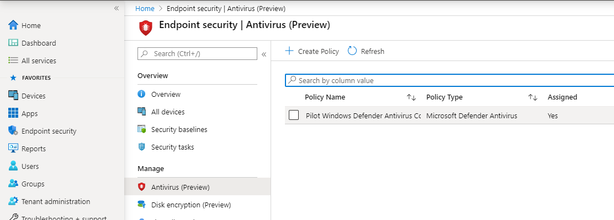
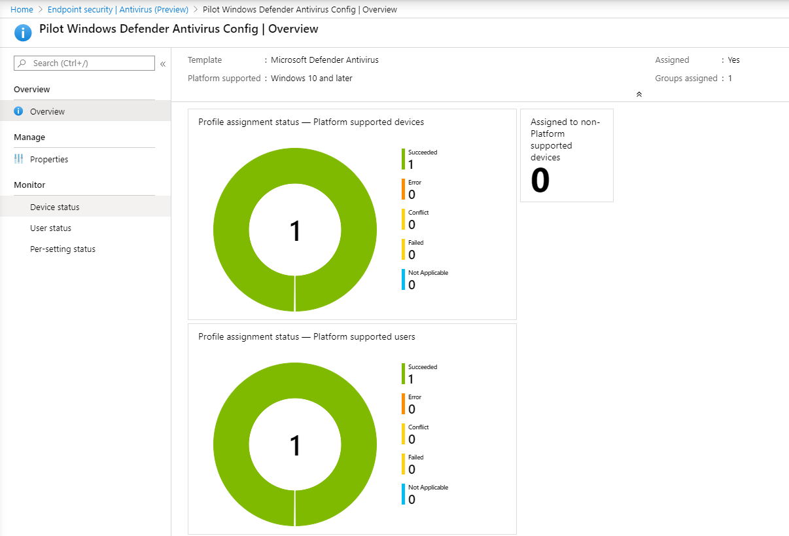

# Incorporación con Microsoft Endpoint Manager

[!INCLUDE [Microsoft 365 Defender rebranding](../../includes/microsoft-defender.md)]

**Se aplica a:**

- [Microsoft Defender para punto de conexión Plan 2](https://go.microsoft.com/fwlink/p/?linkid=2154037)
- [Microsoft 365 Defender](https://go.microsoft.com/fwlink/?linkid=2118804)

> ¿Quiere experimentar Microsoft Defender para punto de conexión? [Regístrese para obtener una prueba gratuita.](https://signup.microsoft.com/create-account/signup?products=7f379fee-c4f9-4278-b0a1-e4c8c2fcdf7e&ru=https://aka.ms/MDEp2OpenTrial?ocid=docs-wdatp-exposedapis-abovefoldlink)

Este artículo forma parte de la guía de implementación y actúa como un método de incorporación de ejemplo.

En el tema [Planeamiento](deployment-strategy.md) , se proporcionaron varios métodos para incorporar dispositivos al servicio. En este tema se trata la arquitectura nativa de la nube.

:::image type="content" source="images/cloud-native-architecture.png" alt-text="Arquitectura nativa de la nube" lightbox="images/cloud-native-architecture.png":::
*Diagrama de arquitecturas de entorno*

Aunque Defender para punto de conexión admite la incorporación de varios puntos de conexión y herramientas, en este artículo no se tratan. Para obtener información sobre la incorporación general mediante otras herramientas y métodos de implementación admitidos, consulte [Introducción a la incorporación](onboarding.md).

[Microsoft Endpoint Manager](/mem/endpoint-manager-overview) es una plataforma de solución que unifica varios servicios. Incluye [Microsoft Intune](/mem/intune/fundamentals/what-is-intune) y [Microsoft Endpoint Configuration Manager](/mem/configmgr).

Este tema guía a los usuarios en:

- Paso 1: Incorporación de dispositivos al servicio mediante la creación de un grupo en Microsoft Endpoint Manager (MEM)
- Paso 2: Configuración de las funcionalidades de Defender para punto de conexión mediante Microsoft Endpoint Manager

Esta guía de incorporación le guiará por los siguientes pasos básicos que debe seguir al usar Microsoft Endpoint Manager:

- [Identificación de dispositivos o usuarios de destino](#identify-target-devices-or-users)
  - Creación de un grupo de Azure Active Directory (usuario o dispositivo)
- [Creación de un perfil de configuración](#step-2-create-configuration-policies-to-configure-microsoft-defender-for-endpoint-capabilities)
  - En Microsoft Endpoint Manager, le guiaremos en la creación de una directiva independiente para cada funcionalidad.

## Recursos

Estos son los vínculos que necesitará para el resto del proceso:

- [Portal de MEM](https://aka.ms/memac)
- [Microsoft 365 Defender](https://security.microsoft.com)
- [líneas base de seguridad de Intune](/mem/intune/protect/security-baseline-settings-defender-atp#microsoft-defender)

Para obtener más información sobre Microsoft Endpoint Manager, consulte estos recursos:

- [Página Endpoint Manager de Microsoft](/mem/)
- [Entrada de blog sobre la convergencia de Intune y ConfigMgr](https://www.microsoft.com/microsoft-365/blog/2019/11/04/use-the-power-of-cloud-intelligence-to-simplify-and-accelerate-it-and-the-move-to-a-modern-workplace/)
- [Vídeo de introducción en MEM](https://www.microsoft.com/microsoft-365/blog/2019/11/04/use-the-power-of-cloud-intelligence-to-simplify-and-accelerate-it-and-the-move-to-a-modern-workplace)

## Paso 1: Incorporación de dispositivos mediante la creación de un grupo en MEM

### Identificación de dispositivos o usuarios de destino

En esta sección, crearemos un grupo de pruebas en el que asignar las configuraciones.

> [!NOTE]
> Intune usa grupos de Azure Active Directory (AD) para administrar dispositivos y usuarios. Como administrador de Intune, puede configurar los grupos de modo que satisfagan sus necesidades organizativas.
>
> Para más información, vea [Agregar grupos para organizar usuarios y dispositivos](/mem/intune/fundamentals/groups-add).

### Crear un grupo

1. Abra el portal de MEM.

2. Abra **Grupos > nuevo grupo**.

    > [!div class="mx-imgBorder"]
    > :::image type="content" source="images/66f724598d9c3319cba27f79dd4617a4.png" alt-text="Portal de Microsoft Endpoint Manager 1" lightbox="images/66f724598d9c3319cba27f79dd4617a4.png":::

3. Escriba los detalles y cree un nuevo grupo.

    > [!div class="mx-imgBorder"]
    > :::image type="content" source="images/b1e0206d675ad07db218b63cd9b9abc3.png" alt-text="Portal de Microsoft Endpoint Manager 2" lightbox="images/b1e0206d675ad07db218b63cd9b9abc3.png":::

4. Agregue el usuario o dispositivo de prueba.

5. En el panel **Grupos > Todos los grupos** , abra el nuevo grupo.

6. Seleccione  **Miembros > Agregar miembros**.

7. Busque el usuario o dispositivo de prueba y selecciónelo.

    > [!div class="mx-imgBorder"]
    > :::image type="content" source="images/149cbfdf221cdbde8159d0ab72644cd0.png" alt-text="Portal de Microsoft Endpoint Manager 3" lightbox="images/149cbfdf221cdbde8159d0ab72644cd0.png":::

8. El grupo de pruebas ahora tiene un miembro que probar.

## Paso 2: Creación de directivas de configuración para configurar funcionalidades de Microsoft Defender para punto de conexión

En la sección siguiente, creará varias directivas de configuración.

Lo primero es una directiva de configuración para seleccionar qué grupos de usuarios o dispositivos se incorporarán a Defender para punto de conexión:

- [EDR](#endpoint-detection-and-response)

A continuación, seguirá creando varios tipos diferentes de directivas de seguridad de puntos de conexión:

- [Protección de última generación](#next-generation-protection)
- [Reducción de la superficie de ataque](#attack-surface-reduction---attack-surface-reduction-rules)

### Detección y respuesta de puntos de conexión

1. Abra el portal de MEM.

2. Vaya a **Seguridad del punto de conexión \> Detección y respuesta de puntos de conexión**. Haga clic en **Crear perfil**.

    > [!div class="mx-imgBorder"]
    > :::image type="content" source="images/58dcd48811147feb4ddc17212b7fe840.png" alt-text="Portal de Microsoft Endpoint Manager 4" lightbox="images/58dcd48811147feb4ddc17212b7fe840.png":::

3. En **Plataforma**, seleccione **Windows 10 y versiones posteriores**, y en perfil, **Detección y respuesta de puntos de conexión**. Haga click en Crear.

4. Escriba un nombre y una descripción y, a continuación, seleccione  **Siguiente**.

    > [!div class="mx-imgBorder"]
    > :::image type="content" source="images/a5b2d23bdd50b160fef4afd25dda28d4.png" alt-text="Portal de Microsoft Endpoint Manager 5" lightbox="images/a5b2d23bdd50b160fef4afd25dda28d4.png":::

5. Seleccione la configuración según sea necesario y, a continuación, seleccione  **Siguiente**.

    > [!div class="mx-imgBorder"]
    > :::image type="content" source="images/cea7e288b5d42a9baf1aef0754ade910.png" alt-text="Portal de Microsoft Endpoint Manager 6" lightbox="images/cea7e288b5d42a9baf1aef0754ade910.png":::

    > [!NOTE]
    > En este caso, se ha rellenado automáticamente, ya que Defender para punto de conexión ya se ha integrado con Intune. Para obtener más información sobre la integración, vea [Habilitar Microsoft Defender para punto de conexión en Intune](/mem/intune/protect/advanced-threat-protection-configure#to-enable-microsoft-defender-atp).
    >
    > La siguiente imagen es un ejemplo de lo que verá cuando Microsoft Defender para punto de conexión no esté integrado con Intune:
    >
    > :::image type="content" source="images/2466460812371ffae2d19a10c347d6f4.png" alt-text="Portal de Microsoft Endpoint Manager 7" lightbox="images/2466460812371ffae2d19a10c347d6f4.png":::

6. Agregue etiquetas de ámbito si es necesario y, a continuación, seleccione  **Siguiente**.

    > [!div class="mx-imgBorder"]
    > :::image type="content" source="images/ef844f52ec2c0d737ce793f68b5e8408.png" alt-text="Portal de Microsoft Endpoint Manager 8" lightbox="images/ef844f52ec2c0d737ce793f68b5e8408.png":::

7. Para agregar un grupo de pruebas, haga clic en **Seleccionar grupos para incluir** y elija el grupo y, a continuación, seleccione  **Siguiente**.

    > [!div class="mx-imgBorder"]
    > :::image type="content" source="images/fc3525e20752da026ec9f46ab4fec64f.png" alt-text="Portal de Microsoft Endpoint Manager 9" lightbox="images/fc3525e20752da026ec9f46ab4fec64f.png":::

8. Revise y acepte y, a continuación, seleccione  **Crear**.

    > [!div class="mx-imgBorder"]
    > :::image type="content" source="images/289172dbd7bd34d55d24810d9d4d8158.png" alt-text="El portal de Microsoft Endpoint Manager 10" lightbox="images/289172dbd7bd34d55d24810d9d4d8158.png":::

9. Puede ver la directiva completada.

    > [!div class="mx-imgBorder"]
    > :::image type="content" source="images/5a568b6878be8243ea2b9d82d41ed297.png" alt-text="Portal de Microsoft Endpoint Manager 11" lightbox="images/5a568b6878be8243ea2b9d82d41ed297.png":::

### Protección de última generación

1. Abra el portal de MEM.

2. Vaya a **Seguridad del punto de conexión \> Antivirus \> Crear directiva**.

    > [!div class="mx-imgBorder"]
    > :::image type="content" source="images/6b728d6e0d71108d768e368b416ff8ba.png" alt-text="Portal de Microsoft Endpoint Manager 12" lightbox="images/6b728d6e0d71108d768e368b416ff8ba.png":::

3. Seleccione **Plataforma: Windows 10 y versiones posteriores** y **Perfil: Microsoft Defender Antivirus \> Crear**.

4. Escriba el nombre y la descripción y, a continuación, seleccione  **Siguiente**.

    > [!div class="mx-imgBorder"]
    > :::image type="content" source="images/a7d738dd4509d65407b7d12beaa3e917.png" alt-text="Portal de Microsoft Endpoint Manager 13" lightbox="images/a7d738dd4509d65407b7d12beaa3e917.png":::

5. En la página **Configuración**, establezca las configuraciones que necesita para Microsoft Defender Antivirus (Protección Cloud, Exclusiones, Protección en tiempo real y Remediación).

    > [!div class="mx-imgBorder"]
    > :::image type="content" source="images/3840b1576d6f79a1d72eb14760ef5e8c.png" alt-text="Portal de Microsoft Endpoint Manager 14" lightbox="images/3840b1576d6f79a1d72eb14760ef5e8c.png":::

6. Agregue etiquetas de ámbito si es necesario y, a continuación, seleccione  **Siguiente**.

    > [!div class="mx-imgBorder"]
    > :::image type="content" source="images/2055e4f9b9141525c0eb681e7ba19381.png" alt-text="Portal de Microsoft Endpoint Manager 15" lightbox="images/2055e4f9b9141525c0eb681e7ba19381.png":::

7. Seleccione los grupos que desea incluir, asígnelos al grupo de pruebas y, a continuación, seleccione  **Siguiente**.

    > [!div class="mx-imgBorder"]
    > :::image type="content" source="images/48318a51adee06bff3908e8ad4944dc9.png" alt-text="Portal de Microsoft Endpoint Manager 16" lightbox="images/48318a51adee06bff3908e8ad4944dc9.png":::

8. Revise los detalles y, a continuación, seleccione  **Crear**.

    > [!div class="mx-imgBorder"]
    > :::image type="content" source="images/dfdadab79112d61bd3693d957084b0ec.png" alt-text="Portal de Microsoft Endpoint Manager 17" lightbox="images/dfdadab79112d61bd3693d957084b0ec.png":::

9. Verá la directiva de configuración que ha creado.

    > [!div class="mx-imgBorder"]
    > :::image type="content" source="images/38180219e632d6e4ec7bd25a46398da8.png" alt-text="Portal de Microsoft Endpoint Manager 18" lightbox="images/38180219e632d6e4ec7bd25a46398da8.png":::

### Reducción de superficie de ataque: reglas de reducción de superficie de ataque

1. Abra el portal de MEM.

2. Vaya a **Seguridad del punto de conexión > Reducción de la superficie de ataque**.

3. Seleccione  **Crear directiva**.

4. Seleccione **Plataforma: Windows 10 y versiones posteriores** y **Perfil: Reglas de reducción de superficie de ataque \> Crear**.

    > [!div class="mx-imgBorder"]
    > :::image type="content" source="images/522d9bb4288dc9c1a957392b51384fdd.png" alt-text="Portal de Microsoft Endpoint Manager 19" lightbox="images/522d9bb4288dc9c1a957392b51384fdd.png":::

5. Escriba un nombre y una descripción y, a continuación, seleccione  **Siguiente**.

    > [!div class="mx-imgBorder"]
    > :::image type="content" source="images/a5a71fd73ec389f3cdce6d1a6bd1ff31.png" alt-text="Portal de Microsoft Endpoint Manager 20" lightbox="images/a5a71fd73ec389f3cdce6d1a6bd1ff31.png":::

6. En la página **Configuración**, establezca las configuraciones que necesita para las reglas de reducción de superficie de ataque y, a continuación, seleccione  **Siguiente**.

    > [!NOTE]
    > Configuraremos todas las reglas de reducción de superficie de ataque en Auditoría.
    >
    > Para obtener más información, consulte [Reglas de reducción de superficie de ataque](attack-surface-reduction.md).

    > [!div class="mx-imgBorder"]
    > :::image type="content" source="images/dd0c00efe615a64a4a368f54257777d0.png" alt-text="Portal de Microsoft Endpoint Manager 21" lightbox="images/dd0c00efe615a64a4a368f54257777d0.png":::

7. Agregue etiquetas de ámbito según sea necesario y, a continuación, seleccione  **Siguiente**.

    > [!div class="mx-imgBorder"]
    > :::image type="content" source="images/6daa8d347c98fe94a0d9c22797ff6f28.png" alt-text="Portal de Microsoft Endpoint Manager 22" lightbox="images/6daa8d347c98fe94a0d9c22797ff6f28.png":::

8. Seleccione los grupos que desea incluir, asígnelo al grupo de pruebas y, a continuación, seleccione **Siguiente**.

    > [!div class="mx-imgBorder"]
    > :::image type="content" source="images/45cefc8e4e474321b4d47b4626346597.png" alt-text="Portal de Microsoft Endpoint Manager 23" lightbox="images/45cefc8e4e474321b4d47b4626346597.png":::

9. Revise los detalles y, a continuación, seleccione  **Crear**.

    > [!div class="mx-imgBorder"]
    > :::image type="content" source="images/2c2e87c5fedc87eba17be0cdeffdb17f.png" alt-text="Portal de Microsoft Endpoint Manager 24" lightbox="images/2c2e87c5fedc87eba17be0cdeffdb17f.png":::

10. Vea la directiva.

    > [!div class="mx-imgBorder"]
    > :::image type="content" source="images/7a631d17cc42500dacad4e995823ffef.png" alt-text="Portal de Microsoft Endpoint Manager 25" lightbox="images/7a631d17cc42500dacad4e995823ffef.png":::

### Reducción de superficie de ataque: protección web

1. Abra el portal de MEM.

2. Vaya a **Seguridad del punto de conexión > Reducción de la superficie de ataque**.

3. Seleccione  **Crear directiva**.

4. Seleccione **Plataforma: Windows 10 y versiones posteriores** y **Perfil: protección web \> Crear**.

    > [!div class="mx-imgBorder"]
    > :::image type="content" source="images/cd7b5a1cbc16cc05f878cdc99ba4c27f.png" alt-text="Portal de Microsoft Endpoint Manager 26" lightbox="images/cd7b5a1cbc16cc05f878cdc99ba4c27f.png":::

5. Escriba un nombre y una descripción y, a continuación, seleccione  **Siguiente**.

    > [!div class="mx-imgBorder"]
    > :::image type="content" source="images/5be573a60cd4fa56a86a6668b62dd808.png" alt-text="Portal de Microsoft Endpoint Manager 27" lightbox="images/5be573a60cd4fa56a86a6668b62dd808.png":::

6. En la página **Configuración**, establezca las configuraciones que necesita para la protección web y, a continuación, seleccione  **Siguiente**.

    > [!NOTE]
    > Estamos configurando la protección web en bloque.
    >
    > Para obtener más información, consulte [Protección web](web-protection-overview.md).

    > [!div class="mx-imgBorder"]
    > :::image type="content" source="images/6104aa33a56fab750cf30ecabef9f5b6.png" alt-text="Portal de Microsoft Endpoint Manager 28" lightbox="images/6104aa33a56fab750cf30ecabef9f5b6.png":::

7. Agregue etiquetas de ámbito según sea necesario y, a continuación, seleccione **Siguiente**.

    > [!div class="mx-imgBorder"]
    > :::image type="content" source="images/6daa8d347c98fe94a0d9c22797ff6f28.png" alt-text="Portal de Microsoft Endpoint Manager 29" lightbox="images/6daa8d347c98fe94a0d9c22797ff6f28.png":::

8. Seleccione los grupos que desea incluir, asígnelo al grupo de pruebas y, a continuación, seleccione **Siguiente**.

    > [!div class="mx-imgBorder"]
    > :::image type="content" source="images/45cefc8e4e474321b4d47b4626346597.png" alt-text="Portal de Microsoft Endpoint Manager 30" lightbox="images/45cefc8e4e474321b4d47b4626346597.png":::

9. Revise los detalles y, a continuación, seleccione  **Crear**.

    > [!div class="mx-imgBorder"]
    > :::image type="content" source="images/8ee0405f1a96c23d2eb6f737f11c1ae5.png" alt-text="Portal de Microsoft Endpoint Manager 31" lightbox="images/8ee0405f1a96c23d2eb6f737f11c1ae5.png":::

10. Vea la directiva.

    > [!div class="mx-imgBorder"]
    > :::image type="content" source="images/e74f6f6c150d017a286e6ed3dffb7757.png" alt-text="Portal de Microsoft Endpoint Manager 32" lightbox="images/e74f6f6c150d017a286e6ed3dffb7757.png":::

## Validación de los valores de configuración

### Confirmar que se han aplicado directivas

Una vez asignada la directiva de configuración, se tardará algún tiempo en aplicarse.

Para obtener información sobre el tiempo, consulte [información de configuración de Intune](/mem/intune/configuration/device-profile-troubleshoot#how-long-does-it-take-for-devices-to-get-a-policy-profile-or-app-after-they-are-assigned).

Para confirmar que la directiva de configuración se ha aplicado al dispositivo de prueba, siga el proceso siguiente para cada directiva de configuración.

1. Abra el portal de MEM y vaya a la directiva pertinente, como se muestra en los pasos anteriores. En el ejemplo siguiente se muestra la configuración de protección de próxima generación.

    > [!div class="mx-imgBorder"]
    >  

2. Seleccione la **directiva de configuración** para ver el estado de la directiva.

    > [!div class="mx-imgBorder"]
    > 

3. Seleccione  **Estado del dispositivo** para ver el estado.

    > [!div class="mx-imgBorder"]
    > 

4. Seleccione  **Estado de usuario** para ver el estado.

    > [!div class="mx-imgBorder"]
    > 

5. Seleccione  **Estado por configuración** para ver el estado.

    > [!TIP]
    > Esta vista es muy útil para identificar cualquier configuración que entre en conflicto con otra directiva.

    > [!div class="mx-imgBorder"]
    > 

### Confirmar la detección y respuesta del punto de conexión

1. Antes de aplicar la configuración, no se debe iniciar el servicio de protección de Defender para punto de conexión.

    > [!div class="mx-imgBorder"]
    > 

2. Una vez aplicada la configuración, se debe iniciar el servicio de protección de Defender para punto de conexión.

    > [!div class="mx-imgBorder"]
    > 

3. Una vez que los servicios se ejecutan en el dispositivo, el dispositivo aparece en el portal de Microsoft 365 Defender.

    > [!div class="mx-imgBorder"]
    > 

### Confirmar la protección de próxima generación

1. Antes de aplicar la directiva en un dispositivo de prueba, debe poder administrar manualmente la configuración como se muestra a continuación.

    > [!div class="mx-imgBorder"]
    > :::image type="content" source="images/88efb4c3710493a53f2840c3eac3e3d3.png" alt-text="Página de configuración-1" lightbox="images/88efb4c3710493a53f2840c3eac3e3d3.png":::

2. Una vez aplicada la directiva, no debería poder administrar manualmente la configuración.

    > [!NOTE]
    > En la siguiente imagen **, activar la protección entregada en la nube** y **Activar la protección en tiempo real** se muestran como administrados.

    > [!div class="mx-imgBorder"]
    > :::image type="content" source="images/9341428b2d3164ca63d7d4eaa5cff642.png" alt-text="Página de configuración 2" lightbox="images/9341428b2d3164ca63d7d4eaa5cff642.png":::

### Confirmar la reducción de superficie de ataque: reglas de reducción de superficie de ataque

1. Antes de aplicar la directiva en un dispositivo de prueba, abra una ventana de PowerShell y escriba `Get-MpPreference`.

2. Esto debe responder con las siguientes líneas sin contenido:

    > AttackSurfaceReductionOnlyExclusions:
    >
    > AttackSurfaceReductionRules_Actions:
    >
    > AttackSurfaceReductionRules_Ids:

    :::image type="content" source="images/cb0260d4b2636814e37eee427211fe71.png" alt-text="Línea de comandos-1" lightbox="images/cb0260d4b2636814e37eee427211fe71.png":::

3. Después de aplicar la directiva en un dispositivo de prueba, abra una ventana de PowerShell y escriba `Get-MpPreference`.

4. Esto debe responder con las siguientes líneas con contenido, como se muestra a continuación:

   :::image type="content" source="images/619fb877791b1fc8bc7dfae1a579043d.png" alt-text="Línea de comandos-2" lightbox="images/619fb877791b1fc8bc7dfae1a579043d.png":::

### Confirmar la reducción de superficie de ataque: Protección web

1. En el dispositivo de prueba, abra una ventana de PowerShell y escriba `(Get-MpPreference).EnableNetworkProtection`.

2. Esto debe responder con un 0 como se muestra a continuación.

   :::image type="content" source="images/196a8e194ac99d84221f405d0f684f8c.png" alt-text="Línea de comandos-3" lightbox="images/196a8e194ac99d84221f405d0f684f8c.png":::

3. Después de aplicar la directiva, abra una ventana de PowerShell y escriba `(Get-MpPreference).EnableNetworkProtection`.

4. Esto debe responder con un 1 como se muestra a continuación.

   :::image type="content" source="images/c06fa3bbc2f70d59dfe1e106cd9a4683.png" alt-text="Línea de comandos-4" lightbox="images/c06fa3bbc2f70d59dfe1e106cd9a4683.png":::
   