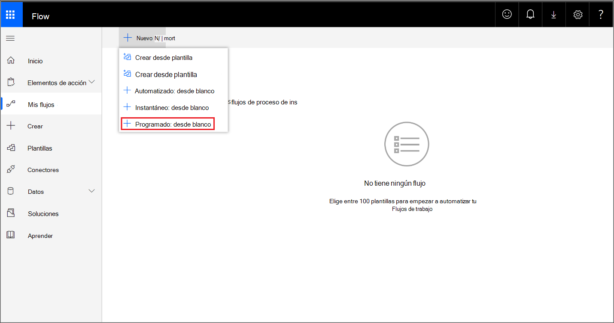
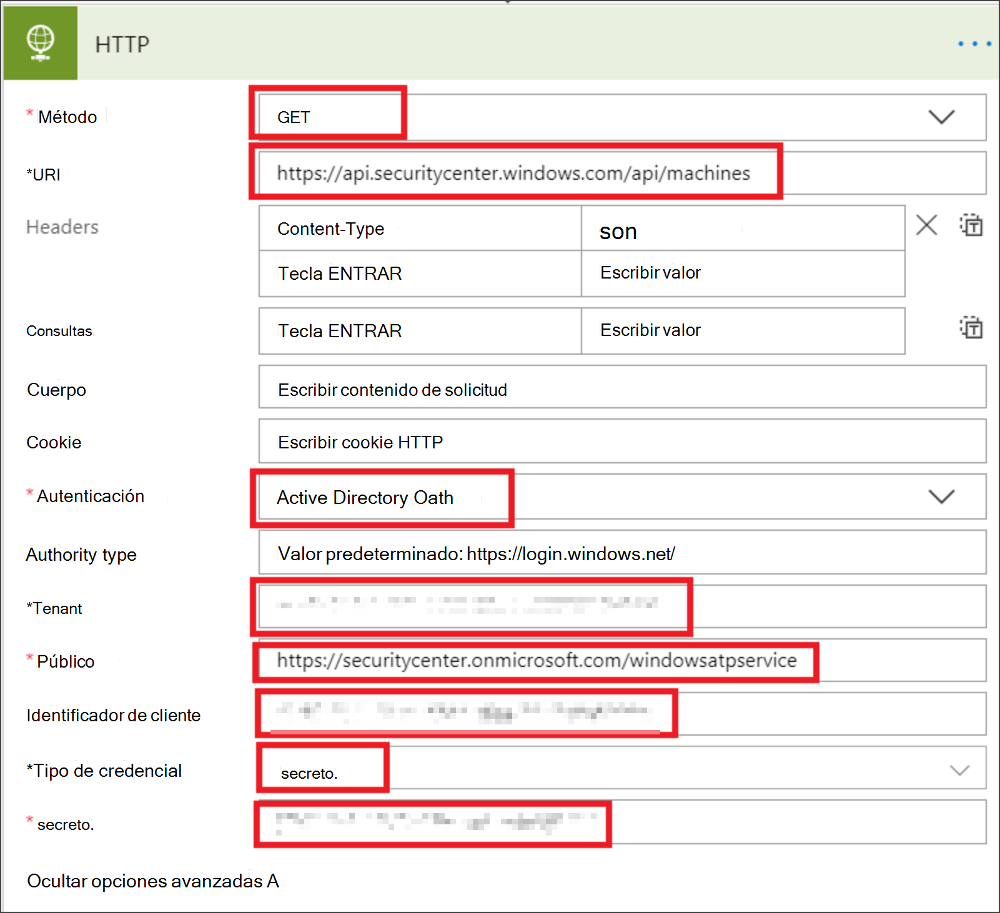
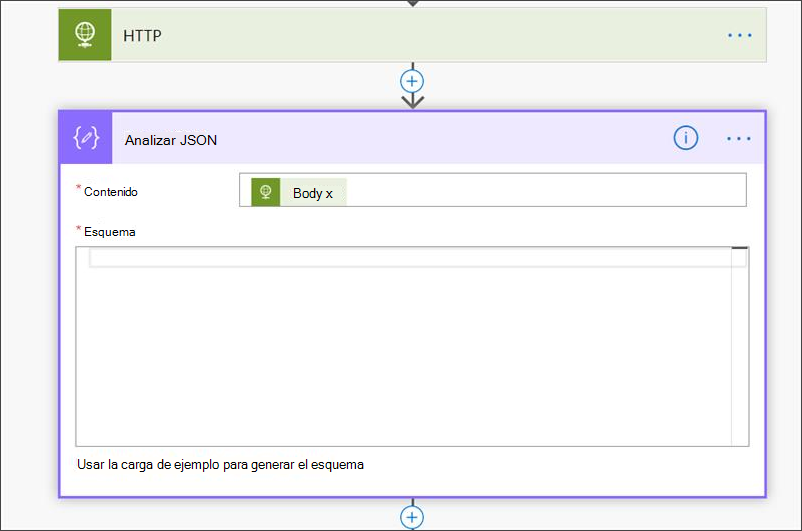
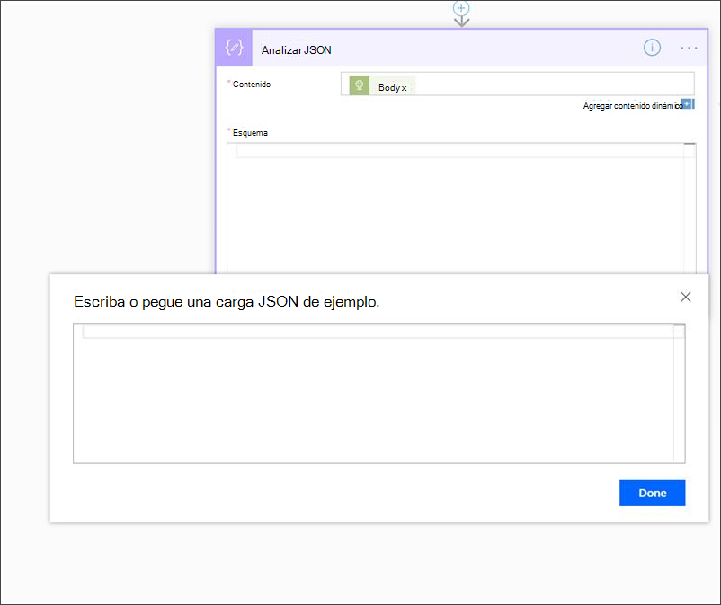
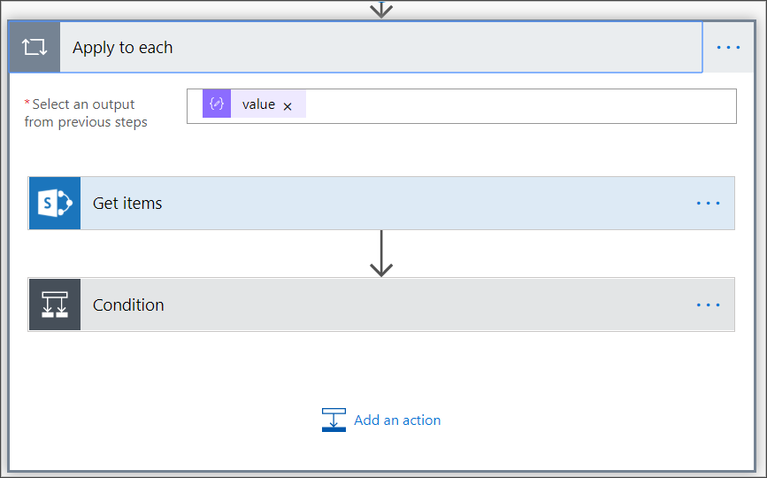
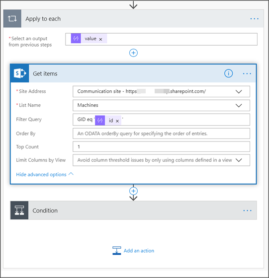
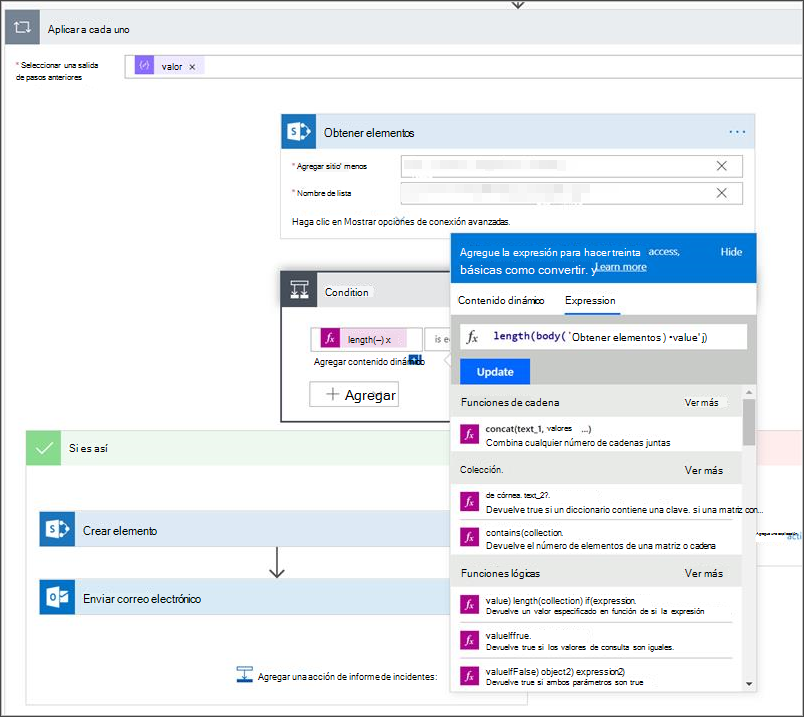
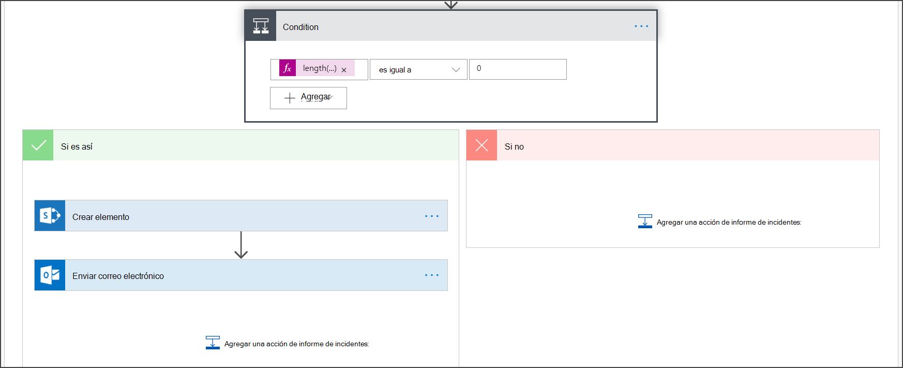
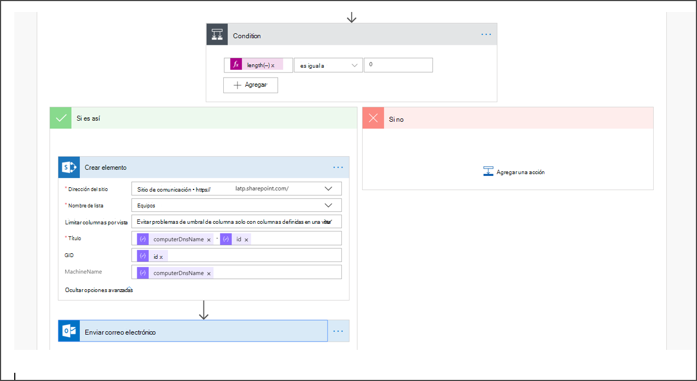

# <a name="create-a-notification-rule-when-a-local-onboarding-or-offboarding-script-is-used"></a>Crear una regla de notificación cuando se usa un script local de incorporación o offboarding

[!INCLUDE [Microsoft 365 Defender rebranding](../../includes/microsoft-defender.md)]


**Se aplica a:**
- [Microsoft Defender para punto de conexión](https://go.microsoft.com/fwlink/p/?linkid=2154037)
- [Microsoft 365 Defender](https://go.microsoft.com/fwlink/?linkid=2118804)


> ¿Desea experimentar Microsoft Defender para endpoint? [Regístrate para obtener una versión de prueba gratuita.](https://www.microsoft.com/microsoft-365/windows/microsoft-defender-atp?ocid=docs-wdatp-exposedapis-abovefoldlink)

[!include[Microsoft Defender for Endpoint API URIs for US Government](../../includes/microsoft-defender-api-usgov.md)]

[!include[Improve request performance](../../includes/improve-request-performance.md)]


Cree una regla de notificación para que cuando se utilice un script local de incorporación o offboarding, se le notificará. 

## <a name="before-you-begin"></a>Antes de empezar
Tendrás que tener acceso a:
 - Microsoft Flow (plan de flujo 1 como mínimo). Para obtener más información, vea [Flow pricing page](https://flow.microsoft.com/pricing/).
 - Tabla de Azure o Lista de SharePoint o Biblioteca /SQL DB

## <a name="create-the-notification-flow"></a>Crear el flujo de notificaciones

1. En [flow.microsoft.com](https://flow.microsoft.com/).

2. Vaya a **Mis flujos > Nuevo > Programado - desde en blanco**. 

    


3. Cree un flujo programado.
   1. Escriba un nombre de flujo.
   2. Especifique el inicio y la hora.
   3. Especifique la frecuencia. Por ejemplo, cada 5 minutos.

    

4. Seleccione el botón + para agregar una nueva acción. La nueva acción será una solicitud HTTP a la API del Centro de seguridad de Defender para puntos de conexión. También puede reemplazarlo por el "Conector WDATP" (acción: "Máquinas- Obtener lista de máquinas"). 

    


5. Escriba los siguientes campos HTTP:

   - Método: "GET" como valor para obtener la lista de dispositivos.
   - URI: escriba `https://api.securitycenter.microsoft.com/api/machines` .
   - Autenticación: seleccione "OAuth de Active Directory".
   - Inquilino: inicie sesión y vaya a Azure Active Directory > registros de aplicaciones https://portal.azure.com y obtenga el valor de Identificador de inquilino. 
   - Audiencia: `https://securitycenter.onmicrosoft.com/windowsatpservice\`
   - Id. de cliente: inicie sesión y vaya a Azure Active Directory > registros de aplicaciones https://portal.azure.com y obtenga el valor id. de cliente. 
   - Tipo de credencial: seleccione "Secreto".
   - Secreto: inicie sesión y vaya a Azure Active Directory > registros de aplicaciones https://portal.azure.com y obtenga el valor de identificador de inquilino. 

    


6. Para agregar un paso nuevo, seleccione **Agregar nueva** acción y, a continuación, busque Operaciones de **datos** y seleccione **Analizar JSON**.

    

7. Agregue Body en el **campo Contenido.**

    

8. Seleccione el **vínculo Usar carga de ejemplo para generar el** esquema.

    

9. Copie y pegue el siguiente fragmento de código JSON:

    ```
    {
        "type": "object",
        "properties": {
            "@@odata.context": {
                "type": "string"
            },
            "value": {
                "type": "array",
                "items": {
                    "type": "object",
                    "properties": {
                        "id": {
                            "type": "string"
                        },
                        "computerDnsName": {
                            "type": "string"
                        },
                        "firstSeen": {
                            "type": "string"
                        },
                        "lastSeen": {
                            "type": "string"
                        },
                        "osPlatform": {
                            "type": "string"
                        },
                        "osVersion": {},
                        "lastIpAddress": {
                            "type": "string"
                        },
                        "lastExternalIpAddress": {
                            "type": "string"
                        },
                        "agentVersion": {
                            "type": "string"
                        },
                        "osBuild": {
                            "type": "integer"
                        },
                        "healthStatus": {
                            "type": "string"
                        },
                        "riskScore": {
                            "type": "string"
                        },
                        "exposureScore": {
                            "type": "string"
                        },
                        "aadDeviceId": {},
                        "machineTags": {
                            "type": "array"
                        }
                    },
                    "required": [
                        "id",
                        "computerDnsName",
                        "firstSeen",
                        "lastSeen",
                        "osPlatform",
                        "osVersion",
                        "lastIpAddress",
                        "lastExternalIpAddress",
                        "agentVersion",
                        "osBuild",
                        "healthStatus",
                        "rbacGroupId",
                        "rbacGroupName",
                        "riskScore",
                        "exposureScore",
                        "aadDeviceId",
                        "machineTags"
                    ]
                }
            }
        }
    }

    ```

10.  Extraiga los valores de la llamada JSON y compruebe si los dispositivos incorporados ya están registrados en la lista de SharePoint como ejemplo:
- Si es así, no se activará ninguna notificación
- Si no, registrará los nuevos dispositivos incorporados en la lista de SharePoint y se enviará una notificación al administrador de Defender for Endpoint

    

    

11. En **Condición**, agregue la siguiente expresión: "length(body('Get_items')?[' value'])" y establece la condición en igual a 0.

      
     
       
    

## <a name="alert-notification"></a>Notificación de alerta
La siguiente imagen es un ejemplo de una notificación por correo electrónico.


## <a name="tips"></a>Sugerencias

- Puede filtrar aquí solo con lastSeen:
    - Cada 60 minutos:
      - Toma todos los dispositivos vistos por última vez en los últimos 7 días. 

- Para cada dispositivo: 
    - Si la propiedad vista por última vez se encuentra en el intervalo de una hora de [-7 días, -7 días + 60 minutos ] -> alerta para la posibilidad de fuera deborde.
    - Si se ve por primera vez en la última hora, > alerta de incorporación.

En esta solución no tendrá alertas duplicadas: hay inquilinos que tienen numerosos dispositivos. Obtener todos esos dispositivos puede ser muy caro y puede requerir paginación.

Puede dividirlo en dos consultas: 
1.  Para la offboarding, tome solo este intervalo mediante el $filter OData y notifique únicamente si se cumplen las condiciones.
2.  Tome todos los dispositivos vistos por última vez en la última hora y compruebe la propiedad vista por primera vez para ellos (si la primera propiedad vista está en la última hora, la última vista también debe estar allí). 

