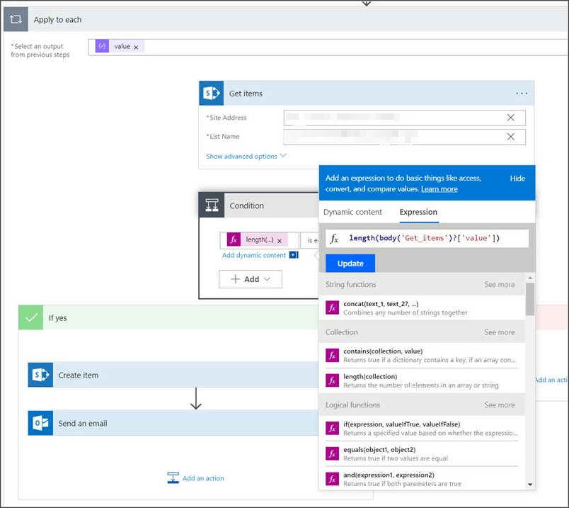

# <a name="create-a-notification-rule-when-a-local-onboarding-or-offboarding-script-is-used"></a><span data-ttu-id="e9605-104">Crear una regla de notificación cuando se usa un script local de incorporación o offboarding</span><span class="sxs-lookup"><span data-stu-id="e9605-104">Create a notification rule when a local onboarding or offboarding script is used</span></span>

[!INCLUDE [Microsoft 365 Defender rebranding](../../includes/microsoft-defender.md)]


<span data-ttu-id="e9605-105">**Se aplica a:**</span><span class="sxs-lookup"><span data-stu-id="e9605-105">**Applies to:**</span></span>
- [<span data-ttu-id="e9605-106">Microsoft Defender para punto de conexión</span><span class="sxs-lookup"><span data-stu-id="e9605-106">Microsoft Defender for Endpoint</span></span>](https://go.microsoft.com/fwlink/p/?linkid=2154037)
- [<span data-ttu-id="e9605-107">Microsoft 365 Defender</span><span class="sxs-lookup"><span data-stu-id="e9605-107">Microsoft 365 Defender</span></span>](https://go.microsoft.com/fwlink/?linkid=2118804)


> <span data-ttu-id="e9605-108">¿Desea experimentar Microsoft Defender para endpoint?</span><span class="sxs-lookup"><span data-stu-id="e9605-108">Want to experience Microsoft Defender for Endpoint?</span></span> [<span data-ttu-id="e9605-109">Regístrate para obtener una versión de prueba gratuita.</span><span class="sxs-lookup"><span data-stu-id="e9605-109">Sign up for a free trial.</span></span>](https://www.microsoft.com/microsoft-365/windows/microsoft-defender-atp?ocid=docs-wdatp-exposedapis-abovefoldlink)

[!include[Microsoft Defender for Endpoint API URIs for US Government](../../includes/microsoft-defender-api-usgov.md)]

[!include[Improve request performance](../../includes/improve-request-performance.md)]


<span data-ttu-id="e9605-110">Cree una regla de notificación para que cuando se utilice un script local de incorporación o offboarding, se le notificará.</span><span class="sxs-lookup"><span data-stu-id="e9605-110">Create a notification rule so that when a local onboarding or offboarding script is used, you'll be notified.</span></span> 

## <a name="before-you-begin"></a><span data-ttu-id="e9605-111">Antes de empezar</span><span class="sxs-lookup"><span data-stu-id="e9605-111">Before you begin</span></span>
<span data-ttu-id="e9605-112">Tendrás que tener acceso a:</span><span class="sxs-lookup"><span data-stu-id="e9605-112">You'll need to have access to:</span></span>
 - <span data-ttu-id="e9605-113">Microsoft Flow (Flow plan 1 como mínimo).</span><span class="sxs-lookup"><span data-stu-id="e9605-113">Microsoft Flow (Flow Plan 1 at a minimum).</span></span> <span data-ttu-id="e9605-114">Para obtener más información, [vea Flow de precios](https://flow.microsoft.com/pricing/).</span><span class="sxs-lookup"><span data-stu-id="e9605-114">For more information, see [Flow pricing page](https://flow.microsoft.com/pricing/).</span></span>
 - <span data-ttu-id="e9605-115">Azure Table o SharePoint List or Library /SQL DB</span><span class="sxs-lookup"><span data-stu-id="e9605-115">Azure Table or SharePoint List or Library / SQL DB</span></span>

## <a name="create-the-notification-flow"></a><span data-ttu-id="e9605-116">Crear el flujo de notificaciones</span><span class="sxs-lookup"><span data-stu-id="e9605-116">Create the notification flow</span></span>

1. <span data-ttu-id="e9605-117">En [flow.microsoft.com](https://flow.microsoft.com/).</span><span class="sxs-lookup"><span data-stu-id="e9605-117">In [flow.microsoft.com](https://flow.microsoft.com/).</span></span>

2. <span data-ttu-id="e9605-118">Vaya a **Mis flujos > Nuevo > Programado - desde en blanco**.</span><span class="sxs-lookup"><span data-stu-id="e9605-118">Navigate to **My flows > New > Scheduled - from blank**.</span></span> 

    


3. <span data-ttu-id="e9605-120">Cree un flujo programado.</span><span class="sxs-lookup"><span data-stu-id="e9605-120">Build a scheduled flow.</span></span>
   1. <span data-ttu-id="e9605-121">Escriba un nombre de flujo.</span><span class="sxs-lookup"><span data-stu-id="e9605-121">Enter a flow name.</span></span>
   2. <span data-ttu-id="e9605-122">Especifique el inicio y la hora.</span><span class="sxs-lookup"><span data-stu-id="e9605-122">Specify the start and time.</span></span>
   3. <span data-ttu-id="e9605-123">Especifique la frecuencia.</span><span class="sxs-lookup"><span data-stu-id="e9605-123">Specify the frequency.</span></span> <span data-ttu-id="e9605-124">Por ejemplo, cada 5 minutos.</span><span class="sxs-lookup"><span data-stu-id="e9605-124">For example, every 5 minutes.</span></span>

    

4. <span data-ttu-id="e9605-126">Seleccione el botón + para agregar una nueva acción.</span><span class="sxs-lookup"><span data-stu-id="e9605-126">Select the + button to add a new action.</span></span> <span data-ttu-id="e9605-127">La nueva acción será una solicitud HTTP a la API del Centro de seguridad de Defender para puntos de conexión.</span><span class="sxs-lookup"><span data-stu-id="e9605-127">The new action will be an HTTP request to the Defender for Endpoint security center device(s) API.</span></span> <span data-ttu-id="e9605-128">También puede reemplazarlo por el "Conector WDATP" (acción: "Máquinas- Obtener lista de máquinas").</span><span class="sxs-lookup"><span data-stu-id="e9605-128">You can also replace it with the out-of-the-box "WDATP Connector" (action: "Machines - Get list of machines").</span></span> 

    


5. <span data-ttu-id="e9605-130">Escriba los siguientes campos HTTP:</span><span class="sxs-lookup"><span data-stu-id="e9605-130">Enter the following HTTP fields:</span></span>

   - <span data-ttu-id="e9605-131">Método: "GET" como valor para obtener la lista de dispositivos.</span><span class="sxs-lookup"><span data-stu-id="e9605-131">Method: "GET" as a value to get the list of devices.</span></span>
   - <span data-ttu-id="e9605-132">URI: escriba `https://api.securitycenter.microsoft.com/api/machines` .</span><span class="sxs-lookup"><span data-stu-id="e9605-132">URI: Enter `https://api.securitycenter.microsoft.com/api/machines`.</span></span>
   - <span data-ttu-id="e9605-133">Autenticación: seleccione "OAuth de Active Directory".</span><span class="sxs-lookup"><span data-stu-id="e9605-133">Authentication: Select "Active Directory OAuth".</span></span>
   - <span data-ttu-id="e9605-134">Inquilino: inicie sesión y vaya a https://portal.azure.com Azure Active Directory > registros de **aplicaciones** y obtenga el valor de Identificador de inquilino.</span><span class="sxs-lookup"><span data-stu-id="e9605-134">Tenant: Sign-in to https://portal.azure.com and navigate to **Azure Active Directory > App Registrations** and get the Tenant ID value.</span></span>
   - <span data-ttu-id="e9605-135">Audiencia: `https://securitycenter.onmicrosoft.com/windowsatpservice\`</span><span class="sxs-lookup"><span data-stu-id="e9605-135">Audience: `https://securitycenter.onmicrosoft.com/windowsatpservice\`</span></span>
   - <span data-ttu-id="e9605-136">Id. de cliente: inicie sesión y https://portal.azure.com vaya a Azure Active Directory > registros de **aplicaciones** y obtenga el valor id. de cliente.</span><span class="sxs-lookup"><span data-stu-id="e9605-136">Client ID: Sign-in to https://portal.azure.com and navigate to **Azure Active Directory > App Registrations** and  get the Client ID value.</span></span>
   - <span data-ttu-id="e9605-137">Tipo de credencial: seleccione "Secreto".</span><span class="sxs-lookup"><span data-stu-id="e9605-137">Credential Type: Select "Secret".</span></span>
   - <span data-ttu-id="e9605-138">Secreto: inicie sesión y navegue hasta Azure Active Directory > https://portal.azure.com **registros de aplicaciones** y obtenga el valor de Identificador de inquilino.</span><span class="sxs-lookup"><span data-stu-id="e9605-138">Secret: Sign-in to https://portal.azure.com and navigate to **Azure Active Directory > App Registrations** and get the Tenant ID value.</span></span>

    


6. <span data-ttu-id="e9605-140">Para agregar un paso nuevo, seleccione **Agregar nueva** acción y, a continuación, busque Operaciones de **datos** y seleccione **Analizar JSON**.</span><span class="sxs-lookup"><span data-stu-id="e9605-140">Add a new step by selecting **Add new action** then search for **Data Operations** and select **Parse JSON**.</span></span>

    

7. <span data-ttu-id="e9605-142">Agregue Body en el **campo Contenido.**</span><span class="sxs-lookup"><span data-stu-id="e9605-142">Add Body in the **Content** field.</span></span>

    

8. <span data-ttu-id="e9605-144">Seleccione el **vínculo Usar carga de ejemplo para generar el** esquema.</span><span class="sxs-lookup"><span data-stu-id="e9605-144">Select the **Use sample payload to generate schema** link.</span></span>

    

9. <span data-ttu-id="e9605-146">Copie y pegue el siguiente fragmento de código JSON:</span><span class="sxs-lookup"><span data-stu-id="e9605-146">Copy and paste the following JSON snippet:</span></span>

    ```
    {
        "type": "object",
        "properties": {
            "@@odata.context": {
                "type": "string"
            },
            "value": {
                "type": "array",
                "items": {
                    "type": "object",
                    "properties": {
                        "id": {
                            "type": "string"
                        },
                        "computerDnsName": {
                            "type": "string"
                        },
                        "firstSeen": {
                            "type": "string"
                        },
                        "lastSeen": {
                            "type": "string"
                        },
                        "osPlatform": {
                            "type": "string"
                        },
                        "osVersion": {},
                        "lastIpAddress": {
                            "type": "string"
                        },
                        "lastExternalIpAddress": {
                            "type": "string"
                        },
                        "agentVersion": {
                            "type": "string"
                        },
                        "osBuild": {
                            "type": "integer"
                        },
                        "healthStatus": {
                            "type": "string"
                        },
                        "riskScore": {
                            "type": "string"
                        },
                        "exposureScore": {
                            "type": "string"
                        },
                        "aadDeviceId": {},
                        "machineTags": {
                            "type": "array"
                        }
                    },
                    "required": [
                        "id",
                        "computerDnsName",
                        "firstSeen",
                        "lastSeen",
                        "osPlatform",
                        "osVersion",
                        "lastIpAddress",
                        "lastExternalIpAddress",
                        "agentVersion",
                        "osBuild",
                        "healthStatus",
                        "rbacGroupId",
                        "rbacGroupName",
                        "riskScore",
                        "exposureScore",
                        "aadDeviceId",
                        "machineTags"
                    ]
                }
            }
        }
    }

    ```

10.  <span data-ttu-id="e9605-147">Extraiga los valores de la llamada JSON y compruebe si los dispositivos incorporados ya están registrados en la lista de SharePoint como ejemplo:</span><span class="sxs-lookup"><span data-stu-id="e9605-147">Extract the values from the JSON call and check if the onboarded device(s) is / are already registered at the SharePoint list as an example:</span></span>
- <span data-ttu-id="e9605-148">Si es así, no se activará ninguna notificación</span><span class="sxs-lookup"><span data-stu-id="e9605-148">If yes, no notification will be triggered</span></span>
- <span data-ttu-id="e9605-149">Si no, registrará los nuevos dispositivos incorporados en la lista SharePoint y se enviará una notificación al administrador de Defender for Endpoint</span><span class="sxs-lookup"><span data-stu-id="e9605-149">If no, will register the new onboarded device(s) in the SharePoint list and a notification will be sent to the Defender for Endpoint admin</span></span>

    

    

11. <span data-ttu-id="e9605-152">En **Condición**, agregue la siguiente expresión: "length(body('Get_items')?[' value'])" y establece la condición en igual a 0.</span><span class="sxs-lookup"><span data-stu-id="e9605-152">Under **Condition**, add the following expression: "length(body('Get_items')?['value'])" and set the condition to equal to 0.</span></span>

    <span data-ttu-id="e9605-153"></span><span class="sxs-lookup"><span data-stu-id="e9605-153"></span></span>  
    <span data-ttu-id="e9605-154"> 
     </span><span class="sxs-lookup"><span data-stu-id="e9605-154"> 
    </span></span>  
<span data-ttu-id="e9605-155"></span><span class="sxs-lookup"><span data-stu-id="e9605-155"></span></span>

## <a name="alert-notification"></a><span data-ttu-id="e9605-156">Notificación de alerta</span><span class="sxs-lookup"><span data-stu-id="e9605-156">Alert notification</span></span>
<span data-ttu-id="e9605-157">La siguiente imagen es un ejemplo de una notificación por correo electrónico.</span><span class="sxs-lookup"><span data-stu-id="e9605-157">The following image is an example of an email notification.</span></span>


## <a name="tips"></a><span data-ttu-id="e9605-159">Sugerencias</span><span class="sxs-lookup"><span data-stu-id="e9605-159">Tips</span></span>

- <span data-ttu-id="e9605-160">Puede filtrar aquí solo con lastSeen:</span><span class="sxs-lookup"><span data-stu-id="e9605-160">You can filter here using lastSeen only:</span></span>
    - <span data-ttu-id="e9605-161">Cada 60 minutos:</span><span class="sxs-lookup"><span data-stu-id="e9605-161">Every 60 min:</span></span>
      - <span data-ttu-id="e9605-162">Toma todos los dispositivos vistos por última vez en los últimos 7 días.</span><span class="sxs-lookup"><span data-stu-id="e9605-162">Take all devices last seen in the past 7 days.</span></span> 

- <span data-ttu-id="e9605-163">Para cada dispositivo:</span><span class="sxs-lookup"><span data-stu-id="e9605-163">For each device:</span></span> 
    - <span data-ttu-id="e9605-164">Si la propiedad vista por última vez se encuentra en el intervalo de una hora de [-7 días, -7 días + 60 minutos ] -> alerta para la posibilidad de fuera deborde.</span><span class="sxs-lookup"><span data-stu-id="e9605-164">If last seen property is on the one hour interval of [-7 days, -7days + 60 minutes ] -> Alert for offboarding possibility.</span></span>
    - <span data-ttu-id="e9605-165">Si se ve por primera vez en la última hora, > alerta de incorporación.</span><span class="sxs-lookup"><span data-stu-id="e9605-165">If first seen is on the past hour -> Alert for onboarding.</span></span>

<span data-ttu-id="e9605-166">En esta solución no tendrá alertas duplicadas: hay inquilinos que tienen numerosos dispositivos.</span><span class="sxs-lookup"><span data-stu-id="e9605-166">In this solution you will not have duplicate alerts: There are tenants that have numerous devices.</span></span> <span data-ttu-id="e9605-167">Obtener todos esos dispositivos puede ser muy caro y puede requerir paginación.</span><span class="sxs-lookup"><span data-stu-id="e9605-167">Getting all those devices might be very expensive and might require paging.</span></span>

<span data-ttu-id="e9605-168">Puede dividirlo en dos consultas:</span><span class="sxs-lookup"><span data-stu-id="e9605-168">You can split it to two queries:</span></span> 
1.  <span data-ttu-id="e9605-169">Para la offboarding, tome solo este intervalo mediante el $filter OData y notifique únicamente si se cumplen las condiciones.</span><span class="sxs-lookup"><span data-stu-id="e9605-169">For offboarding take only this interval using the OData $filter and only notify if the conditions are met.</span></span>
2.  <span data-ttu-id="e9605-170">Tome todos los dispositivos vistos por última vez en la última hora y compruebe la propiedad vista por primera vez para ellos (si la primera propiedad vista está en la última hora, la última vista también debe estar allí).</span><span class="sxs-lookup"><span data-stu-id="e9605-170">Take all devices last seen in the past hour and check first seen property for them (if the first seen property is on the past hour, the last seen must be there too).</span></span> 

