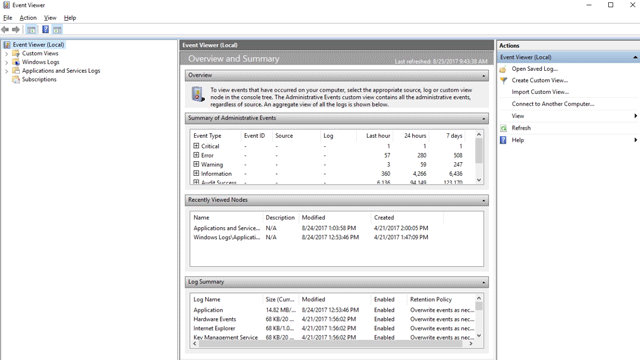

# <a name="understand-and-use-attack-surface-reduction-capabilities"></a>Descripción y uso de funcionalidades de reducción de superficie expuesta a ataques

[!INCLUDE [Microsoft 365 Defender rebranding](../../includes/microsoft-defender.md)]

**Se aplica a:**

- [Microsoft Defender para punto de conexión Plan 1](https://go.microsoft.com/fwlink/p/?linkid=2154037)
- [Microsoft Defender para punto de conexión Plan 2](https://go.microsoft.com/fwlink/p/?linkid=2154037)
- [Microsoft 365 Defender](https://go.microsoft.com/fwlink/?linkid=2118804)
- Antivirus de Microsoft Defender

**Plataformas**
- Windows

> [!TIP]
> ¿Quiere experimentar Microsoft Defender para punto de conexión? [Regístrese para obtener una prueba gratuita.](https://signup.microsoft.com/create-account/signup?products=7f379fee-c4f9-4278-b0a1-e4c8c2fcdf7e&ru=https://aka.ms/MDEp2OpenTrial?ocid=docs-wdatp-exposedapis-abovefoldlink)

Las superficies expuestas a ataques son todos los lugares donde su organización es vulnerable a ciberamenazas y ataques. Defender for Endpoint incluye varias funcionalidades para ayudar a reducir las superficies expuestas a ataques. Vea el siguiente vídeo para obtener más información sobre la reducción de la superficie expuesta a ataques.

> [!VIDEO https://www.microsoft.com/videoplayer/embed/RE4woug]

## <a name="configure-attack-surface-reduction-capabilities"></a>Configurar capacidades de reducción de superficie de ataques

Para configurar la reducción de la superficie expuesta a ataques en el entorno, siga estos pasos:

1. [Habilite el aislamiento basado en hardware para Microsoft Edge](/windows/security/threat-protection/microsoft-defender-application-guard/install-md-app-guard).

2. Habilitar el control de aplicación.

   1. Revise las directivas base en Windows. Consulte [Directivas base de ejemplo](/windows/security/threat-protection/windows-defender-application-control/example-wdac-base-policies).
   2. Consulte la [guía de diseño de Windows Defender Application Control](/windows/security/threat-protection/windows-defender-application-control/windows-defender-application-control-design-guide).
   3. Consulte [Implementación Windows Defender directivas de Control de aplicaciones (WDAC).](/windows/security/threat-protection/windows-defender-application-control/windows-defender-application-control-deployment-guide)

3. [Habilitar el acceso controlado a carpetas](enable-controlled-folders.md).

4. [Active Protección de red](enable-network-protection.md).

5. [Habilite la protección contra vulnerabilidades de seguridad](enable-exploit-protection.md).

6. [Implementar reglas de reducción de superficie expuesta a ataques](attack-surface-reduction-rules-deployment.md).

7. Configure el firewall de red.

   1. Obtenga información general sobre [Windows Defender Firewall con seguridad avanzada](/windows/security/threat-protection/windows-firewall/windows-firewall-with-advanced-security).
   2. Use la [guía de diseño Windows Defender Firewall](/windows/security/threat-protection/windows-firewall/windows-firewall-with-advanced-security-design-guide) para decidir cómo desea diseñar las directivas de firewall.
   3. Use la [guía de implementación Windows Defender Firewall](/windows/security/threat-protection/windows-firewall/windows-firewall-with-advanced-security-deployment-guide) para configurar el firewall de su organización con seguridad avanzada.

> [!TIP]
> En la mayoría de los casos, al configurar funcionalidades de reducción de superficie expuesta a ataques, puede elegir entre varios métodos:
>
> - Microsoft Endpoint Manager (que ahora incluye Microsoft Intune y Microsoft Endpoint Configuration Manager)
> - Directiva de grupo
> - Cmdlets de PowerShell

## <a name="test-attack-surface-reduction-in-microsoft-defender-for-endpoint"></a>Reducción de la superficie expuesta a ataques de prueba en Microsoft Defender para punto de conexión

Como parte del equipo de seguridad de la organización, puede configurar las funcionalidades de reducción de la superficie expuesta a ataques para que se ejecuten en modo de auditoría para ver cómo funcionarán. Puede habilitar las siguientes características de seguridad de ASR en modo de auditoría:

- Reglas de reducción de la superficie expuesta a ataques
- Protección contra vulnerabilidades de seguridad
- Protección de red
- Acceso controlado a carpetas

El modo auditoría le permite ver un registro de lo que *habría* ocurrido si hubiera habilitado la característica.

Puede habilitar el modo de auditoría al probar cómo funcionarán las características. Habilitar el modo de auditoría solo para pruebas ayuda a evitar que el modo de auditoría afecte a las aplicaciones de línea de negocio. También puede hacerse una idea de cuántos intentos de modificación de archivos sospechosos se producen durante un período de tiempo determinado.

Las características no bloquearán ni impedirán que se modifiquen aplicaciones, scripts o archivos. Sin embargo, el registro de eventos de Windows registrará eventos como si las características estuvieran totalmente habilitadas. Con el modo de auditoría, puede revisar el registro de eventos para ver qué efecto habría tenido la característica si se hubiera habilitado.

Para buscar las entradas auditadas, vaya a **Aplicaciones y servicios** \> **de Microsoft** \> **Windows** \> **Windows Defender** \> **operativo**.

Use Defender para punto de conexión para obtener más detalles para cada evento. Estos detalles son especialmente útiles para investigar las reglas de reducción de superficie expuesta a ataques. El uso de la consola de Defender para punto de conexión le permite [investigar problemas como parte de la escala de tiempo de alertas y los escenarios de investigación](investigate-alerts.md).

Puede habilitar el modo de auditoría mediante directiva de grupo, PowerShell y proveedores de servicios de configuración (CSP).

> [!TIP]
> También puede visitar el sitio web Windows Defender Testground en [demo.wd.microsoft.com](https://demo.wd.microsoft.com?ocid=cx-wddocs-testground) para confirmar que las características funcionan y ver cómo funcionan.

> [!NOTE]
> El sitio de demostración de Defender para punto de conexión en demo.wd.microsoft.com está obsoleto y se eliminará en el futuro.

| Opciones de auditoría | Habilitación del modo de auditoría | Visualización de eventos |
|---|---|---|
| La auditoría se aplica a todos los eventos | [Habilitar el acceso controlado a carpetas](enable-controlled-folders.md) | [Eventos de acceso controlado a carpetas](evaluate-controlled-folder-access.md#review-controlled-folder-access-events-in-windows-event-viewer) |
| La auditoría se aplica a reglas individuales | [Paso 1: Probar reglas ASR mediante el modo auditoría](attack-surface-reduction-rules-deployment-test.md#step-1-test-asr-rules-using-audit) | [Paso 2: Descripción de la página de informes de reglas de reducción de superficie expuesta a ataques](attack-surface-reduction-rules-deployment-test.md#step-2-understand-the-attack-surface-reduction-rules-reporting-page-in-the-microsoft-365-defender-portal) |
| La auditoría se aplica a todos los eventos | [Habilitación de la protección de red](enable-network-protection.md) | [Eventos de protección de red](evaluate-network-protection.md#review-network-protection-events-in-windows-event-viewer) |
| La auditoría se aplica a mitigaciones individuales | [Habilitar la protección contra vulnerabilidades de seguridad](enable-exploit-protection.md) | [Eventos de protección contra vulnerabilidades](exploit-protection.md#review-exploit-protection-events-in-windows-event-viewer) |

### <a name="attack-surface-reduction-asr-rules"></a>Reglas de la reducción de la superficie expuesta a ataques (ASR)

Las reglas de reducción de superficie expuesta a ataques (ASR) están predefinidas para proteger las superficies de ataque comunes conocidas. Hay varios métodos que puede usar para implementar reglas de reducción de superficie expuesta a ataques. El método preferido se documenta en los siguientes temas de implementación de reglas de reducción de la superficie expuesta a ataques (ASR):

- [Introducción a la implementación de reglas de reducción de la superficie expuesta a ataques (ASR)](attack-surface-reduction-rules-deployment.md)
- [Planear la implementación de reglas de reducción de la superficie expuesta a ataques (ASR)](attack-surface-reduction-rules-deployment-plan.md)
- [Probar las reglas de reducción de la superficie expuesta a ataques (ASR)](attack-surface-reduction-rules-deployment-test.md)
- [Habilitar reglas de la reducción de la superficie expuesta a ataques (ASR)](attack-surface-reduction-rules-deployment-implement.md)
- [Operacionar reglas de reducción de la superficie expuesta a ataques (ASR)](attack-surface-reduction-rules-deployment-operationalize.md)

## <a name="view-attack-surface-reduction-events"></a>Ver eventos de la reducción de la superficie expuesta a ataques

Revise los eventos de reducción de la superficie expuesta a ataques en Visor de eventos para supervisar qué reglas o configuraciones funcionan. También puede determinar si alguna configuración es demasiado "ruidosa" o afecta al flujo de trabajo diario.

La revisión de eventos es útil cuando se evalúan las características. Puede habilitar el modo de auditoría para las características o la configuración y, a continuación, revisar lo que habría ocurrido si estuvieran totalmente habilitadas.

En esta sección se enumeran todos los eventos, su característica o configuración asociada, y se describe cómo crear vistas personalizadas para filtrar a eventos específicos.

Obtenga informes detallados sobre eventos, bloques y advertencias como parte de Seguridad de Windows si tiene una suscripción A5 y usa [Microsoft Defender para punto de conexión](microsoft-defender-endpoint.md).

### <a name="use-custom-views-to-review-attack-surface-reduction-capabilities"></a>Uso de vistas personalizadas para revisar las funcionalidades de reducción de superficie expuesta a ataques

Cree vistas personalizadas en el Windows Visor de eventos para ver solo los eventos de funcionalidades y configuraciones específicas. La manera más fácil es importar una vista personalizada como un archivo XML. Puede copiar el XML directamente desde esta página.

También puede navegar manualmente al área de eventos que corresponde a la característica.

#### <a name="import-an-existing-xml-custom-view"></a>Importación de una vista personalizada XML existente

1. Cree un archivo .txt vacío y copie el XML de la vista personalizada que desea usar en el archivo .txt. Haga esto para cada una de las vistas personalizadas que desea usar. Cambie el nombre de los archivos como se indica a continuación (asegúrese de cambiar el tipo de .txt a .xml):
    - Vista personalizada de eventos de acceso controlado a carpetas: *cfa-events.xml*
    - Vista personalizada de eventos de protección contra vulnerabilidades de seguridad: *ep-events.xml*
    - Vista personalizada de eventos de reducción de superficie expuesta a ataques: *asr-events.xml*
    - Vista personalizada de eventos de red y protección: *np-events.xml*

2. Escriba **el visor de eventos** en el menú Inicio y abra **Visor de eventos**.

3. Seleccione **Importar acción** \> **vista personalizada...**

   > [!div class="mx-imgBorder"]
   > 

4. Vaya al lugar donde extrajo el archivo XML para la vista personalizada que desee y selecciónelo.

5. Seleccione **Abrir**.

6. Creará una vista personalizada que filtra para mostrar solo los eventos relacionados con esa característica.

#### <a name="copy-the-xml-directly"></a>Copiar el XML directamente

1. Escriba **el visor de eventos** en el menú Inicio y abra el **Visor de eventos de Windows**.

2. En el panel izquierdo, en **Acciones**, seleccione **Crear vista personalizada...**

   > [!div class="mx-imgBorder"]
   > 

3. Vaya a la pestaña XML y seleccione **Editar consulta manualmente**. Verá una advertencia que indica que no puede editar la consulta mediante la pestaña **Filtro** si usa la opción XML. Seleccione **Sí**.

4. Pegue el código XML de la característica desde la que desea filtrar los eventos en la sección XML.

5. Seleccione **Aceptar**. Especifique un nombre para el filtro. Esto crea una vista personalizada que filtra para mostrar solo los eventos relacionados con esa característica.

#### <a name="xml-for-attack-surface-reduction-rule-events"></a>XML para eventos de regla de reducción de superficie expuesta a ataques

```xml
<QueryList>
  <Query Id="0" Path="Microsoft-Windows-Windows Defender/Operational">
   <Select Path="Microsoft-Windows-Windows Defender/Operational">*[System[(EventID=1121 or EventID=1122 or EventID=5007)]]</Select>
   <Select Path="Microsoft-Windows-Windows Defender/WHC">*[System[(EventID=1121 or EventID=1122 or EventID=5007)]]</Select>
  </Query>
</QueryList>
```

#### <a name="xml-for-controlled-folder-access-events"></a>XML para eventos de acceso controlado a carpetas

```xml
<QueryList>
  <Query Id="0" Path="Microsoft-Windows-Windows Defender/Operational">
   <Select Path="Microsoft-Windows-Windows Defender/Operational">*[System[(EventID=1123 or EventID=1124 or EventID=5007)]]</Select>
   <Select Path="Microsoft-Windows-Windows Defender/WHC">*[System[(EventID=1123 or EventID=1124 or EventID=5007)]]</Select>
  </Query>
</QueryList>
```

#### <a name="xml-for-exploit-protection-events"></a>XML para eventos de protección contra vulnerabilidades de seguridad

```xml
<QueryList>
  <Query Id="0" Path="Microsoft-Windows-Security-Mitigations/KernelMode">
   <Select Path="Microsoft-Windows-Security-Mitigations/KernelMode">*[System[Provider[@Name='Microsoft-Windows-Security-Mitigations' or @Name='Microsoft-Windows-WER-Diag' or @Name='Microsoft-Windows-Win32k' or @Name='Win32k'] and ( (EventID &gt;= 1 and EventID &lt;= 24)  or EventID=5 or EventID=260)]]</Select>
   <Select Path="Microsoft-Windows-Win32k/Concurrency">*[System[Provider[@Name='Microsoft-Windows-Security-Mitigations' or @Name='Microsoft-Windows-WER-Diag' or @Name='Microsoft-Windows-Win32k' or @Name='Win32k'] and ( (EventID &gt;= 1 and EventID &lt;= 24)  or EventID=5 or EventID=260)]]</Select>
   <Select Path="Microsoft-Windows-Win32k/Contention">*[System[Provider[@Name='Microsoft-Windows-Security-Mitigations' or @Name='Microsoft-Windows-WER-Diag' or @Name='Microsoft-Windows-Win32k' or @Name='Win32k'] and ( (EventID &gt;= 1 and EventID &lt;= 24)  or EventID=5 or EventID=260)]]</Select>
   <Select Path="Microsoft-Windows-Win32k/Messages">*[System[Provider[@Name='Microsoft-Windows-Security-Mitigations' or @Name='Microsoft-Windows-WER-Diag' or @Name='Microsoft-Windows-Win32k' or @Name='Win32k'] and ( (EventID &gt;= 1 and EventID &lt;= 24)  or EventID=5 or EventID=260)]]</Select>
   <Select Path="Microsoft-Windows-Win32k/Operational">*[System[Provider[@Name='Microsoft-Windows-Security-Mitigations' or @Name='Microsoft-Windows-WER-Diag' or @Name='Microsoft-Windows-Win32k' or @Name='Win32k'] and ( (EventID &gt;= 1 and EventID &lt;= 24)  or EventID=5 or EventID=260)]]</Select>
   <Select Path="Microsoft-Windows-Win32k/Power">*[System[Provider[@Name='Microsoft-Windows-Security-Mitigations' or @Name='Microsoft-Windows-WER-Diag' or @Name='Microsoft-Windows-Win32k' or @Name='Win32k'] and ( (EventID &gt;= 1 and EventID &lt;= 24)  or EventID=5 or EventID=260)]]</Select>
   <Select Path="Microsoft-Windows-Win32k/Render">*[System[Provider[@Name='Microsoft-Windows-Security-Mitigations' or @Name='Microsoft-Windows-WER-Diag' or @Name='Microsoft-Windows-Win32k' or @Name='Win32k'] and ( (EventID &gt;= 1 and EventID &lt;= 24)  or EventID=5 or EventID=260)]]</Select>
   <Select Path="Microsoft-Windows-Win32k/Tracing">*[System[Provider[@Name='Microsoft-Windows-Security-Mitigations' or @Name='Microsoft-Windows-WER-Diag' or @Name='Microsoft-Windows-Win32k' or @Name='Win32k'] and ( (EventID &gt;= 1 and EventID &lt;= 24)  or EventID=5 or EventID=260)]]</Select>
   <Select Path="Microsoft-Windows-Win32k/UIPI">*[System[Provider[@Name='Microsoft-Windows-Security-Mitigations' or @Name='Microsoft-Windows-WER-Diag' or @Name='Microsoft-Windows-Win32k' or @Name='Win32k'] and ( (EventID &gt;= 1 and EventID &lt;= 24)  or EventID=5 or EventID=260)]]</Select>
   <Select Path="System">*[System[Provider[@Name='Microsoft-Windows-Security-Mitigations' or @Name='Microsoft-Windows-WER-Diag' or @Name='Microsoft-Windows-Win32k' or @Name='Win32k'] and ( (EventID &gt;= 1 and EventID &lt;= 24)  or EventID=5 or EventID=260)]]</Select>
   <Select Path="Microsoft-Windows-Security-Mitigations/UserMode">*[System[Provider[@Name='Microsoft-Windows-Security-Mitigations' or @Name='Microsoft-Windows-WER-Diag' or @Name='Microsoft-Windows-Win32k' or @Name='Win32k'] and ( (EventID &gt;= 1 and EventID &lt;= 24)  or EventID=5 or EventID=260)]]</Select>
  </Query>
</QueryList>
```

#### <a name="xml-for-network-protection-events"></a>XML para eventos de protección de red

```xml
<QueryList>
 <Query Id="0" Path="Microsoft-Windows-Windows Defender/Operational">
  <Select Path="Microsoft-Windows-Windows Defender/Operational">*[System[(EventID=1125 or EventID=1126 or EventID=5007)]]</Select>
  <Select Path="Microsoft-Windows-Windows Defender/WHC">*[System[(EventID=1125 or EventID=1126 or EventID=5007)]]</Select>
 </Query>
</QueryList>
```

### <a name="list-of-attack-surface-reduction-events"></a>Lista de eventos de reducción de superficie expuesta a ataques

Todos los eventos de reducción de superficie expuesta a ataques se encuentran en **Registros de aplicaciones y servicios > Microsoft > Windows** y, a continuación, la carpeta o el proveedor, como se muestra en la tabla siguiente.

Puede acceder a estos eventos en Windows Visor de eventos:

1. Abra el menú **Inicio** y escriba **visor de eventos** y, a continuación, seleccione el resultado **Visor de eventos**.
2. Expanda **Registros de aplicaciones y servicios > Microsoft > Windows** y, a continuación, vaya a la carpeta que aparece en **Proveedor o origen** en la tabla siguiente.
3. Haga doble clic en el subelemento para ver los eventos. Desplácese por los eventos para encontrar el que está buscando.

   

<br>

****

|Característica|Proveedor u origen|Id. de evento|Descripción|
|---|---|:---:|---|
|Protección contra vulnerabilidades de seguridad|Security-Mitigations (modo kernel/modo de usuario)|1|Auditoría de ACG|
|Protección contra vulnerabilidades de seguridad|Security-Mitigations (modo kernel/modo de usuario)|2|Aplicación de ACG|
|Protección contra vulnerabilidades de seguridad|Security-Mitigations (modo kernel/modo de usuario)|3|No permitir procesos secundarios de auditoría|
|Protección contra vulnerabilidades de seguridad|Security-Mitigations (modo kernel/modo de usuario)|4|No permitir procesos secundarios de bloqueo|
|Protección contra vulnerabilidades de seguridad|Security-Mitigations (modo kernel/modo de usuario)|5|Bloquear auditoría de imágenes de integridad baja|
|Protección contra vulnerabilidades de seguridad|Security-Mitigations (modo kernel/modo de usuario)|6 |Bloquear bloqueo de imágenes de integridad baja|
|Protección contra vulnerabilidades de seguridad|Security-Mitigations (modo kernel/modo de usuario)|7 |Bloquear auditoría de imágenes remota|
|Protección contra vulnerabilidades de seguridad|Security-Mitigations (modo kernel/modo de usuario)|8 |Bloquear bloqueo de imágenes remoto|
|Protección contra vulnerabilidades de seguridad|Security-Mitigations (modo kernel/modo de usuario)|9 |Deshabilitar auditoría de llamadas del sistema de Win32k|
|Protección contra vulnerabilidades de seguridad|Security-Mitigations (modo kernel/modo de usuario)|10|Deshabilitar bloqueo de llamadas del sistema de Win32k|
|Protección contra vulnerabilidades de seguridad|Security-Mitigations (modo kernel/modo de usuario)|11|Auditoría de protección de integridad de código|
|Protección contra vulnerabilidades de seguridad|Security-Mitigations (modo kernel/modo de usuario)|12 |Bloque de protección de integridad de código|
|Protección contra vulnerabilidades de seguridad|Security-Mitigations (modo kernel/modo de usuario)|13|Auditoría de EAF|
|Protección contra vulnerabilidades de seguridad|Security-Mitigations (modo kernel/modo de usuario)|14 |Aplicación de EAF|
|Protección contra vulnerabilidades de seguridad|Security-Mitigations (modo kernel/modo de usuario)|15 |Auditoría de EAF+|
|Protección contra vulnerabilidades de seguridad|Security-Mitigations (modo kernel/modo de usuario)|16|Aplicación de EAF+|
|Protección contra vulnerabilidades de seguridad|Security-Mitigations (modo kernel/modo de usuario)|17 |Auditoría de IAF|
|Protección contra vulnerabilidades de seguridad|Security-Mitigations (modo kernel/modo de usuario)|18 |Aplicación de IAF|
|Protección contra vulnerabilidades de seguridad|Security-Mitigations (modo kernel/modo de usuario)|19|Auditoría ROP StackPivot|
|Protección contra vulnerabilidades de seguridad|Security-Mitigations (modo kernel/modo de usuario)|20|Aplicación de ROP StackPivot|
|Protección contra vulnerabilidades de seguridad|Security-Mitigations (modo kernel/modo de usuario)| 21|Auditoría ROP CallerCheck|
|Protección contra vulnerabilidades de seguridad|Security-Mitigations (modo kernel/modo de usuario)|22|Aplicación de ROP CallerCheck|
|Protección contra vulnerabilidades de seguridad|Security-Mitigations (modo kernel/modo de usuario)|23|Auditoría de ROP SimExec|
|Protección contra vulnerabilidades de seguridad|Security-Mitigations (modo kernel/modo de usuario)|24|Aplicación de ROP SimExec|
|Protección contra vulnerabilidades de seguridad|Diagnósticos WER|5|Bloque CFG|
|Protección contra vulnerabilidades de seguridad|Win32K (operativo)|260|Fuente que no es de confianza|
|Protección de red|Windows Defender (operativo)|5007|Evento cuando se cambia la configuración|
|Protección de red|Windows Defender (operativo)|1125|Evento cuando se activa la protección de red en modo de auditoría|
|Protección de red|Windows Defender (operativo)|1126|Evento cuando se activa la protección de red en modo de bloque|
|Acceso controlado a carpetas|Windows Defender (operativo)|5007|Evento cuando se cambia la configuración|
|Acceso controlado a carpetas|Windows Defender (operativo)|1124|Evento de acceso a carpetas controladas auditadas|
|Acceso controlado a carpetas|Windows Defender (operativo)|1123|Evento de acceso a carpetas controladas bloqueadas|
|Acceso controlado a carpetas|Windows Defender (operativo)|1127|Evento de bloque de escritura del sector de acceso controlado bloqueado|
|Acceso controlado a carpetas|Windows Defender (operativo)|1128|Evento de bloque de escritura del sector de acceso controlado auditado a carpetas|
|Reducción de la superficie expuesta a ataques|Windows Defender (operativo)|5007|Evento cuando se cambia la configuración|
|Reducción de la superficie expuesta a ataques|Windows Defender (operativo)|1122|Evento cuando se activa la regla en modo auditoría|
|Reducción de la superficie expuesta a ataques|Windows Defender (operativo)|1121|Evento cuando se activa la regla en modo de bloque|

>[!NOTE]
> Desde la perspectiva del usuario, las notificaciones del modo de advertencia de ASR se realizan como una notificación del sistema de Windows para las reglas de reducción de la superficie expuesta a ataques.
>
> En ASR, Protección de red solo proporciona los modos Auditoría y Bloque.

## <a name="resources-to-learn-more-about-attack-surface-reduction"></a>Recursos para obtener más información sobre la reducción de la superficie expuesta a ataques

Como se mencionó en el vídeo, Defender for Endpoint incluye varias funcionalidades de reducción de superficie expuesta a ataques. Use los siguientes recursos para obtener más información:

| Artículo | Descripción |
|:---|:---|
| [Aislamiento basado en hardware](/windows/security/threat-protection/microsoft-defender-application-guard/md-app-guard-overview) | Proteja y mantenga la integridad de un sistema a medida que se inicia y mientras se ejecuta. Valide la integridad del sistema a través de la atestación local y remota. Use el aislamiento de contenedor para Microsoft Edge para ayudar a protegerse frente a sitios web malintencionados. |
| [Control de la aplicación](/windows/security/threat-protection/windows-defender-application-control/windows-defender-application-control) | Use el control de aplicaciones para que las aplicaciones deberán ganar confianza para poder ejecutarse. |
| [Acceso controlado a carpetas](controlled-folders.md) | Ayuda a evitar que las aplicaciones malintencionadas o sospechosas (incluido el malware ransomware de cifrado de archivos) realicen cambios en los archivos de las carpetas clave del sistema (requiere Antivirus de Microsoft Defender). |
| [Protección de red](network-protection.md) | Amplíe la protección al tráfico de red y la conectividad en los dispositivos de la organización. (Requiere Antivirus de Microsoft Defender). |
| [Protección contra vulnerabilidades de seguridad](exploit-protection.md) | Ayude a proteger los sistemas operativos y las aplicaciones que usa su organización para que no se aprovechen. La protección contra vulnerabilidades de seguridad también funciona con soluciones antivirus de terceros. |
| [Control de dispositivos](device-control-report.md) | Protege contra la pérdida de datos mediante la supervisión y el control de los medios que se usan en los dispositivos, como el almacenamiento extraíble y las unidades USB, en la organización. |
| [ Guía de implementación de reglas de reducción de la superficie expuesta a ataques (ASR)](attack-surface-reduction-rules-deployment.md) | Presenta información general y requisitos previos para implementar reglas de reducción de superficie expuesta a ataques. |
| [Planear la implementación de reglas de reducción de la superficie expuesta a ataques (ASR)](attack-surface-reduction-rules-deployment-plan.md) | Enumera los pasos recomendados para la implementación de reglas de reducción de superficie expuesta a ataques. |
| [Probar las reglas de reducción de la superficie expuesta a ataques (ASR)](attack-surface-reduction-rules-deployment-test.md) | Proporciona los pasos necesarios para usar el modo de auditoría para probar las reglas de reducción de superficie expuesta a ataques. |
| [Habilitar reglas de la reducción de la superficie expuesta a ataques (ASR)](attack-surface-reduction-rules-deployment-implement.md) | Muestra los pasos para realizar la transición de las reglas de reducción de la superficie expuesta a ataques del modo de prueba (auditoría) al modo activo y habilitado (bloquear). |
| [Operacionar reglas de reducción de la superficie expuesta a ataques (ASR)](attack-surface-reduction-rules-deployment-operationalize.md) | Proporciona información sobre las actividades diarias de revisión y mantenimiento. |
| [Referencia de reglas de reducción de la superficie expuesta a ataques (ASR)](attack-surface-reduction-rules-reference.md) | Proporciona detalles sobre cada regla de reducción de superficie expuesta a ataques. |
| [Reglas de la reducción de la superficie expuesta a ataques](attack-surface-reduction.md) | Reduzca los puntos vulnerables (las superficies de ataque) en sus aplicaciones con reglas inteligentes que le ayudarán a detener el malware. (Requiere Antivirus de Microsoft Defender). |
