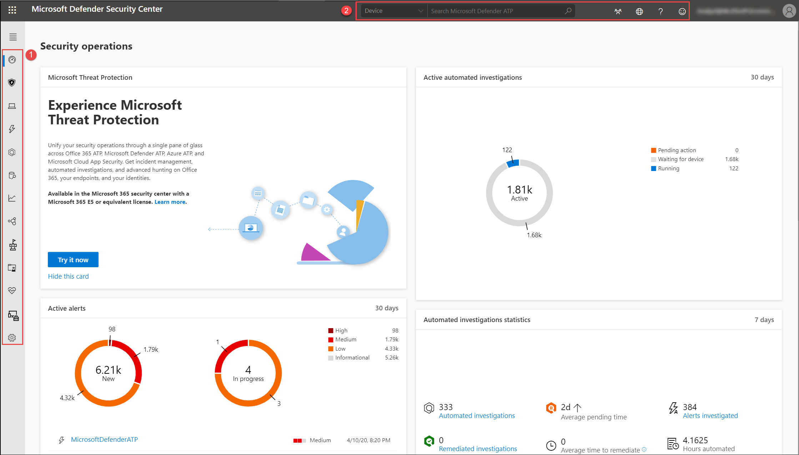

# Información general del portal del Centro de seguridad de Microsoft Defender

[!INCLUDE [Microsoft 365 Defender rebranding](../../includes/microsoft-defender.md)]

**Se aplica a:**
- [Microsoft Defender para punto de conexión](https://go.microsoft.com/fwlink/p/?linkid=2154037)
- [Microsoft 365 Defender](https://go.microsoft.com/fwlink/?linkid=2118804)

>¿Desea experimentar Defender for Endpoint? [Regístrate para obtener una versión de prueba gratuita.](https://www.microsoft.com/microsoft-365/windows/microsoft-defender-atp?ocid=docs-wdatp-portaloverview-abovefoldlink) 

Enterprise de seguridad pueden usar Centro de seguridad de Microsoft Defender para supervisar y ayudar a responder a las alertas de posibles infracciones de datos o actividad de amenazas persistentes avanzadas.

Puede usar [Centro de seguridad de Microsoft Defender](https://securitycenter.windows.com/) para:

- Ver, ordenar y clasificar alertas desde los puntos de conexión
- Buscar más información sobre indicadores observados, como archivos y direcciones IP
- Cambiar la configuración de Microsoft Defender para endpoint, incluida la zona horaria y revisar la información de licencias

## Centro de seguridad de Microsoft Defender

Cuando abra el portal, verá:

- (1) Panel de navegación (seleccione las líneas horizontales en la parte superior del panel de navegación para mostrarlo u ocultarlo)
- (2) Búsqueda, Community, Localización, Ayuda y soporte técnico, Comentarios

 

> [!NOTE]
> Las detecciones relacionadas con malware solo aparecerán si los dispositivos usan Antivirus de Microsoft Defender como el producto antimalware de protección en tiempo real predeterminado.

Puede navegar por el portal con las opciones de menú disponibles en todas las secciones. Consulte la tabla siguiente para obtener una descripción de cada sección.

Área | Descripción
:---|:---
**(1) Panel de navegación** | Use el panel de navegación para moverse entre **Paneles**, Incidentes **,** Lista de **dispositivos** **,** Cola de alertas , Investigaciones **automatizadas** **,** Búsqueda avanzada **,** Informes , API de **&** partners, Administración de vulnerabilidades **de &,** Evaluación y **tutoriales,** Estado del **servicio,** **Administración** de configuración **y Configuración**. Seleccione las líneas horizontales en la parte superior del panel de navegación para mostrarla u ocultarla.
**Paneles** | Acceda a las investigaciones automatizadas activas, alertas activas, estadísticas de investigaciones automatizadas, dispositivos en riesgo, usuarios en riesgo, dispositivos con problemas de sensor, estado del servicio, orígenes de detección y paneles de informes de dispositivos diarios.
**Incidentes** | Ver alertas que se han agregado como incidentes.
**Lista de dispositivos** | Muestra la lista de dispositivos que están incorporados a Defender for Endpoint, información sobre ellos y sus niveles de exposición y riesgo.
**Cola de alertas** | Ver alertas generadas desde dispositivos de las organizaciones.
**Investigaciones automatizadas** | Muestra las investigaciones automatizadas que se han llevado a cabo en la red, la alerta desencadenante, el estado de cada investigación y otros detalles, como cuándo se inició la investigación y la duración de la investigación.
**Búsqueda avanzada de amenazas** | La búsqueda avanzada le permite buscar e investigar proactivamente en toda la organización mediante una herramienta de búsqueda y consulta eficaz.
**Informes** | Vea gráficos que detallan la protección contra amenazas, el estado y el cumplimiento del dispositivo, la protección web y la vulnerabilidad.
**Socios y API** | Vea las conexiones de partners compatibles, que mejoran las capacidades de detección, investigación e inteligencia de amenazas de la plataforma. También puede ver las aplicaciones conectadas, el explorador de API, la información general sobre el uso de la API y la configuración de exportación de datos.
**Administración & vulnerabilidad de amenazas** | Consulta la puntuación segura de Microsoft para dispositivos, la puntuación de exposición, los dispositivos expuestos, el software vulnerable y toma medidas en las recomendaciones de seguridad más destacadas.
**Evaluación y tutoriales** | Administrar dispositivos de prueba, simulaciones de ataques e informes. Aprenda y experimente las capacidades de Defender for Endpoint a través de un recorrido guiado en un entorno de prueba.
**Estado del servicio** | Proporciona información sobre el estado actual del servicio Defender for Endpoint. Podrá comprobar si el estado del servicio es correcto o si hay problemas actuales.
**Administración de configuración** | Muestra los dispositivos abordo, la línea base de seguridad de la organización, el análisis predictivo, la cobertura de protección web y te permite realizar la administración de superficies de ataques en tus dispositivos.
**Configuración** | Muestra la configuración que seleccionó durante la incorporación y le permite actualizar las preferencias del sector y el período de directiva de retención. También puedes establecer otras opciones de configuración como permisos, API, reglas, administración de dispositivos, administración de servicios de TI y evaluaciones de red.
**(2) Búsqueda, Community, Localización, Ayuda y soporte técnico, Comentarios** | **Búsqueda:** búsqueda por dispositivo, archivo, usuario, dirección URL, IP, vulnerabilidad, software y recomendación.    **Community:** acceda al centro de Community para aprender, colaborar y compartir experiencias sobre el producto.     **Localización:** establecer zonas horarias.     **Ayuda y** soporte técnico: obtenga acceso a la guía de Defender para endpoints, soporte técnico de Microsoft y Microsoft Premier, información de licencias, simulaciones & tutoriales, laboratorio de evaluación de Defender for Endpoint, consulte a un experto en amenazas.   **Comentarios:** proporcione comentarios sobre lo que le gusta o lo que podemos hacer mejor.

> [!NOTE]
> Para los dispositivos con problemas de escalado de PPP de alta resolución, consulte Windows de escalado para [dispositivos](https://support.microsoft.com/help/3025083/windows-scaling-issues-for-high-dpi-devices) de ppp altos para obtener posibles soluciones.

## Iconos de Microsoft Defender para puntos de conexión

En la tabla siguiente se proporciona información sobre los iconos usados en todo el portal:

Icono | Descripción
:---|:---
| Logotipo de Microsoft Defender para endpoint
| Alerta: indicación de una actividad correlacionada con ataques avanzados.
| Detección: indicación de una detección de amenazas de malware.
| Amenaza activa: amenazas que se ejecutan activamente en el momento de la detección.
| Remediated: amenaza eliminada del dispositivo.
| No corregido: amenaza no eliminada del dispositivo.
| Indica los eventos que desencadenaron una alerta en el **árbol de proceso de alerta**.
| Icono de dispositivo
| Antivirus de Microsoft Defender eventos
| Protección de aplicaciones de Windows Defender eventos
| Device Guard de Windows Defender eventos
| Windows Defender Eventos de Protección contra vulnerabilidades de seguridad
| Windows Defender Eventos de SmartScreen
| Windows Eventos de firewall
| Acción de respuesta
| Eventos de proceso
| Eventos de red
| Eventos de archivo
| Eventos del Registro
| Cargar eventos DLL
| Otros eventos
| Modificación del token de acceso
| Creación de archivos
| Firmante
| Ruta de acceso de archivo
| Línea de comandos
| Archivo sin signo
| Árbol de procesos
| Asignación de memoria
| Inyección de procesos
| Ejecución de comandos de Powershell
 | Community centro
 | Notificaciones
 | Investigación automatizada: no se han encontrado amenazas
 | Investigación automatizada: error
 | Investigación automatizada: parcialmente investigada
 | Investigación automatizada: finalizada por el sistema
 | Investigación automatizada: pendiente
 | Investigación automatizada: ejecución
 | Investigación automatizada: corregido
 | Investigación automatizada: parcialmente subsanada
 | Administración & vulnerabilidad de amenazas: información sobre amenazas
 | Administración & vulnerabilidad de amenazas: posible alerta activa
 | Administración & vulnerabilidad de amenazas: información de recomendaciones

## Temas relacionados

- [Introducción al Centro de seguridad de Microsoft Defender](use.md)
- [Ver el panel de operaciones de seguridad](security-operations-dashboard.md)
- [Ver el panel de administración & vulnerabilidades](tvm-dashboard-insights.md)
- [Ver el panel análisis de amenazas y realizar acciones de mitigación recomendadas](threat-analytics.md)
