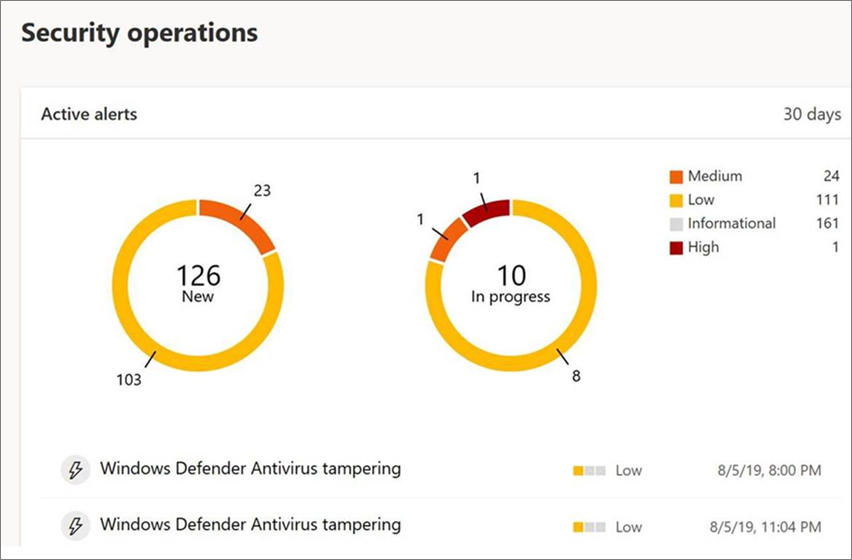

# Proteger la configuración de seguridad con protección contra alteraciones

[!INCLUDE [Microsoft 365 Defender rebranding](../../includes/microsoft-defender.md)]

**Se aplica a:**

- [Microsoft Defender para punto de conexión](/microsoft-365/security/defender-endpoint/)

La protección contra alteraciones está disponible para dispositivos que ejecutan una de las siguientes versiones de Windows:

- Windows 10
- Windows Server 2019
- Windows Server, versión 1803 o posterior
- Windows Server 2016

## Información general

Durante algunos tipos de ataques cibernéticos, los actores malos intentan deshabilitar las características de seguridad, como la protección antivirus, en las máquinas. A los actores malintencionados les gusta deshabilitar las características de seguridad para obtener un acceso más fácil a los datos, para instalar malware o para aprovechar sus datos, identidades y dispositivos. La protección contra alteraciones ayuda a evitar que se produzcan este tipo de cosas.

Con la protección contra manipulaciones, las aplicaciones malintencionadas no pueden realizar acciones como:

- Deshabilitar la protección contra virus y amenazas
- Deshabilitar la protección en tiempo real
- Desactivar la supervisión del comportamiento
- Deshabilitar antivirus (como IOfficeAntivirus (IOAV))
- Deshabilitar la protección entregada en la nube
- Eliminación de actualizaciones de inteligencia de seguridad

### Cómo funciona

La protección contra alteraciones bloquea básicamente El Antivirus de Microsoft Defender e impide que se cambie la configuración de seguridad a través de aplicaciones y métodos como:

- Configuración de la configuración en el Editor del Registro en el dispositivo Windows
- Cambiar la configuración mediante cmdlets de PowerShell
- Edición o eliminación de la configuración de seguridad mediante directivas de grupo

La protección contra alteraciones no le impide ver la configuración de seguridad. Además, la protección contra alteraciones no afecta a la forma en que las aplicaciones antivirus de terceros se registran con la aplicación seguridad de Windows. Si tu organización usa Windows 10 Enterprise E5, los usuarios individuales no pueden cambiar la configuración de protección contra manipulaciones; en esos casos, la protección contra alteraciones la administra el equipo de seguridad.

### ¿Qué quiere hacer?

| Para realizar esta tarea... | Vea esta sección... |
|:---|:---|
| Activar o desactivar la protección contra manipulaciones en el Centro de seguridad de Microsoft Defender 
Administrar la protección contra alteraciones en el espacio empresarial | [Administrar la protección contra alteraciones de su organización mediante el Centro de seguridad de Microsoft Defender](#manage-tamper-protection-for-your-organization-using-the-microsoft-defender-security-center) |
| Activar o desactivar la protección contra manipulaciones para toda o parte de la organización con Intune 
Ajustar la configuración de protección contra alteraciones en la organización | [Administrar la protección contra alteraciones de la organización con Intune](#manage-tamper-protection-for-your-organization-using-intune) |
| Activar o desactivar la protección contra alteraciones para su organización con Configuration Manager | [Administrar la protección contra alteraciones de la organización mediante la conexión de inquilinos con Configuration Manager, versión 2006](#manage-tamper-protection-for-your-organization-with-configuration-manager-version-2006) |
| Activar (o desactivar) la protección contra manipulaciones para un dispositivo individual | [Administrar la protección contra alteraciones en un dispositivo individual](#manage-tamper-protection-on-an-individual-device) |
| Ver detalles sobre intentos de manipulación en dispositivos | [Ver información sobre intentos de manipulación](#view-information-about-tampering-attempts) |
| Revisar las recomendaciones de seguridad | [Revisar recomendaciones de seguridad](#review-your-security-recommendations) |
| Revisar la lista de preguntas más frecuentes (preguntas frecuentes) | [Examinar las preguntas frecuentes](#view-information-about-tampering-attempts) |

## Administrar la protección contra alteraciones de su organización mediante el Centro de seguridad de Microsoft Defender

La protección contra alteraciones puede estar activada o desactivada para el inquilino mediante el Centro de seguridad de Microsoft Defender ( [https://securitycenter.windows.com](https://securitycenter.windows.com) ). Estos son algunos puntos a tener en cuenta:

- Actualmente, la opción para administrar la protección contra alteraciones en el Centro de seguridad de Microsoft Defender está activa de forma predeterminada para las nuevas implementaciones. Para las implementaciones existentes, la protección contra alteraciones está disponible de forma opt-in, con planes para que este método sea el método predeterminado en un futuro próximo. (Para participar, en el Centro de seguridad de Microsoft Defender, elija **Configuración**  >  **Características avanzadas**  >  **Protección contra alteraciones**.) 

- Cuando usa el Centro de seguridad de Microsoft Defender para administrar la protección contra alteraciones, no tiene que usar Intune ni el método de adjuntar inquilino.

- Cuando administras la protección contra alteraciones en el Centro de seguridad de Microsoft Defender, la configuración se aplica en todo el espacio empresarial, lo que afecta a todos los dispositivos que ejecutan Windows 10, Windows Server 2016 o Windows Server 2019. Para ajustar la protección contra manipulaciones (por ejemplo, tener la protección contra manipulaciones en algunos dispositivos, pero desactivada para otros), use [Intune](#manage-tamper-protection-for-your-organization-using-intune) o Configuration Manager con el inquilino [adjuntado](#manage-tamper-protection-for-your-organization-with-configuration-manager-version-2006).

- Si tienes un entorno híbrido, las opciones de protección contra alteraciones configuradas en Intune tienen prioridad sobre las opciones configuradas en el Centro de seguridad de Microsoft Defender. 

### Requisitos para administrar la protección contra alteraciones en el Centro de seguridad de Microsoft Defender

- Debe tener los permisos [adecuados,](/microsoft-365/security/defender-endpoint/assign-portal-access)como el administrador global, el administrador de seguridad o las operaciones de seguridad.

- Los dispositivos Windows deben ejecutar una de las siguientes versiones de Windows:
   - Windows 10
   - [Windows Server 2019](/windows-server/get-started-19/whats-new-19)
   - Windows Server, versión [1803](/windows/release-health/status-windows-10-1803) o posterior
   - [Windows Server 2016](/windows-server/get-started/whats-new-in-windows-server-2016)
   - Para obtener más información acerca de las versiones, consulta [Información de la versión de Windows 10](/windows/release-health/release-information).

- Los dispositivos deben [incorporarse a Microsoft Defender para endpoint](/microsoft-365/security/defender-endpoint/onboarding).

- Los dispositivos deben usar la versión 4.18.2010.7 (o superior) de la plataforma antimalware y el motor antimalware versión 1.1.17600.5 (o superior). ([Administrar actualizaciones de Antivirus de Microsoft Defender y aplicar líneas base](manage-updates-baselines-microsoft-defender-antivirus.md).)

- [La protección entregada en la nube](enable-cloud-protection-microsoft-defender-antivirus.md) debe estar activada.

### Activar o desactivar la protección contra manipulaciones en el Centro de seguridad de Microsoft Defender 

1. Vaya al Centro de seguridad de Microsoft Defender ( [https://securitycenter.windows.com](https://securitycenter.windows.com) ) e inicie sesión.

2. Elija **Configuración**.

3. Vaya a **Características**  >  **avanzadas generales** y, a continuación, active la protección contra manipulaciones.

## Administrar la protección contra alteraciones de la organización con Intune

Si forma parte del equipo de seguridad de su organización y su suscripción incluye [Intune,](/intune/fundamentals/what-is-intune)puede activar (o desactivar) la protección contra manipulaciones de su organización en el portal del Centro de administración de [Microsoft Endpoint Manager.](https://endpoint.microsoft.com) Usa Intune cuando quieras ajustar la configuración de protección contra alteraciones. Por ejemplo, si quieres habilitar la protección contra manipulaciones en algunos dispositivos, pero no todos, usa Intune.

### Requisitos para administrar la protección contra alteraciones en Intune

- Debe tener los permisos [adecuados,](/microsoft-365/security/defender-endpoint/assign-portal-access)como el administrador global, el administrador de seguridad o las operaciones de seguridad.

- Su organización usa [Intune para administrar dispositivos](/intune/fundamentals/what-is-device-management). ([Las licencias de Intune](/intune/fundamentals/licenses) son necesarias; Intune se incluye en Microsoft 365 E5).

- Los dispositivos Windows deben ejecutar Windows 10 OS [1709](/windows/release-health/status-windows-10-1709), [1803](/windows/release-health/status-windows-10-1803), [1809](/windows/release-health/status-windows-10-1809-and-windows-server-2019) o posterior. (Para obtener más información acerca de las versiones, consulta [Información de la versión de Windows 10](/windows/release-health/release-information).)

- Debes usar la seguridad de Windows con inteligencia [de](https://www.microsoft.com/wdsi/definitions) seguridad actualizada a la versión 1.287.60.0 (o superior).

- Los dispositivos deben usar la versión 4.18.1906.3 (o superior) de la plataforma antimalware y el motor antimalware versión 1.1.15500.X (o posterior). ([Administrar actualizaciones de Antivirus de Microsoft Defender y aplicar líneas base](manage-updates-baselines-microsoft-defender-antivirus.md).)

### Activar o desactivar la protección contra manipulaciones en Intune

1. Vaya al Centro [de administración de Microsoft Endpoint Manager](https://endpoint.microsoft.com) e inicie sesión con su cuenta laboral o educativa.

2. Seleccione   >  **Perfiles de configuración de dispositivos**.

3. Cree un perfil que incluya la siguiente configuración:
    - **Plataforma: Windows 10 y versiones posteriores**
    - **Tipo de perfil: Protección de puntos de conexión**
    - **Categoría: Centro de seguridad de Microsoft Defender**
    - **Protección contra alteraciones: habilitada**

4. Asigne el perfil a uno o varios grupos.

### ¿Estás usando Windows OS 1709, 1803 o 1809?

Si usas Windows 10 OS [1709](/windows/release-health/status-windows-10-1709), [1803](/windows/release-health/status-windows-10-1803)o [1809,](/windows/release-health/status-windows-10-1809-and-windows-server-2019)no verás **Protección** contra manipulaciones en la aplicación Seguridad de Windows. En su lugar, puede usar PowerShell para determinar si la protección contra manipulaciones está habilitada.

#### Usar PowerShell para determinar si la protección contra manipulaciones está activada

1. Abre la Windows PowerShell aplicación.

2. Use el cmdlet [De PowerShell Get-MpComputerStatus.](/powershell/module/defender/get-mpcomputerstatus?preserve-view=true&view=win10-ps)

3. En la lista de resultados, busque `IsTamperProtected` . (Un valor de *true significa* que la protección contra manipulaciones está habilitada).

## Administrar la protección contra alteraciones de su organización con Configuration Manager, versión 2006

Si usas la [versión 2006](/mem/configmgr/core/plan-design/changes/whats-new-in-version-2006)de Configuration Manager, puedes administrar la configuración de protección contra alteraciones en Windows 10, Windows Server 2016 y Windows Server 2019 mediante un método denominado *tenant attach*. La conexión de inquilino permite sincronizar los dispositivos de Configuration Manager locales en el Centro de administración de Microsoft Endpoint Manager y, a continuación, entregar directivas de configuración de seguridad de puntos de conexión a colecciones locales & dispositivos.

> [!NOTE]
> El procedimiento se puede usar para extender la protección contra manipulaciones a dispositivos que ejecutan Windows 10 y Windows Server 2019. Asegúrese de revisar los requisitos previos y otra información en los recursos mencionados en este procedimiento.

1. Configurar la conexión de inquilino. Para obtener ayuda con esto, consulta [Microsoft Endpoint Manager tenant attach: Device sync and device actions](/mem/configmgr/tenant-attach/device-sync-actions).

2. En el [Centro de administración de Microsoft Endpoint Manager,](https://go.microsoft.com/fwlink/?linkid=2109431)vaya a Endpoint **security** Antivirus y, a continuación,  >  elija + **Crear directiva.**  
   - En la **lista Plataforma,** seleccione **Windows 10 y Windows Server (ConfigMgr).**  
   - En la **lista Perfil,** seleccione **Experiencia de seguridad de Windows (versión preliminar).**  

3. Implemente la directiva en la colección de dispositivos.

### ¿Necesita ayuda con este método? 

Vea los siguientes recursos:

- [Configuración del perfil de experiencia de seguridad de Windows en Microsoft Intune](/mem/intune/protect/antivirus-security-experience-windows-settings)
- [Blog de la comunidad tecnológica: Anuncio de protección contra alteraciones para clientes de conexión de inquilinos de Configuration Manager](https://techcommunity.microsoft.com/t5/microsoft-endpoint-manager-blog/announcing-tamper-protection-for-configuration-manager-tenant/ba-p/1700246#.X3QLR5Ziqq8.linkedin)

## Administrar la protección contra alteraciones en un dispositivo individual

> [!NOTE]
> La protección contra alteraciones bloquea los intentos de modificar la configuración de Antivirus de Microsoft Defender a través del Registro.
>
> Para garantizar que la protección contra alteraciones no interfiera con los productos de seguridad  de terceros o los scripts de instalación empresarial que modifican esta configuración, vaya a Seguridad de **Windows** y actualice la inteligencia de seguridad a la versión 1.287.60.0 o posterior. (Vea [Actualizaciones de inteligencia de seguridad](https://www.microsoft.com/wdsi/definitions).)
>
> Una vez que haya realizado esta actualización, la protección contra alteraciones continúa protegiendo la configuración del Registro y los registros intentan modificarlos sin devolver errores.

Si eres usuario principal o no estás sujeto a la configuración administrada por un equipo de seguridad, puedes usar la aplicación Seguridad de Windows para administrar la protección contra alteraciones. Debes tener permisos de administrador adecuados en el dispositivo para cambiar la configuración de seguridad, como la protección contra alteraciones.

Esto es lo que ves en la aplicación Seguridad de Windows:

1. Seleccione **Inicio** y empiece a escribir *Seguridad*. En los resultados de búsqueda, seleccione **Seguridad de Windows**.

2. Seleccione **Protección contra & virus y &** de protección contra  >  **amenazas**.

3. Establezca **Protección contra alteraciones** **en On** o **Off**.

## Ver información sobre intentos de manipulación

Los intentos de manipulación suelen indicar ataques cibernéticos más grandes. Los actores no detectados intentan cambiar la configuración de seguridad como una forma de persistir y no detectarse. Si forma parte del equipo de seguridad de su organización, puede ver información sobre estos intentos y, a continuación, realizar las acciones adecuadas para mitigar las amenazas.

Cuando se detecta un intento de manipulación, se genera una alerta en el Centro de seguridad [de Microsoft Defender](/microsoft-365/security/defender-endpoint/portal-overview) ( [https://securitycenter.windows.com](https://securitycenter.windows.com) ).

Con [la detección y respuesta](/microsoft-365/security/defender-endpoint/overview-endpoint-detection-response) de puntos de conexión y las capacidades avanzadas de búsqueda en Microsoft Defender para endpoint, el equipo de operaciones de seguridad puede investigar y solucionar dichos intentos. 

## Revisar las recomendaciones de seguridad

La protección contra alteraciones se integra [con las & de administración de vulnerabilidades.](/microsoft-365/security/defender-endpoint/next-gen-threat-and-vuln-mgt) [Las recomendaciones de seguridad](/microsoft-365/security/defender-endpoint/tvm-security-recommendation) incluyen asegurarse de que la protección contra manipulaciones está activada. Por ejemplo, puede buscar en la *manipulación*, como se muestra en la siguiente imagen:

En los resultados, puedes seleccionar **Activar protección contra** manipulaciones para obtener más información y activarla.

Para obtener más información acerca de la administración & vulnerabilidades de amenazas, [vea Threat & Vulnerability Management en el Centro](/microsoft-365/security/defender-endpoint/tvm-dashboard-insights#threat--vulnerability-management-in-microsoft-defender-security-center)de seguridad de Microsoft Defender .

## Preguntas frecuentes

### ¿A qué versiones del sistema operativo Windows se aplica la protección contra manipulaciones?

Windows 10 OS [1709](/windows/release-health/status-windows-10-1709), [1803](/windows/release-health/status-windows-10-1803), [1809](/windows/release-health/status-windows-10-1809-and-windows-server-2019)o posterior junto con [Microsoft Defender para Endpoint](/microsoft-365/security/defender-endpoint).

Si usa Configuration Manager, versión 2006, con la conexión de inquilino, la protección contra manipulaciones se puede extender a Windows Server 2019. Vea [Tenant attach: Create and deploy endpoint security Antivirus policy from the admin center (preview).](/mem/configmgr/tenant-attach/deploy-antivirus-policy)

### ¿La protección contra alteraciones tendrá algún impacto en el registro de antivirus de terceros?

No. Las ofertas de antivirus de terceros seguirán registrándose con la aplicación seguridad de Windows.

### ¿Qué sucede si Antivirus de Microsoft Defender no está activo en un dispositivo?

Los dispositivos que se incorpore a Microsoft Defender para Endpoint tendrán Antivirus de Microsoft Defender ejecutándose en modo pasivo. La protección contra alteraciones seguirá protegiendo el servicio y sus características. 

### ¿Cómo puedo activar y desactivar la protección contra manipulaciones?

Si eres usuario principal, consulta [Administrar la protección contra manipulaciones en un dispositivo individual.](#manage-tamper-protection-on-an-individual-device)

Si es una organización que usa [Microsoft Defender para](/microsoft-365/security/defender-endpoint)endpoint, debería poder administrar la protección contra alteraciones en Intune de forma similar a la forma en que administra otras características de protección de puntos de conexión. Vea las siguientes secciones de este artículo: 

- [Administrar la protección contra alteraciones con Intune](#manage-tamper-protection-for-your-organization-using-intune)
- [Administrar la protección contra alteraciones con Configuration Manager, versión 2006](#manage-tamper-protection-for-your-organization-with-configuration-manager-version-2006)
- [Administrar la protección contra alteraciones con el Centro](#manage-tamper-protection-for-your-organization-using-the-microsoft-defender-security-center) de seguridad de Microsoft Defender (actualmente en versión preliminar)

### ¿Cómo afecta la configuración de la protección contra alteraciones en Intune a la forma en que administre Antivirus de Microsoft Defender a través de mi directiva de grupo?

La directiva de grupo normal no se aplica a la protección contra manipulaciones y los cambios en la configuración de Antivirus de Microsoft Defender se omiten cuando está la protección contra manipulaciones. 

### Para Microsoft Defender para endpoint, ¿la configuración de la protección contra alteraciones en Intune está dirigida únicamente a toda la organización?

La configuración de la protección contra alteraciones en Intune o Microsoft Endpoint Manager puede dirigirse a toda la organización y a dispositivos y grupos de usuarios específicos.

### ¿Puedo configurar la protección contra alteraciones en Microsoft Endpoint Configuration Manager?

Si usa la conexión de inquilino, puede usar Microsoft Endpoint Configuration Manager. Vea los siguientes recursos:
- [Administrar la protección contra alteraciones de su organización con Configuration Manager, versión 2006](#manage-tamper-protection-for-your-organization-with-configuration-manager-version-2006)
- [Blog de la comunidad tecnológica: Anuncio de protección contra alteraciones para clientes de conexión de inquilinos de Configuration Manager](https://techcommunity.microsoft.com/t5/microsoft-endpoint-manager-blog/announcing-tamper-protection-for-configuration-manager-tenant/ba-p/1700246#.X3QLR5Ziqq8.linkedin)

### Tengo la inscripción de Windows E3. ¿Puedo usar la configuración de la protección contra alteraciones en Intune?

Actualmente, la configuración de la protección contra alteraciones en Intune solo está disponible para los clientes que tienen [Microsoft Defender para Endpoint](/microsoft-365/security/defender-endpoint).

### ¿Qué sucede si intento cambiar la configuración de Microsoft Defender para puntos de conexión en Intune, Microsoft Endpoint Configuration Manager e Instrumental de administración de Windows cuando la protección contra alteraciones está habilitada en un dispositivo?

No podrá cambiar las características protegidas por la protección contra manipulaciones; dichas solicitudes de cambio se omiten.

### Soy un cliente de empresa. ¿Pueden los administradores locales cambiar la protección contra alteraciones en sus dispositivos?

No. Los administradores locales no pueden cambiar ni modificar la configuración de protección contra alteraciones.

### ¿Qué sucede si mi dispositivo está incorporado con Microsoft Defender para endpoint y, a continuación, pasa a un estado desaborde?

Si un dispositivo está desactivado de Microsoft Defender para endpoint, la protección contra manipulaciones está activada, que es el estado predeterminado para los dispositivos no administrados. 

### ¿Habrá una alerta sobre el cambio del estado de protección contra manipulaciones en el Centro de seguridad de Microsoft Defender?

Sí. La alerta se muestra en [https://securitycenter.microsoft.com](https://securitycenter.microsoft.com) **Alertas**.

El equipo de operaciones de seguridad también puede usar consultas de búsqueda, como el ejemplo siguiente:

`DeviceAlertEvents | where Title == "Tamper Protection bypass"`

[Ver información sobre intentos de manipulación](#view-information-about-tampering-attempts).

## Vea también

[Ayudar a proteger equipos Windows con Endpoint Protection para Microsoft Intune](/intune/help-secure-windows-pcs-with-endpoint-protection-for-microsoft-intune)

[Obtener información general sobre Microsoft Defender para endpoint](/microsoft-365/security/defender-endpoint)

[Mejor juntos: Antivirus de Microsoft Defender y Microsoft Defender para endpoint](why-use-microsoft-defender-antivirus.md)