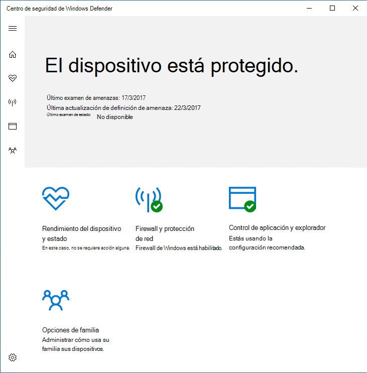
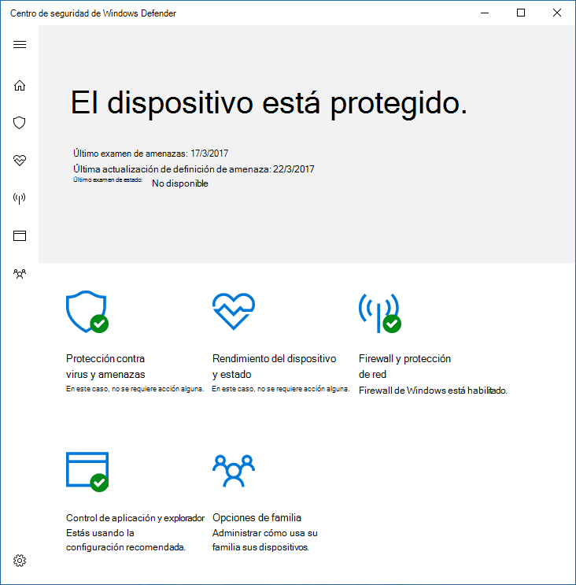
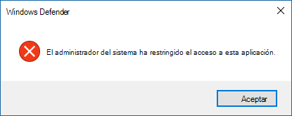

# Impedir que los usuarios vean o interactúen con la interfaz Antivirus de Microsoft Defender usuario

[!INCLUDE [Microsoft 365 Defender rebranding](../../includes/microsoft-defender.md)]

**Se aplica a:**

- [Microsoft Defender para punto de conexión](/microsoft-365/security/defender-endpoint/)

Puede usar la directiva de grupo para impedir que los usuarios de los puntos de conexión vean la interfaz Antivirus de Microsoft Defender usuario. También puede evitar que pauten los exámenes.

## Ocultar la Antivirus de Microsoft Defender interfaz

En Windows 10, versión 1703, ocultar la interfaz ocultará las notificaciones de Antivirus de Microsoft Defender e impedirá que el icono protección contra amenazas de Virus & aparezca en la aplicación Seguridad de Windows.

Con la configuración establecida en **Enabled**:

Con la configuración establecida en **Deshabilitado** o no configurada:

>[!NOTE]
>Ocultar la interfaz también impedirá que Antivirus de Microsoft Defender notificaciones en el punto de conexión. Las notificaciones de Microsoft Defender para puntos de conexión seguirán apareciendo. También puede configurar [individualmente las notificaciones que aparecen en los puntos de conexión](configure-notifications-microsoft-defender-antivirus.md)

En versiones anteriores de Windows 10, la configuración ocultará la interfaz Windows Defender cliente. Si el usuario intenta abrirlo, recibirá una advertencia que indica: "El administrador del sistema ha restringido el acceso a esta aplicación".

## Usar la directiva de grupo para ocultar la interfaz av de Microsoft Defender a los usuarios

1. En el equipo de administración de directivas de grupo, abra la Consola de administración de directivas de [grupo,](/previous-versions/windows/desktop/gpmc/group-policy-management-console-portal)haga clic con el botón secundario en el objeto de directiva de grupo que desea configurar y haga clic en **Editar**.

2. Con el **Editor de administración de directivas de grupo,** vaya a Configuración del **equipo**.

3. Haga clic **en Plantillas administrativas**.

4. Expanda el árbol para Windows **componentes > Antivirus de Microsoft Defender > interfaz de cliente**.

5. Haz doble clic en **la opción Habilitar modo de interfaz de** usuario sin cabeza y establece la opción en **Habilitado**. Haga clic en **Aceptar**. 

Consulta [Impedir que los usuarios modifiquen localmente](configure-local-policy-overrides-microsoft-defender-antivirus.md) la configuración de directiva para obtener más opciones sobre cómo impedir que los usuarios forme parte de la protección de sus equipos.

## Impedir que los usuarios pauten un examen

Puede impedir que los usuarios pauten los exámenes, lo que puede ser útil para garantizar que los usuarios no interrumpan los exámenes programados o a petición.

> [!NOTE]
> Esta configuración no se admite en Windows 10.

### Usar la directiva de grupo para evitar que los usuarios pauten un examen

1. En el equipo de administración de directivas de grupo, abra la Consola de administración de directivas de [grupo,](/previous-versions/windows/desktop/gpmc/group-policy-management-console-portal)haga clic con el botón secundario en el objeto de directiva de grupo que desea configurar y haga clic en **Editar**.

2. Con el **Editor de administración de directivas de grupo,** vaya a Configuración del **equipo**.

3. Haga clic **en Plantillas administrativas**.

4. Expanda el árbol para Windows **componentes**  >  **Antivirus de Microsoft Defender**  >  **Scan**.

5. Haga doble clic en **la opción Permitir a los usuarios pausar el** examen y establezca la opción en **Deshabilitado**. Haga clic en **Aceptar**. 

## Artículos relacionados

- [Configurar las notificaciones que aparecen en los puntos de conexión](configure-notifications-microsoft-defender-antivirus.md)

- [Configurar la interacción del usuario final con Antivirus de Microsoft Defender](configure-end-user-interaction-microsoft-defender-antivirus.md)

- [Antivirus de Microsoft Defender en Windows 10](microsoft-defender-antivirus-in-windows-10.md)