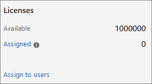

# <a name="set-up-microsoft-defender-for-endpoint-deployment"></a>Configurar Microsoft Defender para la implementación de puntos de conexión

[!INCLUDE [Microsoft 365 Defender rebranding](../../includes/microsoft-defender.md)]


**Se aplica a:**
- [Microsoft Defender para punto de conexión](https://go.microsoft.com/fwlink/p/?linkid=2154037)
- [Microsoft 365 Defender](https://go.microsoft.com/fwlink/?linkid=2118804)

> ¿Desea experimentar Microsoft Defender para endpoint? [Regístrate para obtener una versión de prueba gratuita.](https://www.microsoft.com/microsoft-365/windows/microsoft-defender-atp?ocid=docs-wdatp-exposedapis-abovefoldlink)

La implementación de Defender for Endpoint es un proceso de tres fases:

| [](prepare-deployment.md)<br>[Fase 1: Preparar](prepare-deployment.md) | <br>Fase 2: Configuración | [](onboarding.md)<br>[Fase 3: Incorporación](onboarding.md) |
| ----- | ----- | ----- |
| | *¡Estás aquí!*||

Actualmente se encuentra en la fase de configuración.

En este escenario de implementación, se le guiará a través de los pasos siguientes:
- Validación de licencias
- Configuración del espacio empresarial
- Configuración de red


>[!NOTE]
>Con el fin de guiarlo a través de una implementación típica, este escenario solo abarcará el uso de Microsoft Endpoint Configuration Manager. Defender for Endpoint admite el uso de otras herramientas de incorporación, pero no cubrirá esos escenarios en la guía de implementación. Para obtener más información, consulta [Incorporación de dispositivos a Microsoft Defender para Endpoint](onboard-configure.md).

## <a name="check-license-state"></a>Comprobar el estado de la licencia

La comprobación del estado de la licencia y si se aprovisionó correctamente, se puede realizar a través del Centro de administración o a través de **Microsoft Azure Portal**.

1. Para ver las licencias, vaya a **Microsoft Azure Portal** y vaya a la sección licencia de Microsoft Azure [Portal](https://portal.azure.com/#blade/Microsoft_AAD_IAM/LicensesMenuBlade/Products).

   

1. Como alternativa, en el Centro de administración, vaya a **Suscripciones de**  >  **facturación.**

    En la pantalla, verá todas las licencias aprovisionadas y su estado **actual.**

    


## <a name="cloud-service-provider-validation"></a>Validación del proveedor de servicios en la nube

Para obtener acceso a las licencias que se aprovisionan a su empresa y comprobar el estado de las licencias, vaya al Centro de administración.

1. En el **portal de partners,** seleccione **Administrar servicios > Office 365**.

2. Al hacer clic en **el vínculo Portal** de partners, se abrirá la opción **Administrador** en nombre del usuario y se le dará acceso al Centro de administración de clientes.

   


## <a name="tenant-configuration"></a>Configuración del espacio empresarial

Al obtener acceso al Centro de seguridad de Microsoft Defender por primera vez, un asistente que le guiará a través de algunos pasos iniciales. Al final del asistente para la instalación, se creará una instancia en la nube dedicada de Defender para endpoint. El método más sencillo es realizar estos pasos desde un dispositivo cliente de Windows 10.

1. Desde un explorador web, vaya a <https://securitycenter.windows.com> .

    

2. Si va a través de una licencia DE PRUEBA, vaya al vínculo ( <https://signup.microsoft.com/Signup?OfferId=6033e4b5-c320-4008-a936-909c2825d83c&dl=WIN_DEF_ATP&pc=xxxxxxx-xxxxxx-xxx-x> )

    Una vez completado el paso de autorización, se mostrará **la** pantalla de bienvenida.
3. Siga los pasos de autorización.

    

4. Configurar preferencias.

   **Ubicación de almacenamiento de** datos: es importante configurar esto correctamente. Determine dónde quiere hospedarse el cliente principalmente: ESTADOS UNIDOS, UE o Reino Unido. No puede cambiar la ubicación después de esta configuración y Microsoft no transferirá los datos de la geolocalización especificada. 

    **Retención de datos:** el valor predeterminado es de seis meses.

    **Habilitar características de vista previa:** el valor predeterminado está en, se puede cambiar más adelante.

    

5. Seleccione **Siguiente**.

     

6. Seleccione **Continuar**.


## <a name="network-configuration"></a>Configuración de red
Si la organización no requiere que los puntos de conexión usen un proxy para tener acceso a Internet, omita esta sección.

El sensor de Microsoft Defender para punto de conexión requiere HTTP de Microsoft Windows (WinHTTP) para informar los datos del sensor y comunicarse con el servicio Microsoft Defender para punto de conexión. El sensor incrustado de Microsoft Defender para endpoint se ejecuta en el contexto del sistema mediante la cuenta LocalSystem. El sensor usa los servicios HTTP de Microsoft Windows (WinHTTP) para habilitar la comunicación con el servicio en la nube Microsoft Defender para punto de conexión. La configuración de WinHTTP es independiente de la configuración de proxy de exploración de Internet de Windows Internet (WinINet) y solo puede detectar un servidor proxy mediante los siguientes métodos de detección:

**Métodos de detección automática:**

-   Proxy transparente

-   Protocolo de detección automática de proxy web (WPAD)

Si se ha implementado un proxy transparente o WPAD en la topología de red, no es necesario que haya opciones de configuración especiales. Para obtener más información sobre las exclusiones de url de punto de conexión de Microsoft Defender en el proxy, vea la sección Apéndice de este documento para la lista de direcciones URL permitidas o en [Microsoft Docs](https://docs.microsoft.com/windows/security/threat-protection/windows-defender-atp/configure-proxy-internet-windows-defender-advanced-threat-protection#enable-access-to-windows-defender-atp-service-urls-in-the-proxy-server).

> [!NOTE]
> Para obtener una lista detallada de las direcciones URL que deben permitirse, consulte [este artículo](https://docs.microsoft.com/windows/security/threat-protection/microsoft-defender-antivirus/configure-network-connections-microsoft-defender-antivirus).

**Configuración del proxy estático manual:**

-   Configuración basada en el Registro

-   WinHTTP configurado mediante el comando netsh <br> Adecuado solo para escritorios en una topología estable (por ejemplo: un escritorio en una red corporativa detrás del mismo proxy)

### <a name="configure-the-proxy-server-manually-using-a-registry-based-static-proxy"></a>Configurar manualmente el servidor proxy mediante un proxy estático basado en el registro

Configure un proxy estático basado en el Registro para permitir que solo el sensor de Microsoft Defender for Endpoint informe de datos de diagnóstico y se comunique con Microsoft Defender para los servicios de punto de conexión si un equipo no tiene permiso para conectarse a Internet. El proxy estático se puede configurar mediante la directiva de grupo (GP). La directiva de grupo se puede encontrar aquí:

 - Plantillas administrativas Componentes de Windows Recopilación de datos y versiones preliminares \> Configurar el uso de proxy \> autenticado para el servicio de telemetría y experiencia del usuario \> conectado
     - Estadíla en **Habilitada** y seleccione **Deshabilitar el uso de proxy autenticado**

1. Abra la Consola de administración de directivas de grupo.
2. Cree una directiva o edite una directiva existente basada en las prácticas organizativas.
3. Edite la directiva de grupo y vaya a Plantillas administrativas Componentes de Windows Recopilación de datos y versiones preliminares Configure **\> \> \> Authenticated Proxy usage for the Connected User Experience and Telemetry Service**. 
    

4. Seleccione **Habilitado**.
5. Seleccione **Deshabilitar el uso de proxy autenticado**.
   
6. Vaya a Plantillas administrativas Componentes de Windows Recopilación de datos **\> y Versiones \> preliminares Configure connected user experiences and \> telemetry**.
    
7. Seleccione **Habilitado**.
8. Escriba el **nombre del servidor proxy**.

La directiva establece dos valores del registro `TelemetryProxyServer` como REG_SZ y `DisableEnterpriseAuthProxy` como REG_DWORD en la clave del registro `HKLM\Software\Policies\Microsoft\Windows\DataCollection`.

El valor del `TelemetryProxyServer` Registro tiene el siguiente formato de cadena:

```text
<server name or ip>:<port>
```

Por ejemplo, 10.0.0.6:8080

El valor del registro `DisableEnterpriseAuthProxy` debe establecerse en 1.

###  <a name="configure-the-proxy-server-manually-using-netsh-command"></a>Configurar el servidor proxy manualmente mediante el comando netsh

Use netsh para configurar un proxy estático en todo el sistema.

> [!NOTE]
> - Esto afectará a todas las aplicaciones, incluidos los servicios de Windows que utilicen WinHTTP con el proxy predeterminado.</br>
> - Los portátiles que cambian la topología (por ejemplo: de la oficina a la casa) no funcionan correctamente con netsh. Use la configuración de proxy estático basada en el registro.

1. Abra una línea de comandos con privilegios elevados:

    1. Vaya a **Inicio** y escriba **cmd**.

    1. Haga clic derecho en **Símbolo del sistema** y seleccione **Ejecutar como administrador**.

2. Escriba el siguiente comando y presione **Entrar**:

   ```PowerShell
   netsh winhttp set proxy <proxy>:<port>
   ```

   Por ejemplo: netsh winhttp set proxy 10.0.0.6:8080


###  <a name="proxy-configuration-for-down-level-devices"></a>Configuración de proxy para dispositivos de nivel inferior

Down-Level incluyen estaciones de trabajo de Windows 7 SP1 y Windows 8.1, así como Windows Server 2008 R2, Windows Server 2012, Windows Server 2012 R2 y versiones de Windows Server 2016 anteriores a Windows Server CB 1803. Estos sistemas operativos tendrán el proxy configurado como parte del Agente de administración de Microsoft para controlar la comunicación desde el punto de conexión a Azure. Consulte la Guía de implementación rápida de Microsoft Management Agent para obtener información sobre cómo se configura un proxy en estos dispositivos.

### <a name="proxy-service-urls"></a>Direcciones URL del servicio proxy
Las direcciones URL que incluyen v20 solo son necesarias si tienes dispositivos Windows 10, versión 1803 o posteriores. Por ejemplo, solo es necesario si el dispositivo ```us-v20.events.data.microsoft.com``` está en Windows 10, versión 1803 o posterior.
 

Si un proxy o firewall bloquea el tráfico anónimo, ya que el sensor de Microsoft Defender para endpoint se conecta desde el contexto del sistema, asegúrese de que el tráfico anónimo está permitido en las direcciones URL enumeradas.

En la siguiente hoja de cálculo descargable se enumeran los servicios y sus direcciones URL asociadas a las que la red debe poder conectarse. Asegúrese de que no hay reglas de filtrado de red o firewall que denieguen el acceso *a* estas direcciones URL, o puede que necesite crear una regla de permitido específicamente para ellas.

|**Hoja de cálculo de la lista de dominios**|**Descripción**|
|:-----|:-----|
|<br/>  | Hoja de cálculo de registros DNS específicos para ubicaciones de servicio, ubicaciones geográficas y sistema operativo. <br><br>[Descargue la hoja de cálculo aquí.](https://download.microsoft.com/download/8/a/5/8a51eee5-cd02-431c-9d78-a58b7f77c070/mde-urls.xlsx) 


###  <a name="microsoft-defender-for-endpoint-service-backend-ip-range"></a>Intervalo IP de back-end de Servicio de extremo de Microsoft Defender para Endpoint

Si los dispositivos de red no admiten las direcciones URL enumeradas en la sección anterior, puede usar la siguiente información.

Defender for Endpoint se basa en la nube de Azure y se implementa en las siguientes regiones:

- \+\<Region Name="uswestcentral">
- \+\<Region Name="useast2">
- \+\<Region Name="useast">
- \+\<Region Name="europenorth">
- \+\<Region Name="europewest">
- \+\<Region Name="uksouth">
- \+\<Region Name="ukwest">

Puede encontrar el intervalo IP de Azure en Intervalos IP del centro [de datos de Microsoft Azure.](https://www.microsoft.com/en-us/download/details.aspx?id=41653)

> [!NOTE]
> Como solución basada en la nube, el intervalo de direcciones IP puede cambiar. Se recomienda pasar a la configuración de resolución de DNS.

## <a name="next-step"></a>Paso siguiente

 <br>[Fase 3: Incorporación](onboarding.md)de dispositivos al servicio para que el servicio de Microsoft Defender para endpoints pueda obtener datos de sensores de ellos. 
