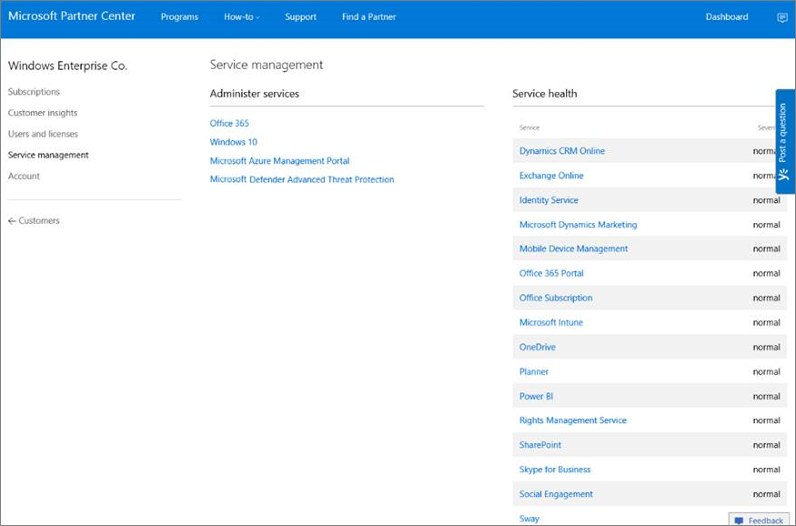

# <a name="set-up-microsoft-defender-for-endpoint-deployment"></a><span data-ttu-id="2c70f-104">Configurar Microsoft Defender para la implementación de puntos de conexión</span><span class="sxs-lookup"><span data-stu-id="2c70f-104">Set up Microsoft Defender for Endpoint deployment</span></span>

[!INCLUDE [Microsoft 365 Defender rebranding](../../includes/microsoft-defender.md)]


<span data-ttu-id="2c70f-105">**Se aplica a:**</span><span class="sxs-lookup"><span data-stu-id="2c70f-105">**Applies to:**</span></span>
- [<span data-ttu-id="2c70f-106">Microsoft Defender para punto de conexión</span><span class="sxs-lookup"><span data-stu-id="2c70f-106">Microsoft Defender for Endpoint</span></span>](https://go.microsoft.com/fwlink/p/?linkid=2154037)
- [<span data-ttu-id="2c70f-107">Microsoft 365 Defender</span><span class="sxs-lookup"><span data-stu-id="2c70f-107">Microsoft 365 Defender</span></span>](https://go.microsoft.com/fwlink/?linkid=2118804)

> <span data-ttu-id="2c70f-108">¿Desea experimentar Microsoft Defender para endpoint?</span><span class="sxs-lookup"><span data-stu-id="2c70f-108">Want to experience Microsoft Defender for Endpoint?</span></span> [<span data-ttu-id="2c70f-109">Regístrate para obtener una versión de prueba gratuita.</span><span class="sxs-lookup"><span data-stu-id="2c70f-109">Sign up for a free trial.</span></span>](https://www.microsoft.com/microsoft-365/windows/microsoft-defender-atp?ocid=docs-wdatp-exposedapis-abovefoldlink)

<span data-ttu-id="2c70f-110">La implementación de Defender for Endpoint es un proceso de tres fases:</span><span class="sxs-lookup"><span data-stu-id="2c70f-110">Deploying Defender for Endpoint is a three-phase process:</span></span>

| <span data-ttu-id="2c70f-111">[](prepare-deployment.md)</span><span class="sxs-lookup"><span data-stu-id="2c70f-111">[](prepare-deployment.md)</span></span><br>[<span data-ttu-id="2c70f-112">Fase 1: Preparación</span><span class="sxs-lookup"><span data-stu-id="2c70f-112">Phase 1: Prepare</span></span>](prepare-deployment.md) | <br><span data-ttu-id="2c70f-114">Fase 2: Configuración</span><span class="sxs-lookup"><span data-stu-id="2c70f-114">Phase 2: Setup</span></span> | <span data-ttu-id="2c70f-115">[](onboarding.md)</span><span class="sxs-lookup"><span data-stu-id="2c70f-115">[](onboarding.md)</span></span><br>[<span data-ttu-id="2c70f-116">Fase 3: Incorporación</span><span class="sxs-lookup"><span data-stu-id="2c70f-116">Phase 3: Onboard</span></span>](onboarding.md) |
| ----- | ----- | ----- |
| | <span data-ttu-id="2c70f-117">*¡Estás aquí!*</span><span class="sxs-lookup"><span data-stu-id="2c70f-117">*You are here!*</span></span>||

<span data-ttu-id="2c70f-118">Actualmente se encuentra en la fase de configuración.</span><span class="sxs-lookup"><span data-stu-id="2c70f-118">You are currently in the set-up phase.</span></span>

<span data-ttu-id="2c70f-119">En este escenario de implementación, se le guiará a través de los pasos siguientes:</span><span class="sxs-lookup"><span data-stu-id="2c70f-119">In this deployment scenario, you'll be guided through the steps on:</span></span>
- <span data-ttu-id="2c70f-120">Validación de licencias</span><span class="sxs-lookup"><span data-stu-id="2c70f-120">Licensing validation</span></span>
- <span data-ttu-id="2c70f-121">Configuración del espacio empresarial</span><span class="sxs-lookup"><span data-stu-id="2c70f-121">Tenant configuration</span></span>
- <span data-ttu-id="2c70f-122">Configuración de red</span><span class="sxs-lookup"><span data-stu-id="2c70f-122">Network configuration</span></span>


>[!NOTE]
><span data-ttu-id="2c70f-123">Con el fin de guiarlo a través de una implementación típica, este escenario solo abarcará el uso de Microsoft Endpoint Configuration Manager.</span><span class="sxs-lookup"><span data-stu-id="2c70f-123">For the purpose of guiding you through a typical deployment, this scenario will only cover the use of Microsoft Endpoint Configuration Manager.</span></span> <span data-ttu-id="2c70f-124">Defender for Endpoint admite el uso de otras herramientas de incorporación, pero no cubrirá esos escenarios en la guía de implementación.</span><span class="sxs-lookup"><span data-stu-id="2c70f-124">Defender for Endpoint supports the use of other onboarding tools but won't cover those scenarios in the deployment guide.</span></span> <span data-ttu-id="2c70f-125">Para obtener más información, consulta [Incorporación de dispositivos a Microsoft Defender para Endpoint](onboard-configure.md).</span><span class="sxs-lookup"><span data-stu-id="2c70f-125">For more information, see [Onboard devices to Microsoft Defender for Endpoint](onboard-configure.md).</span></span>

## <a name="check-license-state"></a><span data-ttu-id="2c70f-126">Comprobar el estado de la licencia</span><span class="sxs-lookup"><span data-stu-id="2c70f-126">Check license state</span></span>

<span data-ttu-id="2c70f-127">Comprobar el estado de la licencia y si se aprovisionó correctamente, se puede realizar a través del Centro de administración o a través **del portal Microsoft Azure .**</span><span class="sxs-lookup"><span data-stu-id="2c70f-127">Checking for the license state and whether it got properly provisioned, can be done through the admin center or through the **Microsoft Azure portal**.</span></span>

1. <span data-ttu-id="2c70f-128">Para ver las licencias, vaya al **portal de** Microsoft Azure y vaya a la sección Microsoft Azure licencia [del portal.](https://portal.azure.com/#blade/Microsoft_AAD_IAM/LicensesMenuBlade/Products)</span><span class="sxs-lookup"><span data-stu-id="2c70f-128">To view your licenses, go to the **Microsoft Azure portal** and navigate to the [Microsoft Azure portal license section](https://portal.azure.com/#blade/Microsoft_AAD_IAM/LicensesMenuBlade/Products).</span></span>

   

1. <span data-ttu-id="2c70f-130">Como alternativa, en el Centro de administración, vaya a **Suscripciones de**  >  **facturación.**</span><span class="sxs-lookup"><span data-stu-id="2c70f-130">Alternately, in the admin center, navigate to **Billing** > **Subscriptions**.</span></span>

    <span data-ttu-id="2c70f-131">En la pantalla, verá todas las licencias aprovisionadas y su estado **actual.**</span><span class="sxs-lookup"><span data-stu-id="2c70f-131">On the screen, you'll see all the provisioned licenses and their current **Status**.</span></span>

    


## <a name="cloud-service-provider-validation"></a><span data-ttu-id="2c70f-133">Validación del proveedor de servicios en la nube</span><span class="sxs-lookup"><span data-stu-id="2c70f-133">Cloud Service Provider validation</span></span>

<span data-ttu-id="2c70f-134">Para obtener acceso a las licencias que se aprovisionan a su empresa y comprobar el estado de las licencias, vaya al Centro de administración.</span><span class="sxs-lookup"><span data-stu-id="2c70f-134">To gain access into which licenses are provisioned to your company, and to check the state of the licenses, go to the admin center.</span></span>

1. <span data-ttu-id="2c70f-135">En el **portal de partners,** seleccione **Administrar servicios > Office 365**.</span><span class="sxs-lookup"><span data-stu-id="2c70f-135">From the **Partner portal**, select **Administer services > Office 365**.</span></span>

2. <span data-ttu-id="2c70f-136">Al hacer clic en **el vínculo Portal** de partners, se abrirá la opción **Administrador** en nombre del usuario y se le dará acceso al Centro de administración de clientes.</span><span class="sxs-lookup"><span data-stu-id="2c70f-136">Clicking on the **Partner portal** link will open the **Admin on behalf** option and will give you access to the customer admin center.</span></span>

   


## <a name="tenant-configuration"></a><span data-ttu-id="2c70f-138">Configuración del espacio empresarial</span><span class="sxs-lookup"><span data-stu-id="2c70f-138">Tenant Configuration</span></span>
<span data-ttu-id="2c70f-139">La incorporación a Microsoft Defender para Endpoint es fácil.</span><span class="sxs-lookup"><span data-stu-id="2c70f-139">Onboarding to Microsoft Defender for Endpoint is easy.</span></span> <span data-ttu-id="2c70f-140">En el menú de navegación, seleccione cualquier elemento en la sección Extremos o cualquier característica de Microsoft 365 Defender como Incidentes, Cacería, Centro de acción o Análisis de amenazas para iniciar el proceso de incorporación.</span><span class="sxs-lookup"><span data-stu-id="2c70f-140">From the navigation menu, select any item under the Endpoints section, or any Microsoft 365 Defender feature such as Incidents, Hunting, Action center, or Threat analytics to initiate the onboarding process.</span></span>

<span data-ttu-id="2c70f-141">Desde un explorador web, vaya al Centro [Microsoft 365 seguridad](https://security.microsoft.com).</span><span class="sxs-lookup"><span data-stu-id="2c70f-141">From a web browser, navigate to the [Microsoft 365 Security Center](https://security.microsoft.com).</span></span>

## <a name="network-configuration"></a><span data-ttu-id="2c70f-142">Configuración de red</span><span class="sxs-lookup"><span data-stu-id="2c70f-142">Network configuration</span></span>
<span data-ttu-id="2c70f-143">Si la organización no requiere que los puntos de conexión usen un proxy para tener acceso a Internet, omita esta sección.</span><span class="sxs-lookup"><span data-stu-id="2c70f-143">If the organization doesn't require the endpoints to use a Proxy to access the Internet, skip this section.</span></span>

<span data-ttu-id="2c70f-144">El sensor de Microsoft Defender para punto de conexión requiere HTTP de Microsoft Windows (WinHTTP) para informar los datos del sensor y comunicarse con el servicio Microsoft Defender para punto de conexión.</span><span class="sxs-lookup"><span data-stu-id="2c70f-144">The Microsoft Defender for Endpoint sensor requires Microsoft Windows HTTP (WinHTTP) to report sensor data and communicate with the Microsoft Defender for Endpoint service.</span></span> <span data-ttu-id="2c70f-145">El sensor incrustado de Microsoft Defender para endpoint se ejecuta en el contexto del sistema mediante la cuenta LocalSystem.</span><span class="sxs-lookup"><span data-stu-id="2c70f-145">The embedded Microsoft Defender for Endpoint sensor runs in the system context using the LocalSystem account.</span></span> <span data-ttu-id="2c70f-146">El sensor usa los servicios HTTP de Microsoft Windows (WinHTTP) para habilitar la comunicación con el servicio en la nube Microsoft Defender para punto de conexión.</span><span class="sxs-lookup"><span data-stu-id="2c70f-146">The sensor uses Microsoft Windows HTTP Services (WinHTTP) to enable communication with the Microsoft Defender for Endpoint cloud service.</span></span> <span data-ttu-id="2c70f-147">La configuración de WinHTTP es independiente de la configuración de proxy de exploración de Internet de Windows (WinINet) y solo puede detectar un servidor proxy mediante los siguientes métodos de detección:</span><span class="sxs-lookup"><span data-stu-id="2c70f-147">The WinHTTP configuration setting is independent of the Windows Internet (WinINet) internet browsing proxy settings and can only discover a proxy server by using the following discovery methods:</span></span>

<span data-ttu-id="2c70f-148">**Métodos de detección automática:**</span><span class="sxs-lookup"><span data-stu-id="2c70f-148">**Autodiscovery methods:**</span></span>

-   <span data-ttu-id="2c70f-149">Proxy transparente</span><span class="sxs-lookup"><span data-stu-id="2c70f-149">Transparent proxy</span></span>

-   <span data-ttu-id="2c70f-150">Protocolo de detección automática de proxy web (WPAD)</span><span class="sxs-lookup"><span data-stu-id="2c70f-150">Web Proxy Autodiscovery Protocol (WPAD)</span></span>

<span data-ttu-id="2c70f-151">Si se ha implementado un proxy transparente o WPAD en la topología de red, no es necesario que haya opciones de configuración especiales.</span><span class="sxs-lookup"><span data-stu-id="2c70f-151">If a Transparent proxy or WPAD has been implemented in the network topology, there is no need for special configuration settings.</span></span> <span data-ttu-id="2c70f-152">Para obtener más información sobre las exclusiones de [](production-deployment.md#proxy-service-urls) url de extremo de Microsoft Defender en el proxy, consulte la sección Direcciones URL del servicio proxy de este documento para la lista de direcciones URL permitidas o en Configurar el proxy de dispositivo y la configuración de conectividad a [Internet.](configure-proxy-internet.md#enable-access-to-microsoft-defender-for-endpoint-service-urls-in-the-proxy-server)</span><span class="sxs-lookup"><span data-stu-id="2c70f-152">For more information on Microsoft Defender for Endpoint URL exclusions in the proxy, see the [Proxy Service URLs](production-deployment.md#proxy-service-urls) section in this document for the URLs allow list or on [Configure device proxy and Internet connectivity settings](configure-proxy-internet.md#enable-access-to-microsoft-defender-for-endpoint-service-urls-in-the-proxy-server).</span></span>

<span data-ttu-id="2c70f-153">**Configuración del proxy estático manual:**</span><span class="sxs-lookup"><span data-stu-id="2c70f-153">**Manual static proxy configuration:**</span></span>

-   <span data-ttu-id="2c70f-154">Configuración basada en el registro</span><span class="sxs-lookup"><span data-stu-id="2c70f-154">Registry-based configuration</span></span>

-   <span data-ttu-id="2c70f-155">WinHTTP configurado mediante el comando netsh</span><span class="sxs-lookup"><span data-stu-id="2c70f-155">WinHTTP configured using netsh command</span></span> <br> <span data-ttu-id="2c70f-156">Adecuado solo para escritorios en una topología estable (por ejemplo: un escritorio en una red corporativa detrás del mismo proxy)</span><span class="sxs-lookup"><span data-stu-id="2c70f-156">Suitable only for desktops in a stable topology (for example: a desktop in a corporate network behind the same proxy)</span></span>

### <a name="configure-the-proxy-server-manually-using-a-registry-based-static-proxy"></a><span data-ttu-id="2c70f-157">Configurar manualmente el servidor proxy mediante un proxy estático basado en el registro</span><span class="sxs-lookup"><span data-stu-id="2c70f-157">Configure the proxy server manually using a registry-based static proxy</span></span>

<span data-ttu-id="2c70f-158">Configure un proxy estático basado en el Registro para permitir que solo el sensor de Microsoft Defender para endpoints informe datos de diagnóstico y se comunique con Microsoft Defender para los servicios de punto de conexión si un equipo no tiene permiso para conectarse a Internet.</span><span class="sxs-lookup"><span data-stu-id="2c70f-158">Configure a registry-based static proxy to allow only Microsoft Defender for Endpoint sensor to report diagnostic data and communicate with Microsoft Defender for Endpoint services if a computer isn't permitted to connect to the Internet.</span></span> <span data-ttu-id="2c70f-159">El proxy estático se puede configurar mediante la directiva de grupo (GP).</span><span class="sxs-lookup"><span data-stu-id="2c70f-159">The static proxy is configurable through Group Policy (GP).</span></span> <span data-ttu-id="2c70f-160">La directiva de grupo se puede encontrar aquí:</span><span class="sxs-lookup"><span data-stu-id="2c70f-160">The group policy can be found under:</span></span>

 - <span data-ttu-id="2c70f-161">Plantillas administrativas Windows recopilación de datos y versiones preliminares Configurar el uso de \> proxy autenticado para el servicio de telemetría y experiencia del usuario \> \> conectado</span><span class="sxs-lookup"><span data-stu-id="2c70f-161">Administrative Templates \> Windows Components \> Data Collection and Preview Builds \> Configure Authenticated Proxy usage for the Connected User Experience and Telemetry Service</span></span>
     - <span data-ttu-id="2c70f-162">Estadíla en **Habilitada** y seleccione **Deshabilitar el uso de proxy autenticado**</span><span class="sxs-lookup"><span data-stu-id="2c70f-162">Set it to **Enabled** and select **Disable Authenticated Proxy usage**</span></span>

1. <span data-ttu-id="2c70f-163">Abra la Consola de administración de directivas de grupo.</span><span class="sxs-lookup"><span data-stu-id="2c70f-163">Open the Group Policy Management Console.</span></span>
2. <span data-ttu-id="2c70f-164">Cree una directiva o edite una directiva existente basada en las prácticas organizativas.</span><span class="sxs-lookup"><span data-stu-id="2c70f-164">Create a policy or edit an existing policy based off the organizational practices.</span></span>
3. <span data-ttu-id="2c70f-165">Edite la directiva de grupo y vaya a Plantillas administrativas Windows Componentes de recopilación de datos y versiones preliminares Configure **\> \> \> Authenticated Proxy usage for the Connected User Experience and Telemetry Service**.</span><span class="sxs-lookup"><span data-stu-id="2c70f-165">Edit the Group Policy and navigate to **Administrative Templates \> Windows Components \> Data Collection and Preview Builds \> Configure Authenticated Proxy usage for the Connected User Experience and Telemetry Service**.</span></span> 
    <span data-ttu-id="2c70f-166"></span><span class="sxs-lookup"><span data-stu-id="2c70f-166"></span></span>

4. <span data-ttu-id="2c70f-167">Seleccione **Habilitado**.</span><span class="sxs-lookup"><span data-stu-id="2c70f-167">Select **Enabled**.</span></span>
5. <span data-ttu-id="2c70f-168">Seleccione **Deshabilitar el uso de proxy autenticado**.</span><span class="sxs-lookup"><span data-stu-id="2c70f-168">Select **Disable Authenticated Proxy usage**.</span></span>
   
6. <span data-ttu-id="2c70f-169">Vaya a Plantillas administrativas Windows de datos componentes y versiones **\> \> preliminares \> Configure las experiencias de usuario conectadas y la telemetría**.</span><span class="sxs-lookup"><span data-stu-id="2c70f-169">Navigate to **Administrative Templates \> Windows Components \> Data Collection and Preview Builds \> Configure connected user experiences and telemetry**.</span></span>
    <span data-ttu-id="2c70f-170"></span><span class="sxs-lookup"><span data-stu-id="2c70f-170"></span></span>
7. <span data-ttu-id="2c70f-171">Seleccione **Habilitado**.</span><span class="sxs-lookup"><span data-stu-id="2c70f-171">Select **Enabled**.</span></span>
8. <span data-ttu-id="2c70f-172">Escriba el **nombre del servidor proxy**.</span><span class="sxs-lookup"><span data-stu-id="2c70f-172">Enter the **Proxy Server Name**.</span></span>

<span data-ttu-id="2c70f-173">La directiva establece dos valores del registro `TelemetryProxyServer` como REG_SZ y `DisableEnterpriseAuthProxy` como REG_DWORD en la clave del registro `HKLM\Software\Policies\Microsoft\Windows\DataCollection`.</span><span class="sxs-lookup"><span data-stu-id="2c70f-173">The policy sets two registry values `TelemetryProxyServer` as REG_SZ and `DisableEnterpriseAuthProxy` as REG_DWORD under the registry key `HKLM\Software\Policies\Microsoft\Windows\DataCollection`.</span></span>

<span data-ttu-id="2c70f-174">El valor del `TelemetryProxyServer` Registro tiene el siguiente formato de cadena:</span><span class="sxs-lookup"><span data-stu-id="2c70f-174">The registry value `TelemetryProxyServer` takes the following string format:</span></span>

```text
<server name or ip>:<port>
```

<span data-ttu-id="2c70f-175">Por ejemplo, 10.0.0.6:8080</span><span class="sxs-lookup"><span data-stu-id="2c70f-175">For example: 10.0.0.6:8080</span></span>

<span data-ttu-id="2c70f-176">El valor del registro `DisableEnterpriseAuthProxy` debe establecerse en 1.</span><span class="sxs-lookup"><span data-stu-id="2c70f-176">The registry value `DisableEnterpriseAuthProxy` should be set to 1.</span></span>

###  <a name="configure-the-proxy-server-manually-using-netsh-command"></a><span data-ttu-id="2c70f-177">Configurar el servidor proxy manualmente mediante el comando netsh</span><span class="sxs-lookup"><span data-stu-id="2c70f-177">Configure the proxy server manually using netsh command</span></span>

<span data-ttu-id="2c70f-178">Use netsh para configurar un proxy estático en todo el sistema.</span><span class="sxs-lookup"><span data-stu-id="2c70f-178">Use netsh to configure a system-wide static proxy.</span></span>

> [!NOTE]
> - <span data-ttu-id="2c70f-179">Esto afectará a todas las aplicaciones, incluidos los servicios de Windows que utilicen WinHTTP con el proxy predeterminado.</span><span class="sxs-lookup"><span data-stu-id="2c70f-179">This will affect all applications including Windows services which use WinHTTP with default proxy.</span></span></br>
> - <span data-ttu-id="2c70f-180">Los portátiles que cambian la topología (por ejemplo: de la oficina a la casa) no funcionan correctamente con netsh.</span><span class="sxs-lookup"><span data-stu-id="2c70f-180">Laptops that are changing topology (for example: from office to home) will malfunction with netsh.</span></span> <span data-ttu-id="2c70f-181">Use la configuración de proxy estático basada en el registro.</span><span class="sxs-lookup"><span data-stu-id="2c70f-181">Use the registry-based static proxy configuration.</span></span>

1. <span data-ttu-id="2c70f-182">Abra un símbolo del sistema con privilegios elevados:</span><span class="sxs-lookup"><span data-stu-id="2c70f-182">Open an elevated command line:</span></span>

    1. <span data-ttu-id="2c70f-183">Vaya a **Inicio** y escriba **cmd**.</span><span class="sxs-lookup"><span data-stu-id="2c70f-183">Go to **Start** and type **cmd**.</span></span>

    1. <span data-ttu-id="2c70f-184">Haga clic derecho en **Símbolo del sistema** y seleccione **Ejecutar como administrador**.</span><span class="sxs-lookup"><span data-stu-id="2c70f-184">Right-click **Command prompt** and select **Run as administrator**.</span></span>

2. <span data-ttu-id="2c70f-185">Escriba el siguiente comando y presione **Entrar**:</span><span class="sxs-lookup"><span data-stu-id="2c70f-185">Enter the following command and press **Enter**:</span></span>

   ```PowerShell
   netsh winhttp set proxy <proxy>:<port>
   ```

   <span data-ttu-id="2c70f-186">Por ejemplo: netsh winhttp set proxy 10.0.0.6:8080</span><span class="sxs-lookup"><span data-stu-id="2c70f-186">For example: netsh winhttp set proxy 10.0.0.6:8080</span></span>


###  <a name="proxy-configuration-for-down-level-devices"></a><span data-ttu-id="2c70f-187">Configuración de proxy para dispositivos de nivel inferior</span><span class="sxs-lookup"><span data-stu-id="2c70f-187">Proxy Configuration for down-level devices</span></span>

<span data-ttu-id="2c70f-188">Down-Level incluyen Windows estaciones de trabajo 7 SP1 y Windows 8.1, así como Windows Server 2008 R2, Windows Server 2012, Windows Server 2012 R2 y versiones de Windows Server 2016 anteriores a Windows Server CB 1803.</span><span class="sxs-lookup"><span data-stu-id="2c70f-188">Down-Level devices include Windows 7 SP1 and Windows 8.1 workstations as well as Windows Server 2008 R2, Windows Server 2012, Windows Server 2012 R2, and versions of Windows Server 2016 prior to Windows Server CB 1803.</span></span> <span data-ttu-id="2c70f-189">Estos sistemas operativos tendrán el proxy configurado como parte del Agente de administración de Microsoft para controlar la comunicación desde el punto de conexión a Azure.</span><span class="sxs-lookup"><span data-stu-id="2c70f-189">These operating systems will have the proxy configured as part of the Microsoft Management Agent to handle communication from the endpoint to Azure.</span></span> <span data-ttu-id="2c70f-190">Consulte la Guía de implementación rápida de Microsoft Management Agent para obtener información sobre cómo se configura un proxy en estos dispositivos.</span><span class="sxs-lookup"><span data-stu-id="2c70f-190">Refer to the Microsoft Management Agent Fast Deployment Guide for information on how a proxy is configured on these devices.</span></span>

### <a name="proxy-service-urls"></a><span data-ttu-id="2c70f-191">Direcciones URL del servicio proxy</span><span class="sxs-lookup"><span data-stu-id="2c70f-191">Proxy Service URLs</span></span>
<span data-ttu-id="2c70f-192">Las direcciones URL que incluyen v20 solo son necesarias si tienes Windows 10, versión 1803 o posterior.</span><span class="sxs-lookup"><span data-stu-id="2c70f-192">URLs that include v20 in them are only needed if you have Windows 10, version 1803 or later devices.</span></span> <span data-ttu-id="2c70f-193">Por ejemplo, solo es necesario si el dispositivo está ```us-v20.events.data.microsoft.com``` en Windows 10 versión 1803 o posterior.</span><span class="sxs-lookup"><span data-stu-id="2c70f-193">For example, ```us-v20.events.data.microsoft.com``` is only needed if the device is on Windows 10, version 1803 or later.</span></span>
 

<span data-ttu-id="2c70f-194">Si un proxy o firewall bloquea el tráfico anónimo, ya que el sensor de Microsoft Defender para endpoint se conecta desde el contexto del sistema, asegúrese de que el tráfico anónimo está permitido en las direcciones URL enumeradas.</span><span class="sxs-lookup"><span data-stu-id="2c70f-194">If a proxy or firewall is blocking anonymous traffic, as Microsoft Defender for Endpoint sensor is connecting from system context, make sure anonymous traffic is permitted in the listed URLs.</span></span>

<span data-ttu-id="2c70f-195">En la siguiente hoja de cálculo descargable se enumeran los servicios y sus direcciones URL asociadas a las que la red debe poder conectarse.</span><span class="sxs-lookup"><span data-stu-id="2c70f-195">The following downloadable spreadsheet lists the services and their associated URLs that your network must be able to connect to.</span></span> <span data-ttu-id="2c70f-196">Asegúrese de que no hay reglas de filtrado de red o firewall que denieguen el acceso *a* estas direcciones URL, o puede que necesite crear una regla de permitido específicamente para ellas.</span><span class="sxs-lookup"><span data-stu-id="2c70f-196">Ensure there are no firewall or network filtering rules that would deny access to these URLs, or you may need to create an *allow* rule specifically for them.</span></span>

|<span data-ttu-id="2c70f-197">**Hoja de cálculo de la lista de dominios**</span><span class="sxs-lookup"><span data-stu-id="2c70f-197">**Spreadsheet of domains list**</span></span>|<span data-ttu-id="2c70f-198">**Descripción**</span><span class="sxs-lookup"><span data-stu-id="2c70f-198">**Description**</span></span>|
|:-----|:-----|
|<br/>  | <span data-ttu-id="2c70f-200">Hoja de cálculo de registros DNS específicos para ubicaciones de servicio, ubicaciones geográficas y sistema operativo.</span><span class="sxs-lookup"><span data-stu-id="2c70f-200">Spreadsheet of specific DNS records for service locations, geographic locations, and OS.</span></span> <br><br>[<span data-ttu-id="2c70f-201">Descargue la hoja de cálculo aquí.</span><span class="sxs-lookup"><span data-stu-id="2c70f-201">Download the spreadsheet here.</span></span>](https://download.microsoft.com/download/8/a/5/8a51eee5-cd02-431c-9d78-a58b7f77c070/mde-urls.xlsx) 


###  <a name="microsoft-defender-for-endpoint-service-backend-ip-ranges"></a><span data-ttu-id="2c70f-202">Intervalos IP de back-end de Servicio de extremo de Microsoft Defender para Endpoint</span><span class="sxs-lookup"><span data-stu-id="2c70f-202">Microsoft Defender for Endpoint service backend IP ranges</span></span>

<span data-ttu-id="2c70f-203">Si los dispositivos de red no admiten reglas basadas en DNS, usa intervalos IP en su lugar.</span><span class="sxs-lookup"><span data-stu-id="2c70f-203">If your network devices don't support DNS-based rules, use IP ranges instead.</span></span>

<span data-ttu-id="2c70f-204">Defender for Endpoint se basa en la nube de Azure, se implementa en las siguientes regiones:</span><span class="sxs-lookup"><span data-stu-id="2c70f-204">Defender for Endpoint is built in Azure cloud, deployed in the following regions:</span></span>

- <span data-ttu-id="2c70f-205">AzureCloud.eastus</span><span class="sxs-lookup"><span data-stu-id="2c70f-205">AzureCloud.eastus</span></span>
- <span data-ttu-id="2c70f-206">AzureCloud.eastus2</span><span class="sxs-lookup"><span data-stu-id="2c70f-206">AzureCloud.eastus2</span></span>
- <span data-ttu-id="2c70f-207">AzureCloud.westcentralus</span><span class="sxs-lookup"><span data-stu-id="2c70f-207">AzureCloud.westcentralus</span></span>
- <span data-ttu-id="2c70f-208">AzureCloud.northeurope</span><span class="sxs-lookup"><span data-stu-id="2c70f-208">AzureCloud.northeurope</span></span>
- <span data-ttu-id="2c70f-209">AzureCloud.westeurope</span><span class="sxs-lookup"><span data-stu-id="2c70f-209">AzureCloud.westeurope</span></span>
- <span data-ttu-id="2c70f-210">AzureCloud.uksouth</span><span class="sxs-lookup"><span data-stu-id="2c70f-210">AzureCloud.uksouth</span></span>
- <span data-ttu-id="2c70f-211">AzureCloud.ukwest</span><span class="sxs-lookup"><span data-stu-id="2c70f-211">AzureCloud.ukwest</span></span>

<span data-ttu-id="2c70f-212">Puede encontrar los intervalos IP de Azure en Intervalos IP de Azure y etiquetas de servicio [: nube pública.](https://www.microsoft.com/download/details.aspx?id=56519)</span><span class="sxs-lookup"><span data-stu-id="2c70f-212">You can find the Azure IP ranges in [Azure IP Ranges and Service Tags – Public Cloud](https://www.microsoft.com/download/details.aspx?id=56519).</span></span>

> [!NOTE]
> <span data-ttu-id="2c70f-213">Como solución basada en la nube, los intervalos de direcciones IP pueden cambiar.</span><span class="sxs-lookup"><span data-stu-id="2c70f-213">As a cloud-based solution, the IP address ranges can change.</span></span> <span data-ttu-id="2c70f-214">Se recomienda pasar a reglas basadas en DNS.</span><span class="sxs-lookup"><span data-stu-id="2c70f-214">It's recommended you move to DNS-based rules.</span></span>

> [!NOTE]
> <span data-ttu-id="2c70f-215">Si es un cliente del Gobierno de Estados Unidos, consulte la sección correspondiente en la página [Defender for Endpoint for US Government.](gov.md#service-backend-ip-ranges)</span><span class="sxs-lookup"><span data-stu-id="2c70f-215">If you are a US Government customer, please see the corresponding section in the [Defender for Endpoint for US Government](gov.md#service-backend-ip-ranges) page.</span></span>

## <a name="next-step"></a><span data-ttu-id="2c70f-216">Paso siguiente</span><span class="sxs-lookup"><span data-stu-id="2c70f-216">Next step</span></span>

<span data-ttu-id="2c70f-217"></span><span class="sxs-lookup"><span data-stu-id="2c70f-217"></span></span> <br><span data-ttu-id="2c70f-218">[Fase 3: Incorporación](onboarding.md)de dispositivos al servicio para que el servicio de Microsoft Defender para endpoints pueda obtener datos de sensores de ellos.</span><span class="sxs-lookup"><span data-stu-id="2c70f-218">[Phase 3: Onboard](onboarding.md): Onboard devices to the service so that the Microsoft Defender for Endpoint service can get sensor data from them.</span></span> 
