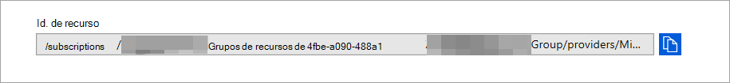

# <a name="configure-microsoft-365-defender-to-stream-advanced-hunting-events-to-your-azure-event-hubs"></a>Configurar Microsoft 365 Defender para transmitir eventos de búsqueda avanzada a los centros de eventos de Azure

[!INCLUDE [Microsoft 365 Defender rebranding](../../includes/microsoft-defender.md)]


**Se aplica a:**
- [Microsoft 365 Defender](https://go.microsoft.com/fwlink/?linkid=2118804)


## <a name="before-you-begin"></a>Antes de empezar:

1. Cree un [centro de eventos](/azure/event-hubs/) en el espacio empresarial.

2. Inicie sesión en el inquilino [de Azure,](https://ms.portal.azure.com/)vaya a Suscripciones > Su suscripción > proveedores de recursos > **Registrarse en Microsoft.Insights**.

3. Cree un espacio de nombres de centro de eventos, vaya a **Event Hubs > Agregar** y seleccione el nivel de precios, las unidades de rendimiento y la opción Autoinflate adecuada para la carga esperada. Para obtener más información, vea [Pricing - Event Hubs | Microsoft Azure](https://azure.microsoft.com/en-us/pricing/details/event-hubs/).  

4. Una vez creado el espacio de nombres del centro de eventos, deberá agregar la entidad de seguridad del servicio de registro de aplicaciones como Lector, el receptor de datos de Azure Event Hubs y el usuario que iniciará sesión en Microsoft 365 Defender como colaborador (esto también se puede hacer a nivel de grupo de recursos o suscripción). Vaya al **espacio de nombres Event hubs > Access control (IAM) > Add** and verify en Role **assignements**.

## <a name="enable-raw-data-streaming"></a>Habilitar la transmisión de datos sin procesar:

1. Inicie sesión en el [centro de seguridad de Microsoft 365 Defender](https://security.microsoft.com) como administrador **global*** o administrador de seguridad __*_**.

2. Vaya a la [página Configuración de exportación de datos](https://security.microsoft.com/settings/mtp_settings/raw_data_export).

3. Haga clic en **Agregar**.

4. Elija un nombre para la nueva configuración.

5. Elija **Reenviar eventos a Azure Event Hubs**.

6. Puede seleccionar si desea exportar los datos de eventos a un único centro de eventos o exportar cada tabla de eventos a un concentrador par diferente en el espacio de nombres del centro de eventos. 

7. Para exportar los datos del evento a un único centro de eventos, escriba el nombre del centro de eventos **y** el identificador de recurso del centro **de eventos**.

   Para obtener el identificador de recurso de **Event Hubs,** vaya a la página de espacio de nombres de Azure Event Hubs en la pestaña Propiedades de [Azure](https://ms.portal.azure.com/)> el texto en  >   **Id. de recurso**:

   

8. Elija los eventos que desea transmitir y haga clic en **Guardar**.

## <a name="the-schema-of-the-events-in-azure-event-hubs"></a>Esquema de los eventos de Azure Event Hubs:

```
{
    "records": [
                    {
                        "time": "<The time Microsoft 365 Defender received the event>"
                        "tenantId": "<The Id of the tenant that the event belongs to>"
                        "category": "<The Advanced Hunting table name with 'AdvancedHunting-' prefix>"
                        "properties": { <Microsoft 365 Defender Advanced Hunting event as Json> }
                    }
                    ...
                ]
}
```

- Cada mensaje del centro de eventos de Azure Event Hubs contiene una lista de registros.

- Cada registro contiene el nombre del evento, la hora en que Microsoft 365 Defender recibió el evento, el inquilino al que pertenece (solo recibirá eventos del inquilino) y el evento en formato JSON en una propiedad denominada "**properties**".

- Para obtener más información sobre el esquema de Microsoft 365 Defender, vea [Advanced Hunting overview](../defender/advanced-hunting-overview.md).

- En Búsqueda avanzada, la **tabla DeviceInfo** tiene una columna denominada **MachineGroup** que contiene el grupo del dispositivo. Aquí todos los eventos también se decorarán con esta columna. 

9. Para exportar cada tabla de eventos a  un centro de eventos diferente, simplemente deje el nombre del centro de eventos vacío y Microsoft 365 Defender hará el resto.


## <a name="data-types-mapping"></a>Asignación de tipos de datos:

Para obtener los tipos de datos de las propiedades de evento, haga lo siguiente:

1. Inicie sesión en [el Microsoft 365 seguridad y](https://security.microsoft.com) vaya a la página Búsqueda [avanzada](https://security.microsoft.com/hunting-package).

2. Ejecute la siguiente consulta para obtener la asignación de tipos de datos para cada evento:
 
   ```
   {EventType}
   | getschema
   | project ColumnName, ColumnType 
   ```

- Este es un ejemplo para el evento Device Info: 

  

## <a name="related-topics"></a>Temas relacionados
- [Información general sobre la búsqueda avanzada](../defender/advanced-hunting-overview.md)
- [Microsoft 365 Defender streaming API](raw-data-export.md)
- [Transmitir eventos Microsoft 365 Defender a su cuenta de Azure Storage](raw-data-export-storage.md)
- [Documentación de Azure Event Hubs](/azure/event-hubs/)
- [Solucionar problemas de conectividad: Azure Event Hubs](/azure/event-hubs/troubleshooting-guide)
