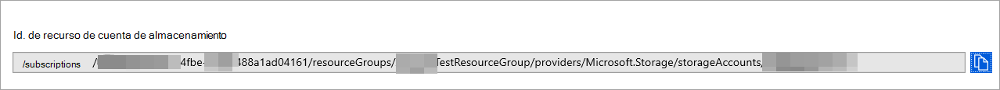

# <a name="configure-microsoft-defender-for-endpoint-to-stream-advanced-hunting-events-to-your-storage-account"></a>Configurar Microsoft Defender para endpoint para transmitir eventos de búsqueda avanzada a su cuenta de almacenamiento

[!INCLUDE [Microsoft 365 Defender rebranding](../../includes/microsoft-defender.md)]


**Se aplica a:**
- [Microsoft Defender para punto de conexión](https://go.microsoft.com/fwlink/?linkid=2154037)

> ¿Desea experimentar Defender for Endpoint? [Regístrate para obtener una versión de prueba gratuita.](https://www.microsoft.com/microsoft-365/windows/microsoft-defender-atp?ocid=docs-wdatp-configuresiem-abovefoldlink) 

## <a name="before-you-begin"></a>Antes de empezar:

1. Cree una [cuenta de almacenamiento](https://docs.microsoft.com/azure/storage/common/storage-account-overview) en el espacio empresarial.

2. Inicie sesión en el inquilino [de Azure,](https://ms.portal.azure.com/)vaya a Suscripciones > Su suscripción > proveedores de recursos > **Registrarse en Microsoft.insights**.

## <a name="enable-raw-data-streaming"></a>Habilitar la transmisión de datos sin procesar:

1. Inicie sesión en [el portal de Microsoft Defender para endpoint](https://securitycenter.windows.com) como * Administrador **global** _ o _* Administrador _de seguridad_**.

2. Vaya a [la página Configuración de exportación de datos](https://securitycenter.windows.com/interoperability/dataexport) en el Centro de seguridad de Microsoft Defender.

3. Haga clic en **Agregar configuración de exportación de datos.**

4. Elija un nombre para la nueva configuración.

5. Elija **Reenviar eventos a Azure Storage**.

6. Escriba el **identificador de recurso de la cuenta de almacenamiento**. Para obtener el identificador de recurso de la cuenta de **almacenamiento,** vaya a la página Cuenta de almacenamiento de [Azure Portal](https://ms.portal.azure.com/) > pestaña propiedades > copiar el texto en Id. de recurso de cuenta de **almacenamiento:**

   

7. Elija los eventos que desea transmitir y haga clic en **Guardar**.

## <a name="the-schema-of-the-events-in-the-storage-account"></a>Esquema de los eventos de la cuenta de almacenamiento:

- Se creará un contenedor de blobs para cada tipo de evento: 

  

- El esquema de cada fila de un blob es el siguiente JSON: 

  ```
  {
          "time": "<The time WDATP received the event>"
          "tenantId": "<Your tenant ID>"
          "category": "<The Advanced Hunting table name with 'AdvancedHunting-' prefix>"
          "properties": { <WDATP Advanced Hunting event as Json> }
  }               
  ```

- Cada blob contiene varias filas.

- Cada fila contiene el nombre del evento, la hora en que Defender para Endpoint recibió el evento, el inquilino al que pertenece (solo recibirá eventos de su inquilino) y el evento en formato JSON en una propiedad denominada "propiedades".

- Para obtener más información sobre el esquema de eventos de Microsoft Defender para endpoint, vea [Advanced Hunting overview](advanced-hunting-overview.md).

- En Búsqueda avanzada, la **tabla DeviceInfo** tiene una columna denominada **MachineGroup** que contiene el grupo del dispositivo. Aquí todos los eventos también se decorarán con esta columna. Consulta [Grupos de dispositivos](machine-groups.md) para obtener más información.

## <a name="data-types-mapping"></a>Asignación de tipos de datos:

Para obtener los tipos de datos de nuestras propiedades de eventos, haga lo siguiente:

1. Inicie sesión en el [Centro de seguridad de Microsoft Defender](https://securitycenter.windows.com) y vaya a la página Búsqueda [avanzada](https://securitycenter.windows.com/hunting-package).

2. Ejecute la siguiente consulta para obtener la asignación de tipos de datos para cada evento: 

   ```
   {EventType}
   | getschema
   | project ColumnName, ColumnType 
   ```

- Este es un ejemplo para el evento Device Info: 

  

## <a name="related-topics"></a>Temas relacionados
- [Información general sobre la búsqueda avanzada](advanced-hunting-overview.md)
- [API de Streaming de Microsoft Defender para endpoints](raw-data-export.md)
- [Transmitir eventos de Microsoft Defender para endpoint a su cuenta de Azure Storage](raw-data-export-storage.md)
- [Documentación de la cuenta de Azure Storage](https://docs.microsoft.com/azure/storage/common/storage-account-overview)
