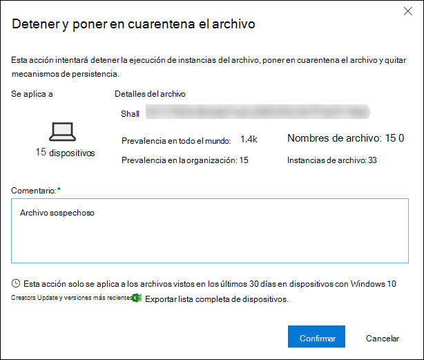
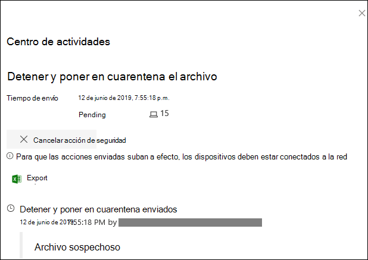
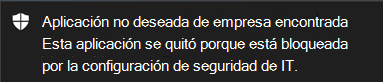
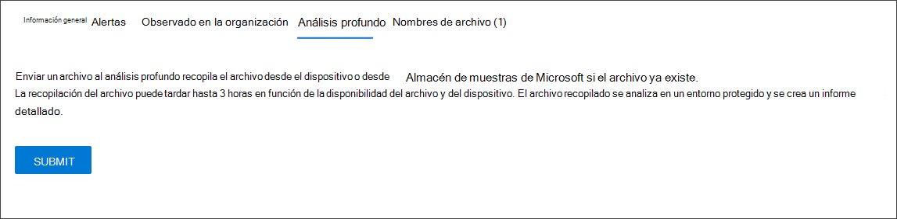

# <a name="take-response-actions-on-a-file"></a><span data-ttu-id="625fc-104">Realizar acciones de respuesta en un archivo</span><span class="sxs-lookup"><span data-stu-id="625fc-104">Take response actions on a file</span></span>

[!INCLUDE [Microsoft 365 Defender rebranding](../../includes/microsoft-defender.md)]


<span data-ttu-id="625fc-105">**Se aplica a:**</span><span class="sxs-lookup"><span data-stu-id="625fc-105">**Applies to:**</span></span>
- [<span data-ttu-id="625fc-106">Microsoft Defender para punto de conexión</span><span class="sxs-lookup"><span data-stu-id="625fc-106">Microsoft Defender for Endpoint</span></span>](https://go.microsoft.com/fwlink/?linkid=2154037)

[!include[Prerelease information](../../includes/prerelease.md)]

> <span data-ttu-id="625fc-107">¿Desea experimentar Defender for Endpoint?</span><span class="sxs-lookup"><span data-stu-id="625fc-107">Want to experience Defender for Endpoint?</span></span> [<span data-ttu-id="625fc-108">Regístrate para obtener una versión de prueba gratuita.</span><span class="sxs-lookup"><span data-stu-id="625fc-108">Sign up for a free trial.</span></span>](https://www.microsoft.com/microsoft-365/windows/microsoft-defender-atp?ocid=docs-wdatp-responddile-abovefoldlink)

<span data-ttu-id="625fc-109">Responda rápidamente a los ataques detectados deteniendo y anulando archivos o bloqueando un archivo.</span><span class="sxs-lookup"><span data-stu-id="625fc-109">Quickly respond to detected attacks by stopping and quarantining files or blocking a file.</span></span> <span data-ttu-id="625fc-110">Después de realizar acciones en los archivos, puede comprobar los detalles de la actividad en el Centro de acciones.</span><span class="sxs-lookup"><span data-stu-id="625fc-110">After taking action on files, you can check on activity details in the Action center.</span></span>

<span data-ttu-id="625fc-111">Las acciones de respuesta están disponibles en la página de perfil detallada de un archivo.</span><span class="sxs-lookup"><span data-stu-id="625fc-111">Response actions are available on a file's detailed profile page.</span></span> <span data-ttu-id="625fc-112">Una vez en esta página, puede cambiar entre los diseños de página nuevo y antiguo cambiando la **nueva página archivo**.</span><span class="sxs-lookup"><span data-stu-id="625fc-112">Once on this page, you can switch between the new and old page layouts by toggling **new File page**.</span></span> <span data-ttu-id="625fc-113">El resto de este artículo describe el diseño de página más reciente.</span><span class="sxs-lookup"><span data-stu-id="625fc-113">The rest of this article describes the newer page layout.</span></span>

<span data-ttu-id="625fc-114">Las acciones de respuesta se ejecutan en la parte superior de la página de archivos e incluyen:</span><span class="sxs-lookup"><span data-stu-id="625fc-114">Response actions run along the top of the file page, and include:</span></span>

- <span data-ttu-id="625fc-115">Detener y poner en cuarentena el archivo</span><span class="sxs-lookup"><span data-stu-id="625fc-115">Stop and Quarantine File</span></span>
- <span data-ttu-id="625fc-116">Agregar indicador</span><span class="sxs-lookup"><span data-stu-id="625fc-116">Add Indicator</span></span>
- <span data-ttu-id="625fc-117">Descargar archivo</span><span class="sxs-lookup"><span data-stu-id="625fc-117">Download file</span></span>
- <span data-ttu-id="625fc-118">Consultar a un experto en amenazas</span><span class="sxs-lookup"><span data-stu-id="625fc-118">Consult a threat expert</span></span>
- <span data-ttu-id="625fc-119">Centro de actividades</span><span class="sxs-lookup"><span data-stu-id="625fc-119">Action center</span></span>

<span data-ttu-id="625fc-120">También puede enviar archivos para un análisis profundo, para ejecutar el archivo en un espacio aislado seguro en la nube.</span><span class="sxs-lookup"><span data-stu-id="625fc-120">You can also submit files for deep analysis, to run the file in a secure cloud sandbox.</span></span> <span data-ttu-id="625fc-121">Cuando se complete el análisis, se obtiene un informe detallado que proporciona información sobre el comportamiento del archivo.</span><span class="sxs-lookup"><span data-stu-id="625fc-121">When the analysis is complete, you'll get a detailed report that provides information about the behavior of the file.</span></span> <span data-ttu-id="625fc-122">Puede enviar archivos para análisis profundo y leer informes anteriores seleccionando la **pestaña Análisis profundo.** Se encuentra debajo de las tarjetas de información de archivos.</span><span class="sxs-lookup"><span data-stu-id="625fc-122">You can submit files for deep analysis and read past reports by selecting the **Deep analysis** tab. It's located below the file information cards.</span></span>

<span data-ttu-id="625fc-123">Algunas acciones requieren ciertos permisos.</span><span class="sxs-lookup"><span data-stu-id="625fc-123">Some actions require certain permissions.</span></span> <span data-ttu-id="625fc-124">En la tabla siguiente se describe qué acción pueden realizar ciertos permisos en archivos ejecutables portátiles (PE) y que no son PE:</span><span class="sxs-lookup"><span data-stu-id="625fc-124">The following table describes what action certain permissions can take on portable executable (PE) and non-PE files:</span></span>

| <span data-ttu-id="625fc-125">Permiso</span><span class="sxs-lookup"><span data-stu-id="625fc-125">Permission</span></span>             | <span data-ttu-id="625fc-126">Archivos PE</span><span class="sxs-lookup"><span data-stu-id="625fc-126">PE files</span></span> | <span data-ttu-id="625fc-127">Archivos que no son PE</span><span class="sxs-lookup"><span data-stu-id="625fc-127">Non-PE files</span></span> |
| :--------------------- | :------: | :----------: |
| <span data-ttu-id="625fc-128">Ver datos</span><span class="sxs-lookup"><span data-stu-id="625fc-128">View data</span></span>              |     <span data-ttu-id="625fc-129">X</span><span class="sxs-lookup"><span data-stu-id="625fc-129">X</span></span>    |       <span data-ttu-id="625fc-130">X</span><span class="sxs-lookup"><span data-stu-id="625fc-130">X</span></span>      |
| <span data-ttu-id="625fc-131">Investigación de alertas</span><span class="sxs-lookup"><span data-stu-id="625fc-131">Alerts investigation</span></span>   | <span data-ttu-id="625fc-132">&#x2611;</span><span class="sxs-lookup"><span data-stu-id="625fc-132">&#x2611;</span></span> |       <span data-ttu-id="625fc-133">X</span><span class="sxs-lookup"><span data-stu-id="625fc-133">X</span></span>      |
| <span data-ttu-id="625fc-134">Respuesta en directo básica</span><span class="sxs-lookup"><span data-stu-id="625fc-134">Live response basic</span></span>    |     <span data-ttu-id="625fc-135">X</span><span class="sxs-lookup"><span data-stu-id="625fc-135">X</span></span>    |       <span data-ttu-id="625fc-136">X</span><span class="sxs-lookup"><span data-stu-id="625fc-136">X</span></span>      |
| <span data-ttu-id="625fc-137">Respuesta en directo avanzada</span><span class="sxs-lookup"><span data-stu-id="625fc-137">Live response advanced</span></span> | <span data-ttu-id="625fc-138">&#x2611;</span><span class="sxs-lookup"><span data-stu-id="625fc-138">&#x2611;</span></span> |   <span data-ttu-id="625fc-139">&#x2611;</span><span class="sxs-lookup"><span data-stu-id="625fc-139">&#x2611;</span></span>   |

<span data-ttu-id="625fc-140">Para obtener más información sobre los roles, vea [Create and manage roles for role-based access control](user-roles.md).</span><span class="sxs-lookup"><span data-stu-id="625fc-140">For more information on roles, see [Create and manage roles for role-based access control](user-roles.md).</span></span>

## <a name="stop-and-quarantine-files-in-your-network"></a><span data-ttu-id="625fc-141">Detener y poner en cuarentena archivos de la red</span><span class="sxs-lookup"><span data-stu-id="625fc-141">Stop and quarantine files in your network</span></span>

<span data-ttu-id="625fc-142">Puede contener un ataque en su organización al detener el proceso malintencionado y anular el archivo donde se observó.</span><span class="sxs-lookup"><span data-stu-id="625fc-142">You can contain an attack in your organization by stopping the malicious process and quarantining the file where it was observed.</span></span>

> [!IMPORTANT]
> <span data-ttu-id="625fc-143">Solo puede realizar esta acción si:</span><span class="sxs-lookup"><span data-stu-id="625fc-143">You can only take this action if:</span></span>
>
> - <span data-ttu-id="625fc-144">El dispositivo en el que estás llevando a Windows 10, versión 1703 o posterior</span><span class="sxs-lookup"><span data-stu-id="625fc-144">The device you're taking the action on is running Windows 10, version 1703 or later</span></span>
> - <span data-ttu-id="625fc-145">El archivo no pertenece a editores de terceros de confianza o no está firmado por Microsoft</span><span class="sxs-lookup"><span data-stu-id="625fc-145">The file does not belong to trusted third-party publishers or is not signed by Microsoft</span></span>
> - <span data-ttu-id="625fc-146">Antivirus de Microsoft Defender debe ejecutarse al menos en modo pasivo.</span><span class="sxs-lookup"><span data-stu-id="625fc-146">Microsoft Defender Antivirus must at least be running on Passive mode.</span></span> <span data-ttu-id="625fc-147">Para obtener más información, [vea Antivirus de Microsoft Defender compatibilidad](/windows/security/threat-protection/microsoft-defender-antivirus/microsoft-defender-antivirus-compatibility).</span><span class="sxs-lookup"><span data-stu-id="625fc-147">For more information, see [Microsoft Defender Antivirus compatibility](/windows/security/threat-protection/microsoft-defender-antivirus/microsoft-defender-antivirus-compatibility).</span></span>

<span data-ttu-id="625fc-148">La **acción Detener y poner en** cuarentena archivo incluye la detención de procesos en ejecución, la cuarentena de los archivos y la eliminación de datos persistentes, como las claves del Registro.</span><span class="sxs-lookup"><span data-stu-id="625fc-148">The **Stop and Quarantine File** action includes stopping running processes, quarantining the files, and deleting persistent data such as registry keys.</span></span>

<span data-ttu-id="625fc-149">Esta acción tiene efecto en dispositivos con Windows 10, versión 1703 o posterior, donde se observó el archivo en los últimos 30 días.</span><span class="sxs-lookup"><span data-stu-id="625fc-149">This action takes effect on devices with Windows 10, version 1703 or later, where the file was observed in the last 30 days.</span></span>

> [!NOTE]
> <span data-ttu-id="625fc-150">Podrás restaurar el archivo desde la cuarentena en cualquier momento.</span><span class="sxs-lookup"><span data-stu-id="625fc-150">You’ll be able to restore the file from quarantine at any time.</span></span>

### <a name="stop-and-quarantine-files"></a><span data-ttu-id="625fc-151">Detener y poner en cuarentena los archivos</span><span class="sxs-lookup"><span data-stu-id="625fc-151">Stop and quarantine files</span></span>

1. <span data-ttu-id="625fc-152">Seleccione el archivo que desea detener y poner en cuarentena.</span><span class="sxs-lookup"><span data-stu-id="625fc-152">Select the file you want to stop and quarantine.</span></span> <span data-ttu-id="625fc-153">Puede seleccionar un archivo de cualquiera de las siguientes vistas o usar el cuadro De búsqueda:</span><span class="sxs-lookup"><span data-stu-id="625fc-153">You can select a file from any of the following views or use the Search box:</span></span>

   - <span data-ttu-id="625fc-154">**Alertas:** haga clic en los vínculos correspondientes de la línea de tiempo Descripción o Detalles de la escala de tiempo del artículo de alerta</span><span class="sxs-lookup"><span data-stu-id="625fc-154">**Alerts** - click the corresponding links from the Description or Details in the Alert Story timeline</span></span>
   - <span data-ttu-id="625fc-155">**Cuadro de búsqueda:** **seleccione Archivo** en el menú desplegable y escriba el nombre del archivo</span><span class="sxs-lookup"><span data-stu-id="625fc-155">**Search box** - select **File** from the drop–down menu and enter the file name</span></span>

   > [!NOTE]
   > <span data-ttu-id="625fc-156">La acción de detener y poner en cuarentena el archivo está limitada a un máximo de 1000 dispositivos.</span><span class="sxs-lookup"><span data-stu-id="625fc-156">The stop and quarantine file action is limited to a maximum of 1000 devices.</span></span> <span data-ttu-id="625fc-157">Para detener un archivo en un mayor número de dispositivos, vea [Agregar indicador para bloquear o permitir el archivo](#add-indicator-to-block-or-allow-a-file).</span><span class="sxs-lookup"><span data-stu-id="625fc-157">To stop a file on a larger number of devices, see [Add indicator to block or allow file](#add-indicator-to-block-or-allow-a-file).</span></span>

2. <span data-ttu-id="625fc-158">Vaya a la barra superior y seleccione **Detener y Poner en cuarentena archivo**.</span><span class="sxs-lookup"><span data-stu-id="625fc-158">Go to the top bar and select **Stop and Quarantine File**.</span></span>

   

3. <span data-ttu-id="625fc-160">Especifique un motivo y, a continuación, **seleccione Confirmar**.</span><span class="sxs-lookup"><span data-stu-id="625fc-160">Specify a reason, then select **Confirm**.</span></span>

   

   <span data-ttu-id="625fc-162">El Centro de acciones muestra la información de envío:</span><span class="sxs-lookup"><span data-stu-id="625fc-162">The Action center shows the submission information:</span></span>
   
   

   - <span data-ttu-id="625fc-164">**Tiempo de envío:** muestra cuándo se envió la acción.</span><span class="sxs-lookup"><span data-stu-id="625fc-164">**Submission time** - Shows when the action was submitted.</span></span>
   - <span data-ttu-id="625fc-165">**Correcto:** muestra el número de dispositivos en los que se ha detenido y puesto en cuarentena el archivo.</span><span class="sxs-lookup"><span data-stu-id="625fc-165">**Success** - Shows the number of devices where the file has been stopped and quarantined.</span></span>
   - <span data-ttu-id="625fc-166">**Error:** muestra el número de dispositivos en los que se ha fallado la acción y los detalles sobre el error.</span><span class="sxs-lookup"><span data-stu-id="625fc-166">**Failed** - Shows the number of devices where the action failed and details about the failure.</span></span>
   - <span data-ttu-id="625fc-167">**Pendiente:** muestra el número de dispositivos desde los que aún se ha detenido y puesto en cuarentena el archivo.</span><span class="sxs-lookup"><span data-stu-id="625fc-167">**Pending** - Shows the number of devices where the file is yet to be stopped and quarantined from.</span></span> <span data-ttu-id="625fc-168">Esto puede tardar tiempo en casos en los que el dispositivo está desconectado o no conectado a la red.</span><span class="sxs-lookup"><span data-stu-id="625fc-168">This can take time for cases when the device is offline or not connected to the network.</span></span>

4. <span data-ttu-id="625fc-169">Seleccione cualquiera de los indicadores de estado para ver más información sobre la acción.</span><span class="sxs-lookup"><span data-stu-id="625fc-169">Select any of the status indicators to view more information about the action.</span></span> <span data-ttu-id="625fc-170">Por ejemplo, seleccione **Error** al ver dónde falló la acción.</span><span class="sxs-lookup"><span data-stu-id="625fc-170">For example, select **Failed** to see where the action failed.</span></span>

<span data-ttu-id="625fc-171">**Notificación en el usuario del dispositivo:**</span><span class="sxs-lookup"><span data-stu-id="625fc-171">**Notification on device user**:</span></span></br>
<span data-ttu-id="625fc-172">Cuando se quita el archivo de un dispositivo, se muestra la siguiente notificación:</span><span class="sxs-lookup"><span data-stu-id="625fc-172">When the file is being removed from a device, the following notification is shown:</span></span>



<span data-ttu-id="625fc-174">En la escala de tiempo del dispositivo, se agrega un nuevo evento para cada dispositivo en el que se detuvo y se pone en cuarentena un archivo.</span><span class="sxs-lookup"><span data-stu-id="625fc-174">In the device timeline, a new event is added for each device where a file was stopped and quarantined.</span></span>

<span data-ttu-id="625fc-175">Se muestra una advertencia antes de implementar la acción para los archivos que se usan ampliamente en toda la organización.</span><span class="sxs-lookup"><span data-stu-id="625fc-175">A warning is shown before the action is implemented for files widely used throughout an organization.</span></span> <span data-ttu-id="625fc-176">Es para validar que la operación está diseñada.</span><span class="sxs-lookup"><span data-stu-id="625fc-176">It's to validate that the operation is intended.</span></span>

## <a name="restore-file-from-quarantine"></a><span data-ttu-id="625fc-177">Restaurar archivo de la cuarentena</span><span class="sxs-lookup"><span data-stu-id="625fc-177">Restore file from quarantine</span></span>

<span data-ttu-id="625fc-178">Puede revertir y quitar un archivo de la cuarentena si ha determinado que está limpio después de una investigación.</span><span class="sxs-lookup"><span data-stu-id="625fc-178">You can roll back and remove a file from quarantine if you’ve determined that it’s clean after an investigation.</span></span> <span data-ttu-id="625fc-179">Ejecute el siguiente comando en cada dispositivo en el que se ha puesto en cuarentena el archivo.</span><span class="sxs-lookup"><span data-stu-id="625fc-179">Run the following command on each device where the file was quarantined.</span></span>

1. <span data-ttu-id="625fc-180">Abra un símbolo del sistema con privilegios elevados en el dispositivo:</span><span class="sxs-lookup"><span data-stu-id="625fc-180">Open an elevated command–line prompt on the device:</span></span>

   1. <span data-ttu-id="625fc-181">Vaya a **Inicio** y escriba _cmd_.</span><span class="sxs-lookup"><span data-stu-id="625fc-181">Go to **Start** and type _cmd_.</span></span>

   1. <span data-ttu-id="625fc-182">Haga clic con el **botón secundario en Símbolo del sistema** y seleccione Ejecutar como **administrador.**</span><span class="sxs-lookup"><span data-stu-id="625fc-182">Right–click **Command prompt** and select **Run as administrator**.</span></span>

2. <span data-ttu-id="625fc-183">Escriba el siguiente comando y presione **Entrar**:</span><span class="sxs-lookup"><span data-stu-id="625fc-183">Enter the following command, and press **Enter**:</span></span>

   ```console
   “%ProgramFiles%\Windows Defender\MpCmdRun.exe” –Restore –Name EUS:Win32/CustomEnterpriseBlock –All
   ```

   > [!NOTE]
   > <span data-ttu-id="625fc-184">En algunos escenarios, **ThreatName** puede aparecer como: EUS:Win32/CustomEnterpriseBlock!cl.</span><span class="sxs-lookup"><span data-stu-id="625fc-184">In some scenarios, the **ThreatName** may appear as: EUS:Win32/CustomEnterpriseBlock!cl.</span></span>
   >
   > <span data-ttu-id="625fc-185">Defender for Endpoint restaurará todos los archivos bloqueados personalizados que se han puesto en cuarentena en este dispositivo en los últimos 30 días.</span><span class="sxs-lookup"><span data-stu-id="625fc-185">Defender for Endpoint will restore all custom blocked files that were quarantined on this device in the last 30 days.</span></span>

> [!IMPORTANT]
> <span data-ttu-id="625fc-186">Es posible que un archivo que se haya puesto en cuarentena como una amenaza de red potencial no pueda recuperarse.</span><span class="sxs-lookup"><span data-stu-id="625fc-186">A file that was quarantined as a potential network threat might not be recoverable.</span></span> <span data-ttu-id="625fc-187">Si un usuario intenta restaurar el archivo después de la cuarentena, es posible que ese archivo no sea accesible.</span><span class="sxs-lookup"><span data-stu-id="625fc-187">If a user attempts to restore the file after quarantine, that file might not be accessible.</span></span> <span data-ttu-id="625fc-188">Esto puede deberse a que el sistema ya no tiene credenciales de red para tener acceso al archivo.</span><span class="sxs-lookup"><span data-stu-id="625fc-188">This can be due to the system no longer having network credentials to access the file.</span></span> <span data-ttu-id="625fc-189">Normalmente, esto es el resultado de un inicio de sesión temporal en un sistema o carpeta compartida y los tokens de acceso expiraron.</span><span class="sxs-lookup"><span data-stu-id="625fc-189">Typically, this is a result of a temporary log on to a system or shared folder and the access tokens expired.</span></span>

## <a name="download-or-collect-file"></a><span data-ttu-id="625fc-190">Descargar o copiar archivos</span><span class="sxs-lookup"><span data-stu-id="625fc-190">Download or collect file</span></span>

<span data-ttu-id="625fc-191">Si selecciona **Descargar archivo de** las acciones de respuesta, puede descargar un archivo local protegido con contraseña .zip que contenga el archivo.</span><span class="sxs-lookup"><span data-stu-id="625fc-191">Selecting **Download file** from the response actions allows you to download a local, password-protected .zip archive containing your file.</span></span> <span data-ttu-id="625fc-192">Aparecerá un flyout donde puede registrar un motivo para descargar el archivo y establecer una contraseña.</span><span class="sxs-lookup"><span data-stu-id="625fc-192">A flyout will appear where you can record a reason for downloading the file, and set a password.</span></span>

<span data-ttu-id="625fc-193">De forma predeterminada, no podrá descargar archivos que estén en cuarentena.</span><span class="sxs-lookup"><span data-stu-id="625fc-193">By default, you will not be able to download files that are in quarantine.</span></span>


### <a name="collect-files"></a><span data-ttu-id="625fc-195">Recopilar archivos</span><span class="sxs-lookup"><span data-stu-id="625fc-195">Collect files</span></span>

<span data-ttu-id="625fc-196">Si Microsoft Defender para endpoint no ha almacenado un archivo, no puede descargarlo.</span><span class="sxs-lookup"><span data-stu-id="625fc-196">If a file is not already stored by Microsoft Defender for Endpoint, you can't download it.</span></span> <span data-ttu-id="625fc-197">En su lugar, verá un botón **Recopilar** archivo en la misma ubicación.</span><span class="sxs-lookup"><span data-stu-id="625fc-197">Instead, you'll see a **Collect file** button in the same location.</span></span> <span data-ttu-id="625fc-198">Si no se ha visto un archivo en la organización en los últimos 30 días, se deshabilitará **Recopilar** archivo.</span><span class="sxs-lookup"><span data-stu-id="625fc-198">If a file hasn't been seen in the organization in the past 30 days, **Collect file** will be disabled.</span></span>
> [!Important]
> <span data-ttu-id="625fc-199">Es posible que un archivo que se haya puesto en cuarentena como una amenaza de red potencial no pueda recuperarse.</span><span class="sxs-lookup"><span data-stu-id="625fc-199">A file that was quarantined as a potential network threat might not be recoverable.</span></span> <span data-ttu-id="625fc-200">Si un usuario intenta restaurar el archivo después de la cuarentena, es posible que ese archivo no sea accesible.</span><span class="sxs-lookup"><span data-stu-id="625fc-200">If a user attempts to restore the file after quarantine, that file might not be accessible.</span></span> <span data-ttu-id="625fc-201">Esto puede deberse a que el sistema ya no tiene credenciales de red para tener acceso al archivo.</span><span class="sxs-lookup"><span data-stu-id="625fc-201">This can be due to the system no longer having network credentials to access the file.</span></span> <span data-ttu-id="625fc-202">Normalmente, esto es el resultado de un inicio de sesión temporal en un sistema o carpeta compartida y los tokens de acceso expiraron.</span><span class="sxs-lookup"><span data-stu-id="625fc-202">Typically, this is a result of a temporary log on to a system or shared folder and the access tokens expired.</span></span>

## <a name="add-indicator-to-block-or-allow-a-file"></a><span data-ttu-id="625fc-203">Agregar indicador para bloquear o permitir un archivo</span><span class="sxs-lookup"><span data-stu-id="625fc-203">Add indicator to block or allow a file</span></span>

<span data-ttu-id="625fc-204">Impedir la propagación posterior de un ataque en la organización mediante la prohibición de archivos potencialmente malintencionados o malware sospechoso.</span><span class="sxs-lookup"><span data-stu-id="625fc-204">Prevent further propagation of an attack in your organization by banning potentially malicious files or suspected malware.</span></span> <span data-ttu-id="625fc-205">Si conoce un archivo ejecutable portátil (PE) potencialmente malintencionado, puede bloquearlo.</span><span class="sxs-lookup"><span data-stu-id="625fc-205">If you know a potentially malicious portable executable (PE) file, you can block it.</span></span> <span data-ttu-id="625fc-206">Esta operación evitará que se lea, se escriba o se ejecute en dispositivos de la organización.</span><span class="sxs-lookup"><span data-stu-id="625fc-206">This operation will prevent it from being read, written, or executed on devices in your organization.</span></span>

> [!IMPORTANT]
>
> - <span data-ttu-id="625fc-207">Esta característica está disponible si su organización usa Antivirus de Microsoft Defender y la protección entregada en la nube está habilitada.</span><span class="sxs-lookup"><span data-stu-id="625fc-207">This feature is available if your organization uses Microsoft Defender Antivirus and Cloud–delivered protection is enabled.</span></span> <span data-ttu-id="625fc-208">Para obtener más información, vea [Manage cloud-delivered protection](/windows/security/threat-protection/microsoft-defender-antivirus/deploy-manage-report-microsoft-defender-antivirus).</span><span class="sxs-lookup"><span data-stu-id="625fc-208">For more information, see [Manage cloud–delivered protection](/windows/security/threat-protection/microsoft-defender-antivirus/deploy-manage-report-microsoft-defender-antivirus).</span></span>
>
> - <span data-ttu-id="625fc-209">La versión del cliente Antimalware debe ser 4.18.1901.x o posterior.</span><span class="sxs-lookup"><span data-stu-id="625fc-209">The Antimalware client version must be 4.18.1901.x or later.</span></span>
> - <span data-ttu-id="625fc-210">Esta característica está diseñada para evitar que el malware sospechoso (o los archivos potencialmente malintencionados) se descarguen de la web.</span><span class="sxs-lookup"><span data-stu-id="625fc-210">This feature is designed to prevent suspected malware (or potentially malicious files) from being downloaded from the web.</span></span> <span data-ttu-id="625fc-211">Actualmente es compatible con archivos ejecutables portátiles (PE), incluidos _.exe_ archivos _.dll_ archivos.</span><span class="sxs-lookup"><span data-stu-id="625fc-211">It currently supports portable executable (PE) files, including _.exe_ and _.dll_ files.</span></span> <span data-ttu-id="625fc-212">La cobertura se extenderá con el tiempo.</span><span class="sxs-lookup"><span data-stu-id="625fc-212">The coverage will be extended over time.</span></span>
> - <span data-ttu-id="625fc-213">Esta acción de respuesta está disponible para dispositivos Windows 10 versión 1703 o posterior.</span><span class="sxs-lookup"><span data-stu-id="625fc-213">This response action is available for devices on Windows 10, version 1703 or later.</span></span>
> - <span data-ttu-id="625fc-214">La función permitir o bloquear no se puede realizar en archivos si la clasificación del archivo existe en la memoria caché del dispositivo antes de la acción permitir o bloquear.</span><span class="sxs-lookup"><span data-stu-id="625fc-214">The allow or block function cannot be done on files if the file's classification exists on the device's cache prior to the allow or block action.</span></span>

> [!NOTE]
> <span data-ttu-id="625fc-215">El archivo PE debe estar en la escala de tiempo del dispositivo para poder realizar esta acción.</span><span class="sxs-lookup"><span data-stu-id="625fc-215">The PE file needs to be in the device timeline for you to be able to take this action.</span></span>
>
> <span data-ttu-id="625fc-216">Puede haber un par de minutos de latencia entre el momento en que se hace la acción y el archivo real que se está bloqueando.</span><span class="sxs-lookup"><span data-stu-id="625fc-216">There may be a couple of minutes of latency between the time the action is taken and the actual file being blocked.</span></span>

### <a name="enable-the-block-file-feature"></a><span data-ttu-id="625fc-217">Habilitar la característica de archivo de bloqueo</span><span class="sxs-lookup"><span data-stu-id="625fc-217">Enable the block file feature</span></span>

<span data-ttu-id="625fc-218">Para empezar a bloquear archivos, primero debe activar la característica [ **Bloquear**](advanced-features.md) o permitir en Configuración.</span><span class="sxs-lookup"><span data-stu-id="625fc-218">To start blocking files, you first need to [turn the **Block or allow** feature on](advanced-features.md) in Settings.</span></span>
### <a name="allow-or-block-file"></a><span data-ttu-id="625fc-219">Permitir o bloquear archivo</span><span class="sxs-lookup"><span data-stu-id="625fc-219">Allow or block file</span></span>

<span data-ttu-id="625fc-220">Cuando agregas un hash de indicador para un archivo, puedes elegir generar una alerta y bloquear el archivo siempre que un dispositivo de la organización intente ejecutarlo.</span><span class="sxs-lookup"><span data-stu-id="625fc-220">When you add an indicator hash for a file, you can choose to raise an alert and block the file whenever a device in your organization attempts to run it.</span></span>

<span data-ttu-id="625fc-221">Los archivos bloqueados automáticamente por un indicador no aparecerán en el Centro de acciones del archivo, pero las alertas seguirán estando visibles en la cola de alertas.</span><span class="sxs-lookup"><span data-stu-id="625fc-221">Files automatically blocked by an indicator won't show up in the file's Action center, but the alerts will still be visible in the Alerts queue.</span></span>

<span data-ttu-id="625fc-222">Consulta [Administrar indicadores para](manage-indicators.md) obtener más información sobre cómo bloquear y generar alertas en los archivos.</span><span class="sxs-lookup"><span data-stu-id="625fc-222">See [manage indicators](manage-indicators.md) for more details on blocking and raising alerts on files.</span></span>

<span data-ttu-id="625fc-223">Para detener el bloqueo de un archivo, quite el indicador.</span><span class="sxs-lookup"><span data-stu-id="625fc-223">To stop blocking a file, remove the indicator.</span></span> <span data-ttu-id="625fc-224">Puede hacerlo a través de la acción **Editar indicador** en la página de perfil del archivo.</span><span class="sxs-lookup"><span data-stu-id="625fc-224">You can do so via the **Edit Indicator** action on the file's profile page.</span></span> <span data-ttu-id="625fc-225">Esta acción estará visible en la  misma posición que la acción Agregar indicador, antes de agregar el indicador.</span><span class="sxs-lookup"><span data-stu-id="625fc-225">This action will be visible in the same position as the **Add Indicator** action, before you added the indicator.</span></span>

<span data-ttu-id="625fc-226">También puede editar indicadores desde la **página Configuración,** en   >  **Indicadores de reglas**.</span><span class="sxs-lookup"><span data-stu-id="625fc-226">You can also edit indicators from  the **Settings** page, under **Rules** > **Indicators**.</span></span> <span data-ttu-id="625fc-227">Los indicadores se enumeran en esta área mediante el hash de su archivo.</span><span class="sxs-lookup"><span data-stu-id="625fc-227">Indicators are listed in this area by their file's hash.</span></span>

## <a name="consult-a-threat-expert"></a><span data-ttu-id="625fc-228">Consultar a un experto en amenazas</span><span class="sxs-lookup"><span data-stu-id="625fc-228">Consult a threat expert</span></span>

<span data-ttu-id="625fc-229">Consulta a un experto en amenazas de Microsoft para obtener más información sobre un dispositivo potencialmente en peligro o dispositivos que ya están en peligro.</span><span class="sxs-lookup"><span data-stu-id="625fc-229">Consult a Microsoft threat expert for more insights on a potentially compromised device, or already compromised devices.</span></span> <span data-ttu-id="625fc-230">Expertos en amenazas de Microsoft se contratan directamente desde dentro del Centro de seguridad de Microsoft Defender para una respuesta rápida y precisa.</span><span class="sxs-lookup"><span data-stu-id="625fc-230">Microsoft Threat Experts are engaged directly from within the Microsoft Defender Security Center for timely and accurate response.</span></span> <span data-ttu-id="625fc-231">Los expertos proporcionan información sobre un dispositivo potencialmente comprometido y te ayudan a comprender las amenazas complejas y las notificaciones de ataque dirigidas.</span><span class="sxs-lookup"><span data-stu-id="625fc-231">Experts provide insights on a potentially compromised device and help you understand complex threats and targeted attack notifications.</span></span> <span data-ttu-id="625fc-232">También pueden proporcionar información sobre las alertas o un contexto de inteligencia de amenazas que se ve en el panel del portal.</span><span class="sxs-lookup"><span data-stu-id="625fc-232">They can also provide information about the alerts or a threat intelligence context that you see on your portal dashboard.</span></span>

<span data-ttu-id="625fc-233">Consulte [Consulte a un experto en amenazas de Microsoft](/microsoft-365/security/defender-endpoint/configure-microsoft-threat-experts#consult-a-microsoft-threat-expert-about-suspicious-cybersecurity-activities-in-your-organization) para obtener más información.</span><span class="sxs-lookup"><span data-stu-id="625fc-233">See [Consult a Microsoft Threat Expert](/microsoft-365/security/defender-endpoint/configure-microsoft-threat-experts#consult-a-microsoft-threat-expert-about-suspicious-cybersecurity-activities-in-your-organization) for details.</span></span>

## <a name="check-activity-details-in-action-center"></a><span data-ttu-id="625fc-234">Comprobar los detalles de actividad en el Centro de actividades</span><span class="sxs-lookup"><span data-stu-id="625fc-234">Check activity details in Action center</span></span>

<span data-ttu-id="625fc-235">El **Centro de acciones** proporciona información sobre las acciones realizadas en un dispositivo o archivo.</span><span class="sxs-lookup"><span data-stu-id="625fc-235">The **Action center** provides information on actions that were taken on a device or file.</span></span> <span data-ttu-id="625fc-236">Puede ver los siguientes detalles:</span><span class="sxs-lookup"><span data-stu-id="625fc-236">You can view the following details:</span></span>

- <span data-ttu-id="625fc-237">Colección de paquetes de investigación</span><span class="sxs-lookup"><span data-stu-id="625fc-237">Investigation package collection</span></span>
- <span data-ttu-id="625fc-238">Examen antivirus</span><span class="sxs-lookup"><span data-stu-id="625fc-238">Antivirus scan</span></span>
- <span data-ttu-id="625fc-239">Restricción de aplicaciones</span><span class="sxs-lookup"><span data-stu-id="625fc-239">App restriction</span></span>
- <span data-ttu-id="625fc-240">Aislamiento de dispositivos</span><span class="sxs-lookup"><span data-stu-id="625fc-240">Device isolation</span></span>

<span data-ttu-id="625fc-241">También se muestran todos los demás detalles relacionados, como la fecha y hora del envío, el envío de usuario y si la acción se ha hecho correctamente o se ha fallado.</span><span class="sxs-lookup"><span data-stu-id="625fc-241">All other related details are also shown, such as submission date/time, submitting user, and if the action succeeded or failed.</span></span>


## <a name="deep-analysis"></a><span data-ttu-id="625fc-243">Análisis detallado</span><span class="sxs-lookup"><span data-stu-id="625fc-243">Deep analysis</span></span>

<span data-ttu-id="625fc-244">Las investigaciones de seguridad cibernética suelen desencadenarse mediante una alerta.</span><span class="sxs-lookup"><span data-stu-id="625fc-244">Cyber security investigations are typically triggered by an alert.</span></span> <span data-ttu-id="625fc-245">Las alertas están relacionadas con uno o varios archivos observados que a menudo son nuevos o desconocidos.</span><span class="sxs-lookup"><span data-stu-id="625fc-245">Alerts are related to one or more observed files that are often new or unknown.</span></span> <span data-ttu-id="625fc-246">La selección de un archivo le lleva a la vista de archivos donde puede ver los metadatos del archivo.</span><span class="sxs-lookup"><span data-stu-id="625fc-246">Selecting a file takes you to the file view where you can see the file's metadata.</span></span> <span data-ttu-id="625fc-247">Para enriquecer los datos relacionados con el archivo, puede enviar el archivo para un análisis profundo.</span><span class="sxs-lookup"><span data-stu-id="625fc-247">To enrich the data related to the file, you can submit the file for deep analysis.</span></span>

<span data-ttu-id="625fc-248">La característica análisis profundo ejecuta un archivo en un entorno de nube seguro y totalmente instrumentado.</span><span class="sxs-lookup"><span data-stu-id="625fc-248">The Deep analysis feature executes a file in a secure, fully instrumented cloud environment.</span></span> <span data-ttu-id="625fc-249">Los resultados de análisis profundo muestran las actividades del archivo, los comportamientos observados y los artefactos asociados, como archivos eliminados, modificaciones del Registro y comunicación con ip.</span><span class="sxs-lookup"><span data-stu-id="625fc-249">Deep analysis results show the file's activities, observed behaviors, and associated artifacts, such as dropped files, registry modifications, and communication with IPs.</span></span>
<span data-ttu-id="625fc-250">Actualmente, el análisis profundo admite un amplio análisis de archivos ejecutables portátiles (PE) (incluidos _.exe_ archivos _.dll_ portátil).</span><span class="sxs-lookup"><span data-stu-id="625fc-250">Deep analysis currently supports extensive analysis of portable executable (PE) files (including _.exe_ and _.dll_ files).</span></span>

<span data-ttu-id="625fc-251">El análisis profundo de un archivo tarda varios minutos.</span><span class="sxs-lookup"><span data-stu-id="625fc-251">Deep analysis of a file takes several minutes.</span></span> <span data-ttu-id="625fc-252">Una vez completado el análisis de archivos, la pestaña Análisis profundo se actualizará para mostrar un resumen y la fecha y hora de los últimos resultados disponibles.</span><span class="sxs-lookup"><span data-stu-id="625fc-252">Once the file analysis is complete, the Deep Analysis tab will update to display a summary and the date and time of the latest available results.</span></span>

<span data-ttu-id="625fc-253">El resumen de análisis profundo incluye una lista de *comportamientos observados,* algunos de los cuales pueden indicar actividad malintencionada y *observables,* incluidos los ip contactados y los archivos creados en el disco.</span><span class="sxs-lookup"><span data-stu-id="625fc-253">The deep analysis summary includes a list of observed *behaviors*, some of which can indicate malicious activity, and *observables*, including contacted IPs and files created on the disk.</span></span> <span data-ttu-id="625fc-254">Si no se encontró nada, estas secciones mostrarán un breve mensaje.</span><span class="sxs-lookup"><span data-stu-id="625fc-254">If nothing was found, these sections will display a brief message.</span></span>

<span data-ttu-id="625fc-255">Los resultados del análisis profundo se comparan con la inteligencia de amenazas y cualquier coincidencia generará alertas adecuadas.</span><span class="sxs-lookup"><span data-stu-id="625fc-255">Results of deep analysis are matched against threat intelligence and any matches will generate appropriate alerts.</span></span>

<span data-ttu-id="625fc-256">Use la característica de análisis profundo para investigar los detalles de cualquier archivo, normalmente durante una investigación de una alerta o por cualquier otro motivo en el que sospeche un comportamiento malintencionado.</span><span class="sxs-lookup"><span data-stu-id="625fc-256">Use the deep analysis feature to investigate the details of any file, usually during an investigation of an alert or for any other reason where you suspect malicious behavior.</span></span> <span data-ttu-id="625fc-257">Esta característica está disponible en la **pestaña Análisis profundo,** en la página de perfil del archivo.</span><span class="sxs-lookup"><span data-stu-id="625fc-257">This feature is available within the **Deep analysis** tab, on the file's profile page.</span></span><br/>
<br/>

> [!VIDEO https://www.microsoft.com/en-us/videoplayer/embed/RE4aAYy?rel=0]

<span data-ttu-id="625fc-258">**Enviar** para análisis profundo está habilitado cuando el archivo está disponible en la colección de muestras back-end de Defender for Endpoint, o si se observó en un dispositivo Windows 10 que admite el envío a un análisis profundo.</span><span class="sxs-lookup"><span data-stu-id="625fc-258">**Submit for deep analysis** is enabled when the file is available in the Defender for Endpoint backend sample collection, or if it was observed on a Windows 10 device that supports submitting to deep analysis.</span></span>

> [!NOTE]
> <span data-ttu-id="625fc-259">Solo los archivos Windows 10 pueden recopilarse automáticamente.</span><span class="sxs-lookup"><span data-stu-id="625fc-259">Only files from Windows 10 can be automatically collected.</span></span>

<span data-ttu-id="625fc-260">También puedes enviar un ejemplo a través del Portal del Centro de seguridad de [Microsoft](https://www.microsoft.com/security/portal/submission/submit.aspx) si  el archivo no se observó en un dispositivo Windows 10 y esperar a que el botón Enviar para análisis profundo esté disponible.</span><span class="sxs-lookup"><span data-stu-id="625fc-260">You can also submit a sample through the [Microsoft Security Center Portal](https://www.microsoft.com/security/portal/submission/submit.aspx) if the file wasn't observed on a Windows 10 device, and wait for **Submit for deep analysis** button to become available.</span></span>

> [!NOTE]
> <span data-ttu-id="625fc-261">Debido a los flujos de procesamiento back-end en el Portal del Centro de seguridad de Microsoft, podría haber hasta 10 minutos de latencia entre el envío de archivos y la disponibilidad de la característica de análisis profundo en Defender para endpoint.</span><span class="sxs-lookup"><span data-stu-id="625fc-261">Due to backend processing flows in the Microsoft Security Center Portal, there could be up to 10 minutes of latency between file submission and availability of the deep analysis feature in Defender for Endpoint.</span></span>

### <a name="submit-files-for-deep-analysis"></a><span data-ttu-id="625fc-262">Enviar archivos para análisis profundo</span><span class="sxs-lookup"><span data-stu-id="625fc-262">Submit files for deep analysis</span></span>

1. <span data-ttu-id="625fc-263">Seleccione el archivo que desea enviar para un análisis profundo.</span><span class="sxs-lookup"><span data-stu-id="625fc-263">Select the file that you want to submit for deep analysis.</span></span> <span data-ttu-id="625fc-264">Puede seleccionar o buscar un archivo en cualquiera de las vistas siguientes:</span><span class="sxs-lookup"><span data-stu-id="625fc-264">You can select or search a file from any of the following views:</span></span>

    - <span data-ttu-id="625fc-265">**Alertas:** seleccione los vínculos de archivo de **la línea de tiempo Descripción** o **Detalles** de la línea de tiempo de artículo de alerta</span><span class="sxs-lookup"><span data-stu-id="625fc-265">**Alerts** - select the file links from the **Description** or **Details** in the Alert Story timeline</span></span>
    - <span data-ttu-id="625fc-266">**Lista dispositivos:** seleccione los vínculos de archivo de la **sección Descripción** o **Detalles** de la sección Dispositivo **en la** organización</span><span class="sxs-lookup"><span data-stu-id="625fc-266">**Devices list** - select the file links from the **Description** or **Details** in the **Device in organization** section</span></span>
    - <span data-ttu-id="625fc-267">**Cuadro de búsqueda:** **seleccione Archivo** en el menú desplegable y escriba el nombre del archivo</span><span class="sxs-lookup"><span data-stu-id="625fc-267">**Search box** - select **File** from the drop–down menu and enter the file name</span></span>

2. <span data-ttu-id="625fc-268">En la **pestaña Análisis profundo** de la vista archivo, seleccione **Enviar**.</span><span class="sxs-lookup"><span data-stu-id="625fc-268">In the **Deep analysis** tab of the file view, select **Submit**.</span></span>

   

   > [!NOTE]
   > <span data-ttu-id="625fc-270">Solo se admiten archivos PE, incluidos _.exe_ y _.dll_ archivos.</span><span class="sxs-lookup"><span data-stu-id="625fc-270">Only PE files are supported, including _.exe_ and _.dll_ files.</span></span>

   <span data-ttu-id="625fc-271">Se muestra una barra de progreso y proporciona información sobre las distintas etapas del análisis.</span><span class="sxs-lookup"><span data-stu-id="625fc-271">A progress bar is displayed and provides information on the different stages of the analysis.</span></span> <span data-ttu-id="625fc-272">A continuación, puede ver el informe cuando se haya realizado el análisis.</span><span class="sxs-lookup"><span data-stu-id="625fc-272">You can then view the report when the analysis is done.</span></span>

> [!NOTE]
> <span data-ttu-id="625fc-273">Según la disponibilidad del dispositivo, el tiempo de recolección de muestras puede variar.</span><span class="sxs-lookup"><span data-stu-id="625fc-273">Depending on device availability, sample collection time can vary.</span></span> <span data-ttu-id="625fc-274">Hay un tiempo de espera de 3 horas para la colección de muestras.</span><span class="sxs-lookup"><span data-stu-id="625fc-274">There is a 3–hour timeout for sample collection.</span></span> <span data-ttu-id="625fc-275">La colección producirá un error y la operación se anulará si no hay informes de dispositivos Windows 10 en línea en ese momento.</span><span class="sxs-lookup"><span data-stu-id="625fc-275">The collection will fail and the operation will abort if there is no online Windows 10 device reporting at that time.</span></span> <span data-ttu-id="625fc-276">Puede volver a enviar archivos para un análisis profundo para obtener datos nuevos en el archivo.</span><span class="sxs-lookup"><span data-stu-id="625fc-276">You can re–submit files for deep analysis to get fresh data on the file.</span></span>

### <a name="view-deep-analysis-reports"></a><span data-ttu-id="625fc-277">Ver informes de análisis profundo</span><span class="sxs-lookup"><span data-stu-id="625fc-277">View deep analysis reports</span></span>

<span data-ttu-id="625fc-278">Vea el informe de análisis profundo proporcionado para ver información más detallada sobre el archivo enviado.</span><span class="sxs-lookup"><span data-stu-id="625fc-278">View the provided deep analysis report to see more in-depth insights on the file you submitted.</span></span> <span data-ttu-id="625fc-279">Esta característica está disponible en el contexto de vista de archivos.</span><span class="sxs-lookup"><span data-stu-id="625fc-279">This feature is available in the file view context.</span></span>

<span data-ttu-id="625fc-280">Puede ver el informe completo que proporciona detalles en las secciones siguientes:</span><span class="sxs-lookup"><span data-stu-id="625fc-280">You can view the comprehensive report that provides details on the following sections:</span></span>

- <span data-ttu-id="625fc-281">Behaviors</span><span class="sxs-lookup"><span data-stu-id="625fc-281">Behaviors</span></span>
- <span data-ttu-id="625fc-282">Observables</span><span class="sxs-lookup"><span data-stu-id="625fc-282">Observables</span></span>

<span data-ttu-id="625fc-283">Los detalles proporcionados pueden ayudarle a investigar si hay indicaciones de un posible ataque.</span><span class="sxs-lookup"><span data-stu-id="625fc-283">The details provided can help you investigate if there are indications of a potential attack.</span></span>

1. <span data-ttu-id="625fc-284">Seleccione el archivo que envió para un análisis profundo.</span><span class="sxs-lookup"><span data-stu-id="625fc-284">Select the file you submitted for deep analysis.</span></span>
2. <span data-ttu-id="625fc-285">Seleccione la **pestaña Análisis profundo.** Si hay informes anteriores, el resumen del informe aparecerá en esta pestaña.</span><span class="sxs-lookup"><span data-stu-id="625fc-285">Select the **Deep analysis** tab. If there are any previous reports, the report summary will appear in this tab.</span></span>

    

#### <a name="troubleshoot-deep-analysis"></a><span data-ttu-id="625fc-287">Solucionar problemas de análisis profundo</span><span class="sxs-lookup"><span data-stu-id="625fc-287">Troubleshoot deep analysis</span></span>

<span data-ttu-id="625fc-288">Si encuentra un problema al intentar enviar un archivo, pruebe cada uno de los siguientes pasos de solución de problemas.</span><span class="sxs-lookup"><span data-stu-id="625fc-288">If you come across a problem when trying to submit a file, try each of the following troubleshooting steps.</span></span>

1. <span data-ttu-id="625fc-289">Asegúrese de que el archivo en cuestión es un archivo PE.</span><span class="sxs-lookup"><span data-stu-id="625fc-289">Ensure that the file in question is a PE file.</span></span> <span data-ttu-id="625fc-290">Los archivos PE suelen _tener.exe_ _o.dll_ (aplicaciones o programas ejecutables).</span><span class="sxs-lookup"><span data-stu-id="625fc-290">PE files typically have _.exe_ or _.dll_ extensions (executable programs or applications).</span></span>

2. <span data-ttu-id="625fc-291">Asegúrese de que el servicio tiene acceso al archivo, que todavía existe y que no se ha dañado ni modificado.</span><span class="sxs-lookup"><span data-stu-id="625fc-291">Ensure the service has access to the file, that it still exists, and hasn't been corrupted or modified.</span></span>

3. <span data-ttu-id="625fc-292">Espere un poco e intente enviar el archivo de nuevo.</span><span class="sxs-lookup"><span data-stu-id="625fc-292">Wait a short while and try to submit the file again.</span></span> <span data-ttu-id="625fc-293">La cola puede estar llena o hubo un error de comunicación o conexión temporal.</span><span class="sxs-lookup"><span data-stu-id="625fc-293">The queue may be full, or there was a temporary connection or communication error.</span></span>

4. <span data-ttu-id="625fc-294">Si la directiva de colección de ejemplo no está configurada, el comportamiento predeterminado es permitir la colección de muestras.</span><span class="sxs-lookup"><span data-stu-id="625fc-294">If the sample collection policy isn't configured, then the default behavior is to allow sample collection.</span></span> <span data-ttu-id="625fc-295">Si está configurado, compruebe que la configuración de directiva permite la colección de muestras antes de enviar el archivo de nuevo.</span><span class="sxs-lookup"><span data-stu-id="625fc-295">If it's configured, then verify the policy setting allows sample collection before submitting the file again.</span></span> <span data-ttu-id="625fc-296">Cuando se configura la colección de ejemplo, compruebe el siguiente valor del Registro:</span><span class="sxs-lookup"><span data-stu-id="625fc-296">When sample collection is configured, then check the following registry value:</span></span>

    ```console
    Path: HKLM\SOFTWARE\Policies\Microsoft\Windows Advanced Threat Protection
    Name: AllowSampleCollection
    Type: DWORD
    Hexadecimal value :
      Value = 0 – block sample collection
      Value = 1 – allow sample collection
    ```

1. <span data-ttu-id="625fc-297">Cambie la unidad organizativa a través de la directiva de grupo.</span><span class="sxs-lookup"><span data-stu-id="625fc-297">Change the organizational unit through the Group Policy.</span></span> <span data-ttu-id="625fc-298">Para obtener más información, vea [Configure with Group Policy](configure-endpoints-gp.md).</span><span class="sxs-lookup"><span data-stu-id="625fc-298">For more information, see [Configure with Group Policy](configure-endpoints-gp.md).</span></span>

1. <span data-ttu-id="625fc-299">Si estos pasos no resuelven el problema, póngase en [contacto winatp@microsoft.com](mailto:winatp@microsoft.com).</span><span class="sxs-lookup"><span data-stu-id="625fc-299">If these steps do not resolve the issue, contact [winatp@microsoft.com](mailto:winatp@microsoft.com).</span></span>

## <a name="related-topics"></a><span data-ttu-id="625fc-300">Temas relacionados</span><span class="sxs-lookup"><span data-stu-id="625fc-300">Related topics</span></span>

- [<span data-ttu-id="625fc-301">Realizar acciones de respuesta en un dispositivo</span><span class="sxs-lookup"><span data-stu-id="625fc-301">Take response actions on a device</span></span>](respond-machine-alerts.md)
- [<span data-ttu-id="625fc-302">Investigar archivos</span><span class="sxs-lookup"><span data-stu-id="625fc-302">Investigate files</span></span>](investigate-files.md)
