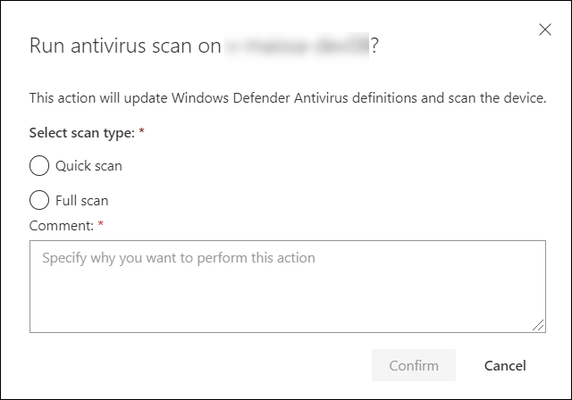

# Realizar acciones de respuesta en un dispositivoTake response actions on a device

[!INCLUDE [Microsoft 365 Defender rebranding](../../includes/microsoft-defender.md)]

**Se aplica a:****Applies to:**
- [Microsoft Defender para punto de conexiónMicrosoft Defender for Endpoint](https://go.microsoft.com/fwlink/?linkid=2154037)

>¿Desea experimentar Defender for Endpoint?Want to experience Defender for Endpoint? [Regístrese para una prueba gratuita.Sign up for a free trial.](https://www.microsoft.com/microsoft-365/windows/microsoft-defender-atp?ocid=docs-wdatp-respondmachine-abovefoldlink) 

Responda rápidamente a los ataques detectados aislando dispositivos o recopilando un paquete de investigación.Quickly respond to detected attacks by isolating devices or collecting an investigation package. Después de realizar acciones en dispositivos, puede comprobar los detalles de la actividad en el Centro de acciones.After taking action on devices, you can check activity details on the Action center.

Las acciones de respuesta se ejecutan a lo largo de la parte superior de una página específica del dispositivo e incluyen:Response actions run along the top of a specific device page and include:

- Administrar etiquetasManage tags
- Iniciar investigación automatizadaInitiate Automated Investigation
- Iniciar sesión de respuesta en vivoInitiate Live Response Session
- Recopilar paquete de investigaciónCollect investigation package
- Ejecutar examen antivirusRun antivirus scan
- Restringir ejecución de aplicaciónRestrict app execution
- Aislar el dispositivoIsolate device
- Consultar a un experto en amenazasConsult a threat expert
- Centro de actividadesAction center

[ de respuesta](images/response-actions.png#lightbox)

 Puede encontrar páginas de dispositivos en cualquiera de las siguientes vistas:You can find device pages from any of the following views:

- **Panel de operaciones de seguridad:** seleccione un nombre de dispositivo en la tarjeta Dispositivos en riesgo.**Security operations dashboard** - Select a device name from the Devices at risk card.
- **Cola de alertas:** seleccione el nombre del dispositivo junto al icono del dispositivo en la cola de alertas.**Alerts queue** - Select the device name beside the device icon from the alerts queue.
- **Lista dispositivos:** seleccione el encabezado del nombre del dispositivo en la lista de dispositivos.**Devices list** - Select the heading of the device name from the devices list.
- **Cuadro de búsqueda:** seleccione Dispositivo en el menú desplegable e introduzca el nombre del dispositivo.**Search box** - Select Device from the drop-down menu and enter the device name.

>[!IMPORTANT]
> - Estas acciones de respuesta solo están disponibles para dispositivos en Windows 10, versión 1703 o posterior.These response actions are only available for devices on Windows 10, version  1703 or later. 
> - Para plataformas que no son Windows, las capacidades de respuesta (como el aislamiento del dispositivo) dependen de las capacidades de terceros.For non-Windows platforms, response capabilities (such as Device isolation) are dependent on the third-party capabilities.

## Administrar etiquetasManage tags

Agregue o administre etiquetas para crear una afiliación de grupo lógico.Add or manage tags to create a logical group affiliation. Las etiquetas de dispositivo admiten la asignación adecuada de la red, lo que le permite adjuntar diferentes etiquetas para capturar el contexto y permitir la creación dinámica de listas como parte de un incidente.Device tags support proper mapping of the network, enabling you to attach different tags to capture context and to enable dynamic list creation as part of an incident.

Para obtener más información sobre el etiquetado de dispositivos, consulte [Crear y administrar etiquetas de dispositivo.](machine-tags.md)For more information on device tagging, see [Create and manage device tags](machine-tags.md).

## Iniciar investigación automatizadaInitiate Automated Investigation

Puede iniciar una nueva investigación automatizada de uso general en el dispositivo si es necesario.You can start a new general purpose automated investigation on the device if needed. Mientras se ejecuta una investigación, cualquier otra alerta generada desde el dispositivo se agregará a una investigación automatizada en curso hasta que se complete esa investigación.While an investigation is running, any other alert generated from the device will be added to an ongoing Automated investigation until that investigation is completed. Además, si se observa la misma amenaza en otros dispositivos, esos dispositivos se añaden a la investigación.In addition, if the same threat is seen on other devices, those devices are added to the investigation.

Para obtener más información sobre las investigaciones automatizadas, consulte [Información general sobre investigaciones automatizadas](automated-investigations.md).For more information on automated investigations, see [Overview of Automated investigations](automated-investigations.md).

## Iniciar sesión de respuesta en vivoInitiate Live Response Session

La respuesta en vivo es una capacidad que le proporciona acceso instantáneo a un dispositivo mediante una conexión de shell remoto.Live response is a capability that gives you instantaneous access to a device by using a remote shell connection. Esto le da el poder de hacer un trabajo de investigación en profundidad y tomar acciones de respuesta inmediata para contener rápidamente las amenazas identificadas, en tiempo real.This gives you the power to do in-depth investigative work and take immediate response actions to promptly contain identified threats — real time.

La respuesta en vivo está diseñada para mejorar las investigaciones al permitirle recopilar datos forenses, ejecutar scripts, enviar entidades sospechosas para su análisis, corregir amenazas y buscar proactivamente amenazas emergentes.Live response is designed to enhance investigations by enabling you to collect forensic data, run scripts, send suspicious entities for analysis, remediate threats, and proactively hunt for emerging threats.

Para obtener más información sobre la respuesta en vivo, consulte [Investigar entidades en dispositivos mediante respuesta en directo.](live-response.md)For more information on live response, see [Investigate entities on devices using live response](live-response.md).

## Recoger paquete de investigación de los dispositivosCollect investigation package from devices

Como parte del proceso de investigación o respuesta, puede recopilar un paquete de investigación de un dispositivo.As part of the investigation or response process, you can collect an investigation package from a device. Mediante la recopilación del paquete de investigación, puede identificar el estado actual del dispositivo y comprender mejor las herramientas y técnicas utilizadas por el atacante.By collecting the investigation package, you can identify the current state of the device and further understand the tools and techniques used by the attacker.

Para descargar el paquete (archivo Zip) e investigar los eventos ocurridos en un dispositivoTo download the package (Zip file) and investigate the events that occurred on a device

1. Seleccione **Recopilar paquete** de investigación en la fila de acciones de respuesta en la parte superior de la página del dispositivo.Select **Collect investigation package** from the row of response actions at the top of the device page.
2. Especifique en el cuadro de texto por qué desea realizar esta acción.Specify in the text box why you want to perform this action. Seleccione **Confirmar**.Select **Confirm**.
3. El archivo zip se descargaráThe zip file will download

Forma alternativa:Alternate way:

1. Seleccione Centro de **acciones** en la sección acciones de respuesta de la página del dispositivo.Select **Action center** from the response actions section of the device page.

    

3. En el menú desplegable Centro de acciones, seleccione **Paquete de colección de paquetes disponible** para descargar el archivo zip.In the Action center fly-out, select **Package collection package available** to download the zip file.
  
    

El paquete contiene las siguientes carpetas:The package contains the following folders:

| CarpetaFolder | DescripciónDescription |
|:---|:---------|
|AutorunsAutoruns | Contiene un conjunto de archivos que representan cada uno el contenido del registro de un punto de entrada de inicio automático (ASEP) conocido para ayudar a identificar la persistencia del atacante en el dispositivo.Contains a set of files that each represent the content of the registry of a known auto start entry point (ASEP) to help identify attacker’s persistency on the device.    
<b>NOTA:</b> Si no se encuentra la clave del Registro, el archivo contendrá el siguiente mensaje: "ERROR: El sistema no pudo encontrar la clave o el valor del Registro especificado."<b>NOTE:</b> If the registry key is not found, the file will contain the following message: “ERROR: The system was unable to find the specified registry key or value.”
                                                                                                                                |
|Programas instaladosInstalled programs | Este .CSV archivo contiene la lista de programas instalados que pueden ayudar a identificar lo que está instalado actualmente en el dispositivo.This .CSV file contains the list of installed programs that can help identify what is currently installed on the device. Para obtener más información, consulte [Win32_Product clase](https://go.microsoft.com/fwlink/?linkid=841509).For more information, see [Win32_Product class](https://go.microsoft.com/fwlink/?linkid=841509).                                                                                  |
|Conexiones de redNetwork connections | Esta carpeta contiene un conjunto de puntos de datos relacionados con la información de conectividad que puede ayudar a identificar la conectividad a direcciones URL sospechosas, la infraestructura de comando y control del atacante (C&C), cualquier movimiento lateral o conexiones remotas.This folder contains a set of data points related to the connectivity information which can help in identifying connectivity to suspicious URLs, attacker’s command and control (C&C) infrastructure, any lateral movement, or remote connections.   - ActiveNetConnections.txt: muestra las estadísticas de protocolo y las conexiones de red TCP/IP actuales.- ActiveNetConnections.txt – Displays protocol statistics and current TCP/IP network connections. Proporciona la capacidad de buscar conectividad sospechosa hecha por un proceso.Provides the ability to look for suspicious connectivity made by a process.    - Arp.txt: muestra las tablas de caché del protocolo de resolución de direcciones (ARP) actuales para todas las interfaces.- Arp.txt – Displays the current address resolution protocol (ARP) cache tables for all interfaces.    La caché ARP puede revelar hosts adicionales en una red que se han visto comprometidos o sistemas sospechosos en la red que podrían haberse utilizado para ejecutar un ataque interno.ARP cache can reveal additional hosts on a network that have been compromised or suspicious systems on the network that might have been used to run an internal attack.   - DnsCache.txt: muestra el contenido de la caché de resolución de cliente DNS, que incluye ambas entradas precargadas desde el archivo hosts local y los registros de recursos obtenidos recientemente para las consultas de nombre resueltas por el equipo.- DnsCache.txt - Displays the contents of the DNS client resolver cache, which includes both entries preloaded from the local Hosts file and any recently obtained resource records for name queries resolved by the computer. Esto puede ayudar a identificar conexiones sospechosas.This can help in identifying suspicious connections.    - IpConfig.txt: muestra la configuración tcp/IP completa para todos los adaptadores.- IpConfig.txt – Displays the full TCP/IP configuration for all adapters. Los adaptadores pueden representar interfaces físicas, como adaptadores de red instalados o interfaces lógicas, como conexiones de acceso telefónico.Adapters can represent physical interfaces, such as installed network adapters, or logical interfaces, such as dial-up connections.    - FirewallExecutionLog.txt y muro de fuego.log- FirewallExecutionLog.txt and pfirewall.log                                                                                  |
| Archivos de prefetchPrefetch files| Windows Los archivos de prefetch están diseñados para acelerar el proceso de inicio de la aplicación.Windows Prefetch files are designed to speed up the application startup process. Se puede utilizar para realizar un seguimiento de todos los archivos utilizados recientemente en el sistema y encontrar seguimientos para aplicaciones que podrían haberse eliminado, pero todavía se pueden encontrar en la lista de archivos de prefetch.It can be used to track all the files recently used in the system and find traces for applications that might have been deleted but can still be found in the prefetch file list.    - Carpeta de prefetch: contiene una copia de los archivos de prefetch de `%SystemRoot%\Prefetch` .- Prefetch folder –  Contains a copy of the prefetch files from `%SystemRoot%\Prefetch`. NOTA: Se sugiere descargar un visor de archivos previo a la captura para ver los archivos de prefetch.NOTE: It is suggested to download a prefetch file viewer to view the prefetch files.    - PrefetchFilesList.txt: contiene la lista de todos los archivos copiados que se pueden utilizar para realizar un seguimiento si hubo errores de copia en la carpeta de captura previa.- PrefetchFilesList.txt – Contains the list of all the copied files which can be used to track if there were any copy failures to the prefetch folder.                                                                                                      |
| ProcesosProcesses| Contiene un archivo .CSV que enumera los procesos en ejecución, que proporciona la capacidad de identificar los procesos actuales que se ejecutan en el dispositivo.Contains a .CSV file listing the running processes, which provides the ability to identify current processes running on the device. Esto puede ser útil al identificar un proceso sospechoso y su estado.This can be useful when identifying a suspicious process and its state.                                                                                                                                                                                                       |
| Tareas programadasScheduled tasks| Contiene un archivo .CSV que enumera las tareas programadas, que se pueden usar para identificar rutinas realizadas automáticamente en un dispositivo elegido para buscar código sospechoso que se estableció para ejecutarse automáticamente.Contains a .CSV file listing the scheduled tasks, which can be used to identify routines performed automatically on a chosen device to look for suspicious code which was set to run automatically.                                                                                                                                                                                                      |
| Registro de eventos de seguridadSecurity event log| Contiene el registro de eventos de seguridad, que contiene registros de actividad de inicio de sesión o cierre de sesión u otros eventos relacionados con la seguridad especificados por la directiva de auditoría del sistema.Contains the security event log, which contains records of login or logout activity, or other security-related events specified by the system's audit policy.   
<b>NOTA:</b> Abra el archivo de registro de eventos mediante el Visor de eventos.<b>NOTE:</b> Open the event log file using Event viewer.
                                                                                    |
| ServiciosServices| Contiene un archivo .CSV que enumera los servicios y sus estados.Contains a .CSV file that lists services and their states.                                                                                      |
| Windows Sesiones de bloque de mensajes de servidor (SMB)Windows Server Message Block (SMB) sessions | Enumera el acceso compartido a archivos, impresoras y puertos serie y comunicaciones diversas entre nodos de una red.Lists shared access to files, printers, and serial ports and miscellaneous communications between nodes on a network. Esto puede ayudar a identificar la exfiltración de datos o el movimiento lateral.This can help identify data exfiltration or lateral movement.    Contiene archivos para SMBInboundSessions y SMBOutboundSession.Contains files for SMBInboundSessions and SMBOutboundSession.    
<b>NOTA:</b> Si no hay sesiones (entrantes o salientes), obtendrá un archivo de texto que le indicará que no se han encontrado sesiones SMB.<b>NOTE:</b> If there are no sessions (inbound or outbound), you'll get a text file which tell you that there are no SMB sessions found.
                                                                                                                          |
| Información del sistemaSystem Information| Contiene un archivo SystemInformation.txt que enumera la información del sistema, como la versión del sistema operativo y las tarjetas de red.Contains a SystemInformation.txt file which lists system information such as OS version and network cards.                                                                                     |
| Directorios temporalesTemp Directories| Contiene un conjunto de archivos de texto que enumera los archivos ubicados en %Temp% para cada usuario del sistema.Contains a set of text files that lists the files located in %Temp% for every user in the system.    Esto puede ayudar a realizar un seguimiento de los archivos sospechosos que un atacante puede haber caído en el sistema.This can help to track suspicious files that an attacker may have dropped on the system.    
<b>NOTA:</b> Si el archivo contiene el siguiente mensaje: "El sistema no puede encontrar la ruta especificada", significa que no hay ningún directorio temporal para este usuario y puede deberse a que el usuario no ha iniciado sesión en el sistema.<b>NOTE:</b> If the file contains the following message: “The system cannot find the path specified”, it means that there is no temp directory for this user, and might be because the user didn’t log in to the system.
                                                                                                                                         |
| Usuarios y gruposUsers and Groups| Proporciona una lista de archivos que representan cada uno un grupo y sus miembros.Provides a list of files that each represent a group and its members.                                                                                                                   |
|WdSupportLogsWdSupportLogs| Proporciona la MpCmdRunLog.txt y la MPSupportFiles.cabProvides the MpCmdRunLog.txt and MPSupportFiles.cab     
<b>NOTA:</b> Esta carpeta solo se creará en Windows 10, versión 1709 o posterior con el paquete acumulativo de actualizaciones de febrero de 2020 o más reciente instalado:<b>NOTE:</b> This folder will only be created on Windows 10, version 1709 or later with February 2020 update rollup or more recent installed:  Win10 1709 (RS3) Compilación 16299.1717 : [KB4537816](https://support.microsoft.com/en-us/help/4537816/windows-10-update-kb4537816)Win10 1709 (RS3) Build 16299.1717 : [KB4537816](https://support.microsoft.com/en-us/help/4537816/windows-10-update-kb4537816)   Win10 1803 (RS4) Compilación 17134.1345 : [KB4537795](https://support.microsoft.com/en-us/help/4537795/windows-10-update-kb4537795)Win10 1803 (RS4) Build 17134.1345 : [KB4537795](https://support.microsoft.com/en-us/help/4537795/windows-10-update-kb4537795)   Win10 1809 (RS5) Compilación 17763.1075 : [KB4537818](https://support.microsoft.com/en-us/help/4537818/windows-10-update-kb4537818)Win10 1809 (RS5) Build 17763.1075 : [KB4537818](https://support.microsoft.com/en-us/help/4537818/windows-10-update-kb4537818)   Win10 1903/1909 (19h1/19h2) Compila 18362.693 y 18363.693 : [KB4535996](https://support.microsoft.com/en-us/help/4535996/windows-10-update-kb4535996)Win10 1903/1909 (19h1/19h2) Builds 18362.693 and 18363.693 : [KB4535996](https://support.microsoft.com/en-us/help/4535996/windows-10-update-kb4535996) 
                                                                                                                    |
| CollectionSummaryReport.xlsCollectionSummaryReport.xls| Este archivo es un resumen de la colección de paquetes de investigación, contiene la lista de puntos de datos, el comando utilizado para extraer los datos, el estado de ejecución y el código de error en caso de error.This file is a summary of the investigation package collection, it contains the list of data points, the command used to extract the data, the execution status, and the error code in case of failure. Puede usar este informe para realizar un seguimiento si el paquete incluye todos los datos esperados e identificar si hubo algún error.You can use this report to track if the package includes all the expected data and identify if there were any errors. |

## Ejecutar análisis Antivirus de Microsoft Defender en dispositivosRun Microsoft Defender Antivirus scan on devices

Como parte del proceso de investigación o respuesta, puede iniciar de forma remota un análisis antivirus para ayudar a identificar y corregir el malware que podría estar presente en un dispositivo comprometido.As part of the investigation or response process, you can remotely initiate an antivirus scan to help identify and remediate malware that might be present on a compromised device.

>[!IMPORTANT]
>- Esta acción está disponible para dispositivos en Windows 10, versión 1709 o posterior.This action is available for devices on Windows 10, version  1709 or later.
>- Un análisis Antivirus de Microsoft Defender (Av de Microsoft Defender) se puede ejecutar junto con otras soluciones antivirus, ya sea que Microsoft Defender AV sea la solución antivirus activa o no.A Microsoft Defender Antivirus (Microsoft Defender AV) scan can run alongside other antivirus solutions, whether Microsoft Defender AV is the active antivirus solution or not. Microsoft Defender AV puede estar en modo pasivo.Microsoft Defender AV can be in Passive mode. Para obtener más información, consulte [compatibilidad Antivirus de Microsoft Defender](https://docs.microsoft.com/windows/security/threat-protection/microsoft-defender-antivirus/microsoft-defender-antivirus-compatibility.md).For more information, see [Microsoft Defender Antivirus compatibility](https://docs.microsoft.com/windows/security/threat-protection/microsoft-defender-antivirus/microsoft-defender-antivirus-compatibility.md).

Uno que ha seleccionado **Ejecutar análisis antivirus,** seleccione el tipo de análisis que desea ejecutar (rápido o completo) y agregue un comentario antes de confirmar el análisis.One you have selected **Run antivirus scan**, select the scan type that you'd like to run (quick or full) and add a comment before confirming the scan.

El Centro de acciones mostrará la información de análisis y la línea de tiempo del dispositivo incluirá un nuevo evento, lo que refleja que se envió una acción de análisis en el dispositivo.The Action center will show the scan information and the device timeline will include a new event, reflecting that a scan action was submitted on the device. Las alertas AV de Microsoft Defender reflejarán las detecciones que surgieron durante el análisis.Microsoft Defender AV alerts will reflect any detections that surfaced during the scan.

>[!NOTE]
>Al desencadenar un análisis mediante la acción de respuesta defender for endpoint, el valor del antivirus de Microsoft Defender 'ScanAvgCPULoadFactor' sigue siendo aplicable y limita el impacto de la CPU del análisis.When triggering a scan using Defender for Endpoint response action, Microsoft Defender antivirus 'ScanAvgCPULoadFactor' value still applies and limits the CPU impact of the scan.  Si ScanAvgCPULoadFactor no está configurado, el valor predeterminado es un límite de carga máxima de CPU del 50% durante un análisis.If ScanAvgCPULoadFactor is not configured, the default value is a limit of 50% maximum CPU load during a scan. 
>Para obtener más información, consulte [configure-advanced-scan-types-microsoft-defender-antivirus](https://docs.microsoft.com/windows/security/threat-protection/microsoft-defender-antivirus/configure-advanced-scan-types-microsoft-defender-antivirus).For more information, see [configure-advanced-scan-types-microsoft-defender-antivirus](https://docs.microsoft.com/windows/security/threat-protection/microsoft-defender-antivirus/configure-advanced-scan-types-microsoft-defender-antivirus).

## Restringir ejecución de aplicaciónRestrict app execution

Además de contener un ataque mediante la detención de procesos maliciosos, también puede bloquear un dispositivo y evitar que se ejecuten intentos posteriores de programas potencialmente maliciosos.In addition to containing an attack by stopping malicious processes, you can also lock down a device and prevent subsequent attempts of potentially malicious programs from running.

>[!IMPORTANT]
> - Esta acción está disponible para dispositivos en Windows 10, versión 1709 o posterior.This action is available for devices on Windows 10, version  1709 or later.
> - Esta característica está disponible si su organización usa Antivirus de Microsoft Defender.This feature is available if your organization uses Microsoft Defender Antivirus.
> - Esta acción debe cumplir los formatos de directiva de integridad de código de Application Control Windows Defender y los requisitos de firma.This action needs to meet the Windows Defender Application Control code integrity policy formats and signing requirements. Para obtener más información, consulte [Formatos de directiva de integridad de código y firma.](https://docs.microsoft.com/windows/device-security/device-guard/requirements-and-deployment-planning-guidelines-for-device-guard#code-integrity-policy-formats-and-signing)For more information, see [Code integrity policy formats and signing](https://docs.microsoft.com/windows/device-security/device-guard/requirements-and-deployment-planning-guidelines-for-device-guard#code-integrity-policy-formats-and-signing).

Para restringir la ejecución de una aplicación, se aplica una directiva de integridad de código que solo permite que los archivos se ejecuten si están firmados por un certificado emitido por Microsoft.To restrict an application from running, a code integrity policy is applied that only allows files to run if they are signed by a Microsoft issued certificate. Este método de restricción puede ayudar a evitar que un atacante controle los dispositivos comprometidos y realice más actividades maliciosas.This method of restriction can help prevent an attacker from controlling compromised devices and performing further malicious activities.

>[!NOTE]
>Podrá revertir la restricción de las aplicaciones de ejecutarse en cualquier momento.You’ll be able to reverse the restriction of applications from running at any time. El botón de la página del dispositivo cambiará para decir **Quitar restricciones de aplicación** y, a continuación, tomará los mismos pasos que restringir la ejecución de la aplicación.The button on the device page will change to say **Remove app restrictions**, and then you take the same steps as restricting app execution.

Una vez que haya seleccionado **Restringir ejecución de aplicaciones** en la página del dispositivo, escriba un comentario y seleccione **Confirmar**.Once you have selected **Restrict app execution** on the device page, type a comment and select **Confirm**. El Centro de acción mostrará la información de análisis y la línea de tiempo del dispositivo incluirá un nuevo evento.The Action center will show the scan information and the device timeline will include a new event.

**Notificación en el usuario del dispositivo**:**Notification on device user**: 
Cuando se restringe una aplicación, se muestra la siguiente notificación para informar al usuario de que se está restringiendo la ejecución de una aplicación:When an app is restricted, the following notification is displayed to inform the user that an app is being restricted from running:

## Aislar dispositivos de la redIsolate devices from the network

Dependiendo de la gravedad del ataque y la sensibilidad del dispositivo, es posible que desee aislar el dispositivo de la red.Depending on the severity of the attack and the sensitivity of the device, you might want to isolate the device from the network. Esta acción puede ayudar a evitar que el atacante controle el dispositivo comprometido y realice otras actividades, como la exfiltración de datos y el movimiento lateral.This action can help prevent the attacker from controlling the compromised device and performing further activities such as data exfiltration and lateral movement.

>[!IMPORTANT]
>- El aislamiento completo está disponible para dispositivos en Windows 10, versión 1703.Full isolation is available for devices on Windows 10, version 1703.
>- El aislamiento selectivo está disponible para dispositivos en Windows 10, versión 1709 o posterior.Selective isolation is available for devices on Windows 10, version 1709 or later.
>- Al aislar un dispositivo, solo se permiten ciertos procesos y destinos.When isolating a device, only certain processes and destinations are allowed. Por lo tanto, los dispositivos que están detrás de un túnel VPN completo no podrán llegar al servicio en la nube de Microsoft Defender for Endpoint después de aislar el dispositivo.Therefore, devices that are behind a full VPN tunnel won't be able to reach the Microsoft Defender for Endpoint cloud service after the device is isolated. Se recomienda usar una VPN de túnel dividido para Microsoft Defender para Endpoint y Antivirus de Microsoft Defender tráfico relacionado con la protección basado en la nube.We recommend using a split-tunneling VPN for Microsoft Defender for Endpoint and Microsoft Defender Antivirus cloud-based protection-related traffic.

Esta característica de aislamiento del dispositivo desconecta el dispositivo comprometido de la red mientras conserva la conectividad al servicio Defender for Endpoint, que continúa supervisando el dispositivo.This device isolation feature disconnects the compromised device from the network while retaining connectivity to the Defender for Endpoint service, which continues to monitor the device.

En Windows 10, versión 1709 o posterior, tendrá control adicional sobre el nivel de aislamiento de red.On Windows 10, version 1709 or later, you'll have additional control over the network isolation level. También puede optar por habilitar Outlook, Microsoft Teams y conectividad Skype Empresarial (también conocido como &quot;Aislamiento selectivo").You can also choose to enable Outlook, Microsoft Teams, and Skype for Business connectivity (a.k.a 'Selective Isolation').

>[!NOTE]
>Podrás volver a conectar el dispositivo a la red en cualquier momento.You’ll be able to reconnect the device back to the network at any time. El botón de la página del dispositivo cambiará para decir **Liberar del aislamiento** y, a continuación, tomará los mismos pasos que aislar el dispositivo.The button on the device page will change to say **Release from isolation**, and then you take the same steps as isolating the device.

Una vez seleccionado **Aislar dispositivo** en la página del dispositivo, escriba un comentario y seleccione **Confirmar**.Once you have selected **Isolate device** on the device page, type a comment and select **Confirm**. El Centro de acción mostrará la información de análisis y la línea de tiempo del dispositivo incluirá un nuevo evento.The Action center will show the scan information and the device timeline will include a new event.

>[!NOTE]
>El dispositivo permanecerá conectado al servicio Defender for Endpoint incluso si está aislado de la red.The device will remain connected to the Defender for Endpoint service even if it is isolated from the network. Si ha elegido habilitar Outlook y Skype Empresarial comunicación, podrá comunicarse con el usuario mientras el dispositivo está aislado.If you've chosen to enable Outlook and Skype for Business communication, then you'll be able to communicate to the user while the device is isolated.

**Notificación en el usuario del dispositivo**:**Notification on device user**: 
Cuando se aísla un dispositivo, se muestra la siguiente notificación para informar al usuario de que el dispositivo se está aislando de la red:When a device is being isolated, the following notification is displayed to inform the user that the device is being isolated from the network:

## Consultar a un experto en amenazasConsult a threat expert

Puede consultar a un experto en amenazas de Microsoft para obtener más información sobre un dispositivo potencialmente comprometido o ya comprometido.You can consult a Microsoft threat expert for more insights regarding a potentially compromised device or already compromised ones. Expertos en amenazas de Microsoft se pueden contratar directamente desde el Centro de seguridad de Microsoft Defender para obtener una respuesta oportuna y precisa.Microsoft Threat Experts can be engaged directly from within the Microsoft Defender Security Center for timely and accurate response. Los expertos proporcionan información no solo sobre un dispositivo potencialmente comprometido, sino también para comprender mejor las amenazas complejas, las notificaciones de ataque dirigidas que recibes o si necesitas más información sobre las alertas, o un contexto de inteligencia de amenazas que ves en el panel del portal.Experts provide insights not just regarding a potentially compromised device, but also to better understand complex threats, targeted attack notifications that you get, or if you need more information about the alerts, or a threat intelligence context that you see on your portal dashboard.

Consulte [Consulte Consulte a un experto en amenazas de Microsoft](https://docs.microsoft.com/microsoft-365/security/defender-endpoint/configure-microsoft-threat-experts#consult-a-microsoft-threat-expert-about-suspicious-cybersecurity-activities-in-your-organization) para obtener más información.See [Consult a Microsoft Threat Expert](https://docs.microsoft.com/microsoft-365/security/defender-endpoint/configure-microsoft-threat-experts#consult-a-microsoft-threat-expert-about-suspicious-cybersecurity-activities-in-your-organization) for details.

## Comprobar los detalles de actividad en el Centro de actividadesCheck activity details in Action center

El **Centro de acciones** proporciona información sobre las acciones que se llevaron a cabo en un dispositivo o archivo.The **Action center** provides information on actions that were taken on a device or file. Podrás ver los siguientes detalles:You’ll be able to view the following details:

- Colección de paquetes de investigaciónInvestigation package collection
- Análisis antivirusAntivirus scan
- Restricción de aplicacionesApp restriction
- Aislamiento del dispositivoDevice isolation

Todos los demás detalles relacionados también se muestran, por ejemplo, la fecha/hora de envío, el envío de usuario y si la acción se realizó correctamente o se ha error.All other related details are also shown, for example, submission date/time, submitting user, and if the action succeeded or failed.

## Tema relacionadoRelated topic
- [Realizar acciones de respuesta en un archivoTake response actions on a file](respond-file-alerts.md)
- [Denuncian imprecisiónReport inaccuracy](https://docs.microsoft.com/microsoft-365/security/defender-endpoint/tvm-security-recommendation#report-inaccuracy)
