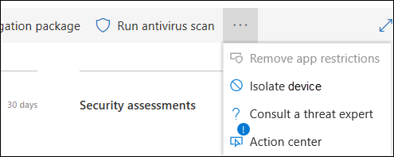
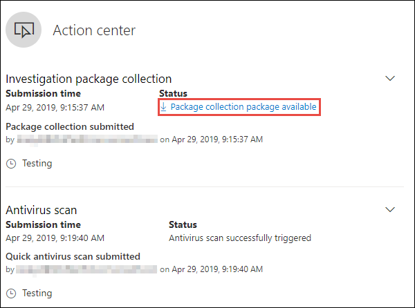
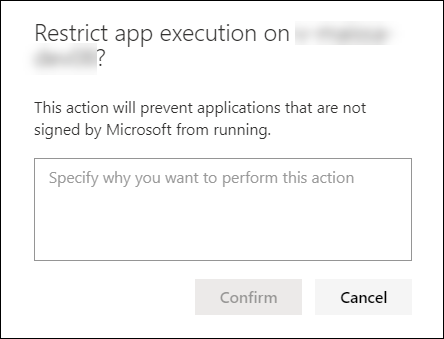

# Realizar acciones de respuesta en un dispositivo

[!INCLUDE [Microsoft 365 Defender rebranding](../../includes/microsoft-defender.md)]

**Se aplica a:**
- [Microsoft Defender para punto de conexión](https://go.microsoft.com/fwlink/?linkid=2154037)

>¿Desea experimentar Defender for Endpoint? [Regístrese para una prueba gratuita.](https://www.microsoft.com/microsoft-365/windows/microsoft-defender-atp?ocid=docs-wdatp-respondmachine-abovefoldlink) 

Responda rápidamente a los ataques detectados aislando dispositivos o recopilando un paquete de investigación. Después de realizar acciones en dispositivos, puede comprobar los detalles de la actividad en el Centro de acciones.

Las acciones de respuesta se ejecutan a lo largo de la parte superior de una página específica del dispositivo e incluyen:

- Administrar etiquetas
- Iniciar investigación automatizada
- Iniciar sesión de respuesta en vivo
- Recopilar paquete de investigación
- Ejecutar examen antivirus
- Restringir ejecución de aplicación
- Aislar el dispositivo
- Consultar a un experto en amenazas
- Centro de actividades

[ de respuesta](images/response-actions.png#lightbox)

 Puede encontrar páginas de dispositivos en cualquiera de las siguientes vistas:

- **Panel de operaciones de seguridad:** seleccione un nombre de dispositivo en la tarjeta Dispositivos en riesgo.
- **Cola de alertas:** seleccione el nombre del dispositivo junto al icono del dispositivo en la cola de alertas.
- **Lista dispositivos:** seleccione el encabezado del nombre del dispositivo en la lista de dispositivos.
- **Cuadro de búsqueda:** seleccione Dispositivo en el menú desplegable e introduzca el nombre del dispositivo.

>[!IMPORTANT]
> - Estas acciones de respuesta solo están disponibles para dispositivos en Windows 10, versión 1703 o posterior. 
> - Para plataformas que no son Windows, las capacidades de respuesta (como el aislamiento del dispositivo) dependen de las capacidades de terceros.

## Administrar etiquetas

Agregue o administre etiquetas para crear una afiliación de grupo lógico. Las etiquetas de dispositivo admiten la asignación adecuada de la red, lo que le permite adjuntar diferentes etiquetas para capturar el contexto y permitir la creación dinámica de listas como parte de un incidente.

Para obtener más información sobre el etiquetado de dispositivos, consulte [Crear y administrar etiquetas de dispositivo.](machine-tags.md)

## Iniciar investigación automatizada

Puede iniciar una nueva investigación automatizada de uso general en el dispositivo si es necesario. Mientras se ejecuta una investigación, cualquier otra alerta generada desde el dispositivo se agregará a una investigación automatizada en curso hasta que se complete esa investigación. Además, si se observa la misma amenaza en otros dispositivos, esos dispositivos se añaden a la investigación.

Para obtener más información sobre las investigaciones automatizadas, consulte [Información general sobre investigaciones automatizadas](automated-investigations.md).

## Iniciar sesión de respuesta en vivo

La respuesta en vivo es una capacidad que le proporciona acceso instantáneo a un dispositivo mediante una conexión de shell remoto. Esto le da el poder de hacer un trabajo de investigación en profundidad y tomar acciones de respuesta inmediata para contener rápidamente las amenazas identificadas, en tiempo real.

La respuesta en vivo está diseñada para mejorar las investigaciones al permitirle recopilar datos forenses, ejecutar scripts, enviar entidades sospechosas para su análisis, corregir amenazas y buscar proactivamente amenazas emergentes.

Para obtener más información sobre la respuesta en vivo, consulte [Investigar entidades en dispositivos mediante respuesta en directo.](live-response.md)

## Recoger paquete de investigación de los dispositivos

Como parte del proceso de investigación o respuesta, puede recopilar un paquete de investigación de un dispositivo. Mediante la recopilación del paquete de investigación, puede identificar el estado actual del dispositivo y comprender mejor las herramientas y técnicas utilizadas por el atacante.

Para descargar el paquete (archivo Zip) e investigar los eventos ocurridos en un dispositivo

1. Seleccione **Recopilar paquete** de investigación en la fila de acciones de respuesta en la parte superior de la página del dispositivo.
2. Especifique en el cuadro de texto por qué desea realizar esta acción. Seleccione **Confirmar**.
3. El archivo zip se descargará

Forma alternativa:

1. Seleccione Centro de **acciones** en la sección acciones de respuesta de la página del dispositivo.

    

3. En el menú desplegable Centro de acciones, seleccione **Paquete de colección de paquetes disponible** para descargar el archivo zip.
  
    

El paquete contiene las siguientes carpetas:

| Carpeta | Descripción |
|:---|:---------|
|Autoruns | Contiene un conjunto de archivos que representan cada uno el contenido del registro de un punto de entrada de inicio automático (ASEP) conocido para ayudar a identificar la persistencia del atacante en el dispositivo.    
<b>NOTA:</b> Si no se encuentra la clave del Registro, el archivo contendrá el siguiente mensaje: "ERROR: El sistema no pudo encontrar la clave o el valor del Registro especificado."
                                                                                                                                |
|Programas instalados | Este .CSV archivo contiene la lista de programas instalados que pueden ayudar a identificar lo que está instalado actualmente en el dispositivo. Para obtener más información, consulte [Win32_Product clase](https://go.microsoft.com/fwlink/?linkid=841509).                                                                                  |
|Conexiones de red | Esta carpeta contiene un conjunto de puntos de datos relacionados con la información de conectividad que puede ayudar a identificar la conectividad a direcciones URL sospechosas, la infraestructura de comando y control del atacante (C&C), cualquier movimiento lateral o conexiones remotas.   - ActiveNetConnections.txt: muestra las estadísticas de protocolo y las conexiones de red TCP/IP actuales. Proporciona la capacidad de buscar conectividad sospechosa hecha por un proceso.    - Arp.txt: muestra las tablas de caché del protocolo de resolución de direcciones (ARP) actuales para todas las interfaces.    La caché ARP puede revelar hosts adicionales en una red que se han visto comprometidos o sistemas sospechosos en la red que podrían haberse utilizado para ejecutar un ataque interno.   - DnsCache.txt: muestra el contenido de la caché de resolución de cliente DNS, que incluye ambas entradas precargadas desde el archivo hosts local y los registros de recursos obtenidos recientemente para las consultas de nombre resueltas por el equipo. Esto puede ayudar a identificar conexiones sospechosas.    - IpConfig.txt: muestra la configuración tcp/IP completa para todos los adaptadores. Los adaptadores pueden representar interfaces físicas, como adaptadores de red instalados o interfaces lógicas, como conexiones de acceso telefónico.    - FirewallExecutionLog.txt y muro de fuego.log                                                                                  |
| Archivos de prefetch| Windows Los archivos de prefetch están diseñados para acelerar el proceso de inicio de la aplicación. Se puede utilizar para realizar un seguimiento de todos los archivos utilizados recientemente en el sistema y encontrar seguimientos para aplicaciones que podrían haberse eliminado, pero todavía se pueden encontrar en la lista de archivos de prefetch.    - Carpeta de prefetch: contiene una copia de los archivos de prefetch de `%SystemRoot%\Prefetch` . NOTA: Se sugiere descargar un visor de archivos previo a la captura para ver los archivos de prefetch.    - PrefetchFilesList.txt: contiene la lista de todos los archivos copiados que se pueden utilizar para realizar un seguimiento si hubo errores de copia en la carpeta de captura previa.                                                                                                      |
| Procesos| Contiene un archivo .CSV que enumera los procesos en ejecución, que proporciona la capacidad de identificar los procesos actuales que se ejecutan en el dispositivo. Esto puede ser útil al identificar un proceso sospechoso y su estado.                                                                                                                                                                                                       |
| Tareas programadas| Contiene un archivo .CSV que enumera las tareas programadas, que se pueden usar para identificar rutinas realizadas automáticamente en un dispositivo elegido para buscar código sospechoso que se estableció para ejecutarse automáticamente.                                                                                                                                                                                                      |
| Registro de eventos de seguridad| Contiene el registro de eventos de seguridad, que contiene registros de actividad de inicio de sesión o cierre de sesión u otros eventos relacionados con la seguridad especificados por la directiva de auditoría del sistema.   
<b>NOTA:</b> Abra el archivo de registro de eventos mediante el Visor de eventos.
                                                                                    |
| Servicios| Contiene un archivo .CSV que enumera los servicios y sus estados.                                                                                      |
| Windows Sesiones de bloque de mensajes de servidor (SMB) | Enumera el acceso compartido a archivos, impresoras y puertos serie y comunicaciones diversas entre nodos de una red. Esto puede ayudar a identificar la exfiltración de datos o el movimiento lateral.    Contiene archivos para SMBInboundSessions y SMBOutboundSession.    
<b>NOTA:</b> Si no hay sesiones (entrantes o salientes), obtendrá un archivo de texto que le indicará que no se han encontrado sesiones SMB.
                                                                                                                          |
| Información del sistema| Contiene un archivo SystemInformation.txt que enumera la información del sistema, como la versión del sistema operativo y las tarjetas de red.                                                                                     |
| Directorios temporales| Contiene un conjunto de archivos de texto que enumera los archivos ubicados en %Temp% para cada usuario del sistema.    Esto puede ayudar a realizar un seguimiento de los archivos sospechosos que un atacante puede haber caído en el sistema.    
<b>NOTA:</b> Si el archivo contiene el siguiente mensaje: "El sistema no puede encontrar la ruta especificada", significa que no hay ningún directorio temporal para este usuario y puede deberse a que el usuario no ha iniciado sesión en el sistema.
                                                                                                                                         |
| Usuarios y grupos| Proporciona una lista de archivos que representan cada uno un grupo y sus miembros.                                                                                                                   |
|WdSupportLogs| Proporciona la MpCmdRunLog.txt y la MPSupportFiles.cab     
<b>NOTA:</b> Esta carpeta solo se creará en Windows 10, versión 1709 o posterior con el paquete acumulativo de actualizaciones de febrero de 2020 o más reciente instalado:  Win10 1709 (RS3) Compilación 16299.1717 : [KB4537816](https://support.microsoft.com/en-us/help/4537816/windows-10-update-kb4537816)   Win10 1803 (RS4) Compilación 17134.1345 : [KB4537795](https://support.microsoft.com/en-us/help/4537795/windows-10-update-kb4537795)   Win10 1809 (RS5) Compilación 17763.1075 : [KB4537818](https://support.microsoft.com/en-us/help/4537818/windows-10-update-kb4537818)   Win10 1903/1909 (19h1/19h2) Compila 18362.693 y 18363.693 : [KB4535996](https://support.microsoft.com/en-us/help/4535996/windows-10-update-kb4535996) 
                                                                                                                    |
| CollectionSummaryReport.xls| Este archivo es un resumen de la colección de paquetes de investigación, contiene la lista de puntos de datos, el comando utilizado para extraer los datos, el estado de ejecución y el código de error en caso de error. Puede usar este informe para realizar un seguimiento si el paquete incluye todos los datos esperados e identificar si hubo algún error. |

## Ejecutar análisis Antivirus de Microsoft Defender en dispositivos

Como parte del proceso de investigación o respuesta, puede iniciar de forma remota un análisis antivirus para ayudar a identificar y corregir el malware que podría estar presente en un dispositivo comprometido.

>[!IMPORTANT]
>- Esta acción está disponible para dispositivos en Windows 10, versión 1709 o posterior.
>- Un análisis Antivirus de Microsoft Defender (Av de Microsoft Defender) se puede ejecutar junto con otras soluciones antivirus, ya sea que Microsoft Defender AV sea la solución antivirus activa o no. Microsoft Defender AV puede estar en modo pasivo. Para obtener más información, consulte [compatibilidad Antivirus de Microsoft Defender](https://docs.microsoft.com/windows/security/threat-protection/microsoft-defender-antivirus/microsoft-defender-antivirus-compatibility.md).

Uno que ha seleccionado **Ejecutar análisis antivirus,** seleccione el tipo de análisis que desea ejecutar (rápido o completo) y agregue un comentario antes de confirmar el análisis.

El Centro de acciones mostrará la información de análisis y la línea de tiempo del dispositivo incluirá un nuevo evento, lo que refleja que se envió una acción de análisis en el dispositivo. Las alertas AV de Microsoft Defender reflejarán las detecciones que surgieron durante el análisis.

>[!NOTE]
>Al desencadenar un análisis mediante la acción de respuesta defender for endpoint, el valor del antivirus de Microsoft Defender 'ScanAvgCPULoadFactor' sigue siendo aplicable y limita el impacto de la CPU del análisis.  Si ScanAvgCPULoadFactor no está configurado, el valor predeterminado es un límite de carga máxima de CPU del 50% durante un análisis. 
>Para obtener más información, consulte [configure-advanced-scan-types-microsoft-defender-antivirus](https://docs.microsoft.com/windows/security/threat-protection/microsoft-defender-antivirus/configure-advanced-scan-types-microsoft-defender-antivirus).

## Restringir ejecución de aplicación

Además de contener un ataque mediante la detención de procesos maliciosos, también puede bloquear un dispositivo y evitar que se ejecuten intentos posteriores de programas potencialmente maliciosos.

>[!IMPORTANT]
> - Esta acción está disponible para dispositivos en Windows 10, versión 1709 o posterior.
> - Esta característica está disponible si su organización usa Antivirus de Microsoft Defender.
> - Esta acción debe cumplir los formatos de directiva de integridad de código de Application Control Windows Defender y los requisitos de firma. Para obtener más información, consulte [Formatos de directiva de integridad de código y firma.](https://docs.microsoft.com/windows/device-security/device-guard/requirements-and-deployment-planning-guidelines-for-device-guard#code-integrity-policy-formats-and-signing)

Para restringir la ejecución de una aplicación, se aplica una directiva de integridad de código que solo permite que los archivos se ejecuten si están firmados por un certificado emitido por Microsoft. Este método de restricción puede ayudar a evitar que un atacante controle los dispositivos comprometidos y realice más actividades maliciosas.

>[!NOTE]
>Podrá revertir la restricción de las aplicaciones de ejecutarse en cualquier momento. El botón de la página del dispositivo cambiará para decir **Quitar restricciones de aplicación** y, a continuación, tomará los mismos pasos que restringir la ejecución de la aplicación.

Una vez que haya seleccionado **Restringir ejecución de aplicaciones** en la página del dispositivo, escriba un comentario y seleccione **Confirmar**. El Centro de acción mostrará la información de análisis y la línea de tiempo del dispositivo incluirá un nuevo evento.

**Notificación en el usuario del dispositivo**: 
Cuando se restringe una aplicación, se muestra la siguiente notificación para informar al usuario de que se está restringiendo la ejecución de una aplicación:

## Aislar dispositivos de la red

Dependiendo de la gravedad del ataque y la sensibilidad del dispositivo, es posible que desee aislar el dispositivo de la red. Esta acción puede ayudar a evitar que el atacante controle el dispositivo comprometido y realice otras actividades, como la exfiltración de datos y el movimiento lateral.

>[!IMPORTANT]
>- El aislamiento completo está disponible para dispositivos en Windows 10, versión 1703.
>- El aislamiento selectivo está disponible para dispositivos en Windows 10, versión 1709 o posterior.
>- Al aislar un dispositivo, solo se permiten ciertos procesos y destinos. Por lo tanto, los dispositivos que están detrás de un túnel VPN completo no podrán llegar al servicio en la nube de Microsoft Defender for Endpoint después de aislar el dispositivo. Se recomienda usar una VPN de túnel dividido para Microsoft Defender para Endpoint y Antivirus de Microsoft Defender tráfico relacionado con la protección basado en la nube.

Esta característica de aislamiento del dispositivo desconecta el dispositivo comprometido de la red mientras conserva la conectividad al servicio Defender for Endpoint, que continúa supervisando el dispositivo.

En Windows 10, versión 1709 o posterior, tendrá control adicional sobre el nivel de aislamiento de red. También puede optar por habilitar Outlook, Microsoft Teams y conectividad Skype Empresarial (también conocido como &quot;Aislamiento selectivo").

>[!NOTE]
>Podrás volver a conectar el dispositivo a la red en cualquier momento. El botón de la página del dispositivo cambiará para decir **Liberar del aislamiento** y, a continuación, tomará los mismos pasos que aislar el dispositivo.

Una vez seleccionado **Aislar dispositivo** en la página del dispositivo, escriba un comentario y seleccione **Confirmar**. El Centro de acción mostrará la información de análisis y la línea de tiempo del dispositivo incluirá un nuevo evento.

>[!NOTE]
>El dispositivo permanecerá conectado al servicio Defender for Endpoint incluso si está aislado de la red. Si ha elegido habilitar Outlook y Skype Empresarial comunicación, podrá comunicarse con el usuario mientras el dispositivo está aislado.

**Notificación en el usuario del dispositivo**: 
Cuando se aísla un dispositivo, se muestra la siguiente notificación para informar al usuario de que el dispositivo se está aislando de la red:

## Consultar a un experto en amenazas

Puede consultar a un experto en amenazas de Microsoft para obtener más información sobre un dispositivo potencialmente comprometido o ya comprometido. Expertos en amenazas de Microsoft se pueden contratar directamente desde el Centro de seguridad de Microsoft Defender para obtener una respuesta oportuna y precisa. Los expertos proporcionan información no solo sobre un dispositivo potencialmente comprometido, sino también para comprender mejor las amenazas complejas, las notificaciones de ataque dirigidas que recibes o si necesitas más información sobre las alertas, o un contexto de inteligencia de amenazas que ves en el panel del portal.

Consulte [Consulte Consulte a un experto en amenazas de Microsoft](https://docs.microsoft.com/microsoft-365/security/defender-endpoint/configure-microsoft-threat-experts#consult-a-microsoft-threat-expert-about-suspicious-cybersecurity-activities-in-your-organization) para obtener más información.

## Comprobar los detalles de actividad en el Centro de actividades

El **Centro de acciones** proporciona información sobre las acciones que se llevaron a cabo en un dispositivo o archivo. Podrás ver los siguientes detalles:

- Colección de paquetes de investigación
- Análisis antivirus
- Restricción de aplicaciones
- Aislamiento del dispositivo

Todos los demás detalles relacionados también se muestran, por ejemplo, la fecha/hora de envío, el envío de usuario y si la acción se realizó correctamente o se ha error.

## Tema relacionado
- [Realizar acciones de respuesta en un archivo](respond-file-alerts.md)
- [Denuncian imprecisión](https://docs.microsoft.com/microsoft-365/security/defender-endpoint/tvm-security-recommendation#report-inaccuracy)
