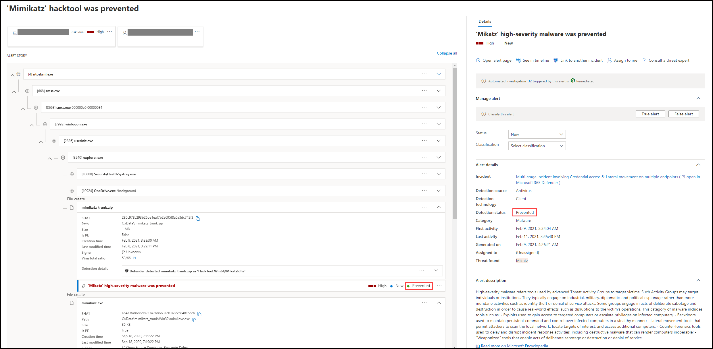
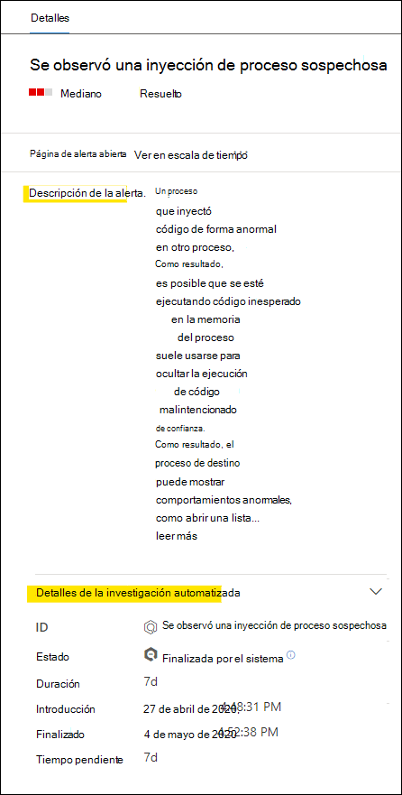
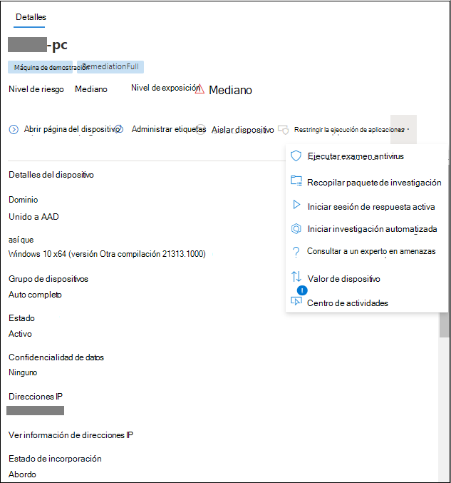

# Revisar alertas en Microsoft Defender para endpointReview alerts in Microsoft Defender for Endpoint

[!INCLUDE [Microsoft 365 Defender rebranding](../../includes/microsoft-defender.md)]

**Se aplica a:****Applies to:**
- [Microsoft Defender para punto de conexiónMicrosoft Defender for Endpoint](https://go.microsoft.com/fwlink/?linkid=2154037)

>¿Desea experimentar Defender for Endpoint?Want to experience Defender for Endpoint? [Regístrate para obtener una versión de prueba gratuita.Sign up for a free trial.](https://www.microsoft.com/microsoft-365/windows/microsoft-defender-atp?ocid=docs-wdatp-managealerts-abovefoldlink)

La página de alertas de Microsoft Defender para endpoint proporciona un contexto completo a la alerta, mediante la combinación de señales de ataque y alertas relacionadas con la alerta seleccionada, para crear un artículo de alerta detallado.The alert page in Microsoft Defender for Endpoint provides full context to the alert, by combining attack signals and alerts related to the selected alert, to construct a detailed alert story.

Triage, investigue y tome medidas eficaces rápidamente en las alertas que afectan a su organización.Quickly triage, investigate, and take effective action on alerts that affect your organization. Comprenda por qué se desencadenaron y su impacto desde una ubicación.Understand why they were triggered, and their impact from one location. Obtenga más información en esta introducción.Learn more in this overview.

> [!VIDEO https://www.microsoft.com/videoplayer/embed/RE4yiO5]

## Introducción a una alertaGetting started with an alert

Si selecciona el nombre de una alerta en Defender for Endpoint, aparecerá en su página de alerta.Selecting an alert's name in Defender for Endpoint will land you on its alert page. En la página de alerta, toda la información se mostrará en el contexto de la alerta seleccionada.On the alert page, all the information will be shown in context of the selected alert. Cada página de alerta consta de 4 secciones:Each alert page consists of 4 sections:

1. **El título de la** alerta muestra el nombre de la alerta y está allí para recordarle qué alerta inició la investigación actual independientemente de lo que haya seleccionado en la página.**The alert title** shows the alert's name and is there to remind you which alert started your current investigation regardless of what you have selected on the page.
2. [**Los activos afectados**](#review-affected-assets) enumeran tarjetas de dispositivos y usuarios afectados por esta alerta que se pueden hacer clic para obtener más información y acciones.[**Affected assets**](#review-affected-assets) lists cards of devices and users affected by this alert that are clickable for further information and actions.
3. El **artículo de alerta** muestra todas las entidades relacionadas con la alerta, interconectadas por una vista de árbol.The **alert story** displays all entities related to the alert, interconnected by a tree view. La alerta del título será la que esté en foco cuando llegues por primera vez a la página de la alerta seleccionada.The alert in the title will be the one in focus when you first land on your selected alert's page. Las entidades del artículo de alertas se pueden expandir y hacer clic, para proporcionar información adicional y acelerar la respuesta, ya que permiten realizar acciones directamente en el contexto de la página de alerta.Entities in the alert story are expandable and clickable, to provide additional information and expedite response by allowing you to take actions right in the context of the alert page. Use el artículo de alerta para iniciar la investigación.Use the alert story to start your investigation. Obtenga información sobre [cómo en Investigar alertas en Microsoft Defender para endpoint](/microsoft-365/security/defender-endpoint/investigate-alerts).Learn how in [Investigate alerts in Microsoft Defender for Endpoint](/microsoft-365/security/defender-endpoint/investigate-alerts).
4. El **panel de detalles** mostrará los detalles de la alerta seleccionada al principio, con detalles y acciones relacionadas con esta alerta.The **details pane** will show the details of the selected alert at first, with details and actions related to this alert. Si selecciona cualquiera de los activos o entidades afectados en el artículo de alerta, el panel de detalles cambiará para proporcionar información contextual y acciones para el objeto seleccionado.If you select any of the affected assets or entities in the alert story, the details pane will change to provide contextual information and actions for the selected object.

Tenga en cuenta el estado de detección de la alerta.Note the detection status for your alert. 
- Prevented: se evitó el intento de acción sospechosa.Prevented – The attempted suspicious action was avoided. Por ejemplo, un archivo no se escribió en el disco o se ejecutó.For example, a file either wasn’t written to disk or executed.

- Bloqueado: se ejecutó un comportamiento sospechoso y, a continuación, se bloqueó.Blocked – Suspicious behavior was executed and then blocked. Por ejemplo, se ejecutó un proceso, pero como posteriormente mostró comportamientos sospechosos, se finalizó el proceso.For example, a process was executed but because it subsequently exhibited suspicious behaviors, the process was terminated.

- Detectado: se detectó un ataque y posiblemente aún esté activo.Detected – An attack was detected and is possibly still active.

A continuación,  también puede revisar los detalles de la investigación automatizada en el panel de detalles de la alerta, para ver qué acciones ya se han realizado, así como leer la descripción de la alerta para las acciones recomendadas.You can then also review the *automated investigation details* in your alert's details pane, to see which actions were already taken, as well as reading the alert's description for recommended actions.

Otra información disponible en el panel de detalles cuando se abre la alerta incluye técnicas MITRE, origen y detalles contextuales adicionales.Other information available in the details pane when the alert opens includes MITRE techniques, source, and additional contextual details.

## Revisar activos afectadosReview affected assets

Al seleccionar un dispositivo o una tarjeta de usuario en las secciones activos afectados, se cambia a los detalles del dispositivo o usuario en el panel de detalles.Selecting a device or a user card in the affected assets sections will switch to the details of the device or user in the details pane.

- **En el caso de** los dispositivos, el panel de detalles mostrará información sobre el propio dispositivo, como Dominio, Sistema operativo e IP.**For devices**, the details pane will display information about the device itself, like Domain, Operating System, and IP. Las alertas activas y los usuarios que han iniciado sesión en ese dispositivo también están disponibles.Active alerts and the logged on users on that device are also available. Puedes tomar medidas inmediatas al aislar el dispositivo, restringir la ejecución de la aplicación o ejecutar un examen antivirus.You can take immediate action by isolating the device, restricting app execution, or running an antivirus scan. Como alternativa, puedes recopilar un paquete de investigación, iniciar una investigación automatizada o ir a la página del dispositivo para investigar desde el punto de vista del dispositivo.Alternatively, you could collect an investigation package, initiate an automated investigation, or go to the device page to investigate from the device's point of view.

   

- Para los **usuarios,** el panel de detalles mostrará información detallada del usuario, como el nombre SAM del usuario y SID, así como los tipos de inicio de sesión realizados por este usuario y las alertas e incidentes relacionados con él.**For users**, the details pane will display detailed user information, such as the user's SAM name and SID, as well as logon types performed by this user and any alerts and incidents related to it. Puede seleccionar Abrir *página de usuario para* continuar la investigación desde el punto de vista de ese usuario.You can select *Open user page* to continue the investigation from that user's point of view.

   

## Temas relacionadosRelated topics

- [Ver y organizar la cola de incidentesView and organize the incidents queue](view-incidents-queue.md)
- [Investigar incidentesInvestigate incidents](investigate-incidents.md)
- [Administrar incidentesManage incidents](manage-incidents.md)
