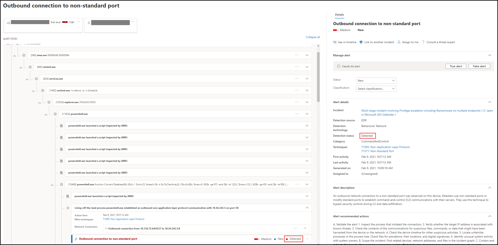

# Revisar alertas en Microsoft Defender para endpoint

[!INCLUDE [Microsoft 365 Defender rebranding](../../includes/microsoft-defender.md)]

**Se aplica a:**
- [Microsoft Defender para punto de conexión](https://go.microsoft.com/fwlink/?linkid=2154037)

>¿Desea experimentar Defender for Endpoint? [Regístrate para obtener una versión de prueba gratuita.](https://www.microsoft.com/microsoft-365/windows/microsoft-defender-atp?ocid=docs-wdatp-managealerts-abovefoldlink)

La página de alertas de Microsoft Defender para endpoint proporciona un contexto completo a la alerta, mediante la combinación de señales de ataque y alertas relacionadas con la alerta seleccionada, para crear un artículo de alerta detallado.

Triage, investigue y tome medidas eficaces rápidamente en las alertas que afectan a su organización. Comprenda por qué se desencadenaron y su impacto desde una ubicación. Obtenga más información en esta introducción.

> [!VIDEO https://www.microsoft.com/videoplayer/embed/RE4yiO5]

## Introducción a una alerta

Si selecciona el nombre de una alerta en Defender for Endpoint, aparecerá en su página de alerta. En la página de alerta, toda la información se mostrará en el contexto de la alerta seleccionada. Cada página de alerta consta de 4 secciones:

1. **El título de la** alerta muestra el nombre de la alerta y está allí para recordarle qué alerta inició la investigación actual independientemente de lo que haya seleccionado en la página.
2. [**Los activos afectados**](#review-affected-assets) enumeran tarjetas de dispositivos y usuarios afectados por esta alerta que se pueden hacer clic para obtener más información y acciones.
3. El **artículo de alerta** muestra todas las entidades relacionadas con la alerta, interconectadas por una vista de árbol. La alerta del título será la que esté en foco cuando llegues por primera vez a la página de la alerta seleccionada. Las entidades del artículo de alertas se pueden expandir y hacer clic, para proporcionar información adicional y acelerar la respuesta, ya que permiten realizar acciones directamente en el contexto de la página de alerta. Use el artículo de alerta para iniciar la investigación. Obtenga información sobre [cómo en Investigar alertas en Microsoft Defender para endpoint](/microsoft-365/security/defender-endpoint/investigate-alerts).
4. El **panel de detalles** mostrará los detalles de la alerta seleccionada al principio, con detalles y acciones relacionadas con esta alerta. Si selecciona cualquiera de los activos o entidades afectados en el artículo de alerta, el panel de detalles cambiará para proporcionar información contextual y acciones para el objeto seleccionado.

Tenga en cuenta el estado de detección de la alerta. 
- Prevented: se evitó el intento de acción sospechosa. Por ejemplo, un archivo no se escribió en el disco o se ejecutó.

- Bloqueado: se ejecutó un comportamiento sospechoso y, a continuación, se bloqueó. Por ejemplo, se ejecutó un proceso, pero como posteriormente mostró comportamientos sospechosos, se finalizó el proceso.

- Detectado: se detectó un ataque y posiblemente aún esté activo.

A continuación,  también puede revisar los detalles de la investigación automatizada en el panel de detalles de la alerta, para ver qué acciones ya se han realizado, así como leer la descripción de la alerta para las acciones recomendadas.

Otra información disponible en el panel de detalles cuando se abre la alerta incluye técnicas MITRE, origen y detalles contextuales adicionales.

## Revisar activos afectados

Al seleccionar un dispositivo o una tarjeta de usuario en las secciones activos afectados, se cambia a los detalles del dispositivo o usuario en el panel de detalles.

- **En el caso de** los dispositivos, el panel de detalles mostrará información sobre el propio dispositivo, como Dominio, Sistema operativo e IP. Las alertas activas y los usuarios que han iniciado sesión en ese dispositivo también están disponibles. Puedes tomar medidas inmediatas al aislar el dispositivo, restringir la ejecución de la aplicación o ejecutar un examen antivirus. Como alternativa, puedes recopilar un paquete de investigación, iniciar una investigación automatizada o ir a la página del dispositivo para investigar desde el punto de vista del dispositivo.

   

- Para los **usuarios,** el panel de detalles mostrará información detallada del usuario, como el nombre SAM del usuario y SID, así como los tipos de inicio de sesión realizados por este usuario y las alertas e incidentes relacionados con él. Puede seleccionar Abrir *página de usuario para* continuar la investigación desde el punto de vista de ese usuario.

   

## Temas relacionados

- [Ver y organizar la cola de incidentes](view-incidents-queue.md)
- [Investigar incidentes](investigate-incidents.md)
- [Administrar incidentes](manage-incidents.md)
