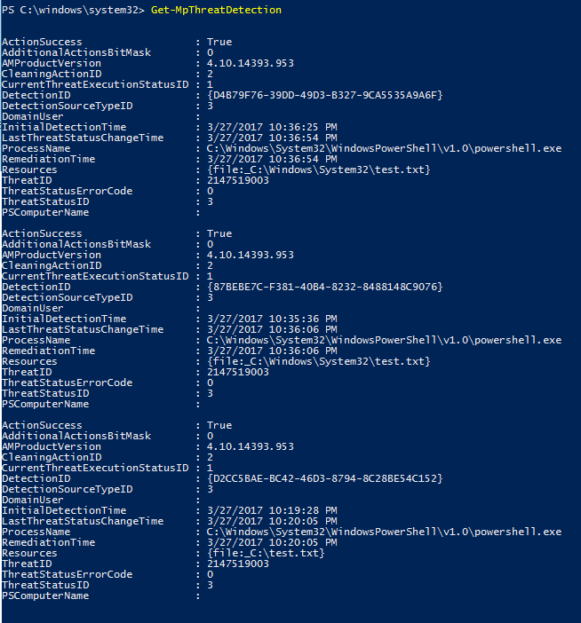

# <a name="review-microsoft-defender-antivirus-scan-results"></a>Revisar los resultados del examen del Antivirus de Microsoft Defender

[!INCLUDE [Microsoft 365 Defender rebranding](../../includes/microsoft-defender.md)]


**Se aplica a:**

- [Microsoft Defender para punto de conexión](/microsoft-365/security/defender-endpoint/)

Una vez completado el examen de Antivirus [](run-scan-microsoft-defender-antivirus.md) de Microsoft Defender, tanto si se trata de un examen a petición como [programado,](scheduled-catch-up-scans-microsoft-defender-antivirus.md)los resultados se registran y puede ver los resultados. 


## <a name="use-configuration-manager-to-review-scan-results"></a>Usar Configuration Manager para revisar los resultados del examen

Consulte [How to monitor Endpoint Protection status](/configmgr/protect/deploy-use/monitor-endpoint-protection).

## <a name="use-powershell-cmdlets-to-review-scan-results"></a>Usar cmdlets de PowerShell para revisar los resultados del examen

El siguiente cmdlet devolverá cada detección en el extremo. Si hay varias detecciones de la misma amenaza, cada detección se enumerará por separado, en función del tiempo de cada detección:

```PowerShell
Get-MpThreatDetection
```



Puede especificar limitar `-ThreatID` el resultado para mostrar solo las detecciones de una amenaza específica.

Si desea enumerar las detecciones de amenazas, pero combinar las detecciones de la misma amenaza en un solo elemento, puede usar el siguiente cmdlet:

```PowerShell
Get-MpThreat
```


Consulte [Use PowerShell cmdlets to configure and run Microsoft Defender Antivirus](use-powershell-cmdlets-microsoft-defender-antivirus.md) and Defender [cmdlets](/powershell/module/defender/) para obtener más información sobre cómo usar PowerShell con Microsoft Defender Antivirus.

## <a name="use-windows-management-instruction-wmi-to-review-scan-results"></a>Usar Windows Management Instruction (WMI) para revisar los resultados del examen

Use el [ **método Get** de las **MSFT_MpThreat** y **MSFT_MpThreatDetection**](/previous-versions/windows/desktop/defender/windows-defender-wmiv2-apis-portal) clases.


## <a name="related-articles"></a>Artículos relacionados

- [Personalizar, iniciar y revisar los resultados de los exámenes y la corrección del Antivirus de Microsoft Defender](customize-run-review-remediate-scans-microsoft-defender-antivirus.md)
- [Antivirus de Microsoft Defender en Windows 10](microsoft-defender-antivirus-in-windows-10.md)