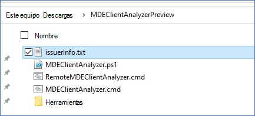

# <a name="run-the-client-analyzer-on-windows"></a>Ejecutar el analizador de cliente en Windows

**Se aplica a:**
- [Microsoft Defender para punto de conexión](https://go.microsoft.com/fwlink/p/?linkid=2146631)


1. Descargue la [herramienta MDE Client Analyzer](https://aka.ms/mdatpanalyzer) en la Windows que necesita investigar.

2. Extraiga el contenido de MDEClientAnalyzer.zip en el equipo.

3. Abra un símbolo del sistema con privilegios elevados:
    1. Vaya a **Inicio** y escriba **cmd**.
    2. Haga clic derecho en **Símbolo del sistema** y seleccione **Ejecutar como administrador**.

4. Escriba el siguiente comando y presione **Entrar**:

   ```dos
   HardDrivePath\MDEClientAnalyzer.cmd
   ```

   **Reemplace HardDrivePath por la ruta de acceso a la que se extrajo la herramienta, por ejemplo:**

   ```dos
   C:\Work\tools\MDATPClientAnalyzer\MDEClientAnalyzer.cmd
   ```

Además de lo anterior, también hay una opción para recopilar los registros de soporte técnico del analizador [mediante la respuesta en directo.](troubleshoot-collect-support-log.md).

> [!NOTE]
> En Windows 10, Windows Server 2019 o versiones posteriores del sistema operativo, o Windows 11, el script del analizador de cliente llama a un archivo ejecutable llamado para ejecutar las pruebas de conectividad a las direcciones URL del servicio en la `MDEClientAnalyzer.exe` nube.
>
> En Windows 8.1, Windows Server 2016 o ediciones anteriores del sistema operativo, el script del analizador de cliente llama a un archivo ejecutable llamado para ejecutar pruebas de conectividad para las direcciones URL de comando y control (CnC), al tiempo que llama Microsoft Monitoring Agent una herramienta de conectividad Microsoft Monitoring Agent las direcciones URL del canal de datos `MDEClientAnalyzerPreviousVersion.exe` `TestCloudConnection.exe` cibernéticos.


Todos los scripts y módulos de PowerShell incluidos en el analizador están firmados por Microsoft.
Si los archivos se han modificado de alguna manera, se espera que el analizador salga con el siguiente error:


Si se muestra este error, el issuerInfo.txt de datos contendrá información detallada sobre por qué ocurrió y qué archivo se afectó:




Contenido de ejemplo después MDEClientAnalyzer.ps1 se modifica:


## <a name="result-package-contents-on-windows"></a>Contenido del paquete de resultados Windows

> [!NOTE]
> Los archivos exactos capturados pueden cambiar en función de factores como:
>
> - La versión de las ventanas en las que se ejecuta el analizador.
> - Disponibilidad del canal de registro de eventos en el equipo.
> - El estado de inicio del sensor EDR (Sense se detiene si la máquina aún no está incorporada).
> - Si se usó un parámetro de solución de problemas avanzado con el comando analyzer.

De forma predeterminada, el archivo MDEClientAnalyzerResult.zip descomprimido contendrá los siguientes elementos.

- MDEClientAnalyzer.htm

  Este es el archivo de salida HTML principal, que contendrá los resultados y las instrucciones que puede producir el script del analizador en la máquina.

- Carpeta SystemInfoLogs \[\]
  - AddRemovePrograms.csv

    Descripción: lista del software instalado x86 en el software del sistema operativo x64 recopilado del Registro.

  - AddRemoveProgramsWOW64.csv

    Descripción: lista del software instalado x86 en el software del sistema operativo x64 recopilado del Registro.

    - CertValidate.log

      Descripción: resultado detallado de la revocación de certificado ejecutada llamando a [CertUtil](/windows-server/administration/windows-commands/certutil).

    - dsregcmd.txt

      Descripción: Salida de la ejecución [de dsregcmd](/azure/active-directory/devices/troubleshoot-device-dsregcmd). Esto proporciona detalles sobre el Azure AD estado de la máquina.

    - IFEO.txt

      Descripción: salida de las [opciones de ejecución de archivos de imagen](/previous-versions/windows/desktop/xperf/image-file-execution-options) configuradas en el equipo

    - MDEClientAnalyzer.txt

      Descripción: se trata de un archivo de texto detallado que muestra los detalles de la ejecución del script del analizador.

    - MDEClientAnalyzer.xml

      Descripción: formato XML que contiene los resultados del script del analizador.

    - RegOnboardedInfoCurrent.Json

      Descripción: la información del equipo incorporado recopilada en formato JSON del Registro.

  - RegOnboardingInfoPolicy.Json

    Descripción: la configuración de directiva de incorporación recopilada en formato JSON del Registro.

    - SCHANNEL.txt

      Descripción: detalles sobre la [configuración de SCHANNEL](/windows-server/security/tls/manage-tls) aplicada a la máquina, tal como se recopila desde el Registro.

    - SessionManager.txt

      Descripción: la configuración específica del Administrador de sesiones se recopila desde el Registro.

    - SSL_00010002.txt

      Descripción: detalles sobre la [configuración SSL](/windows-server/security/tls/manage-tls) aplicada a la máquina recopilada desde el Registro.

- EventLogs [Folder]

  - utc.evtx

    Descripción: Exportación del registro de eventos de DiagTrack

  - senseIR.evtx

    Descripción: exportación del registro de eventos de investigación automatizada

  - sense.evtx

    Descripción: Exportación del registro de eventos principales del sensor

  - OperationsManager.evtx

    Descripción: exportación del registro Microsoft Monitoring Agent de eventos


## <a name="see-also"></a>Consulte también

- [Información general del Analizador de clientes](overview-client-analyzer.md)
- [Descargar y ejecutar el Analizador de clientes](download-client-analyzer.md)
- [ Recopilación de datos para solucionar problemas avanzados en Windows](data-collection-analyzer.md)
- [Comprender el informe HTML del analizador](analyzer-report.md)
