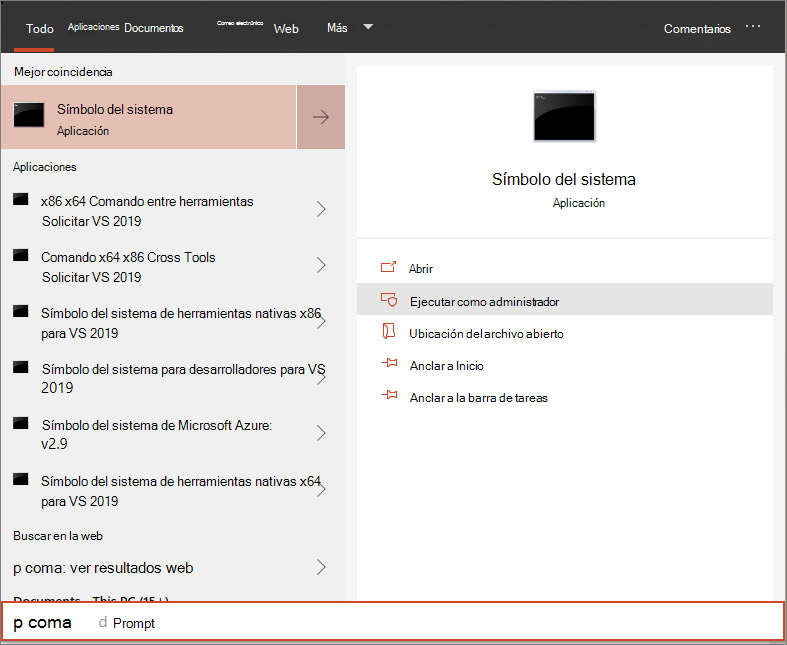

# <a name="run-a-detection-test-on-a-newly-onboarded-microsoft-defender-for-endpoint-device"></a><span data-ttu-id="0d48d-104">Ejecutar una prueba de detección en un dispositivo de Microsoft Defender para endpoint recién incorporado</span><span class="sxs-lookup"><span data-stu-id="0d48d-104">Run a detection test on a newly onboarded Microsoft Defender for Endpoint device</span></span> 

[!INCLUDE [Microsoft 365 Defender rebranding](../../includes/microsoft-defender.md)]


<span data-ttu-id="0d48d-105">**Se aplica a:**</span><span class="sxs-lookup"><span data-stu-id="0d48d-105">**Applies to:**</span></span>
- <span data-ttu-id="0d48d-106">Versiones Windows 10 compatibles</span><span class="sxs-lookup"><span data-stu-id="0d48d-106">Supported Windows 10 versions</span></span>
- <span data-ttu-id="0d48d-107">Windows Server 2012 R2</span><span class="sxs-lookup"><span data-stu-id="0d48d-107">Windows Server 2012 R2</span></span>
- <span data-ttu-id="0d48d-108">Windows Server 2016</span><span class="sxs-lookup"><span data-stu-id="0d48d-108">Windows Server 2016</span></span>
- <span data-ttu-id="0d48d-109">Windows Servidor, versión 1803</span><span class="sxs-lookup"><span data-stu-id="0d48d-109">Windows Server, version 1803</span></span>
- <span data-ttu-id="0d48d-110">Windows Server, 2019</span><span class="sxs-lookup"><span data-stu-id="0d48d-110">Windows Server, 2019</span></span>
- [<span data-ttu-id="0d48d-111">Microsoft Defender para punto de conexión</span><span class="sxs-lookup"><span data-stu-id="0d48d-111">Microsoft Defender for Endpoint</span></span>](https://go.microsoft.com/fwlink/?linkid=2154037)
- [<span data-ttu-id="0d48d-112">Microsoft 365 Defender</span><span class="sxs-lookup"><span data-stu-id="0d48d-112">Microsoft 365 Defender</span></span>](https://go.microsoft.com/fwlink/?linkid=2118804)

> <span data-ttu-id="0d48d-113">¿Desea experimentar Microsoft Defender para endpoint?</span><span class="sxs-lookup"><span data-stu-id="0d48d-113">Want to experience Microsoft Defender for Endpoint?</span></span> [<span data-ttu-id="0d48d-114">Regístrate para obtener una versión de prueba gratuita.</span><span class="sxs-lookup"><span data-stu-id="0d48d-114">Sign up for a free trial.</span></span>](https://www.microsoft.com/microsoft-365/windows/microsoft-defender-atp?ocid=docs-wdatp-exposedapis-abovefoldlink)

<span data-ttu-id="0d48d-115">Ejecute el siguiente script de PowerShell en un dispositivo recién incorporado para comprobar que está informando correctamente al servicio Defender for Endpoint.</span><span class="sxs-lookup"><span data-stu-id="0d48d-115">Run the following PowerShell script on a newly onboarded device to verify that it is properly reporting to the Defender for Endpoint service.</span></span>

1. <span data-ttu-id="0d48d-116">Cree una carpeta: 'C:\test-MDATP-test'.</span><span class="sxs-lookup"><span data-stu-id="0d48d-116">Create a folder:  'C:\test-MDATP-test'.</span></span>
2. <span data-ttu-id="0d48d-117">Abra un símbolo del sistema con privilegios elevados en el dispositivo y ejecute el script:</span><span class="sxs-lookup"><span data-stu-id="0d48d-117">Open an elevated command-line prompt on the device and run the script:</span></span>

   1. <span data-ttu-id="0d48d-118">Vaya a **Inicio** y escriba **cmd**.</span><span class="sxs-lookup"><span data-stu-id="0d48d-118">Go to **Start** and type **cmd**.</span></span>

   1. <span data-ttu-id="0d48d-119">Haga clic con el **botón secundario en Símbolo del sistema** y seleccione Ejecutar como **administrador**.</span><span class="sxs-lookup"><span data-stu-id="0d48d-119">Right-click **Command Prompt** and select **Run as administrator**.</span></span>

      

3. <span data-ttu-id="0d48d-121">En el símbolo del sistema, copie y ejecute el siguiente comando:</span><span class="sxs-lookup"><span data-stu-id="0d48d-121">At the prompt, copy and run the following command:</span></span>

   ```powershell
   powershell.exe -NoExit -ExecutionPolicy Bypass -WindowStyle Hidden $ErrorActionPreference = 'silentlycontinue';(New-Object System.Net.WebClient).DownloadFile('http://127.0.0.1/1.exe', 'C:\\test-MDATP-test\\invoice.exe');Start-Process 'C:\\test-MDATP-test\\invoice.exe'
   ```

<span data-ttu-id="0d48d-122">La ventana símbolo del sistema se cerrará automáticamente.</span><span class="sxs-lookup"><span data-stu-id="0d48d-122">The Command Prompt window will close automatically.</span></span> <span data-ttu-id="0d48d-123">Si se realiza correctamente, la prueba de detección se marcará como completada y aparecerá una nueva alerta en el portal del dispositivo incorporado en aproximadamente 10 minutos.</span><span class="sxs-lookup"><span data-stu-id="0d48d-123">If successful, the detection test will be marked as completed and a new alert will appear in the portal for the onboarded device in approximately 10 minutes.</span></span>

## <a name="related-topics"></a><span data-ttu-id="0d48d-124">Temas relacionados</span><span class="sxs-lookup"><span data-stu-id="0d48d-124">Related topics</span></span>
- [<span data-ttu-id="0d48d-125">Incorporar dispositivos Windows 10 mediante la directiva de grupo</span><span class="sxs-lookup"><span data-stu-id="0d48d-125">Onboard Windows 10 devices</span></span>](configure-endpoints.md)
- [<span data-ttu-id="0d48d-126">Servidores integrados</span><span class="sxs-lookup"><span data-stu-id="0d48d-126">Onboard servers</span></span>](configure-server-endpoints.md)
- [<span data-ttu-id="0d48d-127">Solucionar problemas de incorporación de puntos de conexión de Microsoft Defender</span><span class="sxs-lookup"><span data-stu-id="0d48d-127">Troubleshoot Microsoft Defender for Endpoint onboarding issues</span></span>](https://docs.microsoft.com/microsoft-365/security/defender-endpoint/troubleshoot-onboarding)
