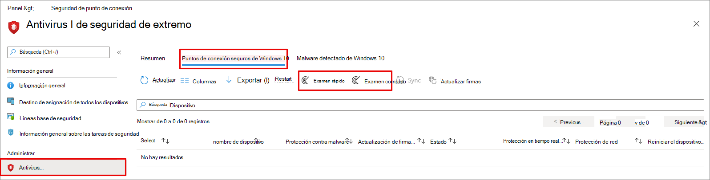

# <a name="configure-and-run-on-demand-microsoft-defender-antivirus-scans"></a>Configurar y ejecutar análisis bajo petición en el Antivirus de Microsoft Defender

**Se aplica a:**

- [Microsoft Defender para punto de conexión](/microsoft-365/security/defender-endpoint/)

Puede ejecutar un examen a petición en puntos de conexión individuales. Estos exámenes se iniciarán inmediatamente y puede definir parámetros para el examen, como la ubicación o el tipo.

## <a name="quick-scan-versus-full-scan"></a>Examen rápido frente a examen completo

El examen rápido examina todas las ubicaciones en las que podría haber malware registrado para empezar con el sistema, como las claves del Registro y las carpetas de inicio Windows de inicio.

> [!IMPORTANT]
> Antivirus de Microsoft Defender se ejecuta en el contexto de la cuenta [LocalSystem](/windows/win32/services/localsystem-account) al realizar un examen local. Para los exámenes de red, usa el contexto de la cuenta del dispositivo. Si la cuenta de dispositivo de dominio no tiene los permisos adecuados para acceder al recurso compartido, el examen no funcionará. Asegúrese de que el dispositivo tiene permisos para el recurso compartido de red de acceso.

Combinado con [la funcionalidad de protección](configure-real-time-protection-microsoft-defender-antivirus.md)en tiempo real siempre activa, un examen rápido ayuda a proporcionar una cobertura sólida tanto para malware que comienza con el malware del sistema como del nivel de kernel. La protección siempre activa y en tiempo real revisa los archivos cuando se abren y cierran, y siempre que un usuario navega a una carpeta. De forma predeterminada, los exámenes rápidos se ejecutan en dispositivos extraíbles montados, como unidades USB. En la mayoría de los casos, un examen rápido es adecuado para encontrar malware que no fue recogido por la protección en tiempo real.

Un examen completo puede ser útil cuando se notifica una amenaza de malware en un punto de conexión. El examen puede identificar si hay componentes inactivos que requieren una limpieza más exhaustiva. Sin embargo, Microsoft suele recomendar el uso de exámenes rápidos en lugar de exámenes completos. Un examen completo puede tardar unas horas o días en completarse, según la cantidad y el tipo de datos que se deben examinar. 

> [!TIP]
> Para obtener más información sobre las diferencias entre los exámenes rápidos y los exámenes [completos, vea Examen rápido frente al examen completo y el examen personalizado.](scheduled-catch-up-scans-microsoft-defender-antivirus.md#quick-scan-versus-full-scan-and-custom-scan)

## <a name="use-microsoft-endpoint-manager-to-run-a-scan"></a>Usar Microsoft Endpoint Manager para ejecutar un examen

1. Vaya al Centro Microsoft Endpoint Manager administración ( [https://endpoint.microsoft.com](https://endpoint.microsoft.com) ) e inicie sesión.
2. Elija **Endpoint security**  >  **Antivirus**.
3. En la lista de pestañas, **seleccione Windows 10 extremos en mal estado.**
4. En la lista de acciones proporcionadas, seleccione **Examen rápido** o **Examen completo.**

[](images/mem-antivirus-scan-on-demand.png#lightbox)

> [!TIP]
> Para obtener más información acerca del Microsoft Endpoint Manager para ejecutar un examen, vea [Antimalware and firewall tasks: How to perform an on-demand scan](/configmgr/protect/deploy-use/endpoint-antimalware-firewall#how-to-perform-an-on-demand-scan-of-computers).

## <a name="use-the-mpcmdrunexe-command-line-utility-to-run-a-scan"></a>Usar la utilidad mpcmdrun.exe línea de comandos para ejecutar un examen

Use el parámetro `-scan` siguiente:

```console
mpcmdrun.exe -scan -scantype 1
```

Para obtener más información acerca de cómo usar la herramienta y los parámetros adicionales, incluido el inicio de un examen completo o la definición de rutas de acceso, vea Usar la herramienta de línea de comandos mpcmdrun.exe para configurar y administrar [Antivirus de Microsoft Defender](command-line-arguments-microsoft-defender-antivirus.md).

## <a name="use-microsoft-intune-to-run-a-scan"></a>Usar Microsoft Intune para ejecutar un examen

1. Vaya al Centro Microsoft Endpoint Manager administración ( [https://endpoint.microsoft.com](https://endpoint.microsoft.com) ) e inicie sesión.
2. En la barra lateral, selecciona **Dispositivos > Todos** los dispositivos y elige el dispositivo que quieras examinar.
3. Seleccione **... Más**. En las opciones, seleccione **Examen rápido** o **Examen completo**.

## <a name="use-the-windows-security-app-to-run-a-scan"></a>Usar la Seguridad de Windows para ejecutar un examen

Consulta [Ejecutar un examen en la aplicación Seguridad de Windows para](microsoft-defender-security-center-antivirus.md) obtener instrucciones sobre cómo ejecutar un examen en puntos de conexión individuales.

## <a name="use-powershell-cmdlets-to-run-a-scan"></a>Usar cmdlets de PowerShell para ejecutar un examen

Use el siguiente cmdlet:

```PowerShell
Start-MpScan
```

Para obtener más información sobre cómo usar PowerShell con Antivirus de Microsoft Defender, vea [Use PowerShell cmdlets to configure and run Antivirus de Microsoft Defender](use-powershell-cmdlets-microsoft-defender-antivirus.md) and Defender [cmdlets](/powershell/module/defender/).

## <a name="use-windows-management-instruction-wmi-to-run-a-scan"></a>Usar Windows de administración de documentos (WMI) para ejecutar un examen

Use el [ **método Start**](/previous-versions/windows/desktop/defender/start-msft-mpscan) de la **MSFT_MpScan** clase.

Para obtener más información acerca de los parámetros permitidos, [vea Windows Defender API de WMIv2](/previous-versions/windows/desktop/defender/windows-defender-wmiv2-apis-portal)

## <a name="related-articles"></a>Artículos relacionados

- [Configurar opciones de análisis del Antivirus de Microsoft Defender](configure-advanced-scan-types-microsoft-defender-antivirus.md)
- [Configurar exámenes Antivirus de Microsoft Defender programados](scheduled-catch-up-scans-microsoft-defender-antivirus.md)
- [Antivirus de Microsoft Defender en Windows 10](microsoft-defender-antivirus-in-windows-10.md)