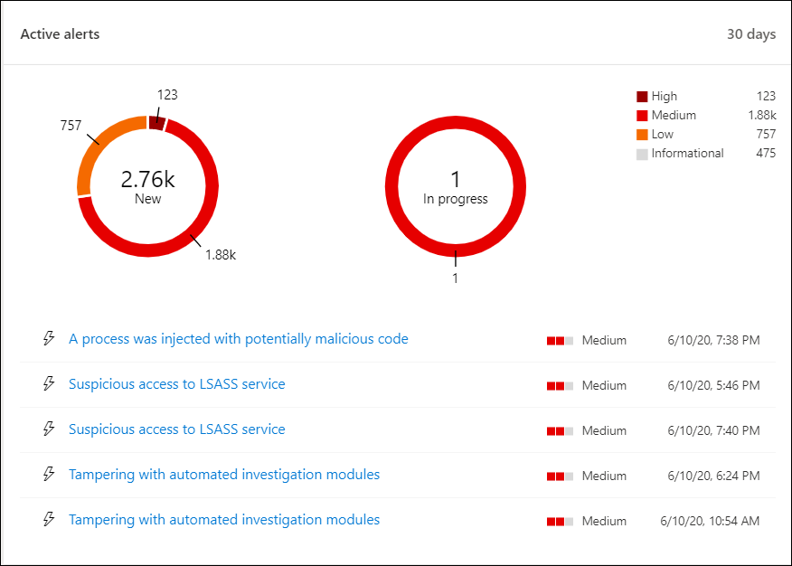

# Panel de operaciones de seguridad del Centro de seguridad de Microsoft DefenderMicrosoft Defender Security Center Security operations dashboard

[!INCLUDE [Microsoft 365 Defender rebranding](../../includes/microsoft-defender.md)]

**Se aplica a:****Applies to:**
- [Microsoft Defender para punto de conexiónMicrosoft Defender for Endpoint](https://go.microsoft.com/fwlink/?linkid=2154037)

>¿Desea experimentar Microsoft Defender para endpoint?Want to experience Microsoft Defender for Endpoint? [Regístrate para obtener una versión de prueba gratuita.Sign up for a free trial.](https://www.microsoft.com/microsoft-365/windows/microsoft-defender-atp?ocid=docs-wdatp-secopsdashboard-abovefoldlink) 

El **panel de operaciones de seguridad** es donde se muestra la detección de puntos de conexión y las capacidades de respuesta.The **Security operations dashboard** is where the endpoint detection and response capabilities are surfaced. Proporciona una introducción de alto nivel de dónde se han visto las detecciones y resalta dónde se necesitan acciones de respuesta.It provides a high level overview of where detections were seen and highlights where response actions are needed. 

El panel muestra una instantánea de:The dashboard displays a snapshot of:

- Alertas activasActive alerts
- Dispositivos en riesgoDevices at risk
- Estado del sensorSensor health
- Estado del servicioService health
- Informes de dispositivos diariosDaily devices reporting
- Investigaciones automatizadas activasActive automated investigations
- Estadísticas de investigaciones automatizadasAutomated investigations statistics
- Usuarios en riesgoUsers at risk
- Actividades sospechosasSuspicious activities

Puedes explorar e investigar alertas y dispositivos para determinar rápidamente si, dónde y cuándo se produjeron actividades sospechosas en la red para ayudarte a comprender el contexto en el que aparecieron.You can explore and investigate alerts and devices to quickly determine if, where, and when suspicious activities occurred in your network to help you understand the context they appeared in.

Desde el **panel de operaciones de** seguridad verás eventos agregados para facilitar la identificación de eventos o comportamientos significativos en un dispositivo.From the **Security operations dashboard** you will see aggregated events to facilitate the identification of significant events or behaviors on a device. También puede profundizar en eventos granulares e indicadores de bajo nivel.You can also drill down into granular events and low-level indicators.

También tiene iconos en los que se puede hacer clic que dan indicaciones visuales sobre el estado general de mantenimiento de la organización.It also has clickable tiles that give visual cues on the overall health state of your organization. Cada icono abre una vista detallada de la información general correspondiente.Each tile opens a detailed view of the corresponding overview.

## Alertas activasActive alerts
Puede ver el número total de alertas activas de los últimos 30 días en la red desde el icono.You can view the overall number of active alerts from the last 30 days in your network from the tile. Las alertas se agrupan **en Nuevo** y **En curso.**Alerts are grouped into **New** and **In progress**.

Cada grupo se subcategorizó aún más en sus niveles de gravedad de alerta correspondientes.Each group is further sub-categorized into their corresponding alert severity levels. Haga clic en el número de alertas dentro de cada anillo de alerta para ver una vista ordenada de la cola de esa categoría (**Nuevo** **o En curso**).Click the number of alerts inside each alert ring to see a sorted view of that category's queue (**New** or **In progress**).

Para obtener más información, vea [Alerts overview](alerts-queue.md).For more information see, [Alerts overview](alerts-queue.md).

Cada fila incluye una categoría de gravedad de alerta y una breve descripción de la alerta.Each row includes an alert severity category and a short description of the alert. Puede hacer clic en una alerta para ver su vista detallada.You can click an alert to see its detailed view. Para obtener más información, vea  [Investigate Microsoft Defender for Endpoint alerts](investigate-alerts.md) and Alerts [overview](alerts-queue.md).For more information see,  [Investigate Microsoft Defender for Endpoint alerts](investigate-alerts.md) and [Alerts overview](alerts-queue.md).

## Dispositivos en riesgoDevices at risk
Este icono muestra una lista de dispositivos con el mayor número de alertas activas.This tile shows you a list of devices with the highest number of active alerts. El número total de alertas para cada dispositivo se muestra en un círculo junto al nombre del dispositivo y, a continuación, se clasifica por niveles de gravedad en el extremo del icono (mantenga el puntero sobre cada barra de gravedad para ver su etiqueta).The total number of alerts for each device is shown in a circle next to the device name, and then further categorized by severity levels at the far end of the tile (hover over each severity bar to see its label).

Haz clic en el nombre del dispositivo para ver detalles sobre ese dispositivo.Click the name of the device to see details about that device. Para obtener más información, vea [Investigar dispositivos en la lista Microsoft Defender para dispositivos de punto de conexión](investigate-machines.md).For more information see, [Investigate devices in the Microsoft Defender for Endpoint Devices list](investigate-machines.md).

También puedes hacer clic en **Lista de** dispositivos en la parte superior del icono para ir directamente a la lista Dispositivos, ordenada por el número de alertas activas. You can also click **Devices list** at the top of the tile to go directly to the **Devices list**, sorted by the number of active alerts. Para obtener más información, vea [Investigar dispositivos en la lista Microsoft Defender para dispositivos de punto de conexión](investigate-machines.md).For more information see, [Investigate devices in the Microsoft Defender for Endpoint Devices list](investigate-machines.md).

## Dispositivos con problemas de sensorDevices with sensor issues
El **icono Dispositivos con** problemas de sensor proporciona información sobre la capacidad del dispositivo individual para proporcionar datos del sensor al servicio de Microsoft Defender para puntos de conexión.The **Devices with sensor issues** tile provides information on the individual device’s ability to provide sensor data to the Microsoft Defender for Endpoint service. Informa de cuántos dispositivos requieren atención y le ayuda a identificar dispositivos problemáticos.It reports how many devices require attention and helps you identify problematic devices.

Hay dos indicadores de estado que proporcionan información sobre el número de dispositivos que no están informando correctamente al servicio:There are two status indicators that provide information on the number of devices that are not reporting properly to the service:
- **Mal configurados:** estos dispositivos podrían estar informando parcialmente los datos del sensor al servicio de Microsoft Defender para endpoints y podrían tener errores de configuración que deben corregirse.**Misconfigured** – These devices might partially be reporting sensor data to the Microsoft Defender for Endpoint service and might have configuration errors that need to be corrected.
- **Inactivo:** dispositivos que han dejado de informar al servicio Microsoft Defender para endpoints durante más de siete días en el último mes.**Inactive** - Devices that have stopped reporting to the Microsoft Defender for Endpoint service for more than seven days in the past month.

Cuando hagas clic en cualquiera de los grupos, se te dirigirá a la lista de dispositivos, filtrada según tu elección.When you click any of the groups, you’ll be directed to devices list, filtered according to your choice. Para obtener más información, vea Comprobar el [estado del sensor](check-sensor-status.md) e Investigar [dispositivos](investigate-machines.md).For more information, see [Check sensor state](check-sensor-status.md) and [Investigate devices](investigate-machines.md).

## Estado del servicioService health
El **icono Estado** del servicio le informa si el servicio está activo o si hay problemas.The **Service health** tile informs you if the service is active or if there are issues.

Para obtener más información sobre el estado del servicio, vea [Check the Microsoft Defender for Endpoint service health](service-status.md).For more information on the service health, see [Check the Microsoft Defender for Endpoint service health](service-status.md).

## Informes de dispositivos diariosDaily devices reporting
El **icono Informes de dispositivos** diarios muestra un gráfico de barras que representa el número de dispositivos que informan diariamente en los últimos 30 días.The **Daily devices reporting** tile shows a bar graph that represents the number of devices reporting daily in the last 30 days. Mantenga el mouse sobre barras individuales en el gráfico para ver el número exacto de dispositivos que se informan en cada día.Hover over individual bars on the graph to see the exact number of devices reporting in each day.

## Investigaciones automatizadas activasActive automated investigations
Puede ver el número total de investigaciones automatizadas de los últimos 30 días en la red desde el icono **Investigaciones automatizadas activas.**You can view the overall number of automated investigations from the last 30 days in your network from the **Active automated investigations** tile. Las investigaciones se agrupan en **Pending action**, **Waiting for device** y **Running**.Investigations are grouped into **Pending action**, **Waiting for device**, and **Running**.

## Estadísticas de investigaciones automatizadasAutomated investigations statistics
Este icono muestra estadísticas relacionadas con investigaciones automatizadas en los últimos siete días.This tile shows statistics related to automated investigations in the last seven days. Muestra el número de investigaciones completadas, el número de investigaciones correctamente subsanadas, el promedio de tiempo pendiente que tarda en iniciarse una investigación, el tiempo promedio que se tarda en corregir una alerta, el número de alertas investigadas y el número de horas de automatización guardadas de una investigación manual típica.It shows the number of investigations completed, the number of successfully remediated investigations, the average pending time it takes for an investigation to be initiated, the average time it takes to remediate an alert, the number of alerts investigated, and the number of hours of automation saved from a typical manual investigation. 

Puede hacer clic en **Investigaciones automatizadas,** Investigaciones **subsanadas** y Alertas investigadas para navegar a la página **Investigaciones,** filtrada por la categoría correspondiente. You can click on **Automated investigations**, **Remediated investigations**, and **Alerts investigated** to navigate to the **Investigations** page, filtered by the appropriate category. Esto le permite ver un desglose detallado de las investigaciones en contexto.This lets you see a detailed breakdown of investigations in context.

## Usuarios en riesgoUsers at risk
El icono muestra una lista de cuentas de usuario con las alertas más activas y el número de alertas vistas en alertas altas, medianas o bajas.The tile shows you a list of user accounts with the most active alerts and the number of alerts seen on high, medium, or low alerts. 

Haga clic en la cuenta de usuario para ver detalles sobre la cuenta de usuario.Click the user account to see details about the user account. Para obtener más información, [vea Investigar una cuenta de usuario](investigate-user.md).For more information see [Investigate a user account](investigate-user.md).

>¿Desea experimentar Microsoft Defender para endpoint?Want to experience Microsoft Defender for Endpoint? [Regístrate para obtener una versión de prueba gratuita.Sign up for a free trial.](https://www.microsoft.com/microsoft-365/windows/microsoft-defender-atp?ocid=docs-wdatp-secopsdashboard-belowfoldlink)

## Temas relacionadosRelated topics
- [Comprender el portal de Microsoft Defender para puntos de conexiónUnderstand the Microsoft Defender for Endpoint portal](use.md)
- [Introducción al portalPortal overview](portal-overview.md)
- [Ver el panel de administración & vulnerabilidadesView the Threat & Vulnerability Management dashboard](tvm-dashboard-insights.md)
- [Ver el panel análisis de amenazas y realizar acciones de mitigación recomendadasView the Threat analytics dashboard and take recommended mitigation actions](threat-analytics.md)
