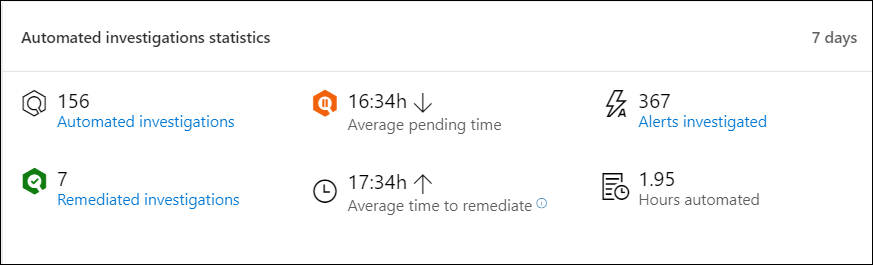

# Centro de seguridad de Microsoft Defender Panel de operaciones de seguridad

[!INCLUDE [Microsoft 365 Defender rebranding](../../includes/microsoft-defender.md)]

**Se aplica a:**
- [Microsoft Defender para punto de conexión](https://go.microsoft.com/fwlink/?linkid=2154037)

>¿Desea experimentar Microsoft Defender para endpoint? [Regístrate para obtener una versión de prueba gratuita.](https://www.microsoft.com/microsoft-365/windows/microsoft-defender-atp?ocid=docs-wdatp-secopsdashboard-abovefoldlink) 

El **panel de operaciones de seguridad** es donde se detección y respuesta de puntos de conexión funcionalidades. Proporciona una introducción de alto nivel de dónde se han visto las detecciones y resalta dónde se necesitan acciones de respuesta. 

El panel muestra una instantánea de:

- Alertas activas
- Dispositivos en riesgo
- Estado del sensor
- Estado del servicio
- Informes de dispositivos diarios
- Investigaciones automatizadas activas
- Estadísticas de investigaciones automatizadas
- Usuarios en riesgo
- Actividades sospechosas

Puedes explorar e investigar alertas y dispositivos para determinar rápidamente si, dónde y cuándo se produjeron actividades sospechosas en la red para ayudarte a comprender el contexto en el que aparecieron.

Desde el **panel de operaciones de** seguridad verás eventos agregados para facilitar la identificación de eventos o comportamientos significativos en un dispositivo. También puede profundizar en eventos granulares e indicadores de bajo nivel.

También tiene iconos en los que se puede hacer clic que dan indicaciones visuales sobre el estado general de mantenimiento de la organización. Cada icono abre una vista detallada de la información general correspondiente.

## Alertas activas
Puede ver el número total de alertas activas de los últimos 30 días en la red desde el icono. Las alertas se agrupan **en Nuevo** y **En curso.**

Cada grupo se subcategorizó aún más en sus niveles de gravedad de alerta correspondientes. Haga clic en el número de alertas dentro de cada anillo de alerta para ver una vista ordenada de la cola de esa categoría (**Nuevo** **o En curso**).

Para obtener más información, vea [Alerts overview](alerts-queue.md).

Cada fila incluye una categoría de gravedad de alerta y una breve descripción de la alerta. Puede hacer clic en una alerta para ver su vista detallada. Para obtener más información, vea  [Investigate Microsoft Defender for Endpoint alerts](investigate-alerts.md) and Alerts [overview](alerts-queue.md).

## Dispositivos en riesgo
Este icono muestra una lista de dispositivos con el mayor número de alertas activas. El número total de alertas para cada dispositivo se muestra en un círculo junto al nombre del dispositivo y, a continuación, se clasifica por niveles de gravedad en el extremo del icono (mantenga el puntero sobre cada barra de gravedad para ver su etiqueta).

Haz clic en el nombre del dispositivo para ver detalles sobre ese dispositivo. Para obtener más información, vea [Investigar dispositivos en la lista Microsoft Defender para dispositivos de punto de conexión](investigate-machines.md).

También puedes hacer clic en **Lista de** dispositivos en la parte superior del icono para ir directamente a la lista Dispositivos, ordenada por el número de alertas activas.  Para obtener más información, vea [Investigar dispositivos en la lista Microsoft Defender para dispositivos de punto de conexión](investigate-machines.md).

## Dispositivos con problemas de sensor
El **icono Dispositivos con** problemas de sensor proporciona información sobre la capacidad del dispositivo individual para proporcionar datos del sensor al servicio de Microsoft Defender para puntos de conexión. Informa de cuántos dispositivos requieren atención y le ayuda a identificar dispositivos problemáticos.

Hay dos indicadores de estado que proporcionan información sobre el número de dispositivos que no están informando correctamente al servicio:
- **Mal configurados:** estos dispositivos podrían estar informando parcialmente los datos del sensor al servicio de Microsoft Defender para endpoints y podrían tener errores de configuración que deben corregirse.
- **Inactivo:** dispositivos que han dejado de informar al servicio Microsoft Defender para endpoints durante más de siete días en el último mes.

Cuando hagas clic en cualquiera de los grupos, se te dirigirá a la lista de dispositivos, filtrada según tu elección. Para obtener más información, vea Comprobar el [estado del sensor](check-sensor-status.md) e Investigar [dispositivos](investigate-machines.md).

## Estado del servicio
El **icono Estado** del servicio le informa si el servicio está activo o si hay problemas.

Para obtener más información sobre el estado del servicio, vea [Check the Microsoft Defender for Endpoint service health](service-status.md).

## Informes de dispositivos diarios
El **icono Informes de dispositivos** diarios muestra un gráfico de barras que representa el número de dispositivos que informan diariamente en los últimos 30 días. Mantenga el mouse sobre barras individuales en el gráfico para ver el número exacto de dispositivos que se informan en cada día.

## Investigaciones automatizadas activas
Puede ver el número total de investigaciones automatizadas de los últimos 30 días en la red desde el icono **Investigaciones automatizadas activas.** Las investigaciones se agrupan en **Pending action**, **Waiting for device** y **Running**.

## Estadísticas de investigaciones automatizadas
Este icono muestra estadísticas relacionadas con investigaciones automatizadas en los últimos siete días. Muestra el número de investigaciones completadas, el número de investigaciones correctamente subsanadas, el promedio de tiempo pendiente que tarda en iniciarse una investigación, el tiempo promedio que se tarda en corregir una alerta, el número de alertas investigadas y el número de horas de automatización guardadas de una investigación manual típica. 

Puede hacer clic en **Investigaciones automatizadas,** Investigaciones **subsanadas** y Alertas investigadas para navegar a la página **Investigaciones,** filtrada por la categoría correspondiente.  Esto le permite ver un desglose detallado de las investigaciones en contexto.

## Usuarios en riesgo
El icono muestra una lista de cuentas de usuario con las alertas más activas y el número de alertas vistas en alertas altas, medianas o bajas. 

Haga clic en la cuenta de usuario para ver detalles sobre la cuenta de usuario. Para obtener más información, [vea Investigar una cuenta de usuario](investigate-user.md).

>¿Desea experimentar Microsoft Defender para endpoint? [Regístrate para obtener una versión de prueba gratuita.](https://www.microsoft.com/microsoft-365/windows/microsoft-defender-atp?ocid=docs-wdatp-secopsdashboard-belowfoldlink)

## Temas relacionados
- [Comprender el portal de Microsoft Defender para puntos de conexión](use.md)
- [Introducción al portal](portal-overview.md)
- [Ver el panel de administración & vulnerabilidades](tvm-dashboard-insights.md)
- [Ver el panel análisis de amenazas y realizar acciones de mitigación recomendadas](threat-analytics.md)
