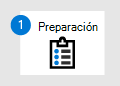
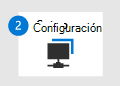

# Cambiar a Microsoft Defender para endpoint - Fase 3: Incorporación

**Se aplica a:**
- [Microsoft Defender para punto de conexión](https://go.microsoft.com/fwlink/p/?linkid=2154037)
- [Microsoft 365 Defender](https://go.microsoft.com/fwlink/?linkid=2118804)

|  [Fase 1: Preparación](switch-to-microsoft-defender-prepare.md) |  [Fase 2: Configuración](switch-to-microsoft-defender-setup.md) |  Fase 3: Incorporación |
|--|--|--|
|| |*¡Estás aquí!* |

**Bienvenido a la fase 3 de [cambiar a Microsoft Defender para endpoint](switch-to-microsoft-defender-migration.md#the-migration-process)**. Esta fase de migración incluye los siguientes pasos:

1. [Incorporar dispositivos a Microsoft Defender para endpoint](#onboard-devices-to-microsoft-defender-for-endpoint).
2. [Ejecute una prueba de detección](#run-a-detection-test).
3. [Desinstale la solución que no es de Microsoft](#uninstall-your-non-microsoft-solution).
4. [Asegúrese de que Microsoft Defender para endpoint está en modo activo](#make-sure-microsoft-defender-for-endpoint-is-in-active-mode).

## Incorporar dispositivos a Microsoft Defender para punto de conexión

1. Vaya al Centro de seguridad de Microsoft Defender ( [https://aka.ms/MDATPportal](https://aka.ms/MDATPportal) ) e inicie sesión.
2. Elija **Configuración**  >  **incorporación de administración de**  >  **dispositivos**. 
3. En la lista Seleccionar sistema operativo para iniciar el proceso **de incorporación,** seleccione un sistema operativo. 
4. En **Método de implementación,** seleccione una opción. Siga los vínculos y avisos para incorporar los dispositivos de la organización. ¿Necesita ayuda? Vea [Métodos de incorporación](#onboarding-methods) (en este artículo).

### Métodos de incorporación
 
Los métodos de implementación varían según el sistema operativo seleccionado. Consulte los recursos enumerados en la tabla siguiente para obtener ayuda con la incorporación.

|Sistema operativo  |Método  |
|---------|---------|
|Windows 10     |- [Directiva de grupo](configure-endpoints-gp.md) - [Configuration Manager](configure-endpoints-sccm.md) - [Administración de dispositivos móviles (Intune)](configure-endpoints-mdm.md) - [Script local](configure-endpoints-script.md) 
**NOTA:** Un script local es adecuado para una prueba de concepto, pero no debe usarse para la implementación de producción. Para una implementación de producción, se recomienda usar la directiva de grupo, Microsoft Endpoint Configuration Manager o Intune.         |
|- Windows 8.1 Enterprise  - Windows 8.1 Pro  - Windows 7 SP1 Enterprise  - Windows 7 SP1 Pro     | [Microsoft Monitoring Agent](onboard-downlevel.md)
**NOTA:** Microsoft Monitoring Agent es ahora agente de Azure Log Analytics. Para obtener más información, consulte [Log Analytics agent overview](/azure/azure-monitor/platform/log-analytics-agent).        |
|- Windows Server 2019 y versiones posteriores  - Windows Server 2019 core edition  - Windows Server versión 1803 y versiones posteriores |- [Script local](configure-endpoints-script.md)  - [Directiva de grupo](configure-endpoints-gp.md)  - [Configuration Manager](configure-endpoints-sccm.md)  - [System Center Configuration Manager](configure-endpoints-sccm.md)  - [Scripts de incorporación de VDI para dispositivos no persistentes](configure-endpoints-vdi.md) 
**NOTA:** Un script local es adecuado para una prueba de concepto, pero no debe usarse para la implementación de producción. Para una implementación de producción, se recomienda usar la directiva de grupo, Microsoft Endpoint Configuration Manager o Intune.    |
|- Windows Server 2016  - Windows Server 2012 R2  - Windows Server 2008 R2 SP1  |- [Centro de seguridad de Microsoft Defender](configure-server-endpoints.md) - [Azure Defender](/azure/security-center/security-center-wdatp) |
|macOS - 11.3.1 (Big Sur)  - 10.15 (Catalina) - 10.14 (Mojave)
iOS
Linux: - RHEL 7.2+ - CentOS Linux 7.2+ - Ubuntu 16 LTS o LTS superior - SLES 12+ - Debian 9+ - Oracle Linux 7.2 |[Incorporar dispositivos que no tienen Windows](configure-endpoints-non-windows.md)  |

## Ejecutar una prueba de detección

Para comprobar que los dispositivos incorporados están correctamente conectados a Microsoft Defender para Endpoint, puede ejecutar una prueba de detección.

|Sistema operativo  |Instrucciones  |
|---------|---------|
|- Windows 10  - Windows Server 2019  - Windows Server, versión 1803  - Windows Server 2016  - Windows Server 2012 R2     |Consulte [Ejecutar una prueba de detección.](run-detection-test.md) 
Visite el sitio de escenarios de demostración de Microsoft Defender para puntos de conexión ( ) y [https://demo.wd.microsoft.com](https://demo.wd.microsoft.com) pruebe uno o varios de los escenarios. Por ejemplo, pruebe el escenario **de demostración de** protección entregado en la nube.         |
|macOS - 11.3.1 (Big Sur)  - 10.15 (Catalina) - 10.14 (Mojave)    |Descargue y use la aplicación DE BRICOLAJE en [https://aka.ms/mdatpmacosdiy](https://aka.ms/mdatpmacosdiy) . 
Para obtener más información, vea [Microsoft Defender for Endpoint on macOS](microsoft-defender-endpoint-mac.md).        |
|Linux: - RHEL 7.2+ - CentOS Linux 7.2+ - Ubuntu 16 LTS o LTS superior - SLES 12+ - Debian 9+ - Oracle Linux 7.2 |1. Ejecute el siguiente comando y busque un resultado de **1**:  `mdatp health --field real_time_protection_enabled`. 
2. Abra una ventana terminal y ejecute el siguiente comando:  `curl -o ~/Downloads/eicar.com.txt https://www.eicar.org/download/eicar.com.txt`. 
3. Ejecute el siguiente comando para enumerar las amenazas detectadas:  `mdatp threat list`. 
Para obtener más información, vea [Microsoft Defender for Endpoint on Linux](microsoft-defender-endpoint-linux.md). |

## Desinstalar la solución que no es de Microsoft

Ahora que has incorporado los dispositivos de la organización a Microsoft Defender para Endpoint, el siguiente paso es desinstalar la solución de protección de puntos de conexión que no sea de Microsoft.

Para obtener ayuda con este paso, llegue al equipo de soporte técnico del proveedor de soluciones.

## Asegúrese de que Microsoft Defender para endpoint está en modo activo

Ahora que has desinstalado la solución de protección de puntos de conexión que no es de Microsoft, el siguiente paso es asegurarte de que Antivirus de Microsoft Defender y Microsoft Defender para endpoint estén habilitados y en modo activo.

Para ello, visite el sitio de escenarios de demostración de Microsoft Defender para endpoint ( [https://demo.wd.microsoft.com](https://demo.wd.microsoft.com) ). Pruebe uno o varios de los escenarios de demostración de esa página, incluidos al menos los siguientes:
- Protección entregada en la nube
- Aplicaciones potencialmente no deseadas (PUA)
- Protección de red (NP)

> [!IMPORTANT]
> Si usas Windows Server 2016, es posible que debas iniciar Antivirus de Microsoft Defender manualmente. Para ello, use el cmdlet de PowerShell `mpcmdrun.exe -wdenable` en el dispositivo.

## Siguientes pasos

**¡Enhorabuena!** Ha completado la migración [a Microsoft Defender para Endpoint](switch-to-microsoft-defender-migration.md#the-migration-process)! 

- [Visite el panel de operaciones de seguridad](security-operations-dashboard.md) en el Centro de seguridad de Microsoft Defender ( [https://aka.ms/MDATPportal](https://aka.ms/MDATPportal) ). 
- [Administrar Microsoft Defender para endpoint, post migration](manage-atp-post-migration.md).
