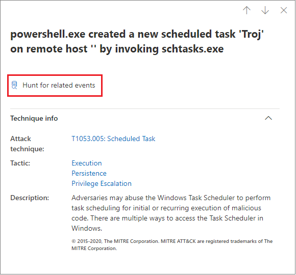

# Técnicas en la escala de tiempo del dispositivoTechniques in the device timeline

**Se aplica a:****Applies to:**
- [Microsoft Defender para punto de conexiónMicrosoft Defender for Endpoint](https://go.microsoft.com/fwlink/p/?linkid=2146631)

Puedes obtener más información en una investigación analizando los eventos que sucedieron en un dispositivo específico.You can gain more insight in an investigation by analyzing the events that happened on a specific device. En primer lugar, selecciona el dispositivo de interés de la [lista Dispositivos](machines-view-overview.md).First, select the device of interest from the [Devices list](machines-view-overview.md). En la página del dispositivo, puedes seleccionar la pestaña **Escala** de tiempo para ver todos los eventos que se produjeron en el dispositivo.On the device page, you can select the **Timeline** tab to view all the events that occurred on the device.

## Comprender técnicas en la escala de tiempoUnderstand techniques in the timeline

>[!IMPORTANT]
>Parte de la información se relaciona con una característica de producto publicada previamente en la versión preliminar pública que puede modificarse considerablemente antes de su lanzamiento comercial.Some information relates to a prereleased product feature in public preview which may be substantially modified before it's commercially released. Microsoft no otorga garantías, expresas o implícitas, con respecto a la información que aquí se proporciona.Microsoft makes no warranties, express or implied, with respect to the information provided here.

En Microsoft Defender para endpoint, **las técnicas son** un tipo de datos adicional en la escala de tiempo del evento.In Microsoft Defender for Endpoint, **Techniques** are an additional data type in the event timeline. Las técnicas proporcionan más información sobre las actividades asociadas con [MITRE ATT&técnicas de CK](https://attack.mitre.org/) o sub-técnicas.Techniques provide more insight on activities associated with [MITRE ATT&CK](https://attack.mitre.org/) techniques or sub-techniques. 

Esta característica simplifica la experiencia de investigación al ayudar a los analistas a comprender las actividades que se observaron en un dispositivo.This feature simplifies the investigation experience by helping analysts understand the activities that were observed on a device. A continuación, los analistas pueden decidir investigar más a fondo.Analysts can then decide to investigate further.

Para la vista previa pública, las técnicas están disponibles de forma predeterminada y se muestran junto con los eventos cuando se visualiza la escala de tiempo de un dispositivo.For public preview, Techniques are available by default and shown together with events when a device's timeline is viewed. 

Las técnicas se resaltan en texto en negrita y aparecen con un icono azul a la izquierda.Techniques are highlighted in bold text and appear with a blue icon on the left. El nombre de la técnica y el identificador de CK&MITRE ATT correspondiente también aparecen como etiquetas en Información adicional.The corresponding MITRE ATT&CK ID and technique name also appear as tags under Additional information. 

Las opciones de búsqueda y exportación también están disponibles para Técnicas.Search and Export options are also available for Techniques.

## Investigar con el panel lateralInvestigate using the side pane

Seleccione una técnica para abrir su panel lateral correspondiente.Select a Technique to open its corresponding side pane. Aquí puede ver información e información adicionales, como att relacionado&técnicas de CK, tácticas y descripciones.Here you can see additional information and insights like related ATT&CK techniques, tactics, and descriptions. 

Seleccione la técnica *de ataque específica* para abrir la página relacionada&técnica de CK de ATT donde encontrará más información al respecto.Select the specific *Attack technique* to open the related ATT&CK technique page where you can find more information about it.

Puede copiar los detalles de una entidad cuando vea un icono azul a la derecha.You can copy an entity's details when you see a blue icon on the right. Por ejemplo, para copiar el SHA1 de un archivo relacionado, seleccione el icono de página azul.For instance, to copy a related file's SHA1, select the blue page icon.

Puede hacer lo mismo con las líneas de comandos.You can do the same for command lines.

## Investigar eventos relacionadosInvestigate related events

Para usar [la búsqueda avanzada](advanced-hunting-overview.md) para buscar eventos relacionados con la técnica seleccionada, seleccione Buscar para eventos **relacionados.**To use [advanced hunting](advanced-hunting-overview.md) to find events related to the selected Technique, select **Hunt for related events**. Esto lleva a la página de búsqueda avanzada con una consulta para encontrar eventos relacionados con la técnica.This leads to the advanced hunting page with a query to find events related to the Technique.

>[!NOTE]
>Las consultas con el botón **Buscar** eventos relacionados desde un panel lateral Técnica muestran todos los eventos relacionados con la técnica identificada, pero no incluyen la técnica en sí en los resultados de la consulta.Querying using the **Hunt for related events** button from a Technique side pane displays all the events related to the identified technique but does not include the Technique itself in the query results.

## Personalizar la escala de tiempo del dispositivoCustomize your device timeline

En la parte superior derecha de la escala de tiempo del dispositivo, puedes elegir un intervalo de fechas para limitar el número de eventos y técnicas de la escala de tiempo.On the upper right-hand side of the device timeline, you can choose a date range to limit the number of events and techniques in the timeline. 

Puede personalizar las columnas que se deben exponer.You can customize which columns to expose. También puede filtrar los eventos marcados por tipo de datos o por grupo de eventos.You can also filter for flagged events by data type or by event group.

### Elegir columnas para exponerChoose columns to expose
Puede elegir qué columnas exponer en la escala de tiempo seleccionando el **botón Elegir** columnas.You can choose which columns to expose in the timeline by selecting the **Choose columns** button.

Desde allí, puede seleccionar qué conjunto de información incluir.From there you can select which information set to include.

### Filtrar solo para ver técnicas o eventosFilter to view techniques or events only

Para ver solo eventos o técnicas, selecciona **Filtros en** la escala de tiempo del dispositivo y elige el tipo de datos que prefieras ver.To view only either events or techniques, select **Filters** from the device timeline and choose your preferred Data type to view.

## Ver tambiénSee also
- [Ver y organizar la lista de dispositivosView and organize the Devices list](machines-view-overview.md)
- [Marcas de eventos de escala de tiempo de dispositivo de Microsoft Defender para punto de conexiónMicrosoft Defender for Endpoint device timeline event flags](device-timeline-event-flag.md) 

 
