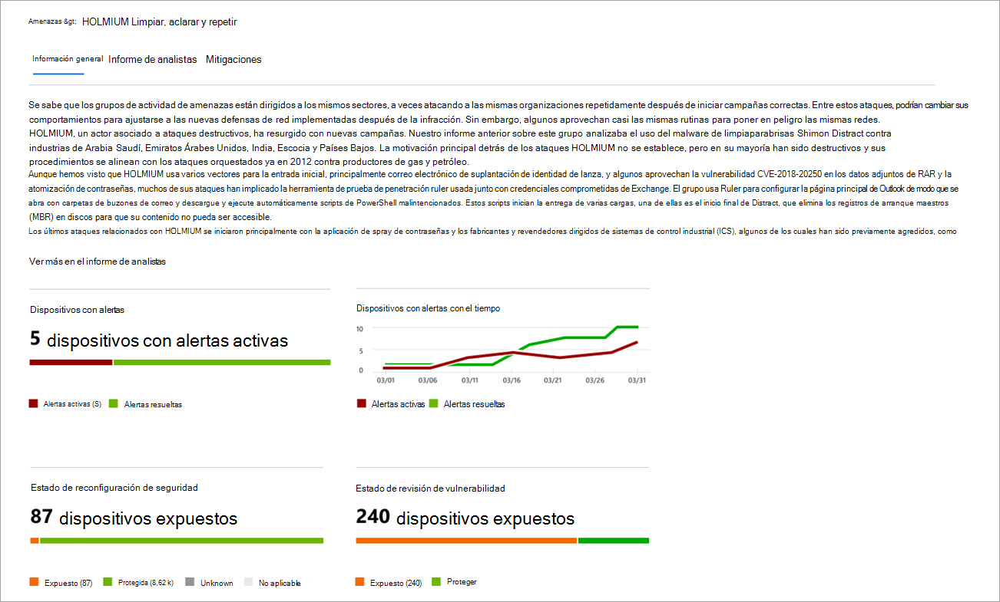
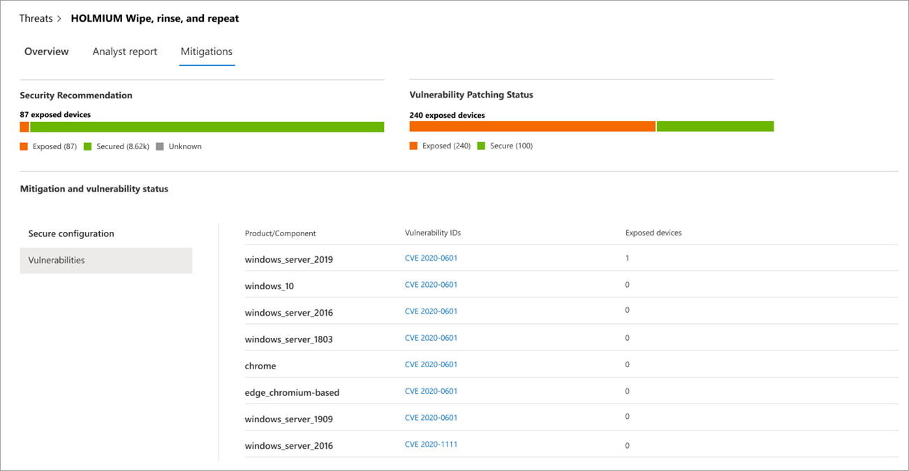

# Seguimiento y respuesta a amenazas emergentes con análisis de amenazas 

[!INCLUDE [Microsoft 365 Defender rebranding](../../includes/microsoft-defender.md)]

**Se aplica a:**
- [Microsoft Defender para punto de conexión](https://go.microsoft.com/fwlink/?linkid=2154037)
- [Microsoft 365 Defender](https://go.microsoft.com/fwlink/?linkid=2118804)

> ¿Desea experimentar Microsoft Defender para endpoint? [Regístrate para obtener una versión de prueba gratuita.](https://www.microsoft.com/microsoft-365/windows/microsoft-defender-atp?ocid=docs-wdatp-exposedapis-abovefoldlink)

Con los adversarios más sofisticados y las nuevas amenazas que surgen con frecuencia y con frecuencia, es fundamental poder hacer lo siguiente rápidamente:

- Evaluar el impacto de las nuevas amenazas
- Revisar la resistencia frente a las amenazas o su exposición a las amenazas.
- Identificar las acciones que puede realizar para detener o contener las amenazas

El análisis de amenazas es un conjunto de informes de investigadores expertos en seguridad de Microsoft que cubren las amenazas más relevantes, entre las que se incluyen:

- Actores de amenazas activas y sus campañas
- Técnicas de ataque populares y nuevas
- Vulnerabilidades críticas
- Superficies de ataque comunes
- Malware común

Cada informe proporciona un análisis detallado de una amenaza y una amplia guía sobre cómo defenderse de esa amenaza. También incorpora datos de la red, que indican si la amenaza está activa y si tiene protecciones aplicables.

Vea este breve vídeo para obtener más información sobre cómo los análisis de amenazas pueden ayudarle a realizar un seguimiento de las amenazas más recientes y detenerlos.

> [!VIDEO https://www.microsoft.com/en-us/videoplayer/embed/RE4bw1f]

## Ver el panel de análisis de amenazas

El panel de análisis de amenazas es un gran punto de partida para llegar a los informes que son más relevantes para su organización. Resume las amenazas en las secciones siguientes:

- **Últimas amenazas:** enumera los informes de amenazas publicados más recientemente, junto con el número de dispositivos con alertas activas y resueltas.
- **Amenazas de alto** impacto: enumera las amenazas que han tenido mayor impacto en la organización. En esta sección se clasifican las amenazas por el número de dispositivos que tienen alertas activas.
- **Resumen de amenazas:** muestra el impacto general de las amenazas rastreadas mostrando el número de amenazas con alertas activas y resueltas.

Seleccione una amenaza en el panel para ver el informe de esa amenaza.

## Ver un informe de análisis de amenazas

Cada informe de análisis de amenazas proporciona información en tres secciones: **Overview**, **Analyst report** y **Mitigations**.

### Información general: comprender rápidamente la amenaza, evaluar su impacto y revisar las defensas

La **sección** Información general proporciona una vista previa del informe detallado del analista. También proporciona gráficos que resaltan el impacto de la amenaza para su organización y su exposición a través de dispositivos mal configurados y sin aparear.

 _Sección información general de un informe de análisis de amenazas_

#### Evaluar el impacto en la organización
Cada informe incluye gráficos diseñados para proporcionar información sobre el impacto organizativo de una amenaza:
- **Dispositivos con alertas:** muestra el número actual de dispositivos distintos que se han visto afectados por la amenaza. Un dispositivo se clasifica como **Activo** si hay al menos una  alerta asociada a esa amenaza y **Resuelto** si se han resuelto todas las alertas asociadas con la amenaza en el dispositivo.
- **Dispositivos con alertas a lo** largo del tiempo: muestra el número de dispositivos distintos con **alertas activas** **y** resueltas con el tiempo. El número de alertas resueltas indica la rapidez con la que la organización responde a las alertas asociadas con una amenaza. Lo ideal es que el gráfico muestre las alertas resueltas en unos días.

#### Revisar la resistencia y la postura de seguridad
Cada informe incluye gráficos que proporcionan información general sobre la resistencia de la organización frente a una amenaza determinada:
- **Estado de configuración de** seguridad: muestra el número de dispositivos que han aplicado la configuración de seguridad recomendada que puede ayudar a mitigar la amenaza. Los dispositivos se consideran **seguros** si han aplicado _toda_ la configuración de seguimiento.
- **Estado de revisión de vulnerabilidad:** muestra el número de dispositivos que han aplicado actualizaciones de seguridad o revisiones que abordan las vulnerabilidades explotadas por la amenaza.

### Informe de analistas: obtener información de expertos de los investigadores de seguridad de Microsoft
Vaya a la **sección Informe de** analistas para leer la escritura detallada del experto. La mayoría de los informes proporcionan descripciones detalladas de las cadenas de ataque, incluidas las tácticas y técnicas  asignadas al marco de CK de MITRE ATT&, listas exhaustivas de recomendaciones y instrucciones de búsqueda de amenazas eficaces.

[Más información sobre el informe de analistas](threat-analytics-analyst-reports.md)

### Mitigaciones: revisar la lista de mitigaciones y el estado de los dispositivos
En la **sección Mitigaciones,** revise la lista de recomendaciones específicas que se pueden usar y que pueden ayudarle a aumentar la resistencia de la organización frente a la amenaza. La lista de mitigaciones rastreadas incluye:

- **Actualizaciones de seguridad:** implementación de actualizaciones de seguridad o revisiones para vulnerabilidades
- **Configuración del Antivirus de Microsoft Defender**
  - Versión de inteligencia de seguridad
  - Protección entregada en la nube  
  - Protección de aplicaciones potencialmente no deseadas (PUA)
  - Protección en tiempo real
 
La información de mitigación de esta sección incorpora datos de la administración de amenazas y vulnerabilidades, que también proporciona información detallada de los distintos vínculos del informe.

 _Mitigaciones de un informe de análisis de amenazas_

## Detalles y limitaciones adicionales del informe
Al usar los informes, tenga en cuenta lo siguiente: 

- Los datos se tienen en cuenta en el ámbito del control de acceso basado en roles (RBAC). Verá el estado de los dispositivos en grupos a los [que puede tener acceso](machine-groups.md).
- Los gráficos reflejan solo las mitigaciones a las que se realiza un seguimiento. Compruebe en el informe información general para ver mitigaciones adicionales que no se muestran en los gráficos.
- Las mitigaciones no garantizan una resistencia completa. Las mitigaciones proporcionadas reflejan las mejores acciones posibles necesarias para mejorar la resistencia.
- Los dispositivos se cuentan como "no disponibles" si no han transmitido datos al servicio.
- Las estadísticas relacionadas con antivirus se basan en la configuración de Antivirus de Microsoft Defender. Los dispositivos con soluciones antivirus de terceros pueden aparecer como "expuestos".

## Temas relacionados
- [Búsqueda proactiva de amenazas con búsqueda avanzada](advanced-hunting-overview.md) 
- [Comprender la sección de informe de analistas](threat-analytics-analyst-reports.md)
- [Evaluar y resolver debilidades y exposiciones de seguridad](next-gen-threat-and-vuln-mgt.md)