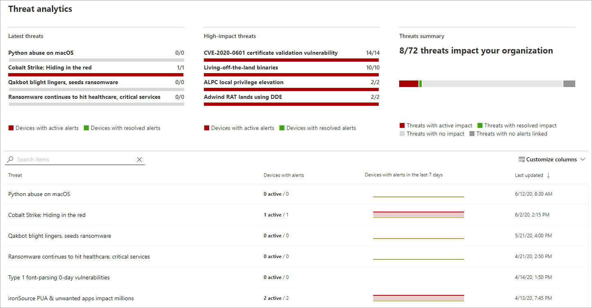

# Seguimiento y respuesta a amenazas emergentes con análisis de amenazasTrack and respond to emerging threats with threat analytics 

[!INCLUDE [Microsoft 365 Defender rebranding](../../includes/microsoft-defender.md)]

**Se aplica a:****Applies to:**
- [Microsoft Defender para punto de conexiónMicrosoft Defender for Endpoint](https://go.microsoft.com/fwlink/?linkid=2154037)
- [Microsoft 365 DefenderMicrosoft 365 Defender](https://go.microsoft.com/fwlink/?linkid=2118804)

> ¿Desea experimentar Microsoft Defender para endpoint?Want to experience Microsoft Defender for Endpoint? [Regístrate para obtener una versión de prueba gratuita.Sign up for a free trial.](https://www.microsoft.com/microsoft-365/windows/microsoft-defender-atp?ocid=docs-wdatp-exposedapis-abovefoldlink)

Con los adversarios más sofisticados y las nuevas amenazas que surgen con frecuencia y con frecuencia, es fundamental poder hacer lo siguiente rápidamente:With more sophisticated adversaries and new threats emerging frequently and prevalently, it's critical to be able to quickly:

- Evaluar el impacto de las nuevas amenazasAssess the impact of new threats
- Revisar la resistencia frente a las amenazas o su exposición a las amenazas.Review your resilience against or exposure to the threats
- Identificar las acciones que puede realizar para detener o contener las amenazasIdentify the actions you can take to stop or contain the threats

El análisis de amenazas es un conjunto de informes de investigadores expertos en seguridad de Microsoft que cubren las amenazas más relevantes, entre las que se incluyen:Threat analytics is a set of reports from expert Microsoft security researchers covering the most relevant threats, including:

- Actores de amenazas activas y sus campañasActive threat actors and their campaigns
- Técnicas de ataque populares y nuevasPopular and new attack techniques
- Vulnerabilidades críticasCritical vulnerabilities
- Superficies de ataque comunesCommon attack surfaces
- Malware comúnPrevalent malware

Cada informe proporciona un análisis detallado de una amenaza y una amplia guía sobre cómo defenderse de esa amenaza.Each report provides a detailed analysis of a threat and extensive guidance on how to defend against that threat. También incorpora datos de la red, que indican si la amenaza está activa y si tiene protecciones aplicables.It also incorporates data from your network, indicating whether the threat is active and if you have applicable protections in place.

Vea este breve vídeo para obtener más información sobre cómo los análisis de amenazas pueden ayudarle a realizar un seguimiento de las amenazas más recientes y detenerlos.Watch this short video to learn more about how threat analytics can help you track the latest threats and stop them.

> [!VIDEO https://www.microsoft.com/en-us/videoplayer/embed/RE4bw1f]

## Ver el panel de análisis de amenazasView the threat analytics dashboard

El panel de análisis de amenazas es un gran punto de partida para llegar a los informes que son más relevantes para su organización.The threat analytics dashboard is a great jump off point for getting to the reports that are most relevant to your organization. Resume las amenazas en las secciones siguientes:It summarizes the threats in the following sections:

- **Últimas amenazas:** enumera los informes de amenazas publicados más recientemente, junto con el número de dispositivos con alertas activas y resueltas.**Latest threats**—lists the most recently published threat reports, along with the number of devices with active and resolved alerts.
- **Amenazas de alto** impacto: enumera las amenazas que han tenido mayor impacto en la organización.**High-impact threats**—lists the threats that have had the highest impact to the organization. En esta sección se clasifican las amenazas por el número de dispositivos que tienen alertas activas.This section ranks threats by the number of devices that have active alerts.
- **Resumen de amenazas:** muestra el impacto general de las amenazas rastreadas mostrando el número de amenazas con alertas activas y resueltas.**Threat summary**—shows the overall impact of tracked threats by showing the number of threats with active and resolved alerts.

Seleccione una amenaza en el panel para ver el informe de esa amenaza.Select a threat from the dashboard to view the report for that threat.

## Ver un informe de análisis de amenazasView a threat analytics report

Cada informe de análisis de amenazas proporciona información en tres secciones: **Overview**, **Analyst report** y **Mitigations**.Each threat analytics report provides information in three sections: **Overview**, **Analyst report**, and **Mitigations**.

### Información general: comprender rápidamente la amenaza, evaluar su impacto y revisar las defensasOverview: Quickly understand the threat, assess its impact, and review defenses

La **sección** Información general proporciona una vista previa del informe detallado del analista.The **Overview** section provides a preview of the detailed analyst report. También proporciona gráficos que resaltan el impacto de la amenaza para su organización y su exposición a través de dispositivos mal configurados y sin aparear.It also provides charts that highlight the impact of the threat to your organization and your exposure through misconfigured and unpatched devices.

 _Sección información general de un informe de análisis de amenazas_
_Overview section of a threat analytics report_

#### Evaluar el impacto en la organizaciónAssess the impact to your organization
Cada informe incluye gráficos diseñados para proporcionar información sobre el impacto organizativo de una amenaza:Each report includes charts designed to provide information about the organizational impact of a threat:
- **Dispositivos con alertas:** muestra el número actual de dispositivos distintos que se han visto afectados por la amenaza.**Devices with alerts**—shows the current number of distinct devices that have been impacted by the threat. Un dispositivo se clasifica como **Activo** si hay al menos una  alerta asociada a esa amenaza y **Resuelto** si se han resuelto todas las alertas asociadas con la amenaza en el dispositivo.A device is categorized as **Active** if there is at least one alert associated with that threat and **Resolved** if *all* alerts associated with the threat on the device have been resolved.
- **Dispositivos con alertas a lo** largo del tiempo: muestra el número de dispositivos distintos con **alertas activas** **y** resueltas con el tiempo.**Devices with alerts over time**—shows the number of distinct devices with **Active** and **Resolved** alerts over time. El número de alertas resueltas indica la rapidez con la que la organización responde a las alertas asociadas con una amenaza.The number of resolved alerts indicates how quickly your organization responds to alerts associated with a threat. Lo ideal es que el gráfico muestre las alertas resueltas en unos días.Ideally, the chart should be showing alerts resolved within a few days.

#### Revisar la resistencia y la postura de seguridadReview security resilience and posture
Cada informe incluye gráficos que proporcionan información general sobre la resistencia de la organización frente a una amenaza determinada:Each report includes charts that provide an overview of how resilient your organization is against a given threat:
- **Estado de configuración de** seguridad: muestra el número de dispositivos que han aplicado la configuración de seguridad recomendada que puede ayudar a mitigar la amenaza.**Security configuration status**—shows the number of devices that have applied the recommended security settings that can help mitigate the threat. Los dispositivos se consideran **seguros** si han aplicado _toda_ la configuración de seguimiento.Devices are considered **Secure** if they have applied _all_ the tracked settings.
- **Estado de revisión de vulnerabilidad:** muestra el número de dispositivos que han aplicado actualizaciones de seguridad o revisiones que abordan las vulnerabilidades explotadas por la amenaza.**Vulnerability patching status**—shows the number of devices that have applied security updates or patches that address vulnerabilities exploited by the threat.

### Informe de analistas: obtener información de expertos de los investigadores de seguridad de MicrosoftAnalyst report: Get expert insight from Microsoft security researchers
Vaya a la **sección Informe de** analistas para leer la escritura detallada del experto.Go to the **Analyst report** section to read through the detailed expert write-up. La mayoría de los informes proporcionan descripciones detalladas de las cadenas de ataque, incluidas las tácticas y técnicas  asignadas al marco de CK de MITRE ATT&, listas exhaustivas de recomendaciones y instrucciones de búsqueda de amenazas eficaces.Most reports provide detailed descriptions of attack chains, including tactics and techniques mapped to the MITRE ATT&CK framework, exhaustive lists of recommendations, and powerful [threat hunting](advanced-hunting-overview.md) guidance.

[Más información sobre el informe de analistasLearn more about the analyst report](threat-analytics-analyst-reports.md)

### Mitigaciones: revisar la lista de mitigaciones y el estado de los dispositivosMitigations: Review list of mitigations and the status of your devices
En la **sección Mitigaciones,** revise la lista de recomendaciones específicas que se pueden usar y que pueden ayudarle a aumentar la resistencia de la organización frente a la amenaza.In the **Mitigations** section, review the list of specific actionable recommendations that can help you increase your organizational resilience against the threat. La lista de mitigaciones rastreadas incluye:The list of tracked mitigations includes:

- **Actualizaciones de seguridad:** implementación de actualizaciones de seguridad o revisiones para vulnerabilidades**Security updates**—deployment of security updates or patches for vulnerabilities
- **Antivirus de Microsoft Defender configuración****Microsoft Defender Antivirus settings**
  - Versión de inteligencia de seguridadSecurity intelligence version
  - Protección entregada en la nubeCloud-delivered protection  
  - Protección de aplicaciones potencialmente no deseadas (PUA)Potentially unwanted application (PUA) protection
  - Protección en tiempo realReal-time protection
 
La información de mitigación de esta sección incorpora datos de [Administración de amenazas y vulnerabilidades](next-gen-threat-and-vuln-mgt.md), que también proporciona información detallada de detalles de varios vínculos del informe.Mitigation information in this section incorporates data from [threat and vulnerability management](next-gen-threat-and-vuln-mgt.md), which also provides detailed drill-down information from various links in the report.

 _Mitigaciones de un informe de análisis de amenazas_
_Mitigations section of a threat analytics report_

## Detalles y limitaciones adicionales del informeAdditional report details and limitations
Al usar los informes, tenga en cuenta lo siguiente:When using the reports, keep the following in mind: 

- Los datos se tienen en cuenta en el ámbito del control de acceso basado en roles (RBAC).Data is scoped based on your role-based access control (RBAC) scope. Verá el estado de los dispositivos en grupos a los [que puede tener acceso](machine-groups.md).You will see the status of devices in [groups that you can access](machine-groups.md).
- Los gráficos reflejan solo las mitigaciones a las que se realiza un seguimiento.Charts reflect only mitigations that are tracked. Compruebe en el informe información general para ver mitigaciones adicionales que no se muestran en los gráficos.Check the report overview for additional mitigations that are not shown in the charts.
- Las mitigaciones no garantizan una resistencia completa.Mitigations don't guarantee complete resilience. Las mitigaciones proporcionadas reflejan las mejores acciones posibles necesarias para mejorar la resistencia.The provided mitigations reflect the best possible actions needed to improve resiliency.
- Los dispositivos se cuentan como "no disponibles" si no han transmitido datos al servicio.Devices are counted as "unavailable" if they have not transmitted data to the service.
- Las estadísticas relacionadas con el antivirus se basan en Antivirus de Microsoft Defender configuración.Antivirus-related statistics are based on Microsoft Defender Antivirus settings. Los dispositivos con soluciones antivirus de terceros pueden aparecer como "expuestos".Devices with third-party antivirus solutions can appear as "exposed".

## Temas relacionadosRelated topics
- [Búsqueda proactiva de amenazas con búsqueda avanzadaProactively find threats with advanced hunting](advanced-hunting-overview.md) 
- [Comprender la sección de informe de analistasUnderstand the analyst report section](threat-analytics-analyst-reports.md)
- [Evaluar y resolver debilidades y exposiciones de seguridadAssess and resolve security weaknesses and exposures](next-gen-threat-and-vuln-mgt.md)