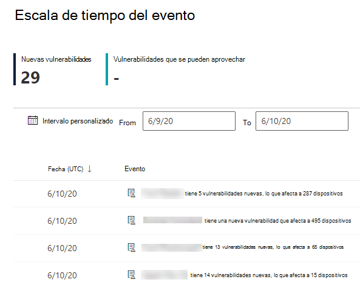
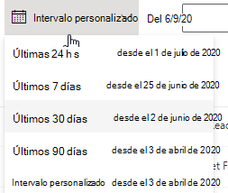
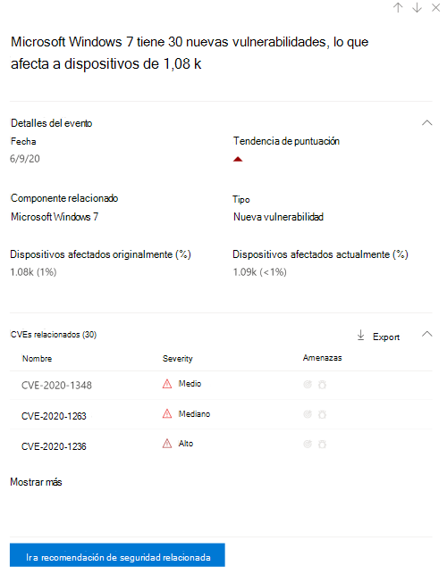
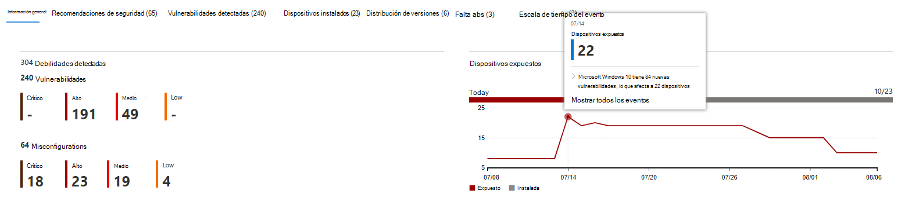

# Escala de tiempo de eventos: administración de amenazas y vulnerabilidadesEvent timeline - threat and vulnerability management

[!INCLUDE [Microsoft 365 Defender rebranding](../../includes/microsoft-defender.md)]

**Se aplica a:****Applies to:**
- [Microsoft Defender para punto de conexiónMicrosoft Defender for Endpoint](https://go.microsoft.com/fwlink/?linkid=2154037)
- [Microsoft 365 DefenderMicrosoft 365 Defender](https://go.microsoft.com/fwlink/?linkid=2118804)

>¿Desea experimentar Microsoft Defender para endpoint?Want to experience Microsoft Defender for Endpoint? [Regístrate para obtener una versión de prueba gratuita.Sign up for a free trial.](https://www.microsoft.com/microsoft-365/windows/microsoft-defender-atp?ocid=docs-wdatp-portaloverview-abovefoldlink)

La escala de tiempo del evento es una fuente de noticias de riesgo que le ayuda a interpretar cómo se introduce el riesgo en la organización a través de nuevas vulnerabilidades o vulnerabilidades.Event timeline is a risk news feed that helps you interpret how risk is introduced into the organization through new vulnerabilities or exploits. Puede ver eventos que pueden afectar al riesgo de su organización.You can view events that may impact your organization's risk. Por ejemplo, puede encontrar nuevas vulnerabilidades que se introdujeron, vulnerabilidades que se convirtieron en explotables, vulnerabilidades que se agregaron a un kit de vulnerabilidades y mucho más.For example, you can find new vulnerabilities that were introduced, vulnerabilities that became exploitable, exploit that was added to an exploit kit, and more.

La escala de tiempo  del evento también cuenta la historia de la puntuación de exposición y la puntuación segura de [Microsoft](tvm-microsoft-secure-score-devices.md) para dispositivos para que puedas determinar la causa de grandes cambios.Event timeline also tells the story of your [exposure score](tvm-exposure-score.md) and [Microsoft Secure Score for Devices](tvm-microsoft-secure-score-devices.md) so you can determine the cause of large changes. Los eventos pueden afectar a los dispositivos o a la puntuación de los dispositivos.Events can impact your devices or your score for devices. Reduzca la exposición abordando lo que debe corregirse en función de las recomendaciones de [seguridad prioritarias.](tvm-security-recommendation.md)Reduce you exposure by addressing what needs to be remediated based on the prioritized [security recommendations](tvm-security-recommendation.md).

>[!TIP]
>Para obtener correos electrónicos sobre nuevos eventos de vulnerabilidad, consulte [Configure vulnerability email notifications in Microsoft Defender for Endpoint](configure-vulnerability-email-notifications.md)To get emails about new vulnerability events, see [Configure vulnerability email notifications in Microsoft Defender for Endpoint](configure-vulnerability-email-notifications.md)

## Vaya a la página Escala de tiempo de eventosNavigate to the Event timeline page

También hay tres puntos de entrada del panel de administración de amenazas [y vulnerabilidades:](tvm-dashboard-insights.md)There are also three entry points from the [threat and vulnerability management dashboard](tvm-dashboard-insights.md):

- **Tarjeta de puntuación de** exposición de la organización: mantenga el mouse sobre los puntos del evento en el gráfico "Puntuación de exposición con el tiempo" y seleccione "Ver todos los eventos de este día".**Organization exposure score card**: Hover over the event dots in the "Exposure Score over time" graph and select "See all events from this day." Los eventos representan vulnerabilidades de software.The events represent software vulnerabilities.
- **Puntuación segura de Microsoft** para dispositivos: mantenga el mouse sobre los puntos de evento en el gráfico "Su puntuación para dispositivos con el tiempo" y seleccione "Ver todos los eventos de este día".**Microsoft Secure Score for Devices**: Hover over the event dots in the "Your score for devices over time" graph and select "See all events from this day." Los eventos representan nuevas evaluaciones de configuración.The events represent new configuration assessments.
- **Tarjeta de eventos superior:** seleccione "Mostrar más" en la parte inferior de la tabla de eventos superior.**Top events card**: Select "Show more" at the bottom of the top events table. La tarjeta muestra los tres eventos más impactantes de los últimos 7 días.The card displays the three most impactful events in the last 7 days. Los eventos de impacto pueden incluir si el evento afecta a un gran número de dispositivos o si es una vulnerabilidad crítica.Impactful events can include if the event affects a large number of devices, or if it is a critical vulnerability.

### Puntuación de exposición y puntuación segura de Microsoft para gráficos de dispositivosExposure score and Microsoft Secure Score for Devices graphs

En el panel de administración de amenazas y vulnerabilidades, mantenga el mouse sobre el gráfico puntuación de exposición para ver los eventos de vulnerabilidad de software principales de ese día que afectaron a sus dispositivos.In the threat and vulnerability management dashboard, hover over the Exposure score graph to view top software vulnerability events from that day that impacted your devices. Mantenga el mouse sobre el gráfico Puntuación segura de Microsoft para dispositivos para ver las nuevas evaluaciones de configuración de seguridad que afectan a su puntuación.Hover over the Microsoft Secure Score for Devices graph to view new security configuration assessments that affect your score.

Si no hay eventos que afecten a los dispositivos o a la puntuación de los dispositivos, no se mostrará ninguno.If there are no events that affect your devices or your score for devices, then none will be shown.

 
  

### Profundizar en los eventos de ese díaDrill down to events from that day

Si selecciona Mostrar todos los eventos de este **día,** podrá ir a la página Escala de tiempo de eventos con un intervalo de fechas personalizado para ese día.Selecting **Show all events from this day** takes you to the Event timeline page with a custom date range for that day.

Seleccione **Intervalo personalizado** para cambiar el intervalo de fechas a otro personalizado o a un intervalo de tiempo predefinido.Select **Custom range** to change the date range to another custom one, or a pre-set time range.

## Introducción a la escala de tiempo de eventosEvent timeline overview

En la página Escala de tiempo del evento, puedes ver toda la información necesaria relacionada con un evento.On the Event timeline page, you can view the all the necessary info related to an event. 

Características:Features:

- Personalizar columnasCustomize columns
- Filtrar por tipo de evento o porcentaje de dispositivos afectadosFilter by event type or percent of impacted devices
- Ver 30, 50 o 100 elementos por páginaView 30, 50, or 100 items per page

Los dos números grandes en la parte superior de la página muestran el número de nuevas vulnerabilidades y vulnerabilidades aprovechables, no eventos.The two large numbers at the top of the page show the number of new vulnerabilities and exploitable vulnerabilities, not events. Algunos eventos pueden tener varias vulnerabilidades y algunas vulnerabilidades pueden tener varios eventos.Some events can have multiple vulnerabilities, and some vulnerabilities can have multiple events.

### ColumnasColumns

- **Fecha:** mes, día, año**Date**: month, day, year
- **Evento:** evento de impacto, incluido el componente, el tipo y el número de dispositivos afectados**Event**: impactful event, including component, type, and number of impacted devices
- **Componente relacionado**: software**Related component**: software
- **Dispositivos afectados originalmente:** el número y el porcentaje de dispositivos afectados cuando se produjo este evento originalmente.**Originally impacted devices**: the number, and percentage, of impacted devices when this event originally occurred. También puedes filtrar por el porcentaje de dispositivos afectados originalmente, de tu número total de dispositivos.You can also filter by the percent of originally impacted devices, out of your total number of devices.
- **Dispositivos afectados actualmente:** el número actual y el porcentaje de dispositivos que este evento afecta actualmente.**Currently impacted devices**: the current number, and percentage, of devices that this event currently impacts. Puede encontrar este campo seleccionando **Personalizar columnas**.You can find this field by selecting **Customize columns**.
- **Tipos:** reflejan eventos con marca de tiempo que afectan a la puntuación.**Types**: reflect time-stamped events that impact the score. Se pueden filtrar.They can be filtered.
    - Exploit agregado a un kit de vulnerabilidadesExploit added to an exploit kit
    - Se ha comprobado la vulnerabilidadExploit was verified
    - Nueva vulnerabilidad públicaNew public exploit
    - Nueva vulnerabilidadNew vulnerability
    - Nueva evaluación de configuraciónNew configuration assessment
- **Tendencia de puntuación:** tendencia de puntuación de exposición**Score trend**: exposure score trend

### IconosIcons

Los siguientes iconos se muestran junto a los eventos:The following icons show up next to events:

-  Nueva vulnerabilidad públicaNew public exploit
-  Se publicó una nueva vulnerabilidadNew vulnerability was published
-  Exploit encontrado en el kit de vulnerabilidadesExploit found in exploit kit
-  Exploit verifiedExploit verified

### Profundizar en un evento específicoDrill down to a specific event

Una vez que selecciones un evento, aparecerá un flyout con una lista de los detalles y las CVEs actuales que afectan a tus dispositivos.Once you select an event, a flyout will appear with a list of the details and current CVEs that affect your devices. Puede mostrar más CVEs o ver la recomendación relacionada.You can show more CVEs or view the related recommendation.

La flecha debajo de "tendencia de puntuación" te ayuda a determinar si este evento potencialmente ha elevado o reducido la puntuación de exposición de la organización.The arrow below "score trend" helps you determine whether this event potentially raised or lowered your organizational exposure score. Una mayor puntuación de exposición significa que los dispositivos son más vulnerables a la explotación.Higher exposure score means devices are more vulnerable to exploitation.

Desde allí, seleccione **Ir a la vista de** recomendación de seguridad relacionada la recomendación que aborda la nueva vulnerabilidad de software en la página recomendaciones de [seguridad](tvm-security-recommendation.md).From there, select **Go to related security recommendation** view the recommendation that addresses the new software vulnerability in the [security recommendations page](tvm-security-recommendation.md). Después de leer la descripción y los detalles de vulnerabilidad en la recomendación de seguridad, puede enviar una solicitud de corrección y realizar un seguimiento de la solicitud en la [página de corrección](tvm-remediation.md).After reading the description and vulnerability details in the security recommendation, you can submit a remediation request, and track the request in the [remediation page](tvm-remediation.md).  

## Ver escalas de tiempo de eventos en páginas de softwareView Event timelines in software pages

Para abrir una página de software, seleccione un evento > el nombre de software con hipervínculo (como Visual Studio 2017) en la sección denominada "Componente relacionado" en el control desplegable.To open a software page, select an event > select the hyperlinked software name (like Visual Studio 2017) in the section called "Related component" in the flyout. [Más información sobre las páginas de softwareLearn more about software pages](tvm-software-inventory.md#software-pages)

Aparecerá una página completa con todos los detalles de un software específico.A full page will appear with all the details of a specific software. Pase el mouse sobre el gráfico para ver la escala de tiempo de los eventos de ese software específico.Mouse over the graph to see the timeline of events for that specific software.

Vaya a la pestaña escala de tiempo del evento para ver todos los eventos relacionados con ese software.Navigate to the event timeline tab to view all the events related to that software. También puede ver recomendaciones de seguridad, vulnerabilidades detectadas, dispositivos instalados y distribución de versiones.You can also see security recommendations, discovered vulnerabilities, installed devices, and version distribution.

## Temas relacionadosRelated topics

- [Introducción a la administración de amenazas y vulnerabilidadesThreat and vulnerability management overview](next-gen-threat-and-vuln-mgt.md)
- [PanelDashboard](tvm-dashboard-insights.md)
- [Puntuación de exposiciónExposure score](tvm-exposure-score.md)
- [Recomendaciones de seguridadSecurity recommendations](tvm-security-recommendation.md)
- [Corregir puntos vulnerablesRemediate vulnerabilities](tvm-remediation.md)
- [Inventario de softwareSoftware inventory](tvm-software-inventory.md)

