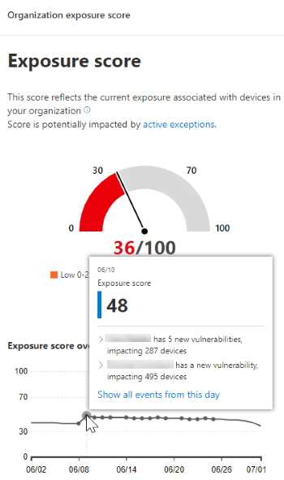

# Escala de tiempo del evento: Administración de amenazas y vulnerabilidades

[!INCLUDE [Microsoft 365 Defender rebranding](../../includes/microsoft-defender.md)]

**Se aplica a:**
- [Microsoft Defender para punto de conexión](https://go.microsoft.com/fwlink/?linkid=2154037)
- [Microsoft 365 Defender](https://go.microsoft.com/fwlink/?linkid=2118804)

>¿Desea experimentar Microsoft Defender para endpoint? [Regístrate para obtener una versión de prueba gratuita.](https://www.microsoft.com/microsoft-365/windows/microsoft-defender-atp?ocid=docs-wdatp-portaloverview-abovefoldlink)

La escala de tiempo del evento es una fuente de noticias de riesgo que le ayuda a interpretar cómo se introduce el riesgo en la organización a través de nuevas vulnerabilidades o vulnerabilidades. Puede ver eventos que pueden afectar al riesgo de su organización. Por ejemplo, puede encontrar nuevas vulnerabilidades que se introdujeron, vulnerabilidades que se convirtieron en explotables, vulnerabilidades que se agregaron a un kit de vulnerabilidades y mucho más.

La escala de tiempo  del evento también cuenta la historia de la puntuación de exposición y la puntuación segura de [Microsoft](tvm-microsoft-secure-score-devices.md) para dispositivos para que puedas determinar la causa de grandes cambios. Los eventos pueden afectar a los dispositivos o a la puntuación de los dispositivos. Reduzca la exposición abordando lo que debe corregirse en función de las recomendaciones de [seguridad prioritarias.](tvm-security-recommendation.md)

>[!TIP]
>Para obtener correos electrónicos sobre nuevos eventos de vulnerabilidad, consulte [Configure vulnerability email notifications in Microsoft Defender for Endpoint](configure-vulnerability-email-notifications.md)

## Vaya a la página Escala de tiempo de eventos

También hay tres puntos de entrada del [panel de Administración de amenazas y vulnerabilidades:](tvm-dashboard-insights.md)

- **Tarjeta de puntuación de** exposición de la organización: mantenga el mouse sobre los puntos del evento en el gráfico "Puntuación de exposición con el tiempo" y seleccione "Ver todos los eventos de este día". Los eventos representan vulnerabilidades de software.
- **Puntuación segura de Microsoft** para dispositivos: mantenga el mouse sobre los puntos de evento en el gráfico "Su puntuación para dispositivos con el tiempo" y seleccione "Ver todos los eventos de este día". Los eventos representan nuevas evaluaciones de configuración.
- **Tarjeta de eventos superior:** seleccione "Mostrar más" en la parte inferior de la tabla de eventos superior. La tarjeta muestra los tres eventos más impactantes de los últimos 7 días. Los eventos de impacto pueden incluir si el evento afecta a un gran número de dispositivos o si es una vulnerabilidad crítica.

### Puntuación de exposición y puntuación segura de Microsoft para gráficos de dispositivos

En el panel Administración de amenazas y vulnerabilidades, mantenga el mouse sobre el gráfico puntuación de exposición para ver los eventos de vulnerabilidad de software principales de ese día que afectaron a los dispositivos. Mantenga el mouse sobre el gráfico Puntuación segura de Microsoft para dispositivos para ver las nuevas evaluaciones de configuración de seguridad que afectan a su puntuación.

Si no hay eventos que afecten a los dispositivos o a la puntuación de los dispositivos, no se mostrará ninguno.

 
 

### Profundizar en los eventos de ese día

Si selecciona Mostrar todos los eventos de este **día,** podrá ir a la página Escala de tiempo de eventos con un intervalo de fechas personalizado para ese día.

Seleccione **Intervalo personalizado** para cambiar el intervalo de fechas a otro personalizado o a un intervalo de tiempo predefinido.

## Introducción a la escala de tiempo de eventos

En la página Escala de tiempo del evento, puedes ver toda la información necesaria relacionada con un evento. 

Características:

- Personalizar columnas
- Filtrar por tipo de evento o porcentaje de dispositivos afectados
- Ver 30, 50 o 100 elementos por página

Los dos números grandes en la parte superior de la página muestran el número de nuevas vulnerabilidades y vulnerabilidades aprovechables, no eventos. Algunos eventos pueden tener varias vulnerabilidades y algunas vulnerabilidades pueden tener varios eventos.

### Columns

- **Fecha:** mes, día, año
- **Evento:** evento de impacto, incluido el componente, el tipo y el número de dispositivos afectados
- **Componente relacionado**: software
- **Dispositivos afectados originalmente:** el número y el porcentaje de dispositivos afectados cuando se produjo este evento originalmente. También puedes filtrar por el porcentaje de dispositivos afectados originalmente, de tu número total de dispositivos.
- **Dispositivos afectados actualmente:** el número actual y el porcentaje de dispositivos que este evento afecta actualmente. Puede encontrar este campo seleccionando **Personalizar columnas**.
- **Tipos:** reflejan eventos con marca de tiempo que afectan a la puntuación. Se pueden filtrar.
    - Exploit agregado a un kit de vulnerabilidades
    - Se ha comprobado la vulnerabilidad
    - Nueva vulnerabilidad pública
    - Nueva vulnerabilidad
    - Nueva evaluación de configuración
- **Tendencia de puntuación:** tendencia de puntuación de exposición

### Iconos

Los siguientes iconos se muestran junto a los eventos:

-  Nueva vulnerabilidad pública
-  Se publicó una nueva vulnerabilidad
-  Exploit encontrado en el kit de vulnerabilidades
-  Exploit verified

### Profundizar en un evento específico

Una vez que selecciones un evento, aparecerá un flyout con una lista de los detalles y las CVEs actuales que afectan a tus dispositivos. Puede mostrar más CVEs o ver la recomendación relacionada.

La flecha debajo de "tendencia de puntuación" te ayuda a determinar si este evento potencialmente ha elevado o reducido la puntuación de exposición de la organización. Una mayor puntuación de exposición significa que los dispositivos son más vulnerables a la explotación.

Desde allí, seleccione **Ir a la vista de** recomendación de seguridad relacionada la recomendación que aborda la nueva vulnerabilidad de software en la página recomendaciones de [seguridad](tvm-security-recommendation.md). Después de leer la descripción y los detalles de vulnerabilidad en la recomendación de seguridad, puede enviar una solicitud de corrección y realizar un seguimiento de la solicitud en la [página de corrección](tvm-remediation.md).  

## Ver escalas de tiempo de eventos en páginas de software

Para abrir una página de software, seleccione un evento > el nombre de software con hipervínculo (como Visual Studio 2017) en la sección denominada "Componente relacionado" en el control desplegable. [Más información sobre las páginas de software](tvm-software-inventory.md#software-pages)

Aparecerá una página completa con todos los detalles de un software específico. Pase el mouse sobre el gráfico para ver la escala de tiempo de los eventos de ese software específico.

Vaya a la pestaña escala de tiempo del evento para ver todos los eventos relacionados con ese software. También puede ver recomendaciones de seguridad, vulnerabilidades detectadas, dispositivos instalados y distribución de versiones.

## Temas relacionados

- [Información general sobre amenazas administración de vulnerabilidades amenazas](next-gen-threat-and-vuln-mgt.md)
- [Panel](tvm-dashboard-insights.md)
- [Puntuación de exposición](tvm-exposure-score.md)
- [Recomendaciones de seguridad](tvm-security-recommendation.md)
- [Corregir puntos vulnerables](tvm-remediation.md)
- [Inventario de software](tvm-software-inventory.md)

