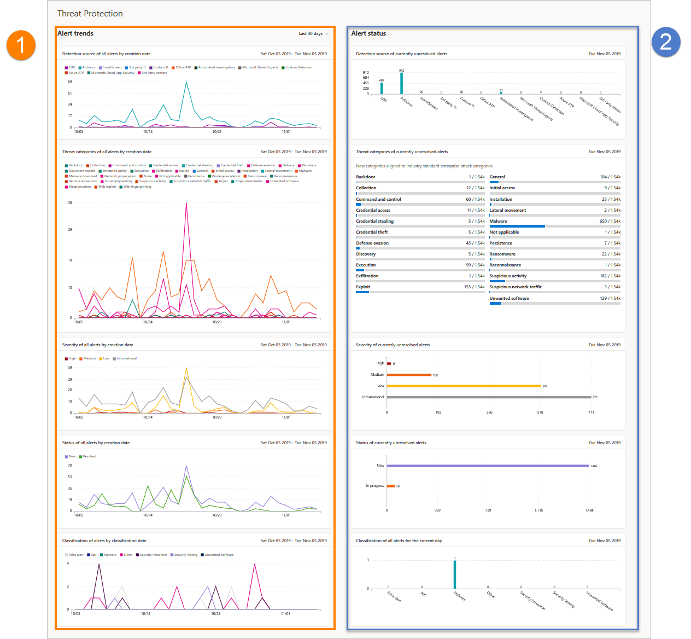

# Informe de protección contra amenazas en Microsoft Defender para endpointThreat protection report in Microsoft Defender for Endpoint

[!INCLUDE [Microsoft 365 Defender rebranding](../../includes/microsoft-defender.md)]

**Se aplica a:****Applies to:**
- [Microsoft Defender para punto de conexiónMicrosoft Defender for Endpoint](https://go.microsoft.com/fwlink/p/?linkid=2154037)
- [Microsoft 365 DefenderMicrosoft 365 Defender](https://go.microsoft.com/fwlink/?linkid=2118804)

> ¿Desea experimentar Defender for Endpoint?Want to experience Defender for Endpoint? [Regístrate para obtener una versión de prueba gratuita.Sign up for a free trial.](https://www.microsoft.com/microsoft-365/windows/microsoft-defender-atp?ocid=docs-wdatp-pullalerts-abovefoldlink) 

El informe de protección contra amenazas proporciona información de alto nivel sobre las alertas generadas en la organización.The threat protection report provides high-level information about alerts generated in your organization. El informe incluye información de tendencias que muestra los orígenes de detección, categorías, gravedades, estados, clasificaciones y determinaciones de alertas a lo largo del tiempo.The report includes trending information showing the detection sources, categories, severities, statuses, classifications, and determinations of alerts across time.

El panel está estructurado en dos secciones:The dashboard is structured into two sections:

SectionSection | DescripciónDescription 
:---|:---
11 | Tendencias de alertasAlerts trends
22 | Resumen de alertasAlert summary

## Tendencias de alertaAlert trends
De forma predeterminada, las tendencias de alerta muestran información de alerta del período de 30 días que termina en el último día completo.By default, the alert trends display alert information from the 30-day period ending in the latest full day. Para obtener una mejor perspectiva de las tendencias que se producen en su organización, puede ajustar el período de informes ajustando el período de tiempo que se muestra.To gain better perspective on trends occurring in your organization, you can fine-tune the reporting period by adjusting the time period shown. Para ajustar el período de tiempo, seleccione un intervalo de tiempo en las opciones desplegables:To adjust the time period, select a time range from the drop-down options:

- 30 días30 days
- 3 meses3 months
- 6 meses6 months
- PersonalizadoCustom

>[!NOTE]
>Estos filtros solo se aplican en la sección de tendencias de alerta.These filters are only applied on the alert trends section. No afecta a la sección de resumen de alertas.It doesn't affect the alert summary section.

## Resumen de alertasAlert summary
Aunque las tendencias de alerta muestran información de alerta de tendencias, el resumen de alerta muestra información de alerta en el ámbito del día actual.While the alert trends shows trending alert information, the alert summary shows alert information scoped to the current day.

 El resumen de alerta le permite explorar en profundidad una cola de alertas determinada con el filtro correspondiente aplicado.The alert summary allows you to drill down to a particular alert queue with the corresponding filter applied to it. Por ejemplo, al hacer clic en la barra de EDR de la tarjeta Orígenes de detección, aparecerá la cola de alertas con resultados que muestran solo alertas generadas a partir de detecciones de EDR.For example, clicking on the EDR bar in the Detection sources card will bring you the alerts queue with results showing only alerts generated from EDR detections. 

>[!NOTE]
>Los datos reflejados en la sección de resumen están en el ámbito de 180 días antes de la fecha actual.The data reflected in the summary section is scoped to 180 days prior to the current date. Por ejemplo, si la fecha de hoy es el 5 de noviembre de 2019, los datos de la sección de resumen reflejarán números a partir del 5 de mayo de 2019 al 5 de noviembre de 2019.For example if today's date is November 5, 2019, the data on the summary section will reflect numbers starting from May 5, 2019 to November 5, 2019. 
> El filtro aplicado en la sección tendencias no se aplica en la sección de resumen.The filter applied on the trends section is not applied on the summary section. 

## Atributos de alertaAlert attributes
El informe está hecho de tarjetas que muestran los siguientes atributos de alerta:The report is made up of cards that display the following alert attributes:

- **Orígenes de detección:** muestra información sobre los sensores y las tecnologías de detección que proporcionan los datos usados por Microsoft Defender para endpoint para desencadenar alertas.**Detection sources**: shows information about the sensors and detection technologies that provide the data used by Microsoft Defender for Endpoint to trigger alerts.

- **Categorías de amenazas:** muestra los tipos de actividad de amenazas o ataques que desencadenaron alertas, lo que indica posibles áreas de foco para las operaciones de seguridad.**Threat categories**: shows the types of threat or attack activity that triggered alerts, indicating possible focus areas for your security operations.

- **Gravedad:** muestra el nivel de gravedad de las alertas, lo que indica el impacto potencial colectivo de las amenazas en su organización y el nivel de respuesta necesario para abordarlas.**Severity**: shows the severity level of alerts, indicating the collective potential impact of threats to your organization and the level of response needed to address them.

- **Estado:** muestra el estado de resolución de las alertas, lo que indica la eficacia de las respuestas de alerta manual y de la corrección automatizada (si está habilitada).**Status**: shows the resolution status of alerts, indicating the efficiency of your manual alert responses and of automated remediation (if enabled). 

- **Clasificación & determinación:** muestra cómo ha clasificado las alertas tras la resolución, si las ha clasificado como amenazas reales (alertas verdaderas) o como detecciones incorrectas (alertas falsas).**Classification & determination**: shows how you have classified alerts upon resolution, whether you have classified them as actual threats (true alerts) or as incorrect detections (false alerts). Estas tarjetas también muestran la determinación de alertas resueltas, lo que proporciona información adicional como los tipos de amenazas reales encontradas o las actividades legítimas que se detectaron incorrectamente.These cards also show the determination of resolved alerts, providing additional insight like the types of actual threats found or the legitimate activities that were incorrectly detected.

 

## Filtrar datosFilter data

Use los filtros proporcionados para incluir o excluir alertas con determinados atributos.Use the provided filters to include or exclude alerts with certain attributes.

>[!NOTE]
>Estos filtros se aplican a **todas** las tarjetas del informe.These filters apply to **all** the cards in the report.

Por ejemplo, para mostrar solo datos sobre alertas de gravedad alta:For example, to show data about high-severity alerts only:

1. En **Filters > Severity**, seleccione **High**Under **Filters > Severity**, select **High**
2. Asegúrese de que todas las demás opciones en **Gravedad** están deseleccionados.Ensure that all other options under **Severity** are deselected.
3. Seleccione **Aplicar**.Select **Apply**. 

## Tema relacionadoRelated topic
- [Informe de cumplimiento y estado del dispositivoDevice health and compliance report](machine-reports.md)
