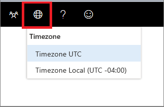

# Configuración de zona horaria del Centro de seguridad de Microsoft Defender

[!INCLUDE [Microsoft 365 Defender rebranding](../../includes/microsoft-defender.md)]

**Se aplica a:**
- [Microsoft Defender para punto de conexión](https://go.microsoft.com/fwlink/p/?linkid=2154037)

>¿Desea experimentar Microsoft Defender para endpoint? [Regístrate para obtener una versión de prueba gratuita.](https://www.microsoft.com/microsoft-365/windows/microsoft-defender-atp?ocid=docs-wdatp-settings-abovefoldlink)

Use el **icono 1 de** configuración de zona horaria del menú Zona  licencia.

## Configuración de zona horaria
El aspecto del tiempo es importante en la evaluación y el análisis de los ciberataques percibidos y reales.

Las investigaciones ciberforensicas suelen basarse en marcas de tiempo para unir la secuencia de eventos. Es importante que el sistema refleje la configuración de zona horaria correcta.

Microsoft Defender para endpoint puede mostrar la hora universal coordinada (UTC) o la hora local.

La configuración actual de la zona horaria se muestra en el menú Microsoft Defender para endpoint. Puede cambiar la zona horaria mostrada en el **menú Zona** horaria.

.

### Zona horaria UTC
Microsoft Defender para endpoint usa la hora UTC de forma predeterminada.

Al establecer la zona horaria de Microsoft Defender para endpoint en UTC, se mostrarán todas las marcas de tiempo del sistema (alertas, eventos y otros) en UTC para todos los usuarios. Esto puede ayudar a los analistas de seguridad que trabajan en diferentes ubicaciones de todo el mundo a usar las mismas marcas de tiempo mientras investigan eventos.

### Zona horaria local
Puedes elegir que Microsoft Defender para endpoint use la configuración de zona horaria local. Todas las alertas y eventos se mostrarán con la zona horaria local.

La zona horaria local se toma de la configuración regional del dispositivo. Si cambia la configuración regional, también cambiará la zona horaria de Microsoft Defender para endpoint. Elegir esta configuración significa que las marcas de tiempo mostradas en Microsoft Defender para endpoint se alinearán a la hora local para todos los usuarios de Microsoft Defender para endpoint. Los analistas ubicados en diferentes ubicaciones globales ahora verán las alertas de Microsoft Defender para endpoint según su configuración regional.

Elegir usar la hora local puede ser útil si los analistas se encuentran en una única ubicación. En este caso, puede ser más fácil correlacionar eventos con la hora local, por ejemplo, cuando un usuario local hizo clic en un vínculo de correo electrónico sospechoso.

### Establecer la zona horaria
La zona horaria de Microsoft Defender para extremo se establece de forma predeterminada en UTC.
Establecer la zona horaria también cambia las horas de todas las vistas de Microsoft Defender para puntos de conexión.
Para establecer la zona horaria:

1. Haga clic en **el icono Configuración** de zona horaria del menú Zona  .
2. Seleccione el **indicador UTC de zona** horaria.
3. Seleccione **Zona horaria UTC** o la zona horaria local, por ejemplo -7:00.

### Configuración regional
Para aplicar diferentes formatos de fecha para Microsoft Defender para endpoint, usa la configuración regional para Internet Explorer (IE) y Microsoft Edge (Edge). Si usas otro explorador como Google Chrome, sigue los pasos necesarios para cambiar la configuración de hora y fecha de ese explorador. 

**Internet Explorer (IE) y Microsoft Edge**

IE y Microsoft Edge usan la **configuración de** región configurada en la **opción Relojes, Idioma y Región** del panel de control. 

#### Problemas conocidos con formatos regionales

**Formatos de fecha y hora** 
Hay algunos problemas conocidos con los formatos de fecha y hora. Si configura la configuración regional en cualquier otro formato que no sea compatible, es posible que el portal no refleje correctamente la configuración.

Se admiten los siguientes formatos de fecha y hora:
- Formato de fecha MM/dd/yyyy
- Formato de fecha dd/MM/yyyy
- Formato de hora hh:mm:ss (formato de 12 horas)

Actualmente no se admiten los siguientes formatos de fecha y hora:
- Formato de fecha yyyy-MM-dd
- Formato de fecha dd-MMM-yy
- Formato de fecha dd/MM/aa
- Formato de fecha MM/dd/aa
- Formato de fecha con yy. Solo se mostrará yyyy.
- Formato de hora HH:mm:ss (formato de 24 horas)

**Símbolo decimal usado en números** 
El símbolo decimal usado siempre es un punto, incluso si se selecciona una coma en la **configuración de** formato Números de la **configuración de** región. Por ejemplo, 15,5K se muestra como 15,5K.

