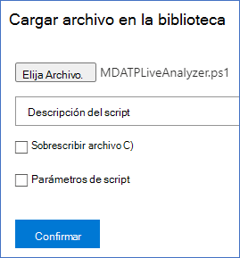
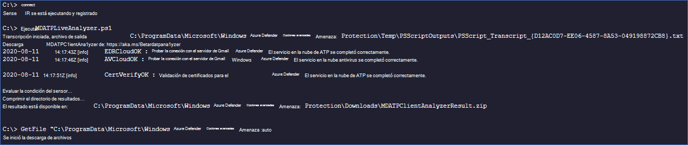

# <a name="collect-support-logs-in-microsoft-defender-for-endpoint-using-live-response"></a><span data-ttu-id="6cdc1-104">Recopilar registros de soporte técnico en Microsoft Defender para endpoint mediante respuesta en directo</span><span class="sxs-lookup"><span data-stu-id="6cdc1-104">Collect support logs in Microsoft Defender for Endpoint using live response</span></span> 


<span data-ttu-id="6cdc1-105">**Se aplica a:**</span><span class="sxs-lookup"><span data-stu-id="6cdc1-105">**Applies to:**</span></span>
- [<span data-ttu-id="6cdc1-106">Microsoft Defender para punto de conexión</span><span class="sxs-lookup"><span data-stu-id="6cdc1-106">Microsoft Defender for Endpoint</span></span>](https://go.microsoft.com/fwlink/p/?linkid=2154037)
- [<span data-ttu-id="6cdc1-107">Microsoft 365 Defender</span><span class="sxs-lookup"><span data-stu-id="6cdc1-107">Microsoft 365 Defender</span></span>](https://go.microsoft.com/fwlink/?linkid=2118804)

> <span data-ttu-id="6cdc1-108">¿Desea experimentar Defender for Endpoint?</span><span class="sxs-lookup"><span data-stu-id="6cdc1-108">Want to experience Defender for Endpoint?</span></span> [<span data-ttu-id="6cdc1-109">Regístrate para obtener una versión de prueba gratuita.</span><span class="sxs-lookup"><span data-stu-id="6cdc1-109">Sign up for a free trial.</span></span>](https://www.microsoft.com/microsoft-365/windows/microsoft-defender-atp?ocid=docs-wdatp-pullalerts-abovefoldlink) 


<span data-ttu-id="6cdc1-110">Al ponerse en contacto con el soporte técnico, es posible que se le pida que proporcione el paquete de salida de la herramienta Analizador de cliente de Microsoft Defender para endpoint.</span><span class="sxs-lookup"><span data-stu-id="6cdc1-110">When contacting support, you may be asked to provide the output package of the Microsoft Defender for Endpoint Client Analyzer tool.</span></span>

<span data-ttu-id="6cdc1-111">En este tema se proporcionan instrucciones sobre cómo ejecutar la herramienta mediante Live Response.</span><span class="sxs-lookup"><span data-stu-id="6cdc1-111">This topic provides instructions on how to run the tool via Live Response.</span></span>

1. <span data-ttu-id="6cdc1-112">Descargar el script adecuado</span><span class="sxs-lookup"><span data-stu-id="6cdc1-112">Download the appropriate script</span></span>
    * <span data-ttu-id="6cdc1-113">Solo los registros del sensor de cliente de Microsoft Defender [ para endpoint:LiveAnalyzer.ps1 script](https://aka.ms/MDELiveAnalyzer).</span><span class="sxs-lookup"><span data-stu-id="6cdc1-113">Microsoft Defender for Endpoint client sensor logs only: [LiveAnalyzer.ps1 script](https://aka.ms/MDELiveAnalyzer).</span></span>
      - <span data-ttu-id="6cdc1-114">Tamaño aproximado del paquete de resultados: ~100Kb</span><span class="sxs-lookup"><span data-stu-id="6cdc1-114">Result package approximate size: ~100Kb</span></span> 
    *  <span data-ttu-id="6cdc1-115">Sensor de cliente de Microsoft Defender para endpoint y registros antivirus: [LiveAnalyzer+MDAV.ps1 script](https://aka.ms/MDELiveAnalyzerAV).</span><span class="sxs-lookup"><span data-stu-id="6cdc1-115">Microsoft Defender for Endpoint client sensor and Antivirus logs: [LiveAnalyzer+MDAV.ps1 script](https://aka.ms/MDELiveAnalyzerAV).</span></span>
       - <span data-ttu-id="6cdc1-116">Tamaño aproximado del paquete de resultados: ~10Mb</span><span class="sxs-lookup"><span data-stu-id="6cdc1-116">Result package approximate size: ~10Mb</span></span> 
 
2.  <span data-ttu-id="6cdc1-117">Inicie una [sesión de respuesta en](live-response.md#initiate-a-live-response-session-on-a-device) directo en el equipo que necesita investigar.</span><span class="sxs-lookup"><span data-stu-id="6cdc1-117">Initiate a [Live Response session](live-response.md#initiate-a-live-response-session-on-a-device) on the machine you need to investigate.</span></span>

3.  <span data-ttu-id="6cdc1-118">Seleccione **Upload archivo a la biblioteca**.</span><span class="sxs-lookup"><span data-stu-id="6cdc1-118">Select **Upload file to library**.</span></span>

    

4. <span data-ttu-id="6cdc1-120">Seleccione **Elegir archivo**.</span><span class="sxs-lookup"><span data-stu-id="6cdc1-120">Select **Choose file**.</span></span>

    

5. <span data-ttu-id="6cdc1-122">Seleccione el archivo descargado denominado MDELiveAnalyzer.ps1 y, a continuación, haga clic en **Confirmar**</span><span class="sxs-lookup"><span data-stu-id="6cdc1-122">Select the downloaded file named MDELiveAnalyzer.ps1 and then click on **Confirm**</span></span>


   


6. <span data-ttu-id="6cdc1-124">Mientras sigue en la sesión de LiveResponse, use los comandos siguientes para ejecutar el analizador y recopilar el archivo de resultados:</span><span class="sxs-lookup"><span data-stu-id="6cdc1-124">While still in the LiveResponse session, use the commands below to run the analyzer and collect the result file:</span></span>

    ```console
    Run MDELiveAnalyzer.ps1
    GetFile "C:\ProgramData\Microsoft\Windows Defender Advanced Threat Protection\Downloads\MDEClientAnalyzerResult.zip"
    ```

    <span data-ttu-id="6cdc1-125">[](images/analyzer-commands.png#lightbox)</span><span class="sxs-lookup"><span data-stu-id="6cdc1-125">[  ](images/analyzer-commands.png#lightbox)</span></span>


>[!NOTE]
> - <span data-ttu-id="6cdc1-126">La versión preliminar más reciente de MDEClientAnalyzer se puede descargar aquí: [https://aka.ms/Betamdeanalyzer](https://aka.ms/Betamdeanalyzer) .</span><span class="sxs-lookup"><span data-stu-id="6cdc1-126">The latest preview version of MDEClientAnalyzer can be downloaded here: [https://aka.ms/Betamdeanalyzer](https://aka.ms/Betamdeanalyzer).</span></span>
> 
> - <span data-ttu-id="6cdc1-127">El script LiveAnalyzer descarga el paquete de solución de problemas en el equipo de destino desde: https://mdatpclientanalyzer.blob.core.windows.net .</span><span class="sxs-lookup"><span data-stu-id="6cdc1-127">The LiveAnalyzer script downloads the troubleshooting package on the destination machine from: https://mdatpclientanalyzer.blob.core.windows.net.</span></span>
> 
>   <span data-ttu-id="6cdc1-128">Si no puede permitir que el equipo llegue a la dirección URL anterior, cargue MDEClientAnalyzerPreview.zip archivo en la biblioteca antes de ejecutar el script LiveAnalyzer:</span><span class="sxs-lookup"><span data-stu-id="6cdc1-128">If you cannot allow the machine to reach the above URL, then upload MDEClientAnalyzerPreview.zip file to the library before running the LiveAnalyzer script:</span></span>
>
>   ```console
>   PutFile MDEClientAnalyzerPreview.zip -overwrite
>   Run MDELiveAnalyzer.ps1
>   GetFile "C:\ProgramData\Microsoft\Windows Defender Advanced Threat Protection\Downloads\MDEClientAnalyzerResult.zip" 
>   ```
> 
> - <span data-ttu-id="6cdc1-129">Para obtener más información sobre la recopilación de datos localmente en una máquina en caso de que la máquina no se comunique con Microsoft Defender para los servicios en la nube de endpoints o no aparezca en el portal de Microsoft Defender para endpoints como se esperaba, consulte [Verify client connectivity to Microsoft Defender for Endpoint service URLs](configure-proxy-internet.md#verify-client-connectivity-to-microsoft-defender-for-endpoint-service-urls).</span><span class="sxs-lookup"><span data-stu-id="6cdc1-129">For more information on gathering data locally on a machine in case the machine isn't communicating with Microsoft Defender for Endpoint cloud services, or does not appear in Microsoft Defender for Endpoint portal as expected, see [Verify client connectivity to Microsoft Defender for Endpoint service URLs](configure-proxy-internet.md#verify-client-connectivity-to-microsoft-defender-for-endpoint-service-urls).</span></span>
