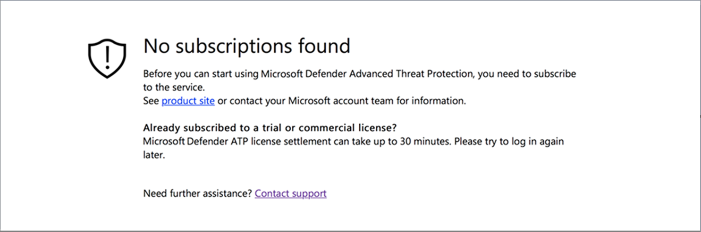
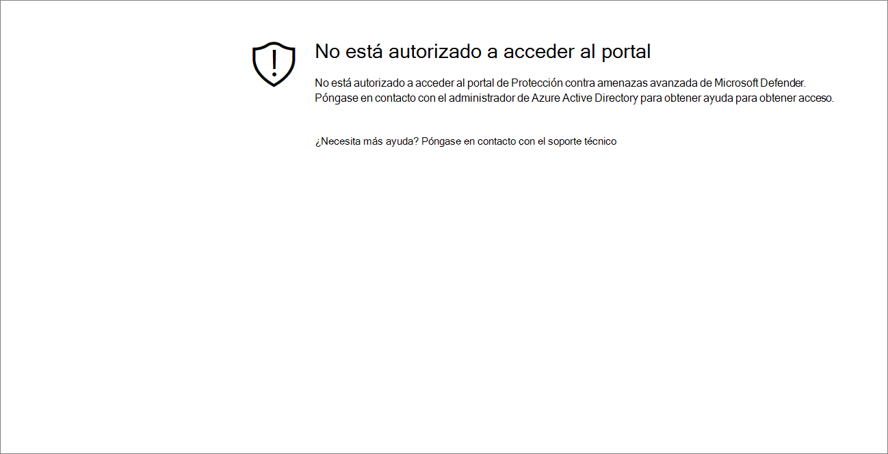
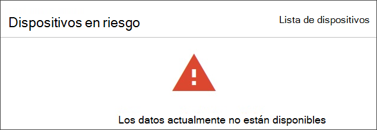

# Solucionar problemas de acceso a portales y suscripciones

[!INCLUDE [Microsoft 365 Defender rebranding](../../includes/microsoft-defender.md)]

**Se aplica a:**
- [Microsoft Defender para punto de conexión](https://go.microsoft.com/fwlink/p/?linkid=2154037)
- [Microsoft 365 Defender](https://go.microsoft.com/fwlink/?linkid=2118804)

>¿Desea experimentar Microsoft Defender para endpoint? [Regístrate para obtener una versión de prueba gratuita.](https://www.microsoft.com/microsoft-365/windows/microsoft-defender-atp?ocid=docs-wdatp-troublshootonboarding-abovefoldlink)

En esta página se proporcionan pasos detallados para solucionar problemas que pueden producirse al configurar el servicio de Microsoft Defender para puntos de conexión.

Si recibe un mensaje de error, el Centro de seguridad de Microsoft Defender proporcionará una explicación detallada sobre el problema y se proporcionarán vínculos relevantes.

## No se encontraron suscripciones

Si al acceder al Centro de seguridad de Microsoft Defender recibe un mensaje No se encontró ninguna suscripción, significa que Azure Active Directory (Azure AD) usado para iniciar sesión en el usuario en el portal, **no** tiene una licencia de Microsoft Defender para endpoints.

Posibles razones:
- Las licencias de Windows E5 y Office E5 son licencias separadas.
- La licencia se compró pero no se aprovisionó en esta instancia de Azure AD.
    - Podría ser un problema de aprovisionamiento de licencias.
    - Podría ser que aprovisionó accidentalmente la licencia a un Microsoft Azure AD diferente al que se usa para la autenticación en el servicio.

En ambos casos, debes ponerse en contacto con el soporte técnico de Microsoft en [General Microsoft Defender para](https://support.microsoft.com/getsupport?wf=0&tenant=ClassicCommercial&oaspworkflow=start_1.0.0.0&locale=en-us&supportregion=en-us&pesid=16055&ccsid=636419533611396913) soporte técnico de endpoints o compatibilidad con licencias por [volumen.](https://www.microsoft.com/licensing/servicecenter/Help/Contact.aspx)

## Su suscripción ha expirado

Si al acceder al Centro de seguridad de Microsoft Defender recibe un mensaje Su **suscripción** ha expirado, la suscripción al servicio en línea ha expirado. La suscripción de Microsoft Defender para endpoint, como cualquier otra suscripción de servicio en línea, tiene una fecha de expiración. 

Puede elegir renovar o ampliar la licencia en cualquier momento. Al acceder al portal después  de la fecha de expiración, se mostrará una opción para descargar el paquete de descarga del dispositivo después de la fecha de expiración, en caso de que decidas no renovar la licencia.

> [!NOTE]
> Por motivos de seguridad, el paquete usado para dispositivos offboard expirará 30 días después de la fecha en que se descargó. Se rechazarán los paquetes de offboarding expirados enviados a un dispositivo. Al descargar un paquete de offboarding, se le notificará la fecha de expiración de los paquetes y también se incluirá en el nombre del paquete.

## No está autorizado a acceder al portal

Si recibe un You **are not authorized to access the portal**, tenga en cuenta que Microsoft Defender for Endpoint es un producto de supervisión de seguridad, investigación de incidentes y respuesta y, como tal, el acceso a él está restringido y controlado por el usuario.
Para obtener más información, vea [**Asignar acceso de usuario al portal**](https://docs.microsoft.com/windows/threat-protection/windows-defender-atp/assign-portal-access-windows-defender-advanced-threat-protection).

## Actualmente, los datos no están disponibles en algunas secciones del portal
Si el panel del portal y otras secciones muestran un mensaje de error como "Los datos actualmente no están disponibles":

Tendrás que permitir los `securitycenter.windows.com` subdominios y todos los subdominios que hay en él. Por ejemplo, `*.securitycenter.windows.com`.

## Problemas de comunicación del portal
Si tiene problemas con el acceso al portal, la falta de datos o el acceso restringido a partes del portal, deberá comprobar que las siguientes direcciones URL están permitidas y abiertas para la comunicación.

- `*.blob.core.windows.net`
- `crl.microsoft.com`
- `https://*.microsoftonline-p.com`
- `https://*.securitycenter.windows.com` 
- `https://automatediracs-eus-prd.securitycenter.windows.com`
- `https://login.microsoftonline.com`
- `https://login.windows.net`
- `https://onboardingpackagescusprd.blob.core.windows.net`
- `https://secure.aadcdn.microsoftonline-p.com` 
- `https://securitycenter.windows.com` 
- `https://static2.sharepointonline.com` 

