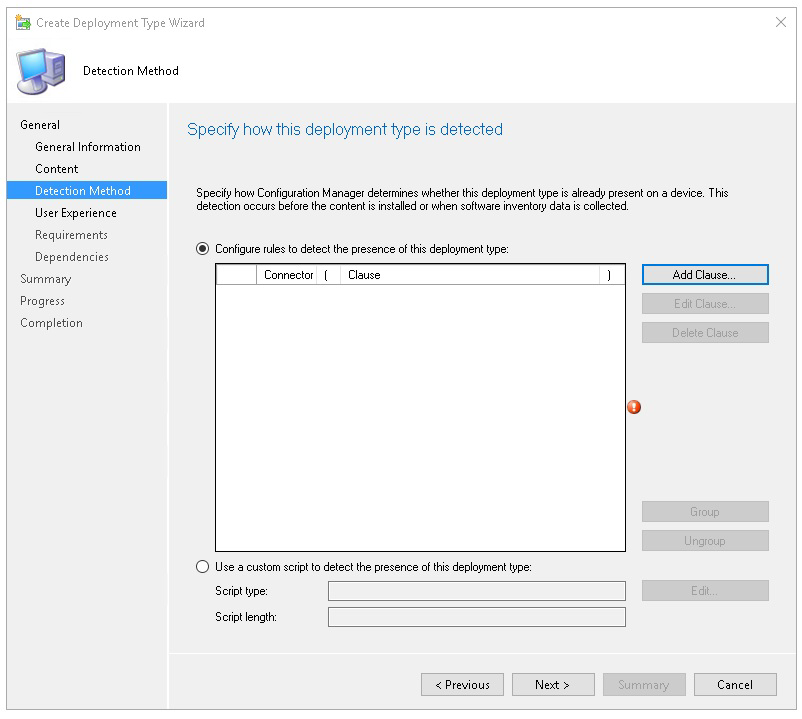
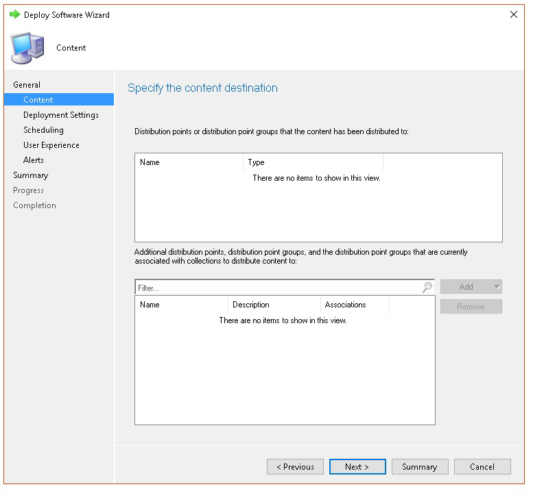

# <a name="troubleshoot-microsoft-defender-for-endpoint-onboarding-issues"></a><span data-ttu-id="d882a-104">Solucionar problemas de incorporación de puntos de conexión de Microsoft Defender</span><span class="sxs-lookup"><span data-stu-id="d882a-104">Troubleshoot Microsoft Defender for Endpoint onboarding issues</span></span>

[!INCLUDE [Microsoft 365 Defender rebranding](../../includes/microsoft-defender.md)]


<span data-ttu-id="d882a-105">**Se aplica a:**</span><span class="sxs-lookup"><span data-stu-id="d882a-105">**Applies to:**</span></span>

- [<span data-ttu-id="d882a-106">Microsoft Defender para punto de conexión</span><span class="sxs-lookup"><span data-stu-id="d882a-106">Microsoft Defender for Endpoint</span></span>](https://go.microsoft.com/fwlink/?linkid=2154037)
- <span data-ttu-id="d882a-107">Windows Server 2012 R2</span><span class="sxs-lookup"><span data-stu-id="d882a-107">Windows Server 2012 R2</span></span>
- <span data-ttu-id="d882a-108">Windows Server 2016</span><span class="sxs-lookup"><span data-stu-id="d882a-108">Windows Server 2016</span></span>
- [<span data-ttu-id="d882a-109">Microsoft 365 Defender</span><span class="sxs-lookup"><span data-stu-id="d882a-109">Microsoft 365 Defender</span></span>](https://go.microsoft.com/fwlink/?linkid=2118804)

> <span data-ttu-id="d882a-110">¿Desea experimentar Defender for Endpoint?</span><span class="sxs-lookup"><span data-stu-id="d882a-110">Want to experience Defender for Endpoint?</span></span> [<span data-ttu-id="d882a-111">Regístrate para obtener una versión de prueba gratuita.</span><span class="sxs-lookup"><span data-stu-id="d882a-111">Sign up for a free trial.</span></span>](https://www.microsoft.com/microsoft-365/windows/microsoft-defender-atp?ocid=docs-wdatp-pullalerts-abovefoldlink) 

<span data-ttu-id="d882a-112">Es posible que deba solucionar problemas en el proceso de incorporación de Microsoft Defender para endpoints si tiene problemas.</span><span class="sxs-lookup"><span data-stu-id="d882a-112">You might need to troubleshoot the Microsoft Defender for Endpoint onboarding process if you encounter issues.</span></span>
<span data-ttu-id="d882a-113">En esta página se proporcionan pasos detallados para solucionar problemas de incorporación que pueden producirse al implementar con una de las herramientas de implementación y errores comunes que pueden producirse en los dispositivos.</span><span class="sxs-lookup"><span data-stu-id="d882a-113">This page provides detailed steps to troubleshoot onboarding issues that might occur when deploying with one of the deployment tools and common errors that might occur on the devices.</span></span>

## <a name="troubleshoot-issues-with-onboarding-tools"></a><span data-ttu-id="d882a-114">Solucionar problemas con las herramientas de incorporación</span><span class="sxs-lookup"><span data-stu-id="d882a-114">Troubleshoot issues with onboarding tools</span></span>

<span data-ttu-id="d882a-115">Si ha completado el proceso de incorporación y [](investigate-machines.md) no ve dispositivos en la lista dispositivos después de una hora, puede indicar un problema de incorporación o conectividad.</span><span class="sxs-lookup"><span data-stu-id="d882a-115">If you have completed the onboarding process and don't see devices in the [Devices list](investigate-machines.md) after an hour, it might indicate an onboarding or connectivity problem.</span></span>

### <a name="troubleshoot-onboarding-when-deploying-with-group-policy"></a><span data-ttu-id="d882a-116">Solucionar problemas de incorporación al implementar con directiva de grupo</span><span class="sxs-lookup"><span data-stu-id="d882a-116">Troubleshoot onboarding when deploying with Group Policy</span></span>

<span data-ttu-id="d882a-117">La implementación con directiva de grupo se realiza ejecutando el script de incorporación en los dispositivos.</span><span class="sxs-lookup"><span data-stu-id="d882a-117">Deployment with Group Policy is done by running the onboarding script on the devices.</span></span> <span data-ttu-id="d882a-118">La consola de directiva de grupo no indica si la implementación se ha hecho correctamente o no.</span><span class="sxs-lookup"><span data-stu-id="d882a-118">The Group Policy console does not indicate if the deployment has succeeded or not.</span></span>

<span data-ttu-id="d882a-119">Si ha completado el proceso de incorporación y [](investigate-machines.md) no ve dispositivos en la lista Dispositivos después de una hora, puede comprobar el resultado del script en los dispositivos.</span><span class="sxs-lookup"><span data-stu-id="d882a-119">If you have completed the onboarding process and don't see devices in the [Devices list](investigate-machines.md) after an hour, you can check the output of the script on the devices.</span></span> <span data-ttu-id="d882a-120">Para obtener más información, vea [Troubleshoot onboarding when deploying with a script](#troubleshoot-onboarding-when-deploying-with-a-script).</span><span class="sxs-lookup"><span data-stu-id="d882a-120">For more information, see [Troubleshoot onboarding when deploying with a script](#troubleshoot-onboarding-when-deploying-with-a-script).</span></span>

<span data-ttu-id="d882a-121">Si el script se completa correctamente, consulta Solucionar problemas de [incorporación](#troubleshoot-onboarding-issues-on-the-device) en los dispositivos para ver si se producen errores adicionales.</span><span class="sxs-lookup"><span data-stu-id="d882a-121">If the script completes successfully, see [Troubleshoot onboarding issues on the devices](#troubleshoot-onboarding-issues-on-the-device) for additional errors that might occur.</span></span>

### <a name="troubleshoot-onboarding-issues-when-deploying-with-microsoft-endpoint-configuration-manager"></a><span data-ttu-id="d882a-122">Solucionar problemas de incorporación al implementar con Microsoft Endpoint Configuration Manager</span><span class="sxs-lookup"><span data-stu-id="d882a-122">Troubleshoot onboarding issues when deploying with Microsoft Endpoint Configuration Manager</span></span>

<span data-ttu-id="d882a-123">Al incorporar dispositivos con las siguientes versiones de Configuration Manager:</span><span class="sxs-lookup"><span data-stu-id="d882a-123">When onboarding devices using the following versions of Configuration Manager:</span></span>

- <span data-ttu-id="d882a-124">Microsoft Endpoint Configuration Manager</span><span class="sxs-lookup"><span data-stu-id="d882a-124">Microsoft Endpoint Configuration Manager</span></span>
- <span data-ttu-id="d882a-125">System Center 2012 Configuration Manager</span><span class="sxs-lookup"><span data-stu-id="d882a-125">System Center 2012 Configuration Manager</span></span>
- <span data-ttu-id="d882a-126">Administrador de configuración de System Center 2012 R2</span><span class="sxs-lookup"><span data-stu-id="d882a-126">System Center 2012 R2 Configuration Manager</span></span>

<span data-ttu-id="d882a-127">La implementación con las versiones anteriores de Configuration Manager se realiza ejecutando el script de incorporación en los dispositivos.</span><span class="sxs-lookup"><span data-stu-id="d882a-127">Deployment with the above-mentioned versions of Configuration Manager is done by running the onboarding script on the devices.</span></span> <span data-ttu-id="d882a-128">Puede realizar un seguimiento de la implementación en la consola de Configuration Manager.</span><span class="sxs-lookup"><span data-stu-id="d882a-128">You can track the deployment in the Configuration Manager Console.</span></span>

<span data-ttu-id="d882a-129">Si se produce un error en la implementación, puede comprobar el resultado del script en los dispositivos.</span><span class="sxs-lookup"><span data-stu-id="d882a-129">If the deployment fails, you can check the output of the script on the devices.</span></span>

<span data-ttu-id="d882a-130">Si la incorporación se completó correctamente pero los  dispositivos no aparecen [](#troubleshoot-onboarding-issues-on-the-device) en la lista dispositivos después de una hora, consulta Solucionar problemas de incorporación en el dispositivo para ver si se producen errores adicionales.</span><span class="sxs-lookup"><span data-stu-id="d882a-130">If the onboarding completed successfully but the devices are not showing up in the **Devices list** after an hour, see [Troubleshoot onboarding issues on the device](#troubleshoot-onboarding-issues-on-the-device) for additional errors that might occur.</span></span>

### <a name="troubleshoot-onboarding-when-deploying-with-a-script"></a><span data-ttu-id="d882a-131">Solucionar problemas de incorporación al implementar con un script</span><span class="sxs-lookup"><span data-stu-id="d882a-131">Troubleshoot onboarding when deploying with a script</span></span>

<span data-ttu-id="d882a-132">**Compruebe el resultado del script en el dispositivo:**</span><span class="sxs-lookup"><span data-stu-id="d882a-132">**Check the result of the script on the device:**</span></span>

1. <span data-ttu-id="d882a-133">Haga **clic en Inicio**, escriba Visor de **eventos** y presione **Entrar**.</span><span class="sxs-lookup"><span data-stu-id="d882a-133">Click **Start**, type **Event Viewer**, and press **Enter**.</span></span>

2. <span data-ttu-id="d882a-134">Vaya a **Windows Logs**  >  **Application**.</span><span class="sxs-lookup"><span data-stu-id="d882a-134">Go to **Windows Logs** > **Application**.</span></span>

3. <span data-ttu-id="d882a-135">Busque un evento del origen **de eventos WDATPOnboarding.**</span><span class="sxs-lookup"><span data-stu-id="d882a-135">Look for an event from **WDATPOnboarding** event source.</span></span>

<span data-ttu-id="d882a-136">Si el script falla y el evento es un error, puede comprobar el identificador de evento en la tabla siguiente para ayudarle a solucionar el problema.</span><span class="sxs-lookup"><span data-stu-id="d882a-136">If the script fails and the event is an error, you can check the event ID in the following table to help you troubleshoot the issue.</span></span>

> [!NOTE]
> <span data-ttu-id="d882a-137">Los siguientes IDs de eventos son específicos solo del script de incorporación.</span><span class="sxs-lookup"><span data-stu-id="d882a-137">The following event IDs are specific to the onboarding script only.</span></span>

<span data-ttu-id="d882a-138">Id. de evento</span><span class="sxs-lookup"><span data-stu-id="d882a-138">Event ID</span></span> | <span data-ttu-id="d882a-139">Tipo de error</span><span class="sxs-lookup"><span data-stu-id="d882a-139">Error Type</span></span> | <span data-ttu-id="d882a-140">Pasos de resolución</span><span class="sxs-lookup"><span data-stu-id="d882a-140">Resolution steps</span></span>
:---:|:---|:---
 `5` | <span data-ttu-id="d882a-141">Se encontraron datos de offboarding, pero no se pudieron eliminar</span><span class="sxs-lookup"><span data-stu-id="d882a-141">Offboarding data was found but couldn't be deleted</span></span> | <span data-ttu-id="d882a-142">Comprobar los permisos en el Registro, específicamente</span><span class="sxs-lookup"><span data-stu-id="d882a-142">Check the permissions on the registry, specifically</span></span><br> <span data-ttu-id="d882a-143">`HKLM\SOFTWARE\Policies\Microsoft\Windows Advanced Threat Protection`.</span><span class="sxs-lookup"><span data-stu-id="d882a-143">`HKLM\SOFTWARE\Policies\Microsoft\Windows Advanced Threat Protection`.</span></span>
`10` | <span data-ttu-id="d882a-144">Los datos de incorporación no se pudieron escribir en el Registro</span><span class="sxs-lookup"><span data-stu-id="d882a-144">Onboarding data couldn't be written to registry</span></span> |  <span data-ttu-id="d882a-145">Comprobar los permisos en el Registro, específicamente</span><span class="sxs-lookup"><span data-stu-id="d882a-145">Check the permissions on the registry, specifically</span></span><br> <span data-ttu-id="d882a-146">`HKLM\SOFTWARE\Policies\Microsoft\Windows Advanced Threat Protection`.</span><span class="sxs-lookup"><span data-stu-id="d882a-146">`HKLM\SOFTWARE\Policies\Microsoft\Windows Advanced Threat Protection`.</span></span><br><span data-ttu-id="d882a-147">Compruebe que el script se ha ejecutado como administrador.</span><span class="sxs-lookup"><span data-stu-id="d882a-147">Verify that the script has been run as an administrator.</span></span>
`15` |  <span data-ttu-id="d882a-148">Error al iniciar el servicio SENSE</span><span class="sxs-lookup"><span data-stu-id="d882a-148">Failed to start SENSE service</span></span> |<span data-ttu-id="d882a-149">Compruebe el estado del servicio ( `sc query sense` comando).</span><span class="sxs-lookup"><span data-stu-id="d882a-149">Check the service health (`sc query sense` command).</span></span> <span data-ttu-id="d882a-150">Asegúrese de que no está en un estado intermedio (*'Pending_Stopped',* *'Pending_Running'*) e intente volver a ejecutar el script (con derechos de administrador).</span><span class="sxs-lookup"><span data-stu-id="d882a-150">Make sure it's not in an intermediate state (*'Pending_Stopped'*, *'Pending_Running'*) and try to run the script again (with administrator rights).</span></span> <br> <br> <span data-ttu-id="d882a-151">Si el dispositivo se ejecuta Windows 10, la versión 1607 y la ejecución del comando `sc query sense` devuelve , reinicie el `START_PENDING` dispositivo.</span><span class="sxs-lookup"><span data-stu-id="d882a-151">If the device is running Windows 10, version 1607 and running the command `sc query sense` returns `START_PENDING`, reboot the device.</span></span> <span data-ttu-id="d882a-152">Si reiniciar el dispositivo no aborda el problema, actualice a KB4015217 e intente incorporarlo de nuevo.</span><span class="sxs-lookup"><span data-stu-id="d882a-152">If rebooting the device doesn't address the issue, upgrade to KB4015217 and try onboarding again.</span></span>
`15` | <span data-ttu-id="d882a-153">Error al iniciar el servicio SENSE</span><span class="sxs-lookup"><span data-stu-id="d882a-153">Failed to start SENSE service</span></span> | <span data-ttu-id="d882a-154">Si el mensaje del error es: Error del sistema 577 o error 1058, debe habilitar el controlador ELAM de Antivirus de Microsoft Defender, consulte [Ensure that Antivirus de Microsoft Defender is not disabled by a policy](#ensure-that-microsoft-defender-antivirus-is-not-disabled-by-a-policy) for instructions.</span><span class="sxs-lookup"><span data-stu-id="d882a-154">If the message of the error is: System error 577  or error 1058 has occurred, you need to enable the Microsoft Defender Antivirus ELAM driver, see [Ensure that Microsoft Defender Antivirus is not disabled by a policy](#ensure-that-microsoft-defender-antivirus-is-not-disabled-by-a-policy) for instructions.</span></span>
`30` |  <span data-ttu-id="d882a-155">El script no pudo esperar a que el servicio comenzara a ejecutarse</span><span class="sxs-lookup"><span data-stu-id="d882a-155">The script failed to wait for the service to start running</span></span> | <span data-ttu-id="d882a-156">El servicio podría haber necesitado más tiempo para iniciarse o haber encontrado errores al intentar iniciarse.</span><span class="sxs-lookup"><span data-stu-id="d882a-156">The service could have taken more time to start or has encountered errors while trying to start.</span></span> <span data-ttu-id="d882a-157">Para obtener más información sobre los eventos y errores relacionados con SENSE, vea [Review events and errors using Event viewer](event-error-codes.md).</span><span class="sxs-lookup"><span data-stu-id="d882a-157">For more information on events and errors related to SENSE, see [Review events and errors using Event viewer](event-error-codes.md).</span></span>
`35` |  <span data-ttu-id="d882a-158">El script no pudo encontrar el valor del Registro de estado de incorporación necesario</span><span class="sxs-lookup"><span data-stu-id="d882a-158">The script failed to find needed onboarding status registry value</span></span> | <span data-ttu-id="d882a-159">Cuando el servicio SENSE se inicia por primera vez, escribe el estado de incorporación en la ubicación del Registro</span><span class="sxs-lookup"><span data-stu-id="d882a-159">When the SENSE service starts for the first time, it writes onboarding status to the registry location</span></span><br><span data-ttu-id="d882a-160">`HKLM\SOFTWARE\Microsoft\Windows Advanced Threat Protection\Status`.</span><span class="sxs-lookup"><span data-stu-id="d882a-160">`HKLM\SOFTWARE\Microsoft\Windows Advanced Threat Protection\Status`.</span></span><br> <span data-ttu-id="d882a-161">El script no pudo encontrarlo después de varios segundos.</span><span class="sxs-lookup"><span data-stu-id="d882a-161">The script failed to find it after several seconds.</span></span> <span data-ttu-id="d882a-162">Puedes probarla manualmente y comprobar si está ahí.</span><span class="sxs-lookup"><span data-stu-id="d882a-162">You can manually test it and check if it's there.</span></span> <span data-ttu-id="d882a-163">Para obtener más información sobre los eventos y errores relacionados con SENSE, vea [Review events and errors using Event viewer](event-error-codes.md).</span><span class="sxs-lookup"><span data-stu-id="d882a-163">For more information on events and errors related to SENSE, see [Review events and errors using Event viewer](event-error-codes.md).</span></span>
`40` | <span data-ttu-id="d882a-164">El estado de incorporación del servicio SENSE no está establecido en **1**</span><span class="sxs-lookup"><span data-stu-id="d882a-164">SENSE service onboarding status is not set to **1**</span></span> | <span data-ttu-id="d882a-165">El servicio SENSE no se ha incorporado correctamente.</span><span class="sxs-lookup"><span data-stu-id="d882a-165">The SENSE service has failed to onboard properly.</span></span> <span data-ttu-id="d882a-166">Para obtener más información sobre los eventos y errores relacionados con SENSE, vea [Review events and errors using Event viewer](event-error-codes.md).</span><span class="sxs-lookup"><span data-stu-id="d882a-166">For more information on events and errors related to SENSE, see [Review events and errors using Event viewer](event-error-codes.md).</span></span>
`65` | <span data-ttu-id="d882a-167">Privilegios insuficientes</span><span class="sxs-lookup"><span data-stu-id="d882a-167">Insufficient privileges</span></span>| <span data-ttu-id="d882a-168">Vuelva a ejecutar el script con privilegios de administrador.</span><span class="sxs-lookup"><span data-stu-id="d882a-168">Run the script again with administrator privileges.</span></span>

### <a name="troubleshoot-onboarding-issues-using-microsoft-intune"></a><span data-ttu-id="d882a-169">Solucionar problemas de incorporación mediante Microsoft Intune</span><span class="sxs-lookup"><span data-stu-id="d882a-169">Troubleshoot onboarding issues using Microsoft Intune</span></span>

<span data-ttu-id="d882a-170">Puede usar Microsoft Intune para comprobar los códigos de error e intentar solucionar la causa del problema.</span><span class="sxs-lookup"><span data-stu-id="d882a-170">You can use Microsoft Intune to check error codes and attempt to troubleshoot the cause of the issue.</span></span>

<span data-ttu-id="d882a-171">Si has configurado directivas en Intune y no se propagan en dispositivos, es posible que debas configurar la inscripción automática de MDM.</span><span class="sxs-lookup"><span data-stu-id="d882a-171">If you have configured policies in Intune and they are not propagated on devices, you might need to configure automatic MDM enrollment.</span></span>

<span data-ttu-id="d882a-172">Use las tablas siguientes para comprender las posibles causas de problemas durante la incorporación:</span><span class="sxs-lookup"><span data-stu-id="d882a-172">Use the following tables to understand the possible causes of issues while onboarding:</span></span>

- <span data-ttu-id="d882a-173">Microsoft Intune códigos de error y OMA-URIs tabla</span><span class="sxs-lookup"><span data-stu-id="d882a-173">Microsoft Intune error codes and OMA-URIs table</span></span>
- <span data-ttu-id="d882a-174">Problemas conocidos con la tabla de no cumplimiento</span><span class="sxs-lookup"><span data-stu-id="d882a-174">Known issues with non-compliance table</span></span>
- <span data-ttu-id="d882a-175">Tabla de registros de eventos de administración de dispositivos móviles (MDM)</span><span class="sxs-lookup"><span data-stu-id="d882a-175">Mobile Device Management (MDM) event logs table</span></span>

<span data-ttu-id="d882a-176">Si ninguno de los registros de eventos y los pasos de solución de problemas funcionan, descargue el script Local de la sección **Administración** de dispositivos del portal y ejecutarlo en un símbolo del sistema con privilegios elevados.</span><span class="sxs-lookup"><span data-stu-id="d882a-176">If none of the event logs and troubleshooting steps work, download the Local script from the **Device management** section of the portal, and run it in an elevated command prompt.</span></span>

#### <a name="microsoft-intune-error-codes-and-oma-uris"></a><span data-ttu-id="d882a-177">Microsoft Intune códigos de error y OMA-URIs</span><span class="sxs-lookup"><span data-stu-id="d882a-177">Microsoft Intune error codes and OMA-URIs</span></span>

<span data-ttu-id="d882a-178">Hexadecimal de código de error</span><span class="sxs-lookup"><span data-stu-id="d882a-178">Error Code Hex</span></span> | <span data-ttu-id="d882a-179">Código de error Dec</span><span class="sxs-lookup"><span data-stu-id="d882a-179">Error Code Dec</span></span> | <span data-ttu-id="d882a-180">Descripción del error</span><span class="sxs-lookup"><span data-stu-id="d882a-180">Error Description</span></span> | <span data-ttu-id="d882a-181">OMA-URI</span><span class="sxs-lookup"><span data-stu-id="d882a-181">OMA-URI</span></span> | <span data-ttu-id="d882a-182">Posibles pasos de causa y solución de problemas</span><span class="sxs-lookup"><span data-stu-id="d882a-182">Possible cause and troubleshooting steps</span></span>
:---:|:---|:---|:---|:---
<span data-ttu-id="d882a-183">0x87D1FDE8</span><span class="sxs-lookup"><span data-stu-id="d882a-183">0x87D1FDE8</span></span> | <span data-ttu-id="d882a-184">-2016281112</span><span class="sxs-lookup"><span data-stu-id="d882a-184">-2016281112</span></span> | <span data-ttu-id="d882a-185">Error de corrección</span><span class="sxs-lookup"><span data-stu-id="d882a-185">Remediation failed</span></span> | <span data-ttu-id="d882a-186">Incorporación</span><span class="sxs-lookup"><span data-stu-id="d882a-186">Onboarding</span></span> <br> <span data-ttu-id="d882a-187">Offboarding</span><span class="sxs-lookup"><span data-stu-id="d882a-187">Offboarding</span></span> | <span data-ttu-id="d882a-188">**Causa posible:** Error en la incorporación o el offboarding en un blob incorrecto: firma incorrecta o faltaban campos PreviousOrgIds.</span><span class="sxs-lookup"><span data-stu-id="d882a-188">**Possible cause:** Onboarding or offboarding failed on a wrong blob: wrong signature or missing PreviousOrgIds fields.</span></span> <br><br> <span data-ttu-id="d882a-189">**Pasos de solución de problemas:**</span><span class="sxs-lookup"><span data-stu-id="d882a-189">**Troubleshooting steps:**</span></span> <br> <span data-ttu-id="d882a-190">Compruebe los IDs de eventos en la sección Ver errores de incorporación de [agentes en la sección registro de eventos del](#view-agent-onboarding-errors-in-the-device-event-log) dispositivo.</span><span class="sxs-lookup"><span data-stu-id="d882a-190">Check the event IDs in the [View agent onboarding errors in the device event log](#view-agent-onboarding-errors-in-the-device-event-log) section.</span></span> <br><br> <span data-ttu-id="d882a-191">Compruebe los registros de eventos MDM en la tabla siguiente o siga las instrucciones de Diagnosticar errores [de MDM en Windows 10](/windows/client-management/mdm/diagnose-mdm-failures-in-windows-10).</span><span class="sxs-lookup"><span data-stu-id="d882a-191">Check the MDM event logs in the following table or follow the instructions in [Diagnose MDM failures in Windows 10](/windows/client-management/mdm/diagnose-mdm-failures-in-windows-10).</span></span>
 | | | | <span data-ttu-id="d882a-192">Incorporación</span><span class="sxs-lookup"><span data-stu-id="d882a-192">Onboarding</span></span> <br> <span data-ttu-id="d882a-193">Offboarding</span><span class="sxs-lookup"><span data-stu-id="d882a-193">Offboarding</span></span> <br> <span data-ttu-id="d882a-194">SampleSharing</span><span class="sxs-lookup"><span data-stu-id="d882a-194">SampleSharing</span></span> | <span data-ttu-id="d882a-195">**Causa posible:** La clave del Registro de Microsoft Defender para directiva de extremo no existe o el cliente de OMA DM no tiene permisos para escribir en ella.</span><span class="sxs-lookup"><span data-stu-id="d882a-195">**Possible cause:** Microsoft Defender for Endpoint Policy registry key does not exist or the OMA DM client doesn't have permissions to write to it.</span></span> <br><br> <span data-ttu-id="d882a-196">**Pasos de solución de problemas:** Asegúrese de que existe la siguiente clave del Registro: `HKEY_LOCAL_MACHINE\SOFTWARE\Policies\Microsoft\Windows Advanced Threat Protection`</span><span class="sxs-lookup"><span data-stu-id="d882a-196">**Troubleshooting steps:** Ensure that the following registry key exists: `HKEY_LOCAL_MACHINE\SOFTWARE\Policies\Microsoft\Windows Advanced Threat Protection`</span></span> <br> <br> <span data-ttu-id="d882a-197">Si no existe, abra un comando con privilegios elevados y agregue la clave.</span><span class="sxs-lookup"><span data-stu-id="d882a-197">If it doesn't exist, open an elevated command and add the key.</span></span>
 | | | | <span data-ttu-id="d882a-198">SenseIsRunning</span><span class="sxs-lookup"><span data-stu-id="d882a-198">SenseIsRunning</span></span> <br> <span data-ttu-id="d882a-199">OnboardingState</span><span class="sxs-lookup"><span data-stu-id="d882a-199">OnboardingState</span></span> <br> <span data-ttu-id="d882a-200">OrgId</span><span class="sxs-lookup"><span data-stu-id="d882a-200">OrgId</span></span> |  <span data-ttu-id="d882a-201">**Causa posible:** Un intento de corregir mediante una propiedad de solo lectura.</span><span class="sxs-lookup"><span data-stu-id="d882a-201">**Possible cause:** An attempt to remediate by read-only property.</span></span> <span data-ttu-id="d882a-202">Error en la incorporación.</span><span class="sxs-lookup"><span data-stu-id="d882a-202">Onboarding has failed.</span></span> <br><br> <span data-ttu-id="d882a-203">**Pasos de solución de problemas:** Consulta los pasos de solución de problemas en [Solucionar problemas de incorporación en el dispositivo](#troubleshoot-onboarding-issues-on-the-device).</span><span class="sxs-lookup"><span data-stu-id="d882a-203">**Troubleshooting steps:** Check the troubleshooting steps in [Troubleshoot onboarding issues on the device](#troubleshoot-onboarding-issues-on-the-device).</span></span> <br><br> <span data-ttu-id="d882a-204">Compruebe los registros de eventos MDM en la tabla siguiente o siga las instrucciones de Diagnosticar errores [de MDM en Windows 10](/windows/client-management/mdm/diagnose-mdm-failures-in-windows-10).</span><span class="sxs-lookup"><span data-stu-id="d882a-204">Check the MDM event logs in the following table or follow the instructions in [Diagnose MDM failures in Windows 10](/windows/client-management/mdm/diagnose-mdm-failures-in-windows-10).</span></span>
 | | | | <span data-ttu-id="d882a-205">Todo</span><span class="sxs-lookup"><span data-stu-id="d882a-205">All</span></span> | <span data-ttu-id="d882a-206">**Causa posible:** Intente implementar Microsoft Defender para endpoint en SKU o plataforma no admitidas, especialmente sku holográfica.</span><span class="sxs-lookup"><span data-stu-id="d882a-206">**Possible cause:** Attempt to deploy Microsoft Defender for Endpoint on non-supported SKU/Platform, particularly Holographic SKU.</span></span> <br><br> <span data-ttu-id="d882a-207">Plataformas compatibles actualmente:</span><span class="sxs-lookup"><span data-stu-id="d882a-207">Currently supported platforms:</span></span><br> <span data-ttu-id="d882a-208">Enterprise, Educación y Professional.</span><span class="sxs-lookup"><span data-stu-id="d882a-208">Enterprise, Education, and Professional.</span></span><br> <span data-ttu-id="d882a-209">El servidor no es compatible.</span><span class="sxs-lookup"><span data-stu-id="d882a-209">Server is not supported.</span></span>
 <span data-ttu-id="d882a-210">0x87D101A9</span><span class="sxs-lookup"><span data-stu-id="d882a-210">0x87D101A9</span></span> | <span data-ttu-id="d882a-211">-2016345687</span><span class="sxs-lookup"><span data-stu-id="d882a-211">-2016345687</span></span> |<span data-ttu-id="d882a-212">SyncML(425): error en el comando solicitado porque el remitente no tiene permisos de control de acceso (ACL) adecuados en el destinatario.</span><span class="sxs-lookup"><span data-stu-id="d882a-212">SyncML(425): The requested command failed because the sender does not have adequate access control permissions (ACL) on the recipient.</span></span> | <span data-ttu-id="d882a-213">Todo</span><span class="sxs-lookup"><span data-stu-id="d882a-213">All</span></span> |  <span data-ttu-id="d882a-214">**Causa posible:** Intente implementar Microsoft Defender para endpoint en SKU o plataforma no admitidas, especialmente sku holográfica.</span><span class="sxs-lookup"><span data-stu-id="d882a-214">**Possible cause:** Attempt to deploy Microsoft Defender for Endpoint on non-supported SKU/Platform, particularly Holographic SKU.</span></span><br><br> <span data-ttu-id="d882a-215">Plataformas compatibles actualmente:</span><span class="sxs-lookup"><span data-stu-id="d882a-215">Currently supported platforms:</span></span><br>  <span data-ttu-id="d882a-216">Enterprise, Educación y Professional.</span><span class="sxs-lookup"><span data-stu-id="d882a-216">Enterprise, Education, and Professional.</span></span>

#### <a name="known-issues-with-non-compliance"></a><span data-ttu-id="d882a-217">Problemas conocidos con el incumplimiento</span><span class="sxs-lookup"><span data-stu-id="d882a-217">Known issues with non-compliance</span></span>

<span data-ttu-id="d882a-218">En la tabla siguiente se proporciona información sobre los problemas de incumplimiento y cómo se pueden solucionar los problemas.</span><span class="sxs-lookup"><span data-stu-id="d882a-218">The following table provides information on issues with non-compliance and how you can address the issues.</span></span>

<span data-ttu-id="d882a-219">Case</span><span class="sxs-lookup"><span data-stu-id="d882a-219">Case</span></span> | <span data-ttu-id="d882a-220">Síntomas</span><span class="sxs-lookup"><span data-stu-id="d882a-220">Symptoms</span></span> | <span data-ttu-id="d882a-221">Posibles pasos de causa y solución de problemas</span><span class="sxs-lookup"><span data-stu-id="d882a-221">Possible cause and troubleshooting steps</span></span>
:---:|:---|:---
 `1` | <span data-ttu-id="d882a-222">El dispositivo es compatible con SenseIsRunning OMA-URI.</span><span class="sxs-lookup"><span data-stu-id="d882a-222">Device is compliant by SenseIsRunning OMA-URI.</span></span> <span data-ttu-id="d882a-223">Pero orgId, onboarding e onboardingState OMA-URIs no cumplen.</span><span class="sxs-lookup"><span data-stu-id="d882a-223">But is non-compliant by OrgId, Onboarding and OnboardingState OMA-URIs.</span></span> | <span data-ttu-id="d882a-224">**Causa posible:** Compruebe que el usuario ha pasado OOBE después Windows instalación o actualización.</span><span class="sxs-lookup"><span data-stu-id="d882a-224">**Possible cause:** Check that user passed OOBE after Windows installation or upgrade.</span></span> <span data-ttu-id="d882a-225">Durante la incorporación de OOBE no se pudo completar, pero SENSE ya se está ejecutando.</span><span class="sxs-lookup"><span data-stu-id="d882a-225">During OOBE onboarding couldn't be completed but SENSE is running already.</span></span><br><br> <span data-ttu-id="d882a-226">**Pasos de solución de problemas:** Espere a que se complete OOBE.</span><span class="sxs-lookup"><span data-stu-id="d882a-226">**Troubleshooting steps:** Wait for OOBE to complete.</span></span>
 `2` |  <span data-ttu-id="d882a-227">El dispositivo es compatible con OrgId, Onboarding e OnboardingState OMA-URIs, pero senseIsRunning OMA-URI no es compatible.</span><span class="sxs-lookup"><span data-stu-id="d882a-227">Device is compliant by OrgId, Onboarding, and OnboardingState OMA-URIs, but is non-compliant by SenseIsRunning OMA-URI.</span></span> |  <span data-ttu-id="d882a-228">**Causa posible:** El tipo de inicio del servicio Sense se establece como "Inicio retrasado".</span><span class="sxs-lookup"><span data-stu-id="d882a-228">**Possible cause:** Sense service's startup type is set as "Delayed Start".</span></span> <span data-ttu-id="d882a-229">A veces esto hace que el Microsoft Intune informe del dispositivo como no compatible con SenseIsRunning cuando se produce una sesión de DM al iniciar el sistema.</span><span class="sxs-lookup"><span data-stu-id="d882a-229">Sometimes this causes the Microsoft Intune server to report the device as non-compliant by SenseIsRunning when DM session occurs on system start.</span></span> <br><br> <span data-ttu-id="d882a-230">**Pasos de solución de problemas:** El problema debe solucionarse automáticamente en un plazo de 24 horas.</span><span class="sxs-lookup"><span data-stu-id="d882a-230">**Troubleshooting steps:** The issue should automatically be fixed within 24 hours.</span></span>
 `3` | <span data-ttu-id="d882a-231">El dispositivo no es compatible</span><span class="sxs-lookup"><span data-stu-id="d882a-231">Device is non-compliant</span></span> | <span data-ttu-id="d882a-232">**Pasos de solución de problemas:** Asegúrese de que las directivas de incorporación y offboarding no se implementan en el mismo dispositivo al mismo tiempo.</span><span class="sxs-lookup"><span data-stu-id="d882a-232">**Troubleshooting steps:** Ensure that Onboarding and Offboarding policies are not deployed on the same device at same time.</span></span>

#### <a name="mobile-device-management-mdm-event-logs"></a><span data-ttu-id="d882a-233">Registros de eventos de administración de dispositivos móviles (MDM)</span><span class="sxs-lookup"><span data-stu-id="d882a-233">Mobile Device Management (MDM) event logs</span></span>

<span data-ttu-id="d882a-234">Consulta los registros de eventos MDM para solucionar problemas que pueden surgir durante la incorporación:</span><span class="sxs-lookup"><span data-stu-id="d882a-234">View the MDM event logs to troubleshoot issues that might arise during onboarding:</span></span>

<span data-ttu-id="d882a-235">Nombre del registro: Microsoft\Windows\DeviceManagement-EnterpriseDiagnostics-Provider</span><span class="sxs-lookup"><span data-stu-id="d882a-235">Log name: Microsoft\Windows\DeviceManagement-EnterpriseDiagnostics-Provider</span></span>

<span data-ttu-id="d882a-236">Nombre del canal: Administrador</span><span class="sxs-lookup"><span data-stu-id="d882a-236">Channel name: Admin</span></span>

<span data-ttu-id="d882a-237">ID</span><span class="sxs-lookup"><span data-stu-id="d882a-237">ID</span></span> | <span data-ttu-id="d882a-238">Gravedad</span><span class="sxs-lookup"><span data-stu-id="d882a-238">Severity</span></span> | <span data-ttu-id="d882a-239">Descripción del evento</span><span class="sxs-lookup"><span data-stu-id="d882a-239">Event description</span></span> | <span data-ttu-id="d882a-240">Pasos para la solución de problemas</span><span class="sxs-lookup"><span data-stu-id="d882a-240">Troubleshooting steps</span></span>
:---|:---|:---|:---
<span data-ttu-id="d882a-241">1819</span><span class="sxs-lookup"><span data-stu-id="d882a-241">1819</span></span> | <span data-ttu-id="d882a-242">Error</span><span class="sxs-lookup"><span data-stu-id="d882a-242">Error</span></span> | <span data-ttu-id="d882a-243">Microsoft Defender para CSP de extremo: no se pudo establecer el valor del nodo.</span><span class="sxs-lookup"><span data-stu-id="d882a-243">Microsoft Defender for Endpoint CSP: Failed to Set Node's Value.</span></span> <span data-ttu-id="d882a-244">NodeId: (%1), TokenName: (%2), Result: (%3).</span><span class="sxs-lookup"><span data-stu-id="d882a-244">NodeId: (%1), TokenName: (%2), Result: (%3).</span></span> | <span data-ttu-id="d882a-245">Descargue la [actualización acumulativa para Windows 10, 1607](https://go.microsoft.com/fwlink/?linkid=829760).</span><span class="sxs-lookup"><span data-stu-id="d882a-245">Download the [Cumulative Update for Windows 10, 1607](https://go.microsoft.com/fwlink/?linkid=829760).</span></span>

## <a name="troubleshoot-onboarding-issues-on-the-device"></a><span data-ttu-id="d882a-246">Solucionar problemas de incorporación en el dispositivo</span><span class="sxs-lookup"><span data-stu-id="d882a-246">Troubleshoot onboarding issues on the device</span></span>

<span data-ttu-id="d882a-247">Si las herramientas de implementación usadas no indican un error en el proceso de incorporación, pero los dispositivos siguen sin aparecer en la lista de dispositivos en una hora, consulte los siguientes temas de comprobación para comprobar si se produjo un error con el agente de Microsoft Defender para endpoints.</span><span class="sxs-lookup"><span data-stu-id="d882a-247">If the deployment tools used does not indicate an error in the onboarding process, but devices are still not appearing in the devices list in an hour, go through the following verification topics to check if an error occurred with the Microsoft Defender for Endpoint agent.</span></span>

- [<span data-ttu-id="d882a-248">Ver errores de incorporación de agentes en el registro de eventos del dispositivo</span><span class="sxs-lookup"><span data-stu-id="d882a-248">View agent onboarding errors in the device event log</span></span>](#view-agent-onboarding-errors-in-the-device-event-log)
- [<span data-ttu-id="d882a-249">Asegurarse de que el servicio de datos de diagnóstico está habilitado</span><span class="sxs-lookup"><span data-stu-id="d882a-249">Ensure the diagnostic data service is enabled</span></span>](#ensure-the-diagnostics-service-is-enabled)
- [<span data-ttu-id="d882a-250">Asegurarse de que el servicio está configurado para iniciarse</span><span class="sxs-lookup"><span data-stu-id="d882a-250">Ensure the service is set to start</span></span>](#ensure-the-service-is-set-to-start)
- [<span data-ttu-id="d882a-251">Asegurarse de que el dispositivo tiene una conexión a Internet</span><span class="sxs-lookup"><span data-stu-id="d882a-251">Ensure the device has an Internet connection</span></span>](#ensure-the-device-has-an-internet-connection)
- [<span data-ttu-id="d882a-252">Asegúrese de Antivirus de Microsoft Defender no está deshabilitada por una directiva</span><span class="sxs-lookup"><span data-stu-id="d882a-252">Ensure that Microsoft Defender Antivirus is not disabled by a policy</span></span>](#ensure-that-microsoft-defender-antivirus-is-not-disabled-by-a-policy)

### <a name="view-agent-onboarding-errors-in-the-device-event-log"></a><span data-ttu-id="d882a-253">Ver errores de incorporación de agentes en el registro de eventos del dispositivo</span><span class="sxs-lookup"><span data-stu-id="d882a-253">View agent onboarding errors in the device event log</span></span>

1. <span data-ttu-id="d882a-254">Haga **clic en Inicio**, escriba Visor de **eventos** y presione **Entrar**.</span><span class="sxs-lookup"><span data-stu-id="d882a-254">Click **Start**, type **Event Viewer**, and press **Enter**.</span></span>

2. <span data-ttu-id="d882a-255">En el **panel Visor de eventos (local),** expanda Registros **de** aplicaciones y servicios  >  **microsoft**  >  **Windows**  >  **SENSE**.</span><span class="sxs-lookup"><span data-stu-id="d882a-255">In the **Event Viewer (Local)** pane, expand **Applications and Services Logs** > **Microsoft** > **Windows** > **SENSE**.</span></span>

   > [!NOTE]
   > <span data-ttu-id="d882a-256">SENSE es el nombre interno que se usa para hacer referencia al sensor de comportamiento que potencia Microsoft Defender para Endpoint.</span><span class="sxs-lookup"><span data-stu-id="d882a-256">SENSE is the internal name used to refer to the behavioral sensor that powers Microsoft Defender for Endpoint.</span></span>

3. <span data-ttu-id="d882a-257">Seleccione **Operativo** para cargar el registro.</span><span class="sxs-lookup"><span data-stu-id="d882a-257">Select **Operational** to load the log.</span></span>

4. <span data-ttu-id="d882a-258">En el **panel Acción,** haga clic **en Filtrar registro actual**.</span><span class="sxs-lookup"><span data-stu-id="d882a-258">In the **Action** pane, click **Filter Current log**.</span></span>

5. <span data-ttu-id="d882a-259">En la **ficha Filtro,** en **Nivel de evento:** seleccione **Crítico**, **Advertencia** y **Error** y haga clic en **Aceptar**.</span><span class="sxs-lookup"><span data-stu-id="d882a-259">On the **Filter** tab, under **Event level:** select **Critical**, **Warning**, and **Error**, and click **OK**.</span></span>

   

6. <span data-ttu-id="d882a-261">Los eventos que pueden indicar problemas aparecerán en el **panel** Operativo.</span><span class="sxs-lookup"><span data-stu-id="d882a-261">Events which can indicate issues will appear in the **Operational** pane.</span></span> <span data-ttu-id="d882a-262">Puede intentar solucionarlos en función de las soluciones de la tabla siguiente:</span><span class="sxs-lookup"><span data-stu-id="d882a-262">You can attempt to troubleshoot them based on the solutions in the following table:</span></span>

<span data-ttu-id="d882a-263">Identificador de evento</span><span class="sxs-lookup"><span data-stu-id="d882a-263">Event ID</span></span> | <span data-ttu-id="d882a-264">Mensaje</span><span class="sxs-lookup"><span data-stu-id="d882a-264">Message</span></span> | <span data-ttu-id="d882a-265">Pasos de resolución</span><span class="sxs-lookup"><span data-stu-id="d882a-265">Resolution steps</span></span>
:---:|:---|:---
 `5` | <span data-ttu-id="d882a-266">Error al conectarse al servidor en la variable Microsoft Defender para el servicio de _punto de conexión_</span><span class="sxs-lookup"><span data-stu-id="d882a-266">Microsoft Defender for Endpoint service failed to connect to the server at _variable_</span></span> | <span data-ttu-id="d882a-267">[Asegúrese de que el dispositivo tiene acceso a Internet.](#ensure-the-device-has-an-internet-connection)</span><span class="sxs-lookup"><span data-stu-id="d882a-267">[Ensure the device has Internet access](#ensure-the-device-has-an-internet-connection).</span></span>
 `6` | <span data-ttu-id="d882a-268">El servicio de Microsoft Defender para puntos de conexión no está incorporado y no se encontraron parámetros de incorporación.</span><span class="sxs-lookup"><span data-stu-id="d882a-268">Microsoft Defender for Endpoint service is not onboarded and no onboarding parameters were found.</span></span> <span data-ttu-id="d882a-269">Código de error: _variable_</span><span class="sxs-lookup"><span data-stu-id="d882a-269">Failure code: _variable_</span></span> | <span data-ttu-id="d882a-270">[Vuelva a ejecutar el script de incorporación](configure-endpoints-script.md).</span><span class="sxs-lookup"><span data-stu-id="d882a-270">[Run the onboarding script again](configure-endpoints-script.md).</span></span>
 `7` | <span data-ttu-id="d882a-271">Microsoft Defender para el servicio de extremo no pudo leer los parámetros de incorporación.</span><span class="sxs-lookup"><span data-stu-id="d882a-271">Microsoft Defender for Endpoint service failed to read the onboarding parameters.</span></span> <span data-ttu-id="d882a-272">Código de error: _variable_</span><span class="sxs-lookup"><span data-stu-id="d882a-272">Failure code: _variable_</span></span> | <span data-ttu-id="d882a-273">[Asegúrese de que el dispositivo tiene acceso a Internet](#ensure-the-device-has-an-internet-connection)y vuelva a ejecutar todo el proceso de incorporación.</span><span class="sxs-lookup"><span data-stu-id="d882a-273">[Ensure the device has Internet access](#ensure-the-device-has-an-internet-connection), then run the entire onboarding process again.</span></span>
 `9` | <span data-ttu-id="d882a-274">Microsoft Defender para el servicio de extremo no pudo cambiar su tipo de inicio.</span><span class="sxs-lookup"><span data-stu-id="d882a-274">Microsoft Defender for Endpoint service failed to change its start type.</span></span> <span data-ttu-id="d882a-275">Código de error: variable</span><span class="sxs-lookup"><span data-stu-id="d882a-275">Failure code: variable</span></span> | <span data-ttu-id="d882a-276">Si el evento se produjo durante la incorporación, reinicie y vuelva a intentar ejecutar el script de incorporación.</span><span class="sxs-lookup"><span data-stu-id="d882a-276">If the event happened during onboarding, reboot and re-attempt running the onboarding script.</span></span> <span data-ttu-id="d882a-277">Para obtener más información, [vea Ejecutar el script de incorporación de nuevo](configure-endpoints-script.md).</span><span class="sxs-lookup"><span data-stu-id="d882a-277">For more information, see [Run the onboarding script again](configure-endpoints-script.md).</span></span> <br><br><span data-ttu-id="d882a-278">Si el evento se produjo durante el offboarding, póngase en contacto con el soporte técnico.</span><span class="sxs-lookup"><span data-stu-id="d882a-278">If the event happened during offboarding, contact support.</span></span>
`10` | <span data-ttu-id="d882a-279">Microsoft Defender para el servicio de extremo no pudo conservar la información de incorporación.</span><span class="sxs-lookup"><span data-stu-id="d882a-279">Microsoft Defender for Endpoint service failed to persist the onboarding information.</span></span> <span data-ttu-id="d882a-280">Código de error: variable</span><span class="sxs-lookup"><span data-stu-id="d882a-280">Failure code: variable</span></span> | <span data-ttu-id="d882a-281">Si el evento se produjo durante la incorporación, vuelva a intentar ejecutar el script de incorporación.</span><span class="sxs-lookup"><span data-stu-id="d882a-281">If the event happened during onboarding, re-attempt running the onboarding script.</span></span> <span data-ttu-id="d882a-282">Para obtener más información, [vea Ejecutar el script de incorporación de nuevo](configure-endpoints-script.md).</span><span class="sxs-lookup"><span data-stu-id="d882a-282">For more information, see [Run the onboarding script again](configure-endpoints-script.md).</span></span> <br><br><span data-ttu-id="d882a-283">Si el problema persiste, póngase en contacto con el soporte técnico.</span><span class="sxs-lookup"><span data-stu-id="d882a-283">If the problem persists, contact support.</span></span>
`15` | <span data-ttu-id="d882a-284">Microsoft Defender para endpoint no puede iniciar el canal de comandos con dirección URL: _variable_</span><span class="sxs-lookup"><span data-stu-id="d882a-284">Microsoft Defender for Endpoint cannot start command channel with URL: _variable_</span></span> | <span data-ttu-id="d882a-285">[Asegúrese de que el dispositivo tiene acceso a Internet.](#ensure-the-device-has-an-internet-connection)</span><span class="sxs-lookup"><span data-stu-id="d882a-285">[Ensure the device has Internet access](#ensure-the-device-has-an-internet-connection).</span></span>
`17` | <span data-ttu-id="d882a-286">Microsoft Defender para el servicio de extremo no pudo cambiar la ubicación del servicio Telemetría y experiencias del usuario conectado.</span><span class="sxs-lookup"><span data-stu-id="d882a-286">Microsoft Defender for Endpoint service failed to change the Connected User Experiences and Telemetry service location.</span></span> <span data-ttu-id="d882a-287">Código de error: variable</span><span class="sxs-lookup"><span data-stu-id="d882a-287">Failure code: variable</span></span> | <span data-ttu-id="d882a-288">[Vuelva a ejecutar el script de incorporación](configure-endpoints-script.md).</span><span class="sxs-lookup"><span data-stu-id="d882a-288">[Run the onboarding script again](configure-endpoints-script.md).</span></span> <span data-ttu-id="d882a-289">Si el problema persiste, póngase en contacto con el soporte técnico.</span><span class="sxs-lookup"><span data-stu-id="d882a-289">If the problem persists, contact support.</span></span>
`25` | <span data-ttu-id="d882a-290">Microsoft Defender para el servicio de extremo no pudo restablecer el estado de mantenimiento en el Registro.</span><span class="sxs-lookup"><span data-stu-id="d882a-290">Microsoft Defender for Endpoint service failed to reset health status in the registry.</span></span> <span data-ttu-id="d882a-291">Código de error: _variable_</span><span class="sxs-lookup"><span data-stu-id="d882a-291">Failure code: _variable_</span></span> | <span data-ttu-id="d882a-292">Póngase en contacto con el servicio de soporte técnico.</span><span class="sxs-lookup"><span data-stu-id="d882a-292">Contact support.</span></span>
`27` | <span data-ttu-id="d882a-293">No se pudo habilitar Microsoft Defender para el modo de extremo en Windows Defender.</span><span class="sxs-lookup"><span data-stu-id="d882a-293">Failed to enable Microsoft Defender for Endpoint mode in Windows Defender.</span></span> <span data-ttu-id="d882a-294">Error en el proceso de incorporación.</span><span class="sxs-lookup"><span data-stu-id="d882a-294">Onboarding process failed.</span></span> <span data-ttu-id="d882a-295">Código de error: variable</span><span class="sxs-lookup"><span data-stu-id="d882a-295">Failure code: variable</span></span> | <span data-ttu-id="d882a-296">Póngase en contacto con el servicio de soporte técnico.</span><span class="sxs-lookup"><span data-stu-id="d882a-296">Contact support.</span></span>
`29` | <span data-ttu-id="d882a-297">No se pudieron leer los parámetros de offboarding.</span><span class="sxs-lookup"><span data-stu-id="d882a-297">Failed to read the offboarding parameters.</span></span> <span data-ttu-id="d882a-298">Tipo de error: %1, Código de error: %2, Descripción: %3</span><span class="sxs-lookup"><span data-stu-id="d882a-298">Error type: %1, Error code: %2, Description: %3</span></span> | <span data-ttu-id="d882a-299">Asegúrate de que el dispositivo tiene acceso a Internet y, a continuación, vuelve a ejecutar todo el proceso de offboarding.</span><span class="sxs-lookup"><span data-stu-id="d882a-299">Ensure the device has Internet access, then run the entire offboarding process again.</span></span>
`30` | <span data-ttu-id="d882a-300">No se pudo deshabilitar el modo $(build.sense.productDisplayName) en Microsoft Defender para Endpoint.</span><span class="sxs-lookup"><span data-stu-id="d882a-300">Failed to disable $(build.sense.productDisplayName) mode in Microsoft Defender for Endpoint.</span></span> <span data-ttu-id="d882a-301">Código de error: %1</span><span class="sxs-lookup"><span data-stu-id="d882a-301">Failure code: %1</span></span> | <span data-ttu-id="d882a-302">Póngase en contacto con el servicio de soporte técnico.</span><span class="sxs-lookup"><span data-stu-id="d882a-302">Contact support.</span></span>
`32` | <span data-ttu-id="d882a-303">El servicio $(build.sense.productDisplayName) no pudo solicitar que se detuviera después del proceso de offboarding.</span><span class="sxs-lookup"><span data-stu-id="d882a-303">$(build.sense.productDisplayName) service failed to request to stop itself after offboarding process.</span></span> <span data-ttu-id="d882a-304">Código de error: %1</span><span class="sxs-lookup"><span data-stu-id="d882a-304">Failure code: %1</span></span> | <span data-ttu-id="d882a-305">Compruebe que el tipo de inicio del servicio es manual y reinicie el dispositivo.</span><span class="sxs-lookup"><span data-stu-id="d882a-305">Verify that the service start type is manual and reboot the device.</span></span>
`55` | <span data-ttu-id="d882a-306">No se pudo crear el registrador automático de ETW seguro.</span><span class="sxs-lookup"><span data-stu-id="d882a-306">Failed to create the Secure ETW autologger.</span></span> <span data-ttu-id="d882a-307">Código de error: %1</span><span class="sxs-lookup"><span data-stu-id="d882a-307">Failure code: %1</span></span> | <span data-ttu-id="d882a-308">Reinicie el dispositivo.</span><span class="sxs-lookup"><span data-stu-id="d882a-308">Reboot the device.</span></span>
`63` | <span data-ttu-id="d882a-309">Actualizar el tipo de inicio del servicio externo.</span><span class="sxs-lookup"><span data-stu-id="d882a-309">Updating the start type of external service.</span></span> <span data-ttu-id="d882a-310">Nombre: %1, tipo de inicio real: %2, tipo de inicio esperado: %3, código de salida: %4</span><span class="sxs-lookup"><span data-stu-id="d882a-310">Name: %1, actual start type: %2, expected start type: %3, exit code: %4</span></span> | <span data-ttu-id="d882a-311">Identifique lo que está provocando cambios en el tipo de inicio del servicio mencionado.</span><span class="sxs-lookup"><span data-stu-id="d882a-311">Identify what is causing changes in start type of mentioned service.</span></span> <span data-ttu-id="d882a-312">Si el código de salida no es 0, corrija el tipo de inicio manualmente en el tipo de inicio esperado.</span><span class="sxs-lookup"><span data-stu-id="d882a-312">If the exit code is not 0, fix the start type manually to expected start type.</span></span>
`64` | <span data-ttu-id="d882a-313">Inicio del servicio externo detenido.</span><span class="sxs-lookup"><span data-stu-id="d882a-313">Starting stopped external service.</span></span> <span data-ttu-id="d882a-314">Nombre: %1, código de salida: %2</span><span class="sxs-lookup"><span data-stu-id="d882a-314">Name: %1, exit code: %2</span></span> | <span data-ttu-id="d882a-315">Póngase en contacto con el soporte técnico si el evento vuelve a aparecer.</span><span class="sxs-lookup"><span data-stu-id="d882a-315">Contact support if the event keeps re-appearing.</span></span>
`68` | <span data-ttu-id="d882a-316">El tipo de inicio del servicio es inesperado.</span><span class="sxs-lookup"><span data-stu-id="d882a-316">The start type of the service is unexpected.</span></span> <span data-ttu-id="d882a-317">Nombre del servicio: %1, tipo de inicio real: %2, tipo de inicio esperado: %3</span><span class="sxs-lookup"><span data-stu-id="d882a-317">Service name: %1, actual start type: %2, expected start type: %3</span></span> | <span data-ttu-id="d882a-318">Identifique lo que está provocando cambios en el tipo de inicio.</span><span class="sxs-lookup"><span data-stu-id="d882a-318">Identify what is causing changes in start type.</span></span> <span data-ttu-id="d882a-319">Corregir el tipo de inicio de servicio mencionado.</span><span class="sxs-lookup"><span data-stu-id="d882a-319">Fix mentioned service start type.</span></span>
`69` | <span data-ttu-id="d882a-320">El servicio se detiene.</span><span class="sxs-lookup"><span data-stu-id="d882a-320">The service is stopped.</span></span> <span data-ttu-id="d882a-321">Nombre del servicio: %1</span><span class="sxs-lookup"><span data-stu-id="d882a-321">Service name: %1</span></span> | <span data-ttu-id="d882a-322">Inicie el servicio mencionado.</span><span class="sxs-lookup"><span data-stu-id="d882a-322">Start the mentioned service.</span></span> <span data-ttu-id="d882a-323">Póngase en contacto con el soporte técnico si persiste.</span><span class="sxs-lookup"><span data-stu-id="d882a-323">Contact support if persists.</span></span>

<br />

<span data-ttu-id="d882a-324">Hay componentes adicionales en el dispositivo de los que depende el agente de Microsoft Defender para Endpoint para funcionar correctamente.</span><span class="sxs-lookup"><span data-stu-id="d882a-324">There are additional components on the device that the Microsoft Defender for Endpoint agent depends on to function properly.</span></span> <span data-ttu-id="d882a-325">Si no hay errores relacionados con la incorporación en el registro de eventos del agente de Microsoft Defender para endpoints, siga estos pasos para asegurarse de que los componentes adicionales estén configurados correctamente.</span><span class="sxs-lookup"><span data-stu-id="d882a-325">If there are no onboarding related errors in the Microsoft Defender for Endpoint agent event log, proceed with the following steps to ensure that the additional components are configured correctly.</span></span>

<span id="ensure-the-diagnostics-service-is-enabled" />

### <a name="ensure-the-diagnostic-data-service-is-enabled"></a><span data-ttu-id="d882a-326">Asegurarse de que el servicio de datos de diagnóstico está habilitado</span><span class="sxs-lookup"><span data-stu-id="d882a-326">Ensure the diagnostic data service is enabled</span></span>

<span data-ttu-id="d882a-327">Si los dispositivos no se informan correctamente, es posible que deba comprobar que el servicio de datos de diagnóstico de Windows 10 está configurado para iniciarse automáticamente y se está ejecutando en el dispositivo.</span><span class="sxs-lookup"><span data-stu-id="d882a-327">If the devices aren't reporting correctly, you might need to check that the Windows 10 diagnostic data service is set to automatically start and is running on the device.</span></span> <span data-ttu-id="d882a-328">Es posible que otros programas o cambios de configuración de usuario hayan deshabilitado el servicio.</span><span class="sxs-lookup"><span data-stu-id="d882a-328">The service might have been disabled by other programs or user configuration changes.</span></span>

<span data-ttu-id="d882a-329">En primer lugar, debe comprobar que el servicio está configurado para iniciarse automáticamente cuando se inicia Windows y, a continuación, debe comprobar que el servicio se está ejecutando actualmente (e iniciarlo si no lo está).</span><span class="sxs-lookup"><span data-stu-id="d882a-329">First, you should check that the service is set to start automatically when Windows starts, then you should check that the service is currently running (and start it if it isn't).</span></span>

### <a name="ensure-the-service-is-set-to-start"></a><span data-ttu-id="d882a-330">Asegurarse de que el servicio está configurado para iniciarse</span><span class="sxs-lookup"><span data-stu-id="d882a-330">Ensure the service is set to start</span></span>

<span data-ttu-id="d882a-331">**Use la línea de comandos para comprobar el tipo Windows 10 inicio del** servicio de datos de diagnóstico:</span><span class="sxs-lookup"><span data-stu-id="d882a-331">**Use the command line to check the Windows 10 diagnostic data service startup type**:</span></span>

1. <span data-ttu-id="d882a-332">Abra un símbolo del sistema con privilegios elevados en el dispositivo:</span><span class="sxs-lookup"><span data-stu-id="d882a-332">Open an elevated command-line prompt on the device:</span></span>

   <span data-ttu-id="d882a-333">a.</span><span class="sxs-lookup"><span data-stu-id="d882a-333">a.</span></span> <span data-ttu-id="d882a-334">Haga **clic en Inicio**, escriba **cmd** y presione **Entrar**.</span><span class="sxs-lookup"><span data-stu-id="d882a-334">Click **Start**, type **cmd**, and press **Enter**.</span></span>

   <span data-ttu-id="d882a-335">b.</span><span class="sxs-lookup"><span data-stu-id="d882a-335">b.</span></span> <span data-ttu-id="d882a-336">Haga clic derecho en **Símbolo del sistema** y seleccione **Ejecutar como administrador**.</span><span class="sxs-lookup"><span data-stu-id="d882a-336">Right-click **Command prompt** and select **Run as administrator**.</span></span>

2. <span data-ttu-id="d882a-337">Escriba el siguiente comando y presione **Entrar**:</span><span class="sxs-lookup"><span data-stu-id="d882a-337">Enter the following command, and press **Enter**:</span></span>

   ```text
   sc qc diagtrack
   ```

   <span data-ttu-id="d882a-338">Si el servicio está habilitado, el resultado debería ser parecido a la siguiente captura de pantalla:</span><span class="sxs-lookup"><span data-stu-id="d882a-338">If the service is enabled, then the result should look like the following screenshot:</span></span>

   

   <span data-ttu-id="d882a-340">Si el valor no está establecido en , tendrás que establecer el servicio para `START_TYPE` `AUTO_START` que se inicie automáticamente.</span><span class="sxs-lookup"><span data-stu-id="d882a-340">If the `START_TYPE` is not set to `AUTO_START`, then you'll need to set the service to automatically start.</span></span>

<span data-ttu-id="d882a-341">**Use la línea de comandos para establecer el Windows 10 de datos de diagnóstico para que se inicie automáticamente:**</span><span class="sxs-lookup"><span data-stu-id="d882a-341">**Use the command line to set the Windows 10 diagnostic data service to automatically start:**</span></span>

1. <span data-ttu-id="d882a-342">Abra un símbolo del sistema con privilegios elevados en el dispositivo:</span><span class="sxs-lookup"><span data-stu-id="d882a-342">Open an elevated command-line prompt on the device:</span></span>

   <span data-ttu-id="d882a-343">a.</span><span class="sxs-lookup"><span data-stu-id="d882a-343">a.</span></span> <span data-ttu-id="d882a-344">Haga **clic en Inicio**, escriba **cmd** y presione **Entrar**.</span><span class="sxs-lookup"><span data-stu-id="d882a-344">Click **Start**, type **cmd**, and press **Enter**.</span></span>

   <span data-ttu-id="d882a-345">b.</span><span class="sxs-lookup"><span data-stu-id="d882a-345">b.</span></span> <span data-ttu-id="d882a-346">Haga clic derecho en **Símbolo del sistema** y seleccione **Ejecutar como administrador**.</span><span class="sxs-lookup"><span data-stu-id="d882a-346">Right-click **Command prompt** and select **Run as administrator**.</span></span>

2. <span data-ttu-id="d882a-347">Escriba el siguiente comando y presione **Entrar**:</span><span class="sxs-lookup"><span data-stu-id="d882a-347">Enter the following command, and press **Enter**:</span></span>

   ```text
   sc config diagtrack start=auto
   ```

3. <span data-ttu-id="d882a-348">Se muestra un mensaje de éxito.</span><span class="sxs-lookup"><span data-stu-id="d882a-348">A success message is displayed.</span></span> <span data-ttu-id="d882a-349">Para comprobar el cambio, escriba el siguiente comando y presione **Entrar**:</span><span class="sxs-lookup"><span data-stu-id="d882a-349">Verify the change by entering the following command, and press **Enter**:</span></span>

   ```text
   sc qc diagtrack
   ```

4. <span data-ttu-id="d882a-350">Inicie el servicio.</span><span class="sxs-lookup"><span data-stu-id="d882a-350">Start the service.</span></span>

   <span data-ttu-id="d882a-351">a.</span><span class="sxs-lookup"><span data-stu-id="d882a-351">a.</span></span> <span data-ttu-id="d882a-352">En el símbolo del sistema, escriba el siguiente comando y presione **ENTRAR**:</span><span class="sxs-lookup"><span data-stu-id="d882a-352">In the command prompt, type the following command and press **Enter**:</span></span>

   ```text
   sc start diagtrack
   ```

### <a name="ensure-the-device-has-an-internet-connection"></a><span data-ttu-id="d882a-353">Asegurarse de que el dispositivo tiene una conexión a Internet</span><span class="sxs-lookup"><span data-stu-id="d882a-353">Ensure the device has an Internet connection</span></span>

<span data-ttu-id="d882a-354">El sensor de Microsoft Defender para punto de conexión requiere HTTP de Microsoft Windows (WinHTTP) para informar los datos del sensor y comunicarse con el servicio Microsoft Defender para punto de conexión.</span><span class="sxs-lookup"><span data-stu-id="d882a-354">The Microsoft Defender for Endpoint sensor requires Microsoft Windows HTTP (WinHTTP) to report sensor data and communicate with the Microsoft Defender for Endpoint service.</span></span>

<span data-ttu-id="d882a-355">WinHTTP es independiente de la configuración de proxy de exploración de Internet y otras aplicaciones de contexto de usuario y debe poder detectar los servidores proxy que están disponibles en su entorno en particular.</span><span class="sxs-lookup"><span data-stu-id="d882a-355">WinHTTP is independent of the Internet browsing proxy settings and other user context applications and must be able to detect the proxy servers that are available in your particular environment.</span></span>

<span data-ttu-id="d882a-356">Para asegurarse de que el sensor tiene conectividad de servicio, siga los pasos descritos en el tema [Verify client connectivity to Microsoft Defender for Endpoint service URLs.](configure-proxy-internet.md#verify-client-connectivity-to-microsoft-defender-for-endpoint-service-urls)</span><span class="sxs-lookup"><span data-stu-id="d882a-356">To ensure that sensor has service connectivity, follow the steps described in the [Verify client connectivity to Microsoft Defender for Endpoint service URLs](configure-proxy-internet.md#verify-client-connectivity-to-microsoft-defender-for-endpoint-service-urls) topic.</span></span>

<span data-ttu-id="d882a-357">Si se produce un error en la comprobación y el entorno usa un proxy para conectarse a Internet, siga los pasos descritos en el tema [Configure proxy and Internet connectivity settings.](configure-proxy-internet.md)</span><span class="sxs-lookup"><span data-stu-id="d882a-357">If the verification fails and your environment is using a proxy to connect to the Internet, then follow the steps described in [Configure proxy and Internet connectivity settings](configure-proxy-internet.md) topic.</span></span>

### <a name="ensure-that-microsoft-defender-antivirus-is-not-disabled-by-a-policy"></a><span data-ttu-id="d882a-358">Asegúrese de Antivirus de Microsoft Defender no está deshabilitada por una directiva</span><span class="sxs-lookup"><span data-stu-id="d882a-358">Ensure that Microsoft Defender Antivirus is not disabled by a policy</span></span>

> [!IMPORTANT]
> <span data-ttu-id="d882a-359">Lo siguiente solo se aplica  a dispositivos que aún no han recibido la actualización de agosto de 2020 (versión 4.18.2007.8) a Antivirus de Microsoft Defender.</span><span class="sxs-lookup"><span data-stu-id="d882a-359">The following only applies to devices that have **not** yet received the August 2020 (version 4.18.2007.8) update to Microsoft Defender Antivirus.</span></span>
>
> <span data-ttu-id="d882a-360">La actualización garantiza que Antivirus de Microsoft Defender no se pueda desactivar en dispositivos cliente a través de la directiva del sistema.</span><span class="sxs-lookup"><span data-stu-id="d882a-360">The update ensures that Microsoft Defender Antivirus cannot be turned off on client devices via system policy.</span></span>

<span data-ttu-id="d882a-361">**Problema:** el servicio microsoft defender para puntos de conexión no se inicia después de la incorporación.</span><span class="sxs-lookup"><span data-stu-id="d882a-361">**Problem**: The Microsoft Defender for Endpoint service does not start after onboarding.</span></span>

<span data-ttu-id="d882a-362">**Síntoma:** la incorporación se completa correctamente, pero aparece el error 577 o el error 1058 al intentar iniciar el servicio.</span><span class="sxs-lookup"><span data-stu-id="d882a-362">**Symptom**: Onboarding successfully completes, but you see error 577 or error 1058 when trying to start the service.</span></span>

<span data-ttu-id="d882a-363">**Solución:** si los dispositivos ejecutan un cliente antimalware de terceros, el agente de Microsoft Defender para endpoint necesita que se habilite el controlador antimalware de inicio anticipado (ELAM).</span><span class="sxs-lookup"><span data-stu-id="d882a-363">**Solution**: If your devices are running a third-party antimalware client, the Microsoft Defender for Endpoint agent needs the Early Launch Antimalware (ELAM) driver to be enabled.</span></span> <span data-ttu-id="d882a-364">Debe asegurarse de que no está desactivada por una directiva del sistema.</span><span class="sxs-lookup"><span data-stu-id="d882a-364">You must ensure that it's not turned off by a system policy.</span></span>

- <span data-ttu-id="d882a-365">Según la herramienta que use para implementar directivas, deberá comprobar que se borran las siguientes Windows Defender directivas:</span><span class="sxs-lookup"><span data-stu-id="d882a-365">Depending on the tool that you use to implement policies, you'll need to verify that the following Windows Defender policies are cleared:</span></span>

  - <span data-ttu-id="d882a-366">DisableAntiSpyware</span><span class="sxs-lookup"><span data-stu-id="d882a-366">DisableAntiSpyware</span></span>
  - <span data-ttu-id="d882a-367">DisableAntiVirus</span><span class="sxs-lookup"><span data-stu-id="d882a-367">DisableAntiVirus</span></span>

  <span data-ttu-id="d882a-368">Por ejemplo, en la directiva de grupo no debe haber ninguna entrada como los siguientes valores:</span><span class="sxs-lookup"><span data-stu-id="d882a-368">For example, in Group Policy there should be no entries such as the following values:</span></span>

  - `<Key Path="SOFTWARE\Policies\Microsoft\Windows Defender"><KeyValue Value="0" ValueKind="DWord" Name="DisableAntiSpyware"/></Key>`
  - `<Key Path="SOFTWARE\Policies\Microsoft\Windows Defender"><KeyValue Value="0" ValueKind="DWord" Name="DisableAntiVirus"/></Key>`

> [!IMPORTANT]
> <span data-ttu-id="d882a-369">La configuración se suspende y se omitirá en todos los dispositivos cliente, a partir de la actualización de agosto de `disableAntiSpyware` 2020 (versión 4.18.2007.8) a Antivirus de Microsoft Defender.</span><span class="sxs-lookup"><span data-stu-id="d882a-369">The `disableAntiSpyware` setting is discontinued and will be ignored on all client devices, as of the August 2020 (version 4.18.2007.8) update to Microsoft Defender Antivirus.</span></span>

- <span data-ttu-id="d882a-370">Después de borrar la directiva, vuelva a ejecutar los pasos de incorporación.</span><span class="sxs-lookup"><span data-stu-id="d882a-370">After clearing the policy, run the onboarding steps again.</span></span>

- <span data-ttu-id="d882a-371">También puede comprobar los valores de clave del Registro anteriores para comprobar que la directiva está deshabilitada, abriendo la clave del Registro `HKEY_LOCAL_MACHINE\SOFTWARE\Policies\Microsoft\Windows Defender` .</span><span class="sxs-lookup"><span data-stu-id="d882a-371">You can also check the previous registry key values to verify that the policy is disabled, by opening the registry key `HKEY_LOCAL_MACHINE\SOFTWARE\Policies\Microsoft\Windows Defender`.</span></span>

    

   > [!NOTE]
   > <span data-ttu-id="d882a-373">Todos Windows Defender (wdboot, wdfilter, wdnisdrv, wdnissvc y windefend) deben estar en su estado predeterminado.</span><span class="sxs-lookup"><span data-stu-id="d882a-373">All Windows Defender services (wdboot, wdfilter, wdnisdrv, wdnissvc, and windefend) should be in their default state.</span></span> <span data-ttu-id="d882a-374">Cambiar el inicio de estos servicios no es compatible y puede forzarte a volver a crear una imagen del sistema.</span><span class="sxs-lookup"><span data-stu-id="d882a-374">Changing the startup of these services is unsupported and may force you to reimage your system.</span></span>
   >
   > <span data-ttu-id="d882a-375">Configuraciones predeterminadas de ejemplo para WdBoot y WdFilter:</span><span class="sxs-lookup"><span data-stu-id="d882a-375">Example default configurations for WdBoot and WdFilter:</span></span>
   > - `<Key Path="SYSTEM\CurrentControlSet\Services\WdBoot"><KeyValue Value="0" ValueKind="DWord" Name="Start"/></Key>`
   > - `<Key Path="SYSTEM\CurrentControlSet\Services\WdFilter"><KeyValue Value="0" ValueKind="DWord" Name="Start"/></Key>`

## <a name="troubleshoot-onboarding-issues-on-a-server"></a><span data-ttu-id="d882a-376">Solucionar problemas de incorporación en un servidor</span><span class="sxs-lookup"><span data-stu-id="d882a-376">Troubleshoot onboarding issues on a server</span></span>

<span data-ttu-id="d882a-377">Si encuentra problemas al incorporar un servidor, siga los siguientes pasos de comprobación para solucionar posibles problemas.</span><span class="sxs-lookup"><span data-stu-id="d882a-377">If you encounter issues while onboarding a server, go through the following verification steps to address possible issues.</span></span>

- [<span data-ttu-id="d882a-378">Asegúrese Microsoft Monitoring Agent (MMA) está instalado y configurado para informar de los datos del sensor al servicio</span><span class="sxs-lookup"><span data-stu-id="d882a-378">Ensure Microsoft Monitoring Agent (MMA) is installed and configured to report sensor data to the service</span></span>](configure-server-endpoints.md)
- [<span data-ttu-id="d882a-379">Asegúrese de que la configuración de proxy de servidor y conectividad a Internet esté configurada correctamente</span><span class="sxs-lookup"><span data-stu-id="d882a-379">Ensure that the server proxy and Internet connectivity settings are configured properly</span></span>](configure-server-endpoints.md)

<span data-ttu-id="d882a-380">También es posible que tenga que comprobar lo siguiente:</span><span class="sxs-lookup"><span data-stu-id="d882a-380">You might also need to check the following:</span></span>

- <span data-ttu-id="d882a-381">Compruebe que hay un Microsoft Defender para Endpoint Service ejecutándose en la **pestaña Procesos** del Administrador **de tareas**.</span><span class="sxs-lookup"><span data-stu-id="d882a-381">Check that there is a Microsoft Defender for Endpoint Service running in the **Processes** tab in **Task Manager**.</span></span> <span data-ttu-id="d882a-382">Por ejemplo:</span><span class="sxs-lookup"><span data-stu-id="d882a-382">For example:</span></span>

    

- <span data-ttu-id="d882a-384">Compruebe **Event Viewer** Applications and Services  >  **Logs** Operation  >  **Manager** para ver si hay algún error.</span><span class="sxs-lookup"><span data-stu-id="d882a-384">Check **Event Viewer** > **Applications and Services Logs** > **Operation Manager** to see if there are any errors.</span></span>

- <span data-ttu-id="d882a-385">En **Servicios,** compruebe si **el Microsoft Monitoring Agent** se está ejecutando en el servidor.</span><span class="sxs-lookup"><span data-stu-id="d882a-385">In **Services**, check if the **Microsoft Monitoring Agent** is running on the server.</span></span> <span data-ttu-id="d882a-386">Por ejemplo,</span><span class="sxs-lookup"><span data-stu-id="d882a-386">For example,</span></span>

    

- <span data-ttu-id="d882a-388">En **Microsoft Monitoring Agent**  >  **Azure Log Analytics (OMS),** compruebe los espacios de trabajo y compruebe que el estado se está ejecutando.</span><span class="sxs-lookup"><span data-stu-id="d882a-388">In **Microsoft Monitoring Agent** > **Azure Log Analytics (OMS)**, check the Workspaces and verify that the status is running.</span></span>

    

- <span data-ttu-id="d882a-390">Compruebe que los dispositivos se reflejan en la **lista Dispositivos** del portal.</span><span class="sxs-lookup"><span data-stu-id="d882a-390">Check to see that devices are reflected in the **Devices list** in the portal.</span></span>

## <a name="confirming-onboarding-of-newly-built-devices"></a><span data-ttu-id="d882a-391">Confirmar la incorporación de dispositivos recién creados</span><span class="sxs-lookup"><span data-stu-id="d882a-391">Confirming onboarding of newly built devices</span></span>

<span data-ttu-id="d882a-392">Puede haber instancias al implementar la incorporación en un dispositivo recién creado pero no completado.</span><span class="sxs-lookup"><span data-stu-id="d882a-392">There may be instances when onboarding is deployed on a newly built device but not completed.</span></span>

<span data-ttu-id="d882a-393">Los pasos siguientes proporcionan instrucciones para el siguiente escenario:</span><span class="sxs-lookup"><span data-stu-id="d882a-393">The steps below provide guidance for the following scenario:</span></span>

- <span data-ttu-id="d882a-394">El paquete de incorporación se implementa en dispositivos recién creados</span><span class="sxs-lookup"><span data-stu-id="d882a-394">Onboarding package is deployed to newly built devices</span></span>
- <span data-ttu-id="d882a-395">El sensor no se inicia porque no se ha completado la experiencia de inicio de sesión (OOBE) o el primer inicio de sesión del usuario</span><span class="sxs-lookup"><span data-stu-id="d882a-395">Sensor does not start because the Out-of-box experience (OOBE) or first user logon has not been completed</span></span>
- <span data-ttu-id="d882a-396">El dispositivo se apaga o se reinicia antes de que el usuario final realice un primer inicio de sesión</span><span class="sxs-lookup"><span data-stu-id="d882a-396">Device is turned off or restarted before the end user performs a first logon</span></span>
- <span data-ttu-id="d882a-397">En este escenario, el servicio SENSE no se iniciará automáticamente aunque se haya implementado el paquete de incorporación</span><span class="sxs-lookup"><span data-stu-id="d882a-397">In this scenario, the SENSE service will not start automatically even though onboarding package was deployed</span></span>

<div class="alert"><span data-ttu-id="d882a-398"><b>NOTA:</b> El inicio de sesión del usuario después de OOBE ya no es necesario para que el servicio SENSE se inicie en las siguientes o más recientes versiones de Windows: Windows 10, versión 1809 o Windows Server 2019 con paquete acumulativo de actualizaciones del 22 de abril de [2021](https://support.microsoft.com/kb/5001384) </span><span class="sxs-lookup"><span data-stu-id="d882a-398"><b>NOTE:</b> User Logon after OOBE is no longer required for SENSE service to start on the following or more recent Windows versions: Windows 10, version 1809 or Windows Server 2019 with [April 22 2021 update rollup](https://support.microsoft.com/kb/5001384) </span></span></br> <span data-ttu-id="d882a-399">Windows 10, versión 1909 con paquete acumulativo de actualizaciones de [abril de 2021](https://support.microsoft.com/kb/5001396) </span><span class="sxs-lookup"><span data-stu-id="d882a-399">Windows 10, version 1909 with [April 2021 update rollup](https://support.microsoft.com/kb/5001396) </span></span></br> <span data-ttu-id="d882a-400">Windows 10, versión 2004/20H2 con paquete acumulativo de actualizaciones del 28 de abril de [2021](https://support.microsoft.com/kb/5001391) </span><span class="sxs-lookup"><span data-stu-id="d882a-400">Windows 10, version 2004/20H2 with [April 28 2021 update rollup](https://support.microsoft.com/kb/5001391) </span></span></div> 
<br></br>
> [!NOTE]
> <span data-ttu-id="d882a-401">Los pasos siguientes solo son relevantes al usar Microsoft Endpoint Configuration Manager.</span><span class="sxs-lookup"><span data-stu-id="d882a-401">The following steps are only relevant when using Microsoft Endpoint Configuration Manager.</span></span> <span data-ttu-id="d882a-402">Para obtener más información acerca de la incorporación mediante Microsoft Endpoint Configuration Manager, vea [Microsoft Defender for Endpoint](/mem/configmgr/protect/deploy-use/windows-defender-advanced-threat-protection).</span><span class="sxs-lookup"><span data-stu-id="d882a-402">For more details about onboarding using Microsoft Endpoint Configuration Manager, see [Microsoft Defender for Endpoint](/mem/configmgr/protect/deploy-use/windows-defender-advanced-threat-protection).</span></span>

1. <span data-ttu-id="d882a-403">Cree una aplicación en Microsoft Endpoint Configuration Manager.</span><span class="sxs-lookup"><span data-stu-id="d882a-403">Create an application in Microsoft Endpoint Configuration Manager.</span></span>

    

2. <span data-ttu-id="d882a-405">Seleccione **Especificar manualmente la información de la aplicación**.</span><span class="sxs-lookup"><span data-stu-id="d882a-405">Select **Manually specify the application information**.</span></span>

    

3. <span data-ttu-id="d882a-407">Especifique información sobre la aplicación y, a continuación, **seleccione Siguiente**.</span><span class="sxs-lookup"><span data-stu-id="d882a-407">Specify information about the application, then select **Next**.</span></span>

    

4. <span data-ttu-id="d882a-409">Especifique información sobre el centro de software y, a continuación, **seleccione Siguiente**.</span><span class="sxs-lookup"><span data-stu-id="d882a-409">Specify information about the software center, then select **Next**.</span></span>

    

5. <span data-ttu-id="d882a-411">En **Tipos de implementación,** **seleccione Agregar**.</span><span class="sxs-lookup"><span data-stu-id="d882a-411">In **Deployment types** select **Add**.</span></span>

    

6. <span data-ttu-id="d882a-413">Seleccione **Especificar manualmente la información del tipo de implementación** y, a continuación, seleccione **Siguiente**.</span><span class="sxs-lookup"><span data-stu-id="d882a-413">Select **Manually specify the deployment type information**, then select **Next**.</span></span>

    

7. <span data-ttu-id="d882a-415">Especifique información sobre el tipo de implementación y, a continuación, **seleccione Siguiente**.</span><span class="sxs-lookup"><span data-stu-id="d882a-415">Specify information about the deployment type, then select **Next**.</span></span>

    

8. <span data-ttu-id="d882a-417">En **el programa de** instalación de  >  **contenido,** especifique el comando: `net start sense` .</span><span class="sxs-lookup"><span data-stu-id="d882a-417">In **Content** > **Installation program** specify the command: `net start sense`.</span></span>

    

9. <span data-ttu-id="d882a-419">En **El método Detection**, seleccione Configurar reglas para detectar la presencia **de** este tipo de implementación y, a continuación, seleccione **Agregar cláusula**.</span><span class="sxs-lookup"><span data-stu-id="d882a-419">In **Detection method**, select **Configure rules to detect the presence of this deployment type**, then select **Add Clause**.</span></span>

    

10. <span data-ttu-id="d882a-421">Especifique los siguientes detalles de la regla de detección y, a continuación, **seleccione Aceptar**:</span><span class="sxs-lookup"><span data-stu-id="d882a-421">Specify the following detection rule details, then select **OK**:</span></span>

    

11. <span data-ttu-id="d882a-423">En **Método de detección,** **seleccione Siguiente**.</span><span class="sxs-lookup"><span data-stu-id="d882a-423">In **Detection method** select **Next**.</span></span>

    

12. <span data-ttu-id="d882a-425">En **Experiencia de usuario,** especifique la siguiente información y, a continuación, **seleccione Siguiente**:</span><span class="sxs-lookup"><span data-stu-id="d882a-425">In **User Experience**, specify the following information, then select **Next**:</span></span>

    

13. <span data-ttu-id="d882a-427">En **Requisitos**, seleccione **Siguiente**.</span><span class="sxs-lookup"><span data-stu-id="d882a-427">In **Requirements**, select **Next**.</span></span>

    

14. <span data-ttu-id="d882a-429">En **Dependencias**, seleccione **Siguiente**.</span><span class="sxs-lookup"><span data-stu-id="d882a-429">In **Dependencies**, select **Next**.</span></span>

    

15. <span data-ttu-id="d882a-431">En **Resumen,** seleccione **Siguiente**.</span><span class="sxs-lookup"><span data-stu-id="d882a-431">In **Summary**, select **Next**.</span></span>

    

16. <span data-ttu-id="d882a-433">En **Finalización,** seleccione **Cerrar**.</span><span class="sxs-lookup"><span data-stu-id="d882a-433">In **Completion**, select **Close**.</span></span>

    

17. <span data-ttu-id="d882a-435">En **Tipos de implementación,** seleccione **Siguiente**.</span><span class="sxs-lookup"><span data-stu-id="d882a-435">In **Deployment types**, select **Next**.</span></span>

    

18. <span data-ttu-id="d882a-437">En **Resumen,** seleccione **Siguiente**.</span><span class="sxs-lookup"><span data-stu-id="d882a-437">In **Summary**, select **Next**.</span></span>

    

    <span data-ttu-id="d882a-439">A continuación, se muestra el estado: </span><span class="sxs-lookup"><span data-stu-id="d882a-439">The status is then displayed: </span></span>

19. <span data-ttu-id="d882a-440">En **Finalización,** seleccione **Cerrar**.</span><span class="sxs-lookup"><span data-stu-id="d882a-440">In **Completion**, select **Close**.</span></span>

    

20. <span data-ttu-id="d882a-442">Ahora puedes implementar la aplicación haciendo clic con el botón secundario en la aplicación y **seleccionando Implementar**.</span><span class="sxs-lookup"><span data-stu-id="d882a-442">You can now deploy the application by right-clicking the app and selecting **Deploy**.</span></span>

    

21. <span data-ttu-id="d882a-444">En **General,** **seleccione Distribuir automáticamente contenido para dependencias** y **Examinar**.</span><span class="sxs-lookup"><span data-stu-id="d882a-444">In **General** select **Automatically distribute content for dependencies** and **Browse**.</span></span>

    

22. <span data-ttu-id="d882a-446">En **Contenido,** **seleccione Siguiente**.</span><span class="sxs-lookup"><span data-stu-id="d882a-446">In **Content** select **Next**.</span></span>

    

23. <span data-ttu-id="d882a-448">En **Configuración de implementación,** seleccione **Siguiente**.</span><span class="sxs-lookup"><span data-stu-id="d882a-448">In **Deployment settings**, select **Next**.</span></span>

    

24. <span data-ttu-id="d882a-450">En **Programación,** **seleccione Tan pronto como sea posible después de la hora disponible**, luego seleccione **Siguiente**.</span><span class="sxs-lookup"><span data-stu-id="d882a-450">In **Scheduling** select **As soon as possible after the available time**, then select **Next**.</span></span>

    

25. <span data-ttu-id="d882a-452">En **Experiencia del usuario,** seleccione Confirmar cambios en la fecha límite o durante una ventana de **mantenimiento (requiere reinicios)** y, a continuación, **seleccione Siguiente**.</span><span class="sxs-lookup"><span data-stu-id="d882a-452">In **User experience**, select **Commit changes at deadline or during a maintenance window (requires restarts)**, then select **Next**.</span></span>

    

26. <span data-ttu-id="d882a-454">En **Alertas,** **seleccione Siguiente**.</span><span class="sxs-lookup"><span data-stu-id="d882a-454">In **Alerts** select **Next**.</span></span>

    

27. <span data-ttu-id="d882a-456">En **Resumen,** seleccione **Siguiente**.</span><span class="sxs-lookup"><span data-stu-id="d882a-456">In **Summary**, select **Next**.</span></span>

    

    <span data-ttu-id="d882a-458">A continuación, se muestra el estado </span><span class="sxs-lookup"><span data-stu-id="d882a-458">The status is then displayed </span></span>

28. <span data-ttu-id="d882a-459">En **Finalización,** seleccione **Cerrar**.</span><span class="sxs-lookup"><span data-stu-id="d882a-459">In **Completion**, select **Close**.</span></span>

    


## <a name="related-topics"></a><span data-ttu-id="d882a-461">Temas relacionados</span><span class="sxs-lookup"><span data-stu-id="d882a-461">Related topics</span></span>

- [<span data-ttu-id="d882a-462">Solucionar problemas de Microsoft Defender para punto de conexión</span><span class="sxs-lookup"><span data-stu-id="d882a-462">Troubleshoot Microsoft Defender for Endpoint</span></span>](troubleshoot-mdatp.md)
- [<span data-ttu-id="d882a-463">Incorporar dispositivos</span><span class="sxs-lookup"><span data-stu-id="d882a-463">Onboard devices</span></span>](onboard-configure.md)
- [<span data-ttu-id="d882a-464">Configurar las opciones de proxy de dispositivo y de conectividad a Internet</span><span class="sxs-lookup"><span data-stu-id="d882a-464">Configure device proxy and Internet connectivity settings</span></span>](configure-proxy-internet.md)
