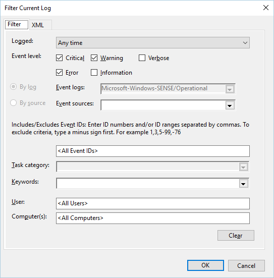
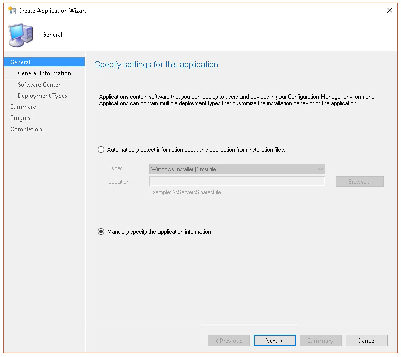

# <a name="troubleshoot-microsoft-defender-for-endpoint-onboarding-issues"></a>Solucionar problemas de incorporación de puntos de conexión de Microsoft Defender

[!INCLUDE [Microsoft 365 Defender rebranding](../../includes/microsoft-defender.md)]


**Se aplica a:**

- [Microsoft Defender para punto de conexión](https://go.microsoft.com/fwlink/?linkid=2154037)
- Windows Server 2012 R2
- Windows Server 2016
- [Microsoft 365 Defender](https://go.microsoft.com/fwlink/?linkid=2118804)

> ¿Desea experimentar Defender for Endpoint? [Regístrate para obtener una versión de prueba gratuita.](https://www.microsoft.com/microsoft-365/windows/microsoft-defender-atp?ocid=docs-wdatp-pullalerts-abovefoldlink) 

Es posible que deba solucionar problemas en el proceso de incorporación de Microsoft Defender para endpoints si tiene problemas.
En esta página se proporcionan pasos detallados para solucionar problemas de incorporación que pueden producirse al implementar con una de las herramientas de implementación y errores comunes que pueden producirse en los dispositivos.

## <a name="troubleshoot-issues-with-onboarding-tools"></a>Solucionar problemas con las herramientas de incorporación

Si ha completado el proceso de incorporación y [](investigate-machines.md) no ve dispositivos en la lista dispositivos después de una hora, puede indicar un problema de incorporación o conectividad.

### <a name="troubleshoot-onboarding-when-deploying-with-group-policy"></a>Solucionar problemas de incorporación al implementar con directiva de grupo

La implementación con directiva de grupo se realiza ejecutando el script de incorporación en los dispositivos. La consola de directiva de grupo no indica si la implementación se ha hecho correctamente o no.

Si ha completado el proceso de incorporación y [](investigate-machines.md) no ve dispositivos en la lista Dispositivos después de una hora, puede comprobar el resultado del script en los dispositivos. Para obtener más información, vea [Troubleshoot onboarding when deploying with a script](#troubleshoot-onboarding-when-deploying-with-a-script).

Si el script se completa correctamente, consulta Solucionar problemas de [incorporación](#troubleshoot-onboarding-issues-on-the-device) en los dispositivos para ver si se producen errores adicionales.

### <a name="troubleshoot-onboarding-issues-when-deploying-with-microsoft-endpoint-configuration-manager"></a>Solucionar problemas de incorporación al implementar con Microsoft Endpoint Configuration Manager

Al incorporar dispositivos con las siguientes versiones de Configuration Manager:

- Microsoft Endpoint Configuration Manager
- System Center 2012 Configuration Manager
- Administrador de configuración de System Center 2012 R2

La implementación con las versiones anteriores de Configuration Manager se realiza ejecutando el script de incorporación en los dispositivos. Puede realizar un seguimiento de la implementación en la consola de Configuration Manager.

Si se produce un error en la implementación, puede comprobar el resultado del script en los dispositivos.

Si la incorporación se completó correctamente pero los  dispositivos no aparecen [](#troubleshoot-onboarding-issues-on-the-device) en la lista dispositivos después de una hora, consulta Solucionar problemas de incorporación en el dispositivo para ver si se producen errores adicionales.

### <a name="troubleshoot-onboarding-when-deploying-with-a-script"></a>Solucionar problemas de incorporación al implementar con un script

**Compruebe el resultado del script en el dispositivo:**

1. Haga **clic en Inicio**, escriba Visor de **eventos** y presione **Entrar**.

2. Vaya a **Aplicación de registros de Windows**  >  .

3. Busque un evento del origen **de eventos WDATPOnboarding.**

Si el script falla y el evento es un error, puede comprobar el identificador de evento en la tabla siguiente para ayudarle a solucionar el problema.

> [!NOTE]
> Los siguientes IDs de eventos son específicos solo del script de incorporación.

Id. de evento | Tipo de error | Pasos de resolución
:---:|:---|:---
 `5` | Se encontraron datos de offboarding, pero no se pudieron eliminar | Comprobar los permisos en el Registro, específicamente<br> `HKLM\SOFTWARE\Policies\Microsoft\Windows Advanced Threat Protection`.
`10` | Los datos de incorporación no se pudieron escribir en el Registro |  Comprobar los permisos en el Registro, específicamente<br> `HKLM\SOFTWARE\Policies\Microsoft\Windows Advanced Threat Protection`.<br>Compruebe que el script se ha ejecutado como administrador.
`15` |  Error al iniciar el servicio SENSE |Compruebe el estado del servicio ( `sc query sense` comando). Asegúrese de que no está en un estado intermedio (*'Pending_Stopped',* *'Pending_Running'*) e intente volver a ejecutar el script (con derechos de administrador). <br> <br> Si el dispositivo ejecuta Windows 10, la versión 1607 y ejecuta el comando `sc query sense` devuelve , reinicia el `START_PENDING` dispositivo. Si reiniciar el dispositivo no aborda el problema, actualice a KB4015217 e intente incorporarlo de nuevo.
`15` | Error al iniciar el servicio SENSE | Si el mensaje del error es: Error del sistema 577 o error 1058, debe habilitar el controlador ELAM de Antivirus de Microsoft Defender, consulte [Ensure that Microsoft Defender Antivirus is not disabled by a policy](#ensure-that-microsoft-defender-antivirus-is-not-disabled-by-a-policy) para obtener instrucciones.
`30` |  El script no pudo esperar a que el servicio comenzara a ejecutarse | El servicio podría haber necesitado más tiempo para iniciarse o haber encontrado errores al intentar iniciarse. Para obtener más información sobre los eventos y errores relacionados con SENSE, vea [Review events and errors using Event viewer](event-error-codes.md).
`35` |  El script no pudo encontrar el valor del Registro de estado de incorporación necesario | Cuando el servicio SENSE se inicia por primera vez, escribe el estado de incorporación en la ubicación del Registro<br>`HKLM\SOFTWARE\Microsoft\Windows Advanced Threat Protection\Status`.<br> El script no pudo encontrarlo después de varios segundos. Puedes probarla manualmente y comprobar si está ahí. Para obtener más información sobre los eventos y errores relacionados con SENSE, vea [Review events and errors using Event viewer](event-error-codes.md).
`40` | El estado de incorporación del servicio SENSE no está establecido en **1** | El servicio SENSE no se ha incorporado correctamente. Para obtener más información sobre los eventos y errores relacionados con SENSE, vea [Review events and errors using Event viewer](event-error-codes.md).
`65` | Privilegios insuficientes| Vuelva a ejecutar el script con privilegios de administrador.

### <a name="troubleshoot-onboarding-issues-using-microsoft-intune"></a>Solucionar problemas de incorporación con Microsoft Intune

Puede usar Microsoft Intune para comprobar los códigos de error e intentar solucionar la causa del problema.

Si has configurado directivas en Intune y no se propagan en dispositivos, es posible que debas configurar la inscripción automática de MDM.

Use las tablas siguientes para comprender las posibles causas de problemas durante la incorporación:

- Códigos de error de Microsoft Intune y OMA-URIs tabla
- Problemas conocidos con la tabla de no cumplimiento
- Tabla de registros de eventos de administración de dispositivos móviles (MDM)

Si ninguno de los registros de eventos y los pasos de solución de problemas funcionan, descargue el script Local de la sección **Administración** de dispositivos del portal y ejecutarlo en un símbolo del sistema con privilegios elevados.

#### <a name="microsoft-intune-error-codes-and-oma-uris"></a>Códigos de error y códigos de error de Microsoft Intune OMA-URIs

Hexadecimal de código de error | Código de error Dec | Descripción del error | OMA-URI | Posibles pasos de causa y solución de problemas
:---:|:---|:---|:---|:---
0x87D1FDE8 | -2016281112 | Error de corrección | Incorporación <br> Offboarding | **Causa posible:** Error en la incorporación o el offboarding en un blob incorrecto: firma incorrecta o faltaban campos PreviousOrgIds. <br><br> **Pasos de solución de problemas:** <br> Compruebe los IDs de eventos en la sección Ver errores de incorporación de [agentes en la sección registro de eventos del](#view-agent-onboarding-errors-in-the-device-event-log) dispositivo. <br><br> Comprueba los registros de eventos MDM en la tabla siguiente o sigue las instrucciones de Diagnosticar errores [de MDM en Windows 10](https://docs.microsoft.com/windows/client-management/mdm/diagnose-mdm-failures-in-windows-10).
 | | | | Incorporación <br> Offboarding <br> SampleSharing | **Causa posible:** La clave del Registro de Microsoft Defender para directiva de extremo no existe o el cliente de OMA DM no tiene permisos para escribir en ella. <br><br> **Pasos de solución de problemas:** Asegúrese de que existe la siguiente clave del Registro: `HKEY_LOCAL_MACHINE\SOFTWARE\Policies\Microsoft\Windows Advanced Threat Protection` <br> <br> Si no existe, abra un comando con privilegios elevados y agregue la clave.
 | | | | SenseIsRunning <br> OnboardingState <br> OrgId |  **Causa posible:** Un intento de corregir mediante una propiedad de solo lectura. Error en la incorporación. <br><br> **Pasos de solución de problemas:** Consulta los pasos de solución de problemas en [Solucionar problemas de incorporación en el dispositivo](#troubleshoot-onboarding-issues-on-the-device). <br><br> Comprueba los registros de eventos MDM en la tabla siguiente o sigue las instrucciones de Diagnosticar errores [de MDM en Windows 10](https://docs.microsoft.com/windows/client-management/mdm/diagnose-mdm-failures-in-windows-10).
 | | | | Todo | **Causa posible:** Intente implementar Microsoft Defender para endpoint en SKU o plataforma no admitidas, especialmente sku holográfica. <br><br> Plataformas compatibles actualmente:<br> Empresa, educación y profesional.<br> El servidor no es compatible.
 0x87D101A9 | -2016345687 |SyncML(425): error en el comando solicitado porque el remitente no tiene permisos de control de acceso (ACL) adecuados en el destinatario. | Todo |  **Causa posible:** Intente implementar Microsoft Defender para endpoint en SKU o plataforma no admitidas, especialmente sku holográfica.<br><br> Plataformas compatibles actualmente:<br>  Empresa, educación y profesional.

#### <a name="known-issues-with-non-compliance"></a>Problemas conocidos con el incumplimiento

En la tabla siguiente se proporciona información sobre los problemas de incumplimiento y cómo se pueden solucionar los problemas.

Case | Síntomas | Posibles pasos de causa y solución de problemas
:---:|:---|:---
 `1` | El dispositivo es compatible con SenseIsRunning OMA-URI. Pero orgId, onboarding e onboardingState OMA-URIs no cumplen. | **Causa posible:** Comprueba que el usuario ha pasado OOBE después de la instalación o actualización de Windows. Durante la incorporación de OOBE no se pudo completar, pero SENSE ya se está ejecutando.<br><br> **Pasos de solución de problemas:** Espere a que se complete OOBE.
 `2` |  El dispositivo es compatible con OrgId, Onboarding e OnboardingState OMA-URIs, pero senseIsRunning OMA-URI no es compatible. |  **Causa posible:** El tipo de inicio del servicio Sense se establece como "Inicio retrasado". A veces esto hace que el servidor de Microsoft Intune informe al dispositivo como no compatible con SenseIsRunning cuando se produce una sesión de DM al iniciar el sistema. <br><br> **Pasos de solución de problemas:** El problema debe solucionarse automáticamente en un plazo de 24 horas.
 `3` | El dispositivo no es compatible | **Pasos de solución de problemas:** Asegúrese de que las directivas de incorporación y offboarding no se implementan en el mismo dispositivo al mismo tiempo.

#### <a name="mobile-device-management-mdm-event-logs"></a>Registros de eventos de administración de dispositivos móviles (MDM)

Consulta los registros de eventos MDM para solucionar problemas que pueden surgir durante la incorporación:

Nombre del registro: Microsoft\Windows\DeviceManagement-EnterpriseDiagnostics-Provider

Nombre del canal: Administrador

Id. | Severity | Descripción del evento | Pasos para la solución de problemas
:---|:---|:---|:---
1819 | Error | Microsoft Defender para CSP de extremo: no se pudo establecer el valor del nodo. NodeId: (%1), TokenName: (%2), Result: (%3). | Descargue la [actualización acumulativa para Windows 10, 1607](https://go.microsoft.com/fwlink/?linkid=829760).

## <a name="troubleshoot-onboarding-issues-on-the-device"></a>Solucionar problemas de incorporación en el dispositivo

Si las herramientas de implementación usadas no indican un error en el proceso de incorporación, pero los dispositivos siguen sin aparecer en la lista de dispositivos en una hora, consulte los siguientes temas de comprobación para comprobar si se produjo un error con el agente de Microsoft Defender para endpoints.

- [Ver errores de incorporación de agentes en el registro de eventos del dispositivo](#view-agent-onboarding-errors-in-the-device-event-log)
- [Asegurarse de que el servicio de datos de diagnóstico está habilitado](#ensure-the-diagnostics-service-is-enabled)
- [Asegurarse de que el servicio está configurado para iniciarse](#ensure-the-service-is-set-to-start)
- [Asegurarse de que el dispositivo tiene una conexión a Internet](#ensure-the-device-has-an-internet-connection)
- [Asegúrese de que antivirus de Microsoft Defender no está deshabilitado por una directiva](#ensure-that-microsoft-defender-antivirus-is-not-disabled-by-a-policy)

### <a name="view-agent-onboarding-errors-in-the-device-event-log"></a>Ver errores de incorporación de agentes en el registro de eventos del dispositivo

1. Haga **clic en Inicio**, escriba Visor de **eventos** y presione **Entrar**.

2. En el **panel Visor de eventos (local),** expanda Registros de aplicaciones y **servicios**  >  **Microsoft**  >  **Windows**  >  **SENSE**.

   > [!NOTE]
   > SENSE es el nombre interno que se usa para hacer referencia al sensor de comportamiento que potencia Microsoft Defender para Endpoint.

3. Seleccione **Operativo** para cargar el registro.

4. En el **panel Acción,** haga clic **en Filtrar registro actual**.

5. En la **ficha Filtro,** en **Nivel de evento:** seleccione **Crítico**, **Advertencia** y **Error** y haga clic en **Aceptar**.

   

6. Los eventos que pueden indicar problemas aparecerán en el **panel** Operativo. Puede intentar solucionarlos en función de las soluciones de la tabla siguiente:

Identificador de evento | Message | Pasos de resolución
:---:|:---|:---
 `5` | Error al conectarse al servidor en la variable Microsoft Defender para el servicio de _punto de conexión_ | [Asegúrese de que el dispositivo tiene acceso a Internet.](#ensure-the-device-has-an-internet-connection)
 `6` | El servicio de Microsoft Defender para puntos de conexión no está incorporado y no se encontraron parámetros de incorporación. Código de error: _variable_ | [Vuelva a ejecutar el script de incorporación](configure-endpoints-script.md).
 `7` | Microsoft Defender para el servicio de extremo no pudo leer los parámetros de incorporación. Código de error: _variable_ | [Asegúrese de que el dispositivo tiene acceso a Internet](#ensure-the-device-has-an-internet-connection)y vuelva a ejecutar todo el proceso de incorporación.
 `9` | Microsoft Defender para el servicio de extremo no pudo cambiar su tipo de inicio. Código de error: variable | Si el evento se produjo durante la incorporación, reinicie y vuelva a intentar ejecutar el script de incorporación. Para obtener más información, [vea Ejecutar el script de incorporación de nuevo](configure-endpoints-script.md). <br><br>Si el evento se produjo durante el offboarding, póngase en contacto con el soporte técnico.
`10` | Microsoft Defender para el servicio de extremo no pudo conservar la información de incorporación. Código de error: variable | Si el evento se produjo durante la incorporación, vuelva a intentar ejecutar el script de incorporación. Para obtener más información, [vea Ejecutar el script de incorporación de nuevo](configure-endpoints-script.md). <br><br>Si el problema persiste, póngase en contacto con el soporte técnico.
`15` | Microsoft Defender para endpoint no puede iniciar el canal de comandos con dirección URL: _variable_ | [Asegúrese de que el dispositivo tiene acceso a Internet.](#ensure-the-device-has-an-internet-connection)
`17` | Microsoft Defender para el servicio de extremo no pudo cambiar la ubicación del servicio Telemetría y experiencias del usuario conectado. Código de error: variable | [Vuelva a ejecutar el script de incorporación](configure-endpoints-script.md). Si el problema persiste, póngase en contacto con el soporte técnico.
`25` | Microsoft Defender para el servicio de extremo no pudo restablecer el estado de mantenimiento en el Registro. Código de error: _variable_ | Póngase en contacto con el servicio de soporte técnico.
`27` | No se pudo habilitar Microsoft Defender para el modo de extremo en Windows Defender. Error en el proceso de incorporación. Código de error: variable | Póngase en contacto con el servicio de soporte técnico.
`29` | No se pudieron leer los parámetros de offboarding. Tipo de error: %1, Código de error: %2, Descripción: %3 | Asegúrate de que el dispositivo tiene acceso a Internet y, a continuación, vuelve a ejecutar todo el proceso de offboarding.
`30` | No se pudo deshabilitar el modo $(build.sense.productDisplayName) en Microsoft Defender para Endpoint. Código de error: %1 | Póngase en contacto con el servicio de soporte técnico.
`32` | El servicio $(build.sense.productDisplayName) no pudo solicitar que se detuviera después del proceso de offboarding. Código de error: %1 | Compruebe que el tipo de inicio del servicio es manual y reinicie el dispositivo.
`55` | No se pudo crear el registrador automático de ETW seguro. Código de error: %1 | Reinicie el dispositivo.
`63` | Actualizar el tipo de inicio del servicio externo. Nombre: %1, tipo de inicio real: %2, tipo de inicio esperado: %3, código de salida: %4 | Identifique lo que está provocando cambios en el tipo de inicio del servicio mencionado. Si el código de salida no es 0, corrija el tipo de inicio manualmente en el tipo de inicio esperado.
`64` | Inicio del servicio externo detenido. Nombre: %1, código de salida: %2 | Póngase en contacto con el soporte técnico si el evento vuelve a aparecer.
`68` | El tipo de inicio del servicio es inesperado. Nombre del servicio: %1, tipo de inicio real: %2, tipo de inicio esperado: %3 | Identifique lo que está provocando cambios en el tipo de inicio. Corregir el tipo de inicio de servicio mencionado.
`69` | El servicio se detiene. Nombre del servicio: %1 | Inicie el servicio mencionado. Póngase en contacto con el soporte técnico si persiste.

<br />

Hay componentes adicionales en el dispositivo de los que depende el agente de Microsoft Defender para Endpoint para funcionar correctamente. Si no hay errores relacionados con la incorporación en el registro de eventos del agente de Microsoft Defender para endpoints, siga estos pasos para asegurarse de que los componentes adicionales estén configurados correctamente.

<span id="ensure-the-diagnostics-service-is-enabled" />

### <a name="ensure-the-diagnostic-data-service-is-enabled"></a>Asegurarse de que el servicio de datos de diagnóstico está habilitado

Si los dispositivos no se informan correctamente, es posible que deba comprobar que el servicio de datos de diagnóstico de Windows 10 está configurado para iniciarse automáticamente y se está ejecutando en el dispositivo. Es posible que otros programas o cambios de configuración de usuario hayan deshabilitado el servicio.

En primer lugar, debes comprobar que el servicio está configurado para iniciarse automáticamente cuando se inicia Windows y, a continuación, debes comprobar que el servicio se está ejecutando actualmente (e iniciarlo si no lo está).

### <a name="ensure-the-service-is-set-to-start"></a>Asegurarse de que el servicio está configurado para iniciarse

Usa la línea de comandos para comprobar el tipo de inicio del servicio de datos de diagnóstico **de Windows 10:**

1. Abra un símbolo del sistema con privilegios elevados en el dispositivo:

   a. Haga **clic en Inicio**, escriba **cmd** y presione **Entrar**.

   b. Haga clic derecho en **Símbolo del sistema** y seleccione **Ejecutar como administrador**.

2. Escriba el siguiente comando y presione **Entrar**:

   ```text
   sc qc diagtrack
   ```

   Si el servicio está habilitado, el resultado debería ser parecido a la siguiente captura de pantalla:

   

   Si el valor no está establecido en , tendrás que establecer el servicio para `START_TYPE` `AUTO_START` que se inicie automáticamente.

**Usa la línea de comandos para establecer el servicio de datos de diagnóstico de Windows 10 para que se inicie automáticamente:**

1. Abra un símbolo del sistema con privilegios elevados en el dispositivo:

   a. Haga **clic en Inicio**, escriba **cmd** y presione **Entrar**.

   b. Haga clic derecho en **Símbolo del sistema** y seleccione **Ejecutar como administrador**.

2. Escriba el siguiente comando y presione **Entrar**:

   ```text
   sc config diagtrack start=auto
   ```

3. Se muestra un mensaje de éxito. Para comprobar el cambio, escriba el siguiente comando y presione **Entrar**:

   ```text
   sc qc diagtrack
   ```

4. Inicie el servicio.

   a. En el símbolo del sistema, escriba el siguiente comando y presione **ENTRAR**:

   ```text
   sc start diagtrack
   ```

### <a name="ensure-the-device-has-an-internet-connection"></a>Asegurarse de que el dispositivo tiene una conexión a Internet

El sensor ATP de Window Defender requiere Microsoft Windows HTTP (WinHTTP) para informar de los datos del sensor y comunicarse con el servicio Microsoft Defender for Endpoint.

WinHTTP es independiente de la configuración de proxy de exploración de Internet y otras aplicaciones de contexto de usuario y debe poder detectar los servidores proxy que están disponibles en su entorno en particular.

Para asegurarse de que el sensor tiene conectividad de servicio, siga los pasos descritos en el tema [Verify client connectivity to Microsoft Defender for Endpoint service URLs.](configure-proxy-internet.md#verify-client-connectivity-to-microsoft-defender-atp-service-urls)

Si se produce un error en la comprobación y el entorno usa un proxy para conectarse a Internet, siga los pasos descritos en el tema [Configure proxy and Internet connectivity settings.](configure-proxy-internet.md)

### <a name="ensure-that-microsoft-defender-antivirus-is-not-disabled-by-a-policy"></a>Asegúrese de que antivirus de Microsoft Defender no está deshabilitado por una directiva

> [!IMPORTANT]
> Lo siguiente solo se aplica  a dispositivos que aún no han recibido la actualización de agosto de 2020 (versión 4.18.2007.8) del Antivirus de Microsoft Defender.
>
> La actualización garantiza que antivirus de Microsoft Defender no se puede desactivar en dispositivos cliente a través de la directiva del sistema.

**Problema:** el servicio microsoft defender para puntos de conexión no se inicia después de la incorporación.

**Síntoma:** la incorporación se completa correctamente, pero aparece el error 577 o el error 1058 al intentar iniciar el servicio.

**Solución:** si los dispositivos ejecutan un cliente antimalware de terceros, el agente de Microsoft Defender para endpoint necesita que se habilite el controlador antimalware de inicio anticipado (ELAM). Debe asegurarse de que no está desactivada por una directiva del sistema.

- Según la herramienta que use para implementar directivas, deberá comprobar que se borran las siguientes Windows Defender directivas:

  - DisableAntiSpyware
  - DisableAntiVirus

  Por ejemplo, en la directiva de grupo no debe haber ninguna entrada como los siguientes valores:

  - `<Key Path="SOFTWARE\Policies\Microsoft\Windows Defender"><KeyValue Value="0" ValueKind="DWord" Name="DisableAntiSpyware"/></Key>`
  - `<Key Path="SOFTWARE\Policies\Microsoft\Windows Defender"><KeyValue Value="0" ValueKind="DWord" Name="DisableAntiVirus"/></Key>`

> [!IMPORTANT]
> La configuración se suspende y se omitirá en todos los dispositivos cliente, a partir de la actualización de agosto de `disableAntiSpyware` 2020 (versión 4.18.2007.8) al Antivirus de Microsoft Defender.

- Después de borrar la directiva, vuelva a ejecutar los pasos de incorporación.

- También puede comprobar los valores de clave del Registro anteriores para comprobar que la directiva está deshabilitada, abriendo la clave del Registro `HKEY_LOCAL_MACHINE\SOFTWARE\Policies\Microsoft\Windows Defender` .

    

   > [!NOTE]
   > Todos Windows Defender (wdboot, wdfilter, wdnisdrv, wdnissvc y windefend) deben estar en su estado predeterminado. Cambiar el inicio de estos servicios no es compatible y puede forzarte a volver a crear una imagen del sistema.
   >
   > Configuraciones predeterminadas de ejemplo para WdBoot y WdFilter:
   > - `<Key Path="SYSTEM\CurrentControlSet\Services\WdBoot"><KeyValue Value="0" ValueKind="DWord" Name="Start"/></Key>`
   > - `<Key Path="SYSTEM\CurrentControlSet\Services\WdFilter"><KeyValue Value="0" ValueKind="DWord" Name="Start"/></Key>`

## <a name="troubleshoot-onboarding-issues-on-a-server"></a>Solucionar problemas de incorporación en un servidor

Si encuentra problemas al incorporar un servidor, siga los siguientes pasos de comprobación para solucionar posibles problemas.

- [Asegúrese de que Microsoft Monitoring Agent (MMA) esté instalado y configurado para informar de los datos del sensor al servicio](configure-server-endpoints.md#server-mma)
- [Asegúrese de que la configuración de proxy de servidor y conectividad a Internet esté configurada correctamente](configure-server-endpoints.md#server-proxy)

También es posible que tenga que comprobar lo siguiente:

- Compruebe que hay un Microsoft Defender para Endpoint Service ejecutándose en la **pestaña Procesos** del Administrador **de tareas**. Por ejemplo:

    

- Compruebe **Event Viewer** Applications and Services  >  **Logs** Operation  >  **Manager** para ver si hay algún error.

- En **Servicios,** compruebe si **el Agente de supervisión de Microsoft** se está ejecutando en el servidor. Por ejemplo,

    

- En **Microsoft Monitoring Agent** Azure Log Analytics  >  **(OMS),** compruebe las áreas de trabajo y compruebe que el estado se está ejecutando.

    

- Compruebe que los dispositivos se reflejan en la **lista Dispositivos** del portal.

## <a name="confirming-onboarding-of-newly-built-devices"></a>Confirmar la incorporación de dispositivos recién creados

Puede haber instancias al implementar la incorporación en un dispositivo recién creado pero no completado.

Los pasos siguientes proporcionan instrucciones para el siguiente escenario:

- El paquete de incorporación se implementa en dispositivos recién creados
- El sensor no se inicia porque no se ha completado la experiencia de inicio de sesión (OOBE) o el primer inicio de sesión del usuario
- El dispositivo se apaga o se reinicia antes de que el usuario final realice un primer inicio de sesión
- En este escenario, el servicio SENSE no se iniciará automáticamente aunque se haya implementado el paquete de incorporación

> [!NOTE]
> Los pasos siguientes solo son relevantes al usar Microsoft Endpoint Configuration Manager. Para obtener más información acerca de la incorporación con Microsoft Endpoint Configuration Manager, vea [Microsoft Defender for Endpoint](https://docs.microsoft.com/mem/configmgr/protect/deploy-use/windows-defender-advanced-threat-protection).

1. Cree una aplicación en Microsoft Endpoint Configuration Manager.

    

2. Seleccione **Especificar manualmente la información de la aplicación**.

    

3. Especifique información sobre la aplicación y, a continuación, **seleccione Siguiente**.

    

4. Especifique información sobre el centro de software y, a continuación, **seleccione Siguiente**.

    

5. En **Tipos de implementación,** **seleccione Agregar**.

    

6. Seleccione **Especificar manualmente la información del tipo de implementación** y, a continuación, seleccione **Siguiente**.

    

7. Especifique información sobre el tipo de implementación y, a continuación, **seleccione Siguiente**.

    

8. En **el programa de** instalación de  >  **contenido,** especifique el comando: `net start sense` .

    

9. En **El método Detection**, seleccione Configurar reglas para detectar la presencia **de** este tipo de implementación y, a continuación, seleccione **Agregar cláusula**.

    

10. Especifique los siguientes detalles de la regla de detección y, a continuación, **seleccione Aceptar**:

    

11. En **Método de detección,** **seleccione Siguiente**.

    

12. En **Experiencia de usuario,** especifique la siguiente información y, a continuación, **seleccione Siguiente**:

    

13. En **Requisitos**, seleccione **Siguiente**.

    

14. En **Dependencias**, seleccione **Siguiente**.

    

15. En **Resumen,** seleccione **Siguiente**.

    

16. En **Finalización,** seleccione **Cerrar**.

    

17. En **Tipos de implementación,** seleccione **Siguiente**.

    

18. En **Resumen,** seleccione **Siguiente**.

    

    A continuación, se muestra el estado: 

19. En **Finalización,** seleccione **Cerrar**.

    

20. Ahora puedes implementar la aplicación haciendo clic con el botón secundario en la aplicación y **seleccionando Implementar**.

    

21. En **General,** **seleccione Distribuir automáticamente contenido para dependencias** y **Examinar**.

    

22. En **Contenido,** **seleccione Siguiente**.

    

23. En **Configuración de implementación,** seleccione **Siguiente**.

    

24. En **Programación,** **seleccione Tan pronto como sea posible después de la hora disponible**, luego seleccione **Siguiente**.

    

25. En **Experiencia del usuario,** seleccione Confirmar cambios en la fecha límite o durante una ventana de **mantenimiento (requiere reinicios)** y, a continuación, **seleccione Siguiente**.

    

26. En **Alertas,** **seleccione Siguiente**.

    

27. En **Resumen,** seleccione **Siguiente**.

    

    A continuación, se muestra el estado 

28. En **Finalización,** seleccione **Cerrar**.

    


## <a name="related-topics"></a>Temas relacionados

- [Solucionar problemas de Microsoft Defender para punto de conexión](troubleshoot-mdatp.md)
- [Dispositivos integrados](onboard-configure.md)
- [Configurar el proxy de dispositivo y la configuración de conectividad a Internet](configure-proxy-internet.md)
