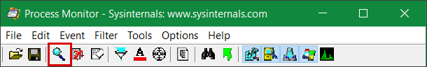
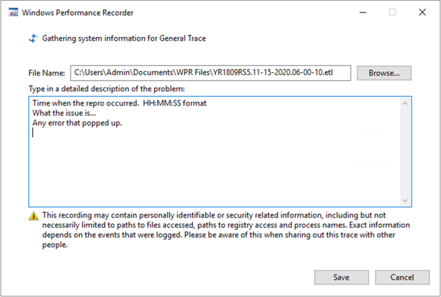

# <a name="troubleshoot-performance-issues-related-to-real-time-protection"></a><span data-ttu-id="80ef8-104">Solucionar problemas de rendimiento relacionados con la protección en tiempo real</span><span class="sxs-lookup"><span data-stu-id="80ef8-104">Troubleshoot performance issues related to real-time protection</span></span>


[!INCLUDE [Microsoft 365 Defender rebranding](../../includes/microsoft-defender.md)]


<span data-ttu-id="80ef8-105">**Se aplica a:**</span><span class="sxs-lookup"><span data-stu-id="80ef8-105">**Applies to:**</span></span>

- [<span data-ttu-id="80ef8-106">Microsoft Defender para punto de conexión</span><span class="sxs-lookup"><span data-stu-id="80ef8-106">Microsoft Defender for Endpoint</span></span>](https://go.microsoft.com/fwlink/p/?linkid=2146631)
 
<span data-ttu-id="80ef8-107">Si el sistema tiene problemas de alto uso de CPU o rendimiento relacionados con el servicio de protección en tiempo real en Microsoft Defender para endpoint, puede enviar un vale al soporte técnico de Microsoft.</span><span class="sxs-lookup"><span data-stu-id="80ef8-107">If your system is having high CPU usage or performance issues related to the real-time protection service in Microsoft Defender for Endpoint, you can submit a ticket to Microsoft support.</span></span> <span data-ttu-id="80ef8-108">Siga los pasos descritos [en Recopilar Antivirus de Microsoft Defender datos de diagnóstico](collect-diagnostic-data.md).</span><span class="sxs-lookup"><span data-stu-id="80ef8-108">Follow the steps in [Collect Microsoft Defender Antivirus diagnostic data](collect-diagnostic-data.md).</span></span>

<span data-ttu-id="80ef8-109">Como administrador, también puede solucionar estos problemas por su cuenta.</span><span class="sxs-lookup"><span data-stu-id="80ef8-109">As an admin, you can also troubleshoot these issues on your own.</span></span> 

<span data-ttu-id="80ef8-110">En primer lugar, es posible que desee comprobar si el problema está causado por otro software.</span><span class="sxs-lookup"><span data-stu-id="80ef8-110">First, you might want to check if the issue is being caused by another software.</span></span> <span data-ttu-id="80ef8-111">Lea [Comprobar con el proveedor las exclusiones de antivirus.](#check-with-vendor-for-antivirus-exclusions)</span><span class="sxs-lookup"><span data-stu-id="80ef8-111">Read [Check with vendor for antivirus exclusions](#check-with-vendor-for-antivirus-exclusions).</span></span>

<span data-ttu-id="80ef8-112">De lo contrario, puede identificar qué software está relacionado con el problema de rendimiento identificado siguiendo los pasos descritos [en Analizar el registro de Microsoft Protection](#analyze-the-microsoft-protection-log).</span><span class="sxs-lookup"><span data-stu-id="80ef8-112">Otherwise, you can identify which software is related to the identified performance issue by following the steps in [Analyze the Microsoft Protection Log](#analyze-the-microsoft-protection-log).</span></span> 

<span data-ttu-id="80ef8-113">También puede proporcionar registros adicionales al envío a soporte técnico de Microsoft siguiendo los pasos descritos en:</span><span class="sxs-lookup"><span data-stu-id="80ef8-113">You can also provide additional logs to your submission to Microsoft support by following the steps in:</span></span>
- [<span data-ttu-id="80ef8-114">Capturar registros de proceso con el Monitor de procesos</span><span class="sxs-lookup"><span data-stu-id="80ef8-114">Capture process logs using Process Monitor</span></span>](#capture-process-logs-using-process-monitor)
- [<span data-ttu-id="80ef8-115">Capturar registros de rendimiento con Windows grabadora de rendimiento</span><span class="sxs-lookup"><span data-stu-id="80ef8-115">Capture performance logs using Windows Performance Recorder</span></span>](#capture-performance-logs-using-windows-performance-recorder) 

## <a name="check-with-vendor-for-antivirus-exclusions"></a><span data-ttu-id="80ef8-116">Comprobar con el proveedor si hay exclusiones de antivirus</span><span class="sxs-lookup"><span data-stu-id="80ef8-116">Check with vendor for antivirus exclusions</span></span>

<span data-ttu-id="80ef8-117">Si puede identificar fácilmente el software que afecta al rendimiento del sistema, vaya al centro de soporte o la base de conocimientos del proveedor de software.</span><span class="sxs-lookup"><span data-stu-id="80ef8-117">If you can readily identify the software affecting system performance, go to the software vendor's knowledge base or support center.</span></span> <span data-ttu-id="80ef8-118">Busque si tiene recomendaciones sobre las exclusiones antivirus.</span><span class="sxs-lookup"><span data-stu-id="80ef8-118">Search if they have recommendations about antivirus exclusions.</span></span> <span data-ttu-id="80ef8-119">Si el sitio web del proveedor no los tiene, puede abrir un vale de soporte técnico con ellos y pedirles que publiquen uno.</span><span class="sxs-lookup"><span data-stu-id="80ef8-119">If the vendor's website does not have them, you can open a support ticket with them and ask them to publish one.</span></span> 

<span data-ttu-id="80ef8-120">Se recomienda que los proveedores de software sigan las distintas directrices de Asociación con [el sector para minimizar los falsos positivos.](https://www.microsoft.com/security/blog/2018/08/16/partnering-with-the-industry-to-minimize-false-positives/)</span><span class="sxs-lookup"><span data-stu-id="80ef8-120">We recommend that software vendors follow the various guidelines in [Partnering with the industry to minimize false positives](https://www.microsoft.com/security/blog/2018/08/16/partnering-with-the-industry-to-minimize-false-positives/).</span></span> <span data-ttu-id="80ef8-121">El proveedor puede enviar su software a través del portal de inteligencia de seguridad [de Microsoft Defender (MDSI).](https://www.microsoft.com/wdsi/filesubmission?persona=SoftwareDeveloper)</span><span class="sxs-lookup"><span data-stu-id="80ef8-121">The vendor can submit their software through the [Microsoft Defender Security Intelligence portal (MDSI)](https://www.microsoft.com/wdsi/filesubmission?persona=SoftwareDeveloper).</span></span>


## <a name="analyze-the-microsoft-protection-log"></a><span data-ttu-id="80ef8-122">Analizar el registro de Microsoft Protection</span><span class="sxs-lookup"><span data-stu-id="80ef8-122">Analyze the Microsoft Protection Log</span></span>

<span data-ttu-id="80ef8-123">En **MPLog-xxxxxxxx-xxxxxx.log**, puede encontrar la información de impacto en el rendimiento estimado de la ejecución de software como *EstimatedImpact*:</span><span class="sxs-lookup"><span data-stu-id="80ef8-123">In **MPLog-xxxxxxxx-xxxxxx.log**, you can find the estimated performance impact information of running software as *EstimatedImpact*:</span></span>
    
`Per-process counts:ProcessImageName: smsswd.exe, TotalTime: 6597, Count: 1406, MaxTime: 609, MaxTimeFile: \Device\HarddiskVolume3\_SMSTaskSequence\Packages\WQ1008E9\Files\FramePkg.exe, EstimatedImpact: 65%`

| <span data-ttu-id="80ef8-124">Nombre del campo</span><span class="sxs-lookup"><span data-stu-id="80ef8-124">Field name</span></span> | <span data-ttu-id="80ef8-125">Descripción</span><span class="sxs-lookup"><span data-stu-id="80ef8-125">Description</span></span> |
|---|---|
|<span data-ttu-id="80ef8-126">ProcessImageName</span><span class="sxs-lookup"><span data-stu-id="80ef8-126">ProcessImageName</span></span> | <span data-ttu-id="80ef8-127">Nombre de imagen de proceso</span><span class="sxs-lookup"><span data-stu-id="80ef8-127">Process image name</span></span> |
| <span data-ttu-id="80ef8-128">TotalTime</span><span class="sxs-lookup"><span data-stu-id="80ef8-128">TotalTime</span></span> | <span data-ttu-id="80ef8-129">Duración acumulativa en milisegundos invertidos en exámenes de archivos a los que se accede mediante este proceso</span><span class="sxs-lookup"><span data-stu-id="80ef8-129">The cumulative duration in milliseconds spent in scans of files accessed by this process</span></span> |
|<span data-ttu-id="80ef8-130">Count</span><span class="sxs-lookup"><span data-stu-id="80ef8-130">Count</span></span> | <span data-ttu-id="80ef8-131">Número de archivos escaneados a los que accede este proceso</span><span class="sxs-lookup"><span data-stu-id="80ef8-131">The number of scanned files accessed by this process</span></span> |
|<span data-ttu-id="80ef8-132">MaxTime</span><span class="sxs-lookup"><span data-stu-id="80ef8-132">MaxTime</span></span> |  <span data-ttu-id="80ef8-133">Duración en milisegundos en el examen único más largo de un archivo al que tiene acceso este proceso</span><span class="sxs-lookup"><span data-stu-id="80ef8-133">The duration in milliseconds in the longest single scan of a file accessed by this process</span></span> |
| <span data-ttu-id="80ef8-134">MaxTimeFile</span><span class="sxs-lookup"><span data-stu-id="80ef8-134">MaxTimeFile</span></span> | <span data-ttu-id="80ef8-135">Ruta de acceso del archivo al que ha accedido este proceso para el que se registró el examen más largo `MaxTime` de duración</span><span class="sxs-lookup"><span data-stu-id="80ef8-135">The path of the file accessed by this process for which the longest scan of `MaxTime` duration was recorded</span></span> |
| <span data-ttu-id="80ef8-136">EstimatedImpact</span><span class="sxs-lookup"><span data-stu-id="80ef8-136">EstimatedImpact</span></span> | <span data-ttu-id="80ef8-137">El porcentaje de tiempo invertido en exámenes para los archivos a los que tiene acceso este proceso fuera del período en el que este proceso experimentó actividad de examen</span><span class="sxs-lookup"><span data-stu-id="80ef8-137">The percentage of time spent in scans for files accessed by this process out of the period in which this process experienced scan activity</span></span> |

<span data-ttu-id="80ef8-138">Si el impacto en el rendimiento es alto, intente agregar el proceso a las exclusiones de ruta de acceso o proceso siguiendo los pasos descritos en Configurar y validar [exclusiones](collect-diagnostic-data.md)para Antivirus de Microsoft Defender exámenes .</span><span class="sxs-lookup"><span data-stu-id="80ef8-138">If the performance impact is high, try adding the process to the Path/Process exclusions by following the steps in [Configure and validate exclusions for Microsoft Defender Antivirus scans](collect-diagnostic-data.md).</span></span>

<span data-ttu-id="80ef8-139">Si el paso anterior no resuelve el problema, puede recopilar más [](#capture-performance-logs-using-windows-performance-recorder) información a través del [Monitor](#capture-process-logs-using-process-monitor) de procesos o la grabadora de rendimiento Windows en las secciones siguientes.</span><span class="sxs-lookup"><span data-stu-id="80ef8-139">If the previous step doesn't solve the problem, you can collect more information through the [Process Monitor](#capture-process-logs-using-process-monitor) or the [Windows Performance Recorder](#capture-performance-logs-using-windows-performance-recorder) in the following sections.</span></span>
     
## <a name="capture-process-logs-using-process-monitor"></a><span data-ttu-id="80ef8-140">Capturar registros de proceso con el Monitor de procesos</span><span class="sxs-lookup"><span data-stu-id="80ef8-140">Capture process logs using Process Monitor</span></span>

<span data-ttu-id="80ef8-141">Process Monitor (ProcMon) es una herramienta de supervisión avanzada que puede mostrar procesos en tiempo real.</span><span class="sxs-lookup"><span data-stu-id="80ef8-141">Process Monitor (ProcMon) is an advanced monitoring tool that can show real-time processes.</span></span> <span data-ttu-id="80ef8-142">Puede usar esto para capturar el problema de rendimiento tal como se está produciendo.</span><span class="sxs-lookup"><span data-stu-id="80ef8-142">You can use this to capture the performance issue as it is occurring.</span></span>

1. <span data-ttu-id="80ef8-143">Descargar [Process Monitor v3.60](/sysinternals/downloads/procmon) en una carpeta como `C:\temp` .</span><span class="sxs-lookup"><span data-stu-id="80ef8-143">Download [Process Monitor v3.60](/sysinternals/downloads/procmon) to a folder like `C:\temp`.</span></span>

2. <span data-ttu-id="80ef8-144">Para quitar la marca del archivo de la web:</span><span class="sxs-lookup"><span data-stu-id="80ef8-144">To remove the file's mark of the web:</span></span>
    1. <span data-ttu-id="80ef8-145">Haga clic con el **botónProcessMonitor.zip** y seleccione **Propiedades**.</span><span class="sxs-lookup"><span data-stu-id="80ef8-145">Right-click **ProcessMonitor.zip** and select **Properties**.</span></span>
    1. <span data-ttu-id="80ef8-146">En la *pestaña General,* busque *Seguridad*.</span><span class="sxs-lookup"><span data-stu-id="80ef8-146">Under the *General* tab, look for *Security*.</span></span>
    1. <span data-ttu-id="80ef8-147">Active la casilla situada junto **a Desbloquear**.</span><span class="sxs-lookup"><span data-stu-id="80ef8-147">Check the box beside **Unblock**.</span></span>
    1. <span data-ttu-id="80ef8-148">Seleccione **Aplicar**.</span><span class="sxs-lookup"><span data-stu-id="80ef8-148">Select **Apply**.</span></span>
    
     

3. <span data-ttu-id="80ef8-150">Descomprima el archivo `C:\temp` para que la ruta de acceso de carpeta sea `C:\temp\ProcessMonitor` .</span><span class="sxs-lookup"><span data-stu-id="80ef8-150">Unzip the file in `C:\temp` so that the folder path will be `C:\temp\ProcessMonitor`.</span></span> 

4. <span data-ttu-id="80ef8-151">Copie **ProcMon.exe** en el Windows o Windows cliente que está solucionando problemas.</span><span class="sxs-lookup"><span data-stu-id="80ef8-151">Copy **ProcMon.exe**  to the Windows client or Windows server you're troubleshooting.</span></span>  

5. <span data-ttu-id="80ef8-152">Antes de ejecutar ProcMon, asegúrese de que se cierren todas las demás aplicaciones que no estén relacionadas con el alto problema de uso de CPU.</span><span class="sxs-lookup"><span data-stu-id="80ef8-152">Before running ProcMon, make sure all other applications not related to the high CPU usage issue are closed.</span></span> <span data-ttu-id="80ef8-153">Al hacerlo, se minimizará el número de procesos que se van a comprobar.</span><span class="sxs-lookup"><span data-stu-id="80ef8-153">Doing this will minimize the number of processes to check.</span></span>

6. <span data-ttu-id="80ef8-154">Puede iniciar ProcMon de dos maneras.</span><span class="sxs-lookup"><span data-stu-id="80ef8-154">You can launch ProcMon in two ways.</span></span>
    1. <span data-ttu-id="80ef8-155">Haga clic con **el botónProcMon.exe** y seleccione Ejecutar como **administrador**.</span><span class="sxs-lookup"><span data-stu-id="80ef8-155">Right-click **ProcMon.exe** and select **Run as administrator**.</span></span> 
    

        <span data-ttu-id="80ef8-156">Dado que el registro se inicia automáticamente, seleccione el icono de lupa para detener la captura actual o use el método abreviado **de teclado Ctrl+E**.</span><span class="sxs-lookup"><span data-stu-id="80ef8-156">Since logging starts automatically, select the magnifying glass icon  to stop the current capture or use the keyboard shortcut **Ctrl+E**.</span></span>
 
        

        <span data-ttu-id="80ef8-158">Para comprobar que ha detenido la captura, compruebe si el icono de lupa aparece ahora con una X roja.</span><span class="sxs-lookup"><span data-stu-id="80ef8-158">To verify that you have stopped the capture, check if the magnifying glass icon now appears with a red X.</span></span>

                 

        <span data-ttu-id="80ef8-160">Después, para borrar la captura anterior, seleccione el icono del borrador.</span><span class="sxs-lookup"><span data-stu-id="80ef8-160">Next, to clear the earlier capture, select the eraser icon.</span></span>

        

        <span data-ttu-id="80ef8-162">O use el método abreviado **de teclado Ctrl+X**.</span><span class="sxs-lookup"><span data-stu-id="80ef8-162">Or use the keyboard shortcut **Ctrl+X**.</span></span>

    2. <span data-ttu-id="80ef8-163">La segunda forma es ejecutar la línea **de** comandos como administrador y, a continuación, desde la ruta de acceso del Monitor de procesos, ejecute:</span><span class="sxs-lookup"><span data-stu-id="80ef8-163">The second way is to run the **command line** as admin, then from the Process Monitor path, run:</span></span>

        
 
        ```console
        Procmon.exe /AcceptEula /Noconnect /Profiling
        ```
        
        >[!TIP] 
        ><span data-ttu-id="80ef8-165">Haga que la ventana de ProcMon sea lo más pequeña posible al capturar datos para que pueda iniciar y detener fácilmente el seguimiento.</span><span class="sxs-lookup"><span data-stu-id="80ef8-165">Make the ProcMon window as small as possible when capturing data so you can easily start and stop the trace.</span></span>
        > 
        >
    
7. <span data-ttu-id="80ef8-167">Después de seguir uno de los procedimientos del paso 6, verá una opción para establecer filtros.</span><span class="sxs-lookup"><span data-stu-id="80ef8-167">After following one of the procedures in step 6, you'll next see an option to set filters.</span></span> <span data-ttu-id="80ef8-168">Seleccione **Aceptar**.</span><span class="sxs-lookup"><span data-stu-id="80ef8-168">Select **OK**.</span></span> <span data-ttu-id="80ef8-169">Siempre puede filtrar los resultados una vez completada la captura.</span><span class="sxs-lookup"><span data-stu-id="80ef8-169">You can always filter the results after the capture is completed.</span></span>
 
     

8. <span data-ttu-id="80ef8-171">Para iniciar la captura, vuelva a seleccionar el icono de lupa.</span><span class="sxs-lookup"><span data-stu-id="80ef8-171">To start the capture, select the magnifying glass icon again.</span></span>
     
9. <span data-ttu-id="80ef8-172">Reproduce el problema.</span><span class="sxs-lookup"><span data-stu-id="80ef8-172">Reproduce the problem.</span></span>
 
    >[!TIP] 
    ><span data-ttu-id="80ef8-173">Espere a que el problema se reproduzca por completo y, a continuación, tome nota de la marca de tiempo cuando se inició el seguimiento.</span><span class="sxs-lookup"><span data-stu-id="80ef8-173">Wait for the problem to be fully reproduced, then take note of the timestamp when the trace started.</span></span>

10. <span data-ttu-id="80ef8-174">Una vez que tenga entre dos y cuatro minutos de actividad de proceso durante la condición de uso de CPU alta, detenga la captura seleccionando el icono de lupa.</span><span class="sxs-lookup"><span data-stu-id="80ef8-174">Once you have two to four minutes of process activity during the high CPU usage condition, stop the capture by selecting the magnifying glass icon.</span></span>

11. <span data-ttu-id="80ef8-175">Para guardar la captura con un nombre único y  con el formato .pml, seleccione Archivo y, a continuación, **seleccione Guardar...**. Asegúrese de seleccionar los botones de radio **Todos los eventos** y Formato de monitor de proceso nativo **(PML).**</span><span class="sxs-lookup"><span data-stu-id="80ef8-175">To save the capture with a unique name and with the .pml format, select **File** then select **Save...**. Make sure to select the radio buttons **All events** and **Native Process Monitor Format (PML)**.</span></span>

    

12. <span data-ttu-id="80ef8-177">Para un mejor seguimiento, cambie la ruta de acceso predeterminada `C:\temp\ProcessMonitor\LogFile.PML` desde `C:\temp\ProcessMonitor\%ComputerName%_LogFile_MMDDYEAR_Repro_of_issue.PML` donde:</span><span class="sxs-lookup"><span data-stu-id="80ef8-177">For better tracking, change the default path from `C:\temp\ProcessMonitor\LogFile.PML` to `C:\temp\ProcessMonitor\%ComputerName%_LogFile_MMDDYEAR_Repro_of_issue.PML` where:</span></span>
    - <span data-ttu-id="80ef8-178">`%ComputerName%` es el nombre del dispositivo</span><span class="sxs-lookup"><span data-stu-id="80ef8-178">`%ComputerName%` is the device name</span></span>
    - <span data-ttu-id="80ef8-179">`MMDDYEAR` es el mes, día y año</span><span class="sxs-lookup"><span data-stu-id="80ef8-179">`MMDDYEAR` is the month, day, and year</span></span>
    -  <span data-ttu-id="80ef8-180">`Repro_of_issue` es el nombre del problema que está intentando reproducir</span><span class="sxs-lookup"><span data-stu-id="80ef8-180">`Repro_of_issue` is the name of the issue you're trying to reproduce</span></span>

    >[!TIP] 
    > <span data-ttu-id="80ef8-181">Si tiene un sistema de trabajo, es posible que desee obtener un registro de ejemplo para comparar.</span><span class="sxs-lookup"><span data-stu-id="80ef8-181">If you have a working system, you might want to get a sample log to compare.</span></span>

13. <span data-ttu-id="80ef8-182">Zip the .pml file and submit it to Microsoft support.</span><span class="sxs-lookup"><span data-stu-id="80ef8-182">Zip the .pml file and submit it to Microsoft support.</span></span>


## <a name="capture-performance-logs-using-windows-performance-recorder"></a><span data-ttu-id="80ef8-183">Capturar registros de rendimiento con Windows grabadora de rendimiento</span><span class="sxs-lookup"><span data-stu-id="80ef8-183">Capture performance logs using Windows Performance Recorder</span></span>

<span data-ttu-id="80ef8-184">Puede usar la grabadora Windows rendimiento (WPR) para incluir información adicional en el envío al soporte técnico de Microsoft.</span><span class="sxs-lookup"><span data-stu-id="80ef8-184">You can use Windows Performance Recorder (WPR) to include additional information in your submission to Microsoft support.</span></span> <span data-ttu-id="80ef8-185">WPR es una herramienta de grabación eficaz que crea el seguimiento de eventos para Windows grabaciones.</span><span class="sxs-lookup"><span data-stu-id="80ef8-185">WPR is a powerful recording tool that creates Event Tracing for Windows recordings.</span></span> 

<span data-ttu-id="80ef8-186">WPR forma parte del kit de evaluación e implementación de Windows (Windows ADK) y se puede descargar desde Descargar e instalar el Windows [ADK](/windows-hardware/get-started/adk-install).</span><span class="sxs-lookup"><span data-stu-id="80ef8-186">WPR is part of the Windows Assessment and Deployment Kit (Windows ADK) and can be downloaded from [Download and install the Windows ADK](/windows-hardware/get-started/adk-install).</span></span> <span data-ttu-id="80ef8-187">También puede descargarlo como parte del kit de desarrollo Windows 10 software en [Windows 10 SDK](https://developer.microsoft.com/windows/downloads/windows-10-sdk/).</span><span class="sxs-lookup"><span data-stu-id="80ef8-187">You can also download it as part of the Windows 10 Software Development Kit at [Windows 10 SDK](https://developer.microsoft.com/windows/downloads/windows-10-sdk/).</span></span>

<span data-ttu-id="80ef8-188">Puede usar la interfaz de usuario de WPR siguiendo los pasos descritos en Capturar registros de rendimiento mediante la interfaz de usuario [de WPR](#capture-performance-logs-using-the-wpr-ui).</span><span class="sxs-lookup"><span data-stu-id="80ef8-188">You can use the WPR user interface by following the steps in [Capture performance logs using the WPR UI](#capture-performance-logs-using-the-wpr-ui).</span></span> 

<span data-ttu-id="80ef8-189">Como alternativa, también puede usar la herramienta de línea de comandos *wpr.exe*, que está disponible en Windows 8 y versiones posteriores siguiendo los pasos descritos en Capturar registros de rendimiento mediante la CLI de [WPR](#capture-performance-logs-using-the-wpr-cli).</span><span class="sxs-lookup"><span data-stu-id="80ef8-189">Alternatively, you can also use the command-line tool *wpr.exe*, which is available in Windows 8 and later versions  by following the steps in [Capture performance logs using the WPR CLI](#capture-performance-logs-using-the-wpr-cli).</span></span>


### <a name="capture-performance-logs-using-the-wpr-ui"></a><span data-ttu-id="80ef8-190">Capturar registros de rendimiento con la interfaz de usuario de WPR</span><span class="sxs-lookup"><span data-stu-id="80ef8-190">Capture performance logs using the WPR UI</span></span>

>[!TIP]
><span data-ttu-id="80ef8-191">Si tienes varios dispositivos donde se está produciendo el problema, usa el que tenga la mayor cantidad de RAM.</span><span class="sxs-lookup"><span data-stu-id="80ef8-191">If you have multiple devices where the issue is occurring, use the one which has the most amount of RAM.</span></span>

1. <span data-ttu-id="80ef8-192">Descargue e instale WPR.</span><span class="sxs-lookup"><span data-stu-id="80ef8-192">Download and install WPR.</span></span>

2. <span data-ttu-id="80ef8-193">En *Windows kits,* haga clic con el botón secundario **en Windows Grabadora de rendimiento**.</span><span class="sxs-lookup"><span data-stu-id="80ef8-193">Under *Windows Kits*, right-click **Windows Performance Recorder**.</span></span> 

    

    <span data-ttu-id="80ef8-195">Seleccione **Más**.</span><span class="sxs-lookup"><span data-stu-id="80ef8-195">Select **More**.</span></span> <span data-ttu-id="80ef8-196">Seleccione **Ejecutar como administrador**.</span><span class="sxs-lookup"><span data-stu-id="80ef8-196">Select **Run as administrator**.</span></span>

3. <span data-ttu-id="80ef8-197">Cuando aparezca el cuadro de diálogo Control de cuentas de usuario, seleccione **Sí**.</span><span class="sxs-lookup"><span data-stu-id="80ef8-197">When the User Account Control dialog box appears, select **Yes**.</span></span>

    

4. <span data-ttu-id="80ef8-199">A continuación, descargue el perfil [de análisis de Microsoft Defender para](https://github.com/YongRhee-MDE/Scripts/blob/master/MDAV.wprp) puntos de conexión y guárdelo en una carpeta como `MDAV.wprp` `C:\temp` .</span><span class="sxs-lookup"><span data-stu-id="80ef8-199">Next, download the [Microsoft Defender for Endpoint analysis](https://github.com/YongRhee-MDE/Scripts/blob/master/MDAV.wprp) profile and save as `MDAV.wprp` to a folder like `C:\temp`.</span></span> 
     
5. <span data-ttu-id="80ef8-200">En el cuadro de diálogo WPR, seleccione **Más opciones**.</span><span class="sxs-lookup"><span data-stu-id="80ef8-200">On the WPR dialog box, select **More options**.</span></span>

    

6. <span data-ttu-id="80ef8-202">Seleccione **Agregar perfiles...** y vaya a la ruta de acceso del `MDAV.wprp` archivo.</span><span class="sxs-lookup"><span data-stu-id="80ef8-202">Select **Add Profiles...** and browse to the path of the `MDAV.wprp` file.</span></span>

7. <span data-ttu-id="80ef8-203">Después de eso, debería ver un nuevo conjunto de perfiles en *Medidas personalizadas* denominada *Microsoft Defender para el análisis de puntos de conexión* debajo de él.</span><span class="sxs-lookup"><span data-stu-id="80ef8-203">After that, you should see a new profile set under *Custom measurements* named *Microsoft Defender for Endpoint analysis* underneath it.</span></span>

    

    >[!WARNING]
    ><span data-ttu-id="80ef8-205">Si el servidor Windows tiene 64 GB de RAM o más, use la medida personalizada `Microsoft Defender for Endpoint analysis for large servers` en lugar de `Microsoft Defender for Endpoint analysis` .</span><span class="sxs-lookup"><span data-stu-id="80ef8-205">If your Windows Server has 64 GB of RAM or more, use the custom measurement `Microsoft Defender for Endpoint analysis for large servers` instead of `Microsoft Defender for Endpoint analysis`.</span></span> <span data-ttu-id="80ef8-206">De lo contrario, el sistema podría consumir una gran cantidad de memoria de grupo no paginada o búferes que pueden provocar inestabilidad en el sistema.</span><span class="sxs-lookup"><span data-stu-id="80ef8-206">Otherwise, your system could consume a high amount of non-paged pool memory or buffers which can lead to system instability.</span></span> <span data-ttu-id="80ef8-207">Puede elegir qué perfiles agregar expandiendo **Análisis de recursos**.</span><span class="sxs-lookup"><span data-stu-id="80ef8-207">You can choose which profiles to add by expanding **Resource Analysis**.</span></span> <span data-ttu-id="80ef8-208">Este perfil personalizado proporciona el contexto necesario para un análisis detallado del rendimiento.</span><span class="sxs-lookup"><span data-stu-id="80ef8-208">This custom profile provides the necessary context for in-depth performance analysis.</span></span>
 
8. <span data-ttu-id="80ef8-209">Para usar el perfil de análisis detallado de Medida personalizada de Microsoft Defender para extremo en la interfaz de usuario de WPR:</span><span class="sxs-lookup"><span data-stu-id="80ef8-209">To use the custom measurement Microsoft Defender for Endpoint verbose analysis profile in the WPR UI:</span></span>

    1. <span data-ttu-id="80ef8-210">Asegúrese de que no hay perfiles seleccionados en los grupos de *triaje* de primer nivel, *Análisis* de recursos y *Análisis de* escenarios.</span><span class="sxs-lookup"><span data-stu-id="80ef8-210">Ensure no profiles are selected under the *First-level triage*, *Resource Analysis* and *Scenario Analysis* groups.</span></span>
    2. <span data-ttu-id="80ef8-211">Seleccione **Medidas personalizadas**.</span><span class="sxs-lookup"><span data-stu-id="80ef8-211">Select **Custom measurements**.</span></span>
    3. <span data-ttu-id="80ef8-212">Seleccione **Microsoft Defender para el análisis de extremo.**</span><span class="sxs-lookup"><span data-stu-id="80ef8-212">Select **Microsoft Defender for Endpoint analysis**.</span></span>
    4. <span data-ttu-id="80ef8-213">Seleccione **Detallado en** Nivel *de* detalle.</span><span class="sxs-lookup"><span data-stu-id="80ef8-213">Select **Verbose** under *Detail* level.</span></span>
    1. <span data-ttu-id="80ef8-214">Seleccione **Archivo** o **Memoria en** modo de registro.</span><span class="sxs-lookup"><span data-stu-id="80ef8-214">Select **File** or **Memory** under Logging mode.</span></span> 

    >[!important]
    ><span data-ttu-id="80ef8-215">Debe seleccionar *Archivo para* usar el modo de registro de archivos si el usuario puede reproducir directamente el problema de rendimiento.</span><span class="sxs-lookup"><span data-stu-id="80ef8-215">You should select *File* to use the file logging mode if the performance issue can be reproduced directly by the user.</span></span> <span data-ttu-id="80ef8-216">La mayoría de los problemas están en esta categoría.</span><span class="sxs-lookup"><span data-stu-id="80ef8-216">Most issues fall under this category.</span></span> <span data-ttu-id="80ef8-217">Sin embargo, si el usuario no puede reproducir directamente el problema, pero  puede observarlo fácilmente una vez que se produce el problema, el usuario debe seleccionar Memoria para usar el modo de registro de memoria.</span><span class="sxs-lookup"><span data-stu-id="80ef8-217">However, if the user cannot directly reproduce the issue but can easily notice it once the issue occurs, the user should select *Memory* to use the memory logging mode.</span></span> <span data-ttu-id="80ef8-218">Esto garantiza que el registro de seguimiento no se infle demasiado debido al largo tiempo de ejecución.</span><span class="sxs-lookup"><span data-stu-id="80ef8-218">This ensures that the trace log will not inflate excessively due to the long run time.</span></span>

9. <span data-ttu-id="80ef8-219">Ahora ya está listo para recopilar datos.</span><span class="sxs-lookup"><span data-stu-id="80ef8-219">Now you're ready to collect data.</span></span> <span data-ttu-id="80ef8-220">Salga de todas las aplicaciones que no son relevantes para reproducir el problema de rendimiento.</span><span class="sxs-lookup"><span data-stu-id="80ef8-220">Exit all the applications that are not relevant to reproducing the performance issue.</span></span> <span data-ttu-id="80ef8-221">Puede seleccionar Ocultar **opciones para** que el espacio ocupado por la ventana de WPR sea pequeño.</span><span class="sxs-lookup"><span data-stu-id="80ef8-221">You can select **Hide options** to keep the space occupied by the WPR window small.</span></span>

    

    >[!TIP]
    ><span data-ttu-id="80ef8-223">Intente iniciar el seguimiento en segundos enteros.</span><span class="sxs-lookup"><span data-stu-id="80ef8-223">Try starting the trace at whole number seconds.</span></span> <span data-ttu-id="80ef8-224">Por ejemplo, 01:30:00.</span><span class="sxs-lookup"><span data-stu-id="80ef8-224">For instance, 01:30:00.</span></span> <span data-ttu-id="80ef8-225">Esto facilitará el análisis de los datos.</span><span class="sxs-lookup"><span data-stu-id="80ef8-225">This will make it easier to analyze the data.</span></span> <span data-ttu-id="80ef8-226">También intente realizar un seguimiento de la marca de tiempo de exactamente cuando se reproduce el problema.</span><span class="sxs-lookup"><span data-stu-id="80ef8-226">Also try to keep track of the timestamp of exactly when the issue is reproduced.</span></span>

10. <span data-ttu-id="80ef8-227">Seleccione **Inicio**.</span><span class="sxs-lookup"><span data-stu-id="80ef8-227">Select **Start**.</span></span>

    

11. <span data-ttu-id="80ef8-229">Reproduce el problema.</span><span class="sxs-lookup"><span data-stu-id="80ef8-229">Reproduce the issue.</span></span>

    >[!TIP]
    ><span data-ttu-id="80ef8-230">Mantenga la colección de datos en no más de cinco minutos.</span><span class="sxs-lookup"><span data-stu-id="80ef8-230">Keep the data collection to no more than five minutes.</span></span> <span data-ttu-id="80ef8-231">De dos a tres minutos es un buen intervalo, ya que se recopilan muchos datos.</span><span class="sxs-lookup"><span data-stu-id="80ef8-231">Two to three minutes is a good range since a lot of data is being collected.</span></span>

12. <span data-ttu-id="80ef8-232">Seleccione **Guardar**.</span><span class="sxs-lookup"><span data-stu-id="80ef8-232">Select **Save**.</span></span>

    

13. <span data-ttu-id="80ef8-234">Rellene **Tipo en una descripción detallada del problema:** con información sobre el problema y cómo se reprodujo el problema.</span><span class="sxs-lookup"><span data-stu-id="80ef8-234">Fill up **Type in a detailed description of the problem:** with information about the problem and how you reproduced the issue.</span></span>

    

    1. <span data-ttu-id="80ef8-236">Seleccione **Nombre de archivo:** para determinar dónde se guardará el archivo de seguimiento.</span><span class="sxs-lookup"><span data-stu-id="80ef8-236">Select **File Name:** to determine where your trace file will be saved.</span></span> <span data-ttu-id="80ef8-237">De forma predeterminada, 1.is guardado en `%user%\Documents\WPR Files\` .</span><span class="sxs-lookup"><span data-stu-id="80ef8-237">By default, it 1.is saved to `%user%\Documents\WPR Files\`.</span></span>
    1. <span data-ttu-id="80ef8-238">Seleccione **Guardar**.</span><span class="sxs-lookup"><span data-stu-id="80ef8-238">Select **Save**.</span></span>

14. <span data-ttu-id="80ef8-239">Espere mientras se combina el seguimiento.</span><span class="sxs-lookup"><span data-stu-id="80ef8-239">Wait while the trace is being merged.</span></span>

    

15. <span data-ttu-id="80ef8-241">Una vez guardado el seguimiento, seleccione **Abrir carpeta**.</span><span class="sxs-lookup"><span data-stu-id="80ef8-241">Once the trace is saved, select **Open folder**.</span></span>

    

    <span data-ttu-id="80ef8-243">Incluya el archivo y la carpeta en el envío al soporte técnico de Microsoft.</span><span class="sxs-lookup"><span data-stu-id="80ef8-243">Include both the file and the folder in your submission to Microsoft support.</span></span>

    

### <a name="capture-performance-logs-using-the-wpr-cli"></a><span data-ttu-id="80ef8-245">Capturar registros de rendimiento con la CLI de WPR</span><span class="sxs-lookup"><span data-stu-id="80ef8-245">Capture performance logs using the WPR CLI</span></span>

<span data-ttu-id="80ef8-246">La herramienta de línea *de comandoswpr.exe* forma parte del sistema operativo a partir de Windows 8.</span><span class="sxs-lookup"><span data-stu-id="80ef8-246">The command-line tool *wpr.exe* is part of the operating system starting with Windows 8.</span></span> <span data-ttu-id="80ef8-247">Para recopilar un seguimiento de WPR mediante la herramienta de línea de comandos wpr.exe:</span><span class="sxs-lookup"><span data-stu-id="80ef8-247">To collect a WPR trace using the command-line tool wpr.exe:</span></span>

1. <span data-ttu-id="80ef8-248">Descargue **[el perfil de análisis](https://github.com/YongRhee-MDE/Scripts/blob/master/MDAV.wprp)** de Microsoft Defender para puntos de conexión para realizar seguimientos de rendimiento en un archivo denominado en un directorio local como `MDAV.wprp` `C:\traces` .</span><span class="sxs-lookup"><span data-stu-id="80ef8-248">Download **[Microsoft Defender for Endpoint analysis](https://github.com/YongRhee-MDE/Scripts/blob/master/MDAV.wprp)** profile for performance traces to a file named `MDAV.wprp` in a local directory such as `C:\traces`.</span></span>

3. <span data-ttu-id="80ef8-249">Haga clic con el **botón** secundario en el icono menú Inicio y seleccione **Windows PowerShell (administrador)** o símbolo del sistema **(administrador)** para abrir una ventana del símbolo del sistema de administración.</span><span class="sxs-lookup"><span data-stu-id="80ef8-249">Right-click the **Start Menu** icon and select **Windows PowerShell (Admin)** or **Command Prompt (Admin)** to open an Admin command prompt window.</span></span>

4. <span data-ttu-id="80ef8-250">Cuando aparezca el cuadro de diálogo Control de cuentas de usuario, seleccione **Sí**.</span><span class="sxs-lookup"><span data-stu-id="80ef8-250">When the User Account Control dialog box appears, select **Yes**.</span></span>

5. <span data-ttu-id="80ef8-251">En el símbolo del sistema con privilegios elevados, ejecute el siguiente comando para iniciar un seguimiento de rendimiento de Microsoft Defender para endpoint:</span><span class="sxs-lookup"><span data-stu-id="80ef8-251">At the elevated prompt, run the following command to start a Microsoft Defender for Endpoint performance trace:</span></span>

    ```console
    wpr.exe -start C:\traces\MDAV.wprp!WD.Verbose -filemode
    ```
    
    >[!WARNING]
    ><span data-ttu-id="80ef8-252">Si el servidor Windows tiene 64 GB o RAM o más, use perfiles y en lugar de perfiles `WDForLargeServers.Light` `WDForLargeServers.Verbose` y , `WD.Light` `WD.Verbose` respectivamente.</span><span class="sxs-lookup"><span data-stu-id="80ef8-252">If your Windows Server has 64 GB or RAM or more, use profiles `WDForLargeServers.Light` and `WDForLargeServers.Verbose` instead of profiles `WD.Light` and `WD.Verbose`, respectively.</span></span> <span data-ttu-id="80ef8-253">De lo contrario, el sistema podría consumir una gran cantidad de memoria de grupo no paginada o búferes que pueden provocar inestabilidad en el sistema.</span><span class="sxs-lookup"><span data-stu-id="80ef8-253">Otherwise, your system could consume a high amount of non-paged pool memory or buffers which can lead to system instability.</span></span>

6. <span data-ttu-id="80ef8-254">Reproduce el problema.</span><span class="sxs-lookup"><span data-stu-id="80ef8-254">Reproduce the issue.</span></span>

    >[!TIP]
    ><span data-ttu-id="80ef8-255">Mantenga la colección de datos no en más de cinco minutos.</span><span class="sxs-lookup"><span data-stu-id="80ef8-255">Keep the data collection no to more than five minutes.</span></span>  <span data-ttu-id="80ef8-256">Según el escenario, de dos a tres minutos es un buen intervalo, ya que se recopilan muchos datos.</span><span class="sxs-lookup"><span data-stu-id="80ef8-256">Depending on the scenario, two to three minutes is a good range since a lot of data is being collected.</span></span>

7. <span data-ttu-id="80ef8-257">En el símbolo del sistema con privilegios elevados, ejecute el siguiente comando para detener el seguimiento de rendimiento, asegurándose de proporcionar información sobre el problema y cómo reprodujo el problema:</span><span class="sxs-lookup"><span data-stu-id="80ef8-257">At the elevated prompt, run the following command to stop the performance trace, making sure to provide information about the problem and how you reproduced the issue:</span></span>

    ```console
    wpr.exe -stop merged.etl "Timestamp when the issue was reproduced, in HH:MM:SS format" "Description of the issue" "Any error that popped up"
    ```

8. <span data-ttu-id="80ef8-258">Espere hasta que se combine el seguimiento.</span><span class="sxs-lookup"><span data-stu-id="80ef8-258">Wait until the trace is merged.</span></span> 

9. <span data-ttu-id="80ef8-259">Incluya el archivo y la carpeta en el envío al soporte técnico de Microsoft.</span><span class="sxs-lookup"><span data-stu-id="80ef8-259">Include both the file and the folder in your submission to Microsoft support.</span></span>

## <a name="see-also"></a><span data-ttu-id="80ef8-260">Consulte también</span><span class="sxs-lookup"><span data-stu-id="80ef8-260">See also</span></span>

- [<span data-ttu-id="80ef8-261">Recopilar Antivirus de Microsoft Defender de diagnóstico</span><span class="sxs-lookup"><span data-stu-id="80ef8-261">Collect Microsoft Defender Antivirus diagnostic data</span></span>](collect-diagnostic-data.md)
- [<span data-ttu-id="80ef8-262">Configurar y validar exclusiones para Antivirus de Microsoft Defender exámenes</span><span class="sxs-lookup"><span data-stu-id="80ef8-262">Configure and validate exclusions for Microsoft Defender Antivirus scans</span></span>](configure-exclusions-microsoft-defender-antivirus.md)
