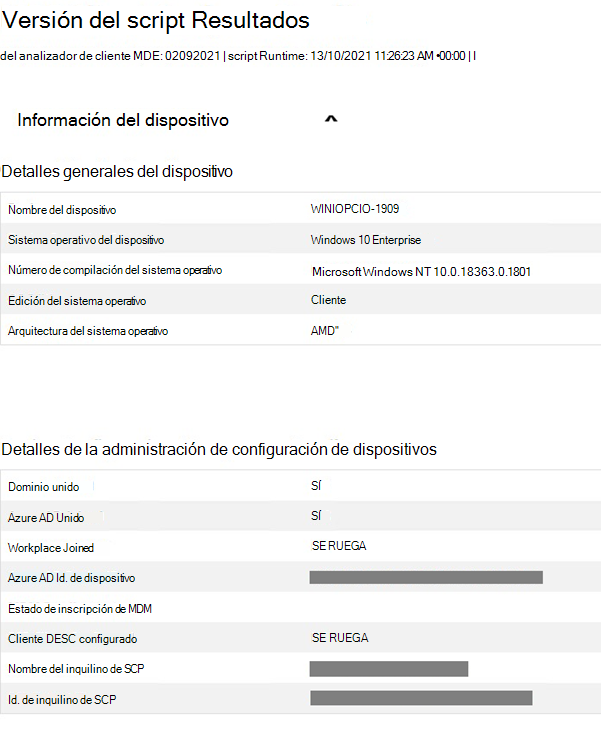
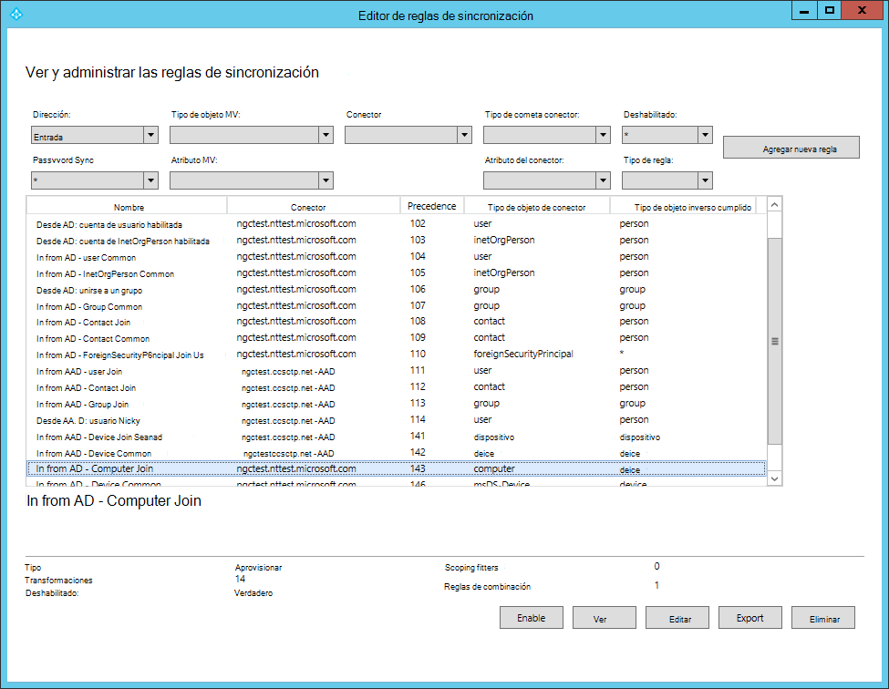
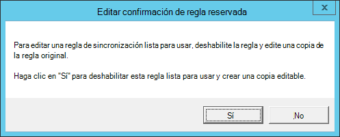
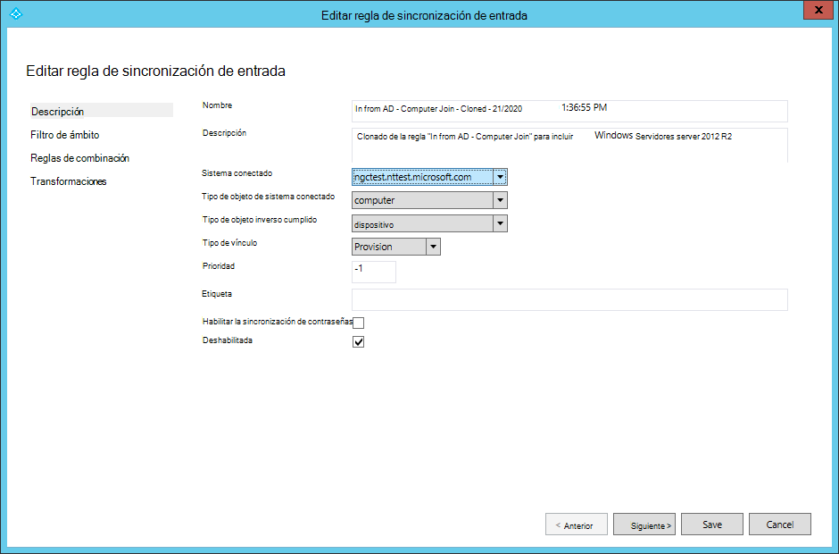
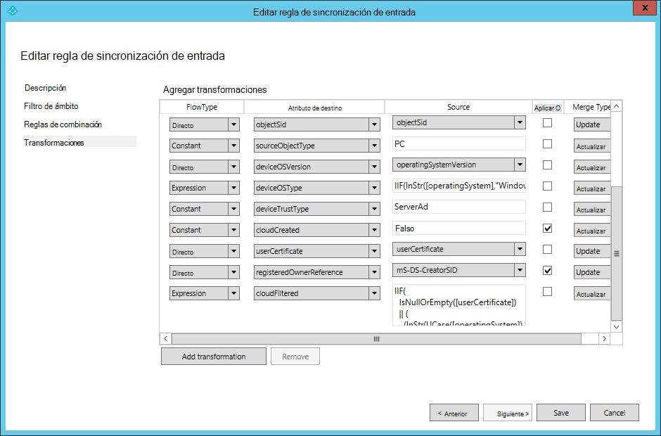

# <a name="troubleshoot-onboarding-issues-related-to-security-management-for-microsoft-defender-for-endpoint"></a>Solucionar problemas de incorporación relacionados con administración de seguridad para Microsoft Defender para endpoint 

[!INCLUDE [Microsoft 365 Defender rebranding](../../includes/microsoft-defender.md)]


**Se aplica a:**

- [Administrar Microsoft Defender para endpoint en dispositivos con Microsoft Endpoint Manager](/mem/intune/protect/mde-security-integration)
- [Microsoft Defender para punto de conexión](https://go.microsoft.com/fwlink/?linkid=2154037)
- [Microsoft 365 Defender](https://go.microsoft.com/fwlink/?linkid=2118804)

Administración de seguridad para Microsoft Defender para endpoint es una funcionalidad para que los dispositivos que no están administrados por un Microsoft Endpoint Manager, ya sea Microsoft Intune o Microsoft Endpoint Configuration Manager, reciban configuraciones de seguridad para Microsoft Defender directamente desde Endpoint Manager.
Para obtener más información sobre administración de seguridad para Microsoft Defender para endpoint, consulte [Manage Microsoft Defender for Endpoint on devices with Microsoft Endpoint Manager](/mem/intune/protect/mde-security-integration).

Para obtener instrucciones de administración de seguridad para Microsoft Defender para la incorporación de puntos de conexión, consulte [Microsoft Defender for Endpoint Security Configuration Management](security-config-management.md)

Esta incorporación de un extremo a otro está diseñada para que no tenga fricción y no requiere la entrada del usuario. Sin embargo, si se producen problemas durante la incorporación, puede ver y solucionar errores en la plataforma de Microsoft Defender para endpoints.


>[!NOTE]
> Si tiene problemas con el flujo de incorporación de nuevos dispositivos, revise los [requisitos previos](/mem/intune/protect/mde-security-integration#prerequisites) de Microsoft Defender para endpoint y asegúrese de que se siguen las instrucciones de incorporación.


Para obtener más información acerca del analizador de cliente, vea [Troubleshoot sensor health using Microsoft Defender for Endpoint Client Analyzer](/microsoft-365/security/defender-endpoint/overview-client-analyzer).

## <a name="registering-domain-joined-computers-with-azure-active-directory"></a>Registrar equipos unidos al dominio con Azure Active Directory  
Para registrar correctamente dispositivos en Azure Active Directory, deberás asegurarte de lo siguiente: 

- Los equipos pueden autenticarse con el controlador de dominio 
- Los equipos tienen acceso a los siguientes recursos de Microsoft desde la red de su organización:
  - https://enterpriseregistration.windows.net
  - https://login.microsoftonline.com
  - https://device.login.microsoftonline.com
- Azure AD connect está configurado para sincronizar los objetos del equipo. De forma predeterminada, las US del equipo están Azure AD ámbito de sincronización de conexión. Si los objetos de equipo pertenecen a unidades organizativas (UNIDADES organizativas específicas), configure las unidades organizativas para que se sincronicen en Azure AD Conectar. Para obtener más información sobre cómo sincronizar objetos de equipo mediante Azure AD Conectar, vea [Filtrado basado en unidades organizativas](/azure/active-directory/hybrid/how-to-connect-sync-configure-filtering#organizational-unitbased-filtering).

>[!IMPORTANT]
>Azure AD connect no sincroniza Windows Server 2012 objetos de equipo R2. Si necesita registrarlos con Azure AD para administración de seguridad para Microsoft Defender para endpoint, deberá personalizar una regla de sincronización de conexión Azure AD incluir esos objetos de equipo en el ámbito de sincronización. Vea [Instrucciones para aplicar la regla de combinación de]()equipos en Azure Active Directory Conectar .

>[!NOTE]
>Para completar correctamente el flujo de incorporación e independientemente del sistema operativo de un dispositivo, el estado Azure Active Directory de un dispositivo puede cambiar en función del estado inicial de los dispositivos:<br>
>
>|      Inicio del estado del dispositivo     |      Nuevo estado del dispositivo     |
>|---|---|
>|     Ya AADJ o HAADJ    |     Permanece tal como está    |
>|     No AADJ ni híbrido Azure Active Directory join (HAADJ) + Domain joined    |     El dispositivo es HAADJ'd    |
>|     Not AADJ or HAADJ + Not domain joined    |     El dispositivo es AADJ'd    |
>
>Donde AADJ representa Azure Active Directory Joined y HAADJ representa hybrid Azure Active Directory Joined.


## <a name="troubleshoot-errors-from-the-microsoft-defender-for-endpoint-portal"></a>Solucionar errores del portal de Microsoft Defender para endpoint


A través del portal de Microsoft Defender para endpoints, los administradores de seguridad ahora pueden solucionar problemas de administración de seguridad para Microsoft Defender para la incorporación de puntos de conexión. 


En **Endpoints > Inventario de** dispositivos, la columna Managed **By** se ha agregado para filtrar por canal de administración (por ejemplo, MEM).


:::image type="content" alt-text="Imagen de la página de inventario de dispositivos" source="./images/device-inventory-mde-error.png":::

Para ver una lista de todos los dispositivos que han fallado en el proceso de incorporación de microsoft defender para puntos de conexión, filtre la tabla por **MDE-Error**.

En la lista, seleccione un dispositivo específico para ver los detalles de solución de problemas en el panel lateral, apuntando a la causa raíz del error y la documentación correspondiente.


:::image type="content" alt-text="Imagen de la página de inventario de dispositivo filtrada" source="./images/secconfig-mde-error.png":::


## <a name="run-microsoft-defender-for-endpoint-client-analyzer-on-windows"></a>Ejecute Microsoft Defender para Endpoint Client Analyzer en Windows 

Considere la posibilidad de ejecutar el Analizador de cliente en puntos de conexión que no puedan completar el flujo de incorporación de administración de seguridad para Microsoft Defender para puntos de conexión. Para obtener más información acerca del analizador de cliente, vea [Troubleshoot sensor health using Microsoft Defender for Endpoint Client Analyzer](overview-client-analyzer.md).

El archivo de salida del analizador de cliente (MDE Client Analyzer Results.htm) puede proporcionar información clave para solucionar problemas:

- Compruebe que el sistema operativo del dispositivo está en el ámbito del flujo de incorporación de Administración de seguridad para Microsoft Defender para endpoints en la **sección Detalles generales del** dispositivo
- Comprobar que el dispositivo se ha registrado correctamente para Azure Active Directory en **Detalles de administración de configuración de dispositivos**


    


En la **sección Resultados detallados** del informe, el analizador de cliente también proporciona instrucciones que se pueden usar.

>[!TIP]
>Asegúrese de que la sección Resultados detallados del informe no incluye ningún "error" y asegúrese de revisar todos los mensajes de "Advertencia".

Por ejemplo, como parte del flujo de incorporación de administración de seguridad, es necesario que el identificador de inquilino de  Azure Active Directory en el inquilino de Microsoft Defender para endpoint coincida con el identificador de inquilino scp que aparece en la sección Detalles de administración de configuración de dispositivos de los informes. Si es relevante, el resultado del informe recomendará realizar esta comprobación.


## <a name="general-troubleshooting"></a>Solución de problemas generales 

Si no pudo identificar el dispositivo incorporado en AAD o MEM y no recibió un error durante la inscripción, comprobar la clave del Registro puede proporcionar información adicional de solución de `Computer\\HKEY\_LOCAL\_MACHINE\\SOFTWARE\\Microsoft\\SenseCM\\EnrollmentStatus` problemas.  

:::image type="content" alt-text="Imagen del estado de inscripción." source="images/enrollment-status.png":::

En la tabla siguiente se enumeran los errores y las instrucciones sobre lo que se debe probar y comprobar para solucionar el error. Tenga en cuenta que la lista de errores no está completa y se basa en errores comunes y típicos encontrados por los clientes en el pasado: 


| Código de error  |Acciones de administrador                                                                                                                                                                                                                                                                                                  |
|-----------------|----------------------------------------------------------------------------------------------------------------------------------------------------------------------------------------------------------------------------------------------------------------------------------------------------------------------------|
| ``10``          |El error indica que el sistema operativo no pudo realizar la combinación híbrida. Usa [Solucionar problemas de Azure Active Directory dispositivos](/azure/active-directory/devices/troubleshoot-hybrid-join-windows-current) híbridos unidos como guía para solucionar errores de unión híbrida a nivel del sistema operativo.                                                            |
| ``13-14``       |Revisa [los requisitos previos](/microsoft-365/security/defender-endpoint/security-config-management#onboard-devices) Windows incorporación de Microsoft Endpoint Manager a través de Microsoft Defender para los requisitos previos del punto de conexión para garantizar que los puntos de conexión se completen y que la combinación Azure Active Directory híbrida esté disponible.                   |
| ``15``          |Asegúrese de que el AAD de inquilino de su inquilino MDE coincida con el identificador de inquilino en la entrada SCP de su dominio.                                                                                                                                                                                                                     |
| ``16``          |Revise la [Azure Active Directory de archivos](/azure/active-directory/devices/hybrid-azuread-join-manual#configure-a-service-connection-point). Interactúe con el equipo de identidad de la organización para implementar el método de configuración necesario para HAADJ.                                                                     |
| ``17``          |Revise la configuración de registro de dispositivos de su entorno de Active Directory y determine si está usando Enterprise DRS o Azure DRS.                                                                                                                                                                                 |
| ``18``          |Revisa la configuración Azure AD Conectar y asegúrate de que los dispositivos que se configuran para la administración están dentro del ámbito de sincronización.                                                                                                                                                                                              |
| ``25``          |Revise la topología de red y asegúrese de que un controlador de dominio está disponible para completar las solicitudes de unión híbrida.                                                                                                                                                                                                                       |
| ``26-32``       |Revise la documentación de las notificaciones necesarias para completar la unión federada. Validar manualmente los puntos de conexión de su entorno están disponibles.                                                                                                                                                                                |
| ``36``          |Revise la topología de red y asegúrese de que la API LDAP está disponible para completar las solicitudes de unión híbrida.                                                                                                                                                                                                                                  |
| ``37``          |Para el equipo unido al dominio, compruebe que el equipo está en el ámbito de sincronización en Azure AD Conectar.                                                                                                                                                                                                                    |
| ``38``          |Configuración de DNS no válida en el lado de la estación de trabajo: Active Directory requiere que use DNS de dominio para funcionar correctamente (y no la dirección del enrutador).                                                                                                                                                                                |
| ``40``          |Asegúrese de que el reloj está configurado o sincronizado correctamente en el dispositivo donde se producen los errores.                                                                                                                          |
| ``41``          |Reintentar para confirmar que este error es coherente. Si los reintentos no [](/azure/active-directory/devices/troubleshoot-hybrid-join-windows-current) ayudan, usa Solucionar problemas de Azure Active Directory unidos a dispositivos híbridos como guía para solucionar errores de unión híbrida a nivel del sistema operativo.                                                    |
| ``42``          |El error indica que el sistema operativo no pudo realizar la combinación híbrida. Usa [Solucionar problemas de Azure Active Directory dispositivos](/azure/active-directory/devices/troubleshoot-hybrid-join-windows-current) híbridos unidos como guía para solucionar errores de unión híbrida a nivel del sistema operativo.                                                            |


## <a name="azure-active-directory-runtime-troubleshooting"></a>Azure Active Directory Solución de problemas en tiempo de ejecución 

### <a name="azure-active-directory-runtime"></a>Azure Active Directory Tiempo de ejecución  

El mecanismo principal para solucionar Azure Active Directory Runtime (AADRT) es recopilar seguimientos de depuración. Azure Active Directory Runtime on Windows usa el proveedor ETW con **id. bd67e65c-9cc2-51d8-7399-0bb9899e75c1**. Los seguimientos etw deben capturarse con la reproducción del error (por ejemplo, si se produce un error de unión, los seguimientos deben habilitarse durante el tiempo que cubre las llamadas a las API de AADRT para realizar la unión).  

Vea a continuación un error típico en el registro de AADRT y cómo leerlo: 


A partir de la información del mensaje, en la mayoría de los casos es posible comprender qué error se encontró, qué API de Win32 devolvió el error (si corresponde), qué dirección URL (si corresponde) se usó y qué error de API de tiempo de ejecución de AAD se encontró. 
  
 

## <a name="instructions-for-applying-computer-join-rule-in-aad-connect"></a>Instrucciones para aplicar la regla de combinación de equipos en AAD Conectar 

Para administración de seguridad para Microsoft Defender para endpoint en equipos unidos Windows Server 2012 dominio R2, se necesita una actualización Azure AD Conectar la regla de sincronización "In from AD-Computer Join". Esto se puede lograr mediante la clonación y modificación de la regla, que deshabilitará la regla original "Entrada desde AD - Combinación de equipos". Azure AD Conectar ofrece esta experiencia de forma predeterminada para realizar cambios en las reglas integradas.

>[!NOTE]
>Estos cambios deben aplicarse en el servidor donde AAD Conectar se está ejecutando. Si tiene varias instancias de AAD Conectar implementadas, estos cambios deben aplicarse a todas las instancias. 

1. Abra la aplicación Editor de reglas de sincronización desde el menú inicio. En la lista de reglas, busque la regla denominada **In from AD – Computer Join**. **Tome nota del valor de la columna "Precedencia" de esta regla.** 

    

2. Con la **regla In from AD – Computer Join** resaltada, selecciona **Editar**. En el cuadro de diálogo Editar confirmación de regla **reservada,** seleccione **Sí**. 

   

3. Se mostrará la ventana Editar **regla de sincronización** de entrada. Actualice la descripción de la regla para tener en cuenta que Windows Server 2012R2 se sincronizará con esta regla. Deje todas las demás opciones sin cambios excepto el valor De prioridad. Escriba un valor para Precedence que sea mayor que el valor de la regla original (como se ve en la lista de reglas).  

   

4.  Seleccione **Siguiente** tres veces. Esto navegará a la sección "Transformaciones" de la regla. No realice ningún cambio en las secciones "Filtro de ámbito" y "Reglas de unión" de la regla. Ahora se debe mostrar la sección "Transformaciones". 

    

5. Desplácese hasta la parte inferior de la lista de transformaciones. Busque la transformación del atributo **cloudFiltered.** En el cuadro de texto de la **columna Origen,** seleccione todo el texto (Control-A) y elimínelo. El cuadro de texto ahora debe estar vacío. 

6. Pegue el contenido de la nueva regla en el cuadro de texto. 


    ```command
    IIF(
      IsNullOrEmpty([userCertificate])
      || 
      (
        (InStr(UCase([operatingSystem]),"WINDOWS") > 0)
        && 
        (Left([operatingSystemVersion],2) = "6.")
        &&
        (Left([operatingSystemVersion],3) <> "6.3")
      )
      ||
      (
        (Left([operatingSystemVersion],3) = "6.3") 
        &&
        (InStr(UCase([operatingSystem]),"WINDOWS") > 0)
        &&
        With(
          $validCerts,
          Where(
            $c, 
            [userCertificate], 
            IsCert($c) && CertNotAfter($c) > Now() && RegexIsMatch(CertSubject($c), "CN=[{]*" & StringFromGuid([objectGUID]) & "[}]*", "IgnoreCase")),
          Count($validCerts) = 0)
      ),
      True,
      NULL
    )

    ```

7.  Seleccione **Guardar** para guardar la nueva regla.

## <a name="related-topic"></a>Tema relacionado
- [Administrar Microsoft Defender para endpoint en dispositivos con Microsoft Endpoint Manager](/mem/intune/protect/mde-security-integration)
