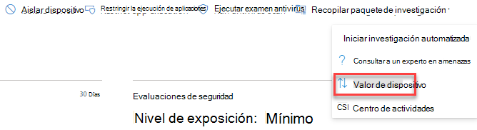
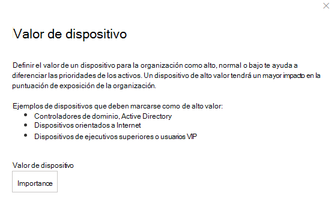

# Asignar valor de dispositivo: Administración de amenazas y vulnerabilidades

[!INCLUDE [Microsoft 365 Defender rebranding](../../includes/microsoft-defender.md)]

**Se aplica a:**

- [Microsoft Defender para punto de conexión](https://go.microsoft.com/fwlink/?linkid=2154037)
- [Amenaza y administración de vulnerabilidades](next-gen-threat-and-vuln-mgt.md)
- [Microsoft 365 Defender](https://go.microsoft.com/fwlink/?linkid=2118804)

> ¿Desea experimentar Microsoft Defender para endpoint? [Regístrate para obtener una versión de prueba gratuita.](https://www.microsoft.com/microsoft-365/windows/microsoft-defender-atp?ocid=docs-wdatp-portaloverview-abovefoldlink)

[!include[Prerelease information](../../includes/prerelease.md)]

La definición del valor de un dispositivo te ayuda a diferenciar entre las prioridades de los activos. El valor del dispositivo se usa para incorporar el apetito de riesgo de un activo individual en el Administración de amenazas y vulnerabilidades de puntuación de exposición. Los dispositivos asignados como "valor alto" recibirán más peso.

También puedes usar la [API de valor de dispositivo establecida.](set-device-value.md)

Opciones de valor del dispositivo:

- Bajo
- Normal (predeterminada)
- Alto

Ejemplos de dispositivos a los que se debe asignar un valor alto:

- Controladores de dominio, Active Directory
- Dispositivos orientados a Internet
- Dispositivos VIP
- Dispositivos que hospedan servicios de producción internos/externos

## Elegir valor de dispositivo

1. Navega a cualquier página de dispositivo, el lugar más fácil es desde el inventario de dispositivos.

2. Selecciona **Valor de dispositivo** entre tres puntos junto a la barra de acciones en la parte superior de la página.

    

3. Aparecerá un flyout con el valor del dispositivo actual y lo que significa. Revisa el valor del dispositivo y elige el que mejor se adapte a tu dispositivo.

## Cómo afecta el valor del dispositivo a la puntuación de exposición

La puntuación de exposición es un promedio ponderado en todos los dispositivos. Si tienes grupos de dispositivos, también puedes filtrar la puntuación por grupo de dispositivos.

- Los dispositivos normales tienen un peso de 1
- Los dispositivos de bajo valor tienen un peso de 0,75
- Los dispositivos de alto valor tienen un peso de NumberOfAssets / 10.
    - Si tienes 100 dispositivos, cada dispositivo de alto valor tendrá un peso de 10 (100/10)

## Temas relacionados

- [Información general sobre amenazas administración de vulnerabilidades amenazas](next-gen-threat-and-vuln-mgt.md)
- [Puntuación de exposición](tvm-exposure-score.md)
- [API](next-gen-threat-and-vuln-mgt.md#apis)