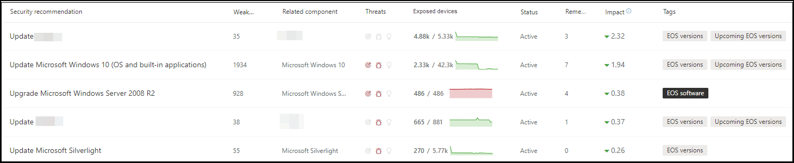
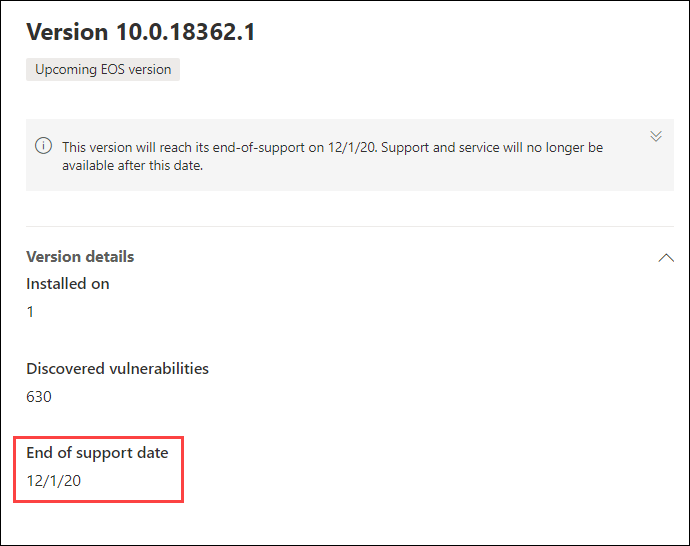

# Plan for end-of-support software and software versions with threat and vulnerability management

[!INCLUDE [Microsoft 365 Defender rebranding](../../includes/microsoft-defender.md)]

**Se aplica a:**

- [Microsoft Defender para punto de conexión](https://go.microsoft.com/fwlink/?linkid=2154037)
- [Administración de amenazas y vulnerabilidades](next-gen-threat-and-vuln-mgt.md)
- [Microsoft 365 Defender](https://go.microsoft.com/fwlink/?linkid=2118804)

>¿Desea experimentar Microsoft Defender para endpoint? [Regístrate para obtener una versión de prueba gratuita.](https://www.microsoft.com/microsoft-365/windows/microsoft-defender-atp?ocid=docs-wdatp-portaloverview-abovefoldlink)

El fin de la compatibilidad (EOS), también conocido como fin de vida (EOL), para las versiones de software o software significa que ya no se admitirán ni se les dará servicio y no recibirán actualizaciones de seguridad. Cuando usa versiones de software o software con soporte técnico finalizado, expone su organización a vulnerabilidades de seguridad, riesgos legales y financieros.

Es fundamental que los administradores de SEGURIDAD y TI trabajen juntos y se aseguren de que el inventario de software de la organización esté configurado para obtener resultados óptimos, cumplimiento y un ecosistema de red en buen estado. Deben examinar las opciones para quitar o reemplazar aplicaciones que han alcanzado versiones de fin de soporte y actualización que ya no son compatibles. Es mejor crear e implementar un **plan** antes de que finalicen las fechas de soporte técnico.

## Buscar versiones de software o software que ya no son compatibles

1. En el menú de administración de amenazas y vulnerabilidades, vaya a [**Recomendaciones de seguridad**](tvm-security-recommendation.md).
2. Vaya al panel **Filtros** y busque la sección etiquetas. Seleccione una o varias de las opciones de etiqueta de EOS. A **continuación, aplique**.

    

3. Verá una lista de recomendaciones relacionadas con el software con soporte finalizado, las versiones de software que han finalizado el soporte técnico o las versiones con el próximo final de soporte técnico. Estas etiquetas también están visibles en la [página de inventario de](tvm-software-inventory.md) software.

    

## Lista de versiones y fechas

Para ver una lista de versiones que han llegado al final de la compatibilidad, o finalizar o admitir pronto, y esas fechas, siga los pasos siguientes:

1. Aparecerá un mensaje en el control de recomendación de seguridad para software con versiones que han llegado al final del soporte técnico, o llegará al final de la compatibilidad pronto.

    

2. Seleccione el **vínculo de distribución** de versiones para ir a la página de desglose de software. Allí, puede ver una lista filtrada de versiones con etiquetas que las identifican como el final de la compatibilidad o el próximo final de la compatibilidad.

    

3. Seleccione una de las versiones de la tabla que desea abrir. Por ejemplo, versión 10.0.18362.1. Aparecerá un menú desplegable con la fecha de finalización del soporte técnico.

    

Una vez que identifique qué versiones de software y software son vulnerables debido a su estado de fin de soporte técnico, debe decidir si desea actualizarlas o quitarlas de su organización. Si lo hace, disminuirá la exposición de las organizaciones a vulnerabilidades y amenazas persistentes avanzadas.

## Temas relacionados

- [Introducción a la administración de amenazas y vulnerabilidades](next-gen-threat-and-vuln-mgt.md)
- [Recomendaciones de seguridad](tvm-security-recommendation.md)
- [Inventario de software](tvm-software-inventory.md)
