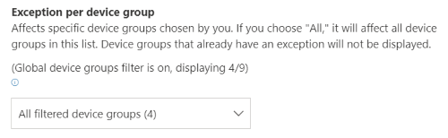
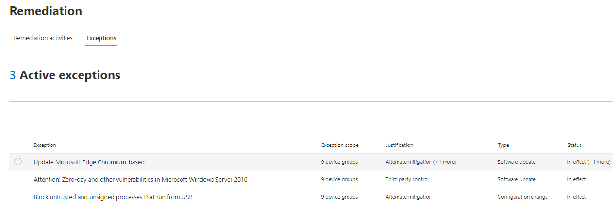

# Crear y ver excepciones para recomendaciones de seguridad: Administración de amenazas y vulnerabilidadesCreate and view exceptions for security recommendations - threat and vulnerability management

[!INCLUDE [Microsoft 365 Defender rebranding](../../includes/microsoft-defender.md)]

**Se aplica a:****Applies to:**

- [Microsoft Defender para punto de conexiónMicrosoft Defender for Endpoint](https://go.microsoft.com/fwlink/?linkid=2154037)
- [Amenaza y administración de vulnerabilidadesThreat and vulnerability management](next-gen-threat-and-vuln-mgt.md)
- [Microsoft 365 DefenderMicrosoft 365 Defender](https://go.microsoft.com/fwlink/?linkid=2118804)

>¿Desea experimentar Microsoft Defender para endpoint?Want to experience Microsoft Defender for Endpoint? [Regístrate para obtener una versión de prueba gratuita.Sign up for a free trial.](https://www.microsoft.com/microsoft-365/windows/microsoft-defender-atp?ocid=docs-wdatp-portaloverview-abovefoldlink)

Como alternativa a una solicitud de corrección cuando una recomendación no es relevante en este momento, puede crear excepciones para las recomendaciones.As an alternative to a remediation request when a recommendation is not relevant at the moment, you can create exceptions for recommendations. Si tu organización tiene grupos de dispositivos, podrás tener en cuenta la excepción para grupos de dispositivos específicos.If your organization has device groups, you will be able to scope the exception to specific device groups. Las excepciones se pueden crear para grupos de dispositivos seleccionados o para todos los grupos de dispositivos pasados y presentes.Exceptions can either be created for selected device groups, or for all device groups past and present.  

Cuando se crea una excepción para una recomendación, la recomendación no estará activa hasta el final de la duración de la excepción.When an exception is created for a recommendation, the recommendation will not be active until the end of the exception duration. El estado de recomendación cambiará a **Excepción completa** o **Excepción parcial** (por grupo de dispositivos).The recommendation state will change to **Full exception** or **Partial exception** (by device group).

## PermisosPermissions

Solo los usuarios con permisos de "control de excepciones" pueden administrar excepciones (incluida la creación o la cancelación).Only users with “exceptions handling” permissions can manage exceptions (including creating or canceling). [Obtenga más información sobre los roles RBAC](user-roles.md).[Learn more about RBAC roles](user-roles.md).

## Crear una excepciónCreate an exception

Seleccione una recomendación de seguridad para la que quiera crear una excepción y, a continuación, seleccione **Opciones de excepción** y rellene el formulario.Select a security recommendation you would like create an exception for, and then select **Exception options** and fill out the form.  

### Excepción por grupo de dispositivosException by device group

Aplica la excepción a todos los grupos de dispositivos actuales o elige grupos de dispositivos específicos.Apply the exception to all current device groups or choose specific device groups. Los grupos de dispositivos futuros no se incluirán en la excepción.Future device groups won't be included in the exception. Los grupos de dispositivos que ya tienen una excepción no se mostrarán en la lista.Device groups that already have an exception will not be displayed in the list. Si solo seleccionas determinados grupos de dispositivos, el estado de recomendación cambiará de "activo" a "excepción parcial".If you only select certain device groups, the recommendation state will change from “active” to “partial exception.” El estado cambiará a "excepción completa" si seleccionas todos los grupos de dispositivos.The state will change to “full exception” if you select all the device groups.

#### Vistas filtradasFiltered views

Si has filtrado por grupo de dispositivos en cualquiera de las Administración de amenazas y vulnerabilidades, solo los grupos de dispositivos filtrados aparecerán como opciones.If you have filtered by device group on any of the threat and vulnerability management pages, only your filtered device groups will appear as options.

Este es el botón para filtrar por grupo de dispositivos en cualquiera de las Administración de amenazas y vulnerabilidades:This is the button to filter by device group on any of the threat and vulnerability management pages: 

Vista de excepción con grupos de dispositivos filtrados:Exception view with filtered device groups:

#### Gran número de grupos de dispositivosLarge number of device groups

Si tu organización tiene más de 20 grupos de dispositivos, selecciona **Editar** junto a la opción grupo de dispositivos filtrado.If your organization has more than 20 device groups, select **Edit** next to the filtered device group option.

Aparecerá un menú desplegable donde puedes buscar y elegir los grupos de dispositivos que quieras incluir.A flyout will appear where you can search and choose device groups you want included. Seleccione el icono de marca de verificación debajo de Buscar para activar o desactivar todo.Select the check mark icon below Search to check/uncheck all.

### Excepciones globalesGlobal exceptions

Si tiene permisos de administrador global, podrá crear y cancelar una excepción global.If you have global administrator permissions, you will be able to create and cancel a global exception. Afecta a todos **los** grupos de dispositivos actuales y futuros de la organización y solo un usuario con permisos similares podría cambiarlo.It affects **all** current and future device groups in your organization, and only a user with similar permission would be able to change it. El estado de recomendación cambiará de "activo" a "excepción completa".The recommendation state will change from “active” to “full exception.”

Algunas cosas a tener en cuenta:Some things to keep in mind:

- Si una recomendación está en excepción global, las excepciones recién creadas para grupos de dispositivos se suspenderán hasta que la excepción global haya expirado o se haya cancelado.If a recommendation is under global exception, then newly created exceptions for device groups will be suspended until the global exception has expired or been cancelled. Después de ese punto, las nuevas excepciones de grupo de dispositivos se harán efectivas hasta que expiren.After that point, the new device group exceptions will go into effect until they expire.
- Si una recomendación ya tiene excepciones para grupos de dispositivos específicos y se crea una excepción global, la excepción de grupo de dispositivos se suspenderá hasta que expire o la excepción global se cancele antes de que expire.If a recommendation already has exceptions for specific device groups and a global exception is created, then the device group exception will be suspended until it expires or the global exception is cancelled before it expires.

### JustificaciónJustification

Seleccione la justificación de la excepción que necesita presentar en lugar de corregir la recomendación de seguridad en cuestión.Select your justification for the exception you need to file instead of remediating the security recommendation in question. Rellene el contexto de justificación y, a continuación, establezca la duración de la excepción.Fill out the justification context, then set the exception duration.

En la siguiente lista se detallan las justificaciones detrás de las opciones de excepción:The following list details the justifications behind the exception options:

- **Control de terceros:** un producto o software de terceros ya aborda esta recomendación: elegir este tipo de justificación reducirá la puntuación de exposición y aumentará la puntuación segura porque se reduce el riesgo**Third party control** - A third party product or software already addresses this recommendation       - Choosing this justification type will lower your exposure score and increase your secure score because your risk is reduced
- **Mitigación alternativa:** una herramienta interna ya aborda esta recomendación: elegir este tipo de justificación reducirá la puntuación de exposición y aumentará la puntuación segura porque el riesgo se reduce.**Alternate mitigation** - An internal tool already addresses this recommendation       - Choosing this justification type will lower your exposure score and increase your secure score because your risk is reduced
- **Riesgo aceptado:** el riesgo bajo o la implementación de la recomendación es demasiado caro**Risk accepted** - Poses low risk and/or implementing the recommendation is too expensive
- **Corrección planeada (gracia):** ya planeada, pero está a la espera de la ejecución o autorización**Planned remediation (grace)** - Already planned but is awaiting execution or authorization

## Ver todas las excepcionesView all exceptions

Vaya a la **pestaña Excepciones** de la **página Corrección.**Navigate to the **Exceptions** tab in the **Remediation** page. Puede filtrar por justificación, tipo y estado.You can filter by justification, type, and status.

 Seleccione una excepción para abrir un control desplegable con más detalles.Select an exception to open a flyout with more details. Las excepciones por grupo de dispositivos tendrán una lista de todos los grupos de dispositivos que cubre la excepción, que puedes exportar.Exceptions per devices group will have a list of every device group the exception covers, which you can export. También puede ver la recomendación relacionada o cancelar la excepción.You can also view the related recommendation or cancel the exception.

## Cómo cancelar una excepciónHow to cancel an exception

Para cancelar una excepción, vaya a la **pestaña Excepciones** de la **página** Corrección.To cancel an exception, navigate to the **Exceptions** tab in the **Remediation** page. Seleccione la excepción.Select the exception.

Para cancelar la excepción para todos los grupos de dispositivos o para una excepción global, selecciona el **botón Cancelar excepción para todos los** grupos de dispositivos.To cancel the exception for all device groups or for a global exception, select the **Cancel exception for all device groups** button. Solo podrás cancelar excepciones para grupos de dispositivos para los que tienes permisos.You will only be able to cancel exceptions for device groups you have permissions for.

### Cancelar la excepción de un grupo de dispositivos específicoCancel the exception for a specific device group

Selecciona el grupo de dispositivos específico para cancelar la excepción.Select the specific device group to cancel the exception for it. Aparecerá un control desplegable para el grupo de dispositivos y puedes seleccionar **Cancelar excepción**.A flyout will appear for the device group, and you can select **Cancel exception**.

## Ver impacto después de aplicar excepcionesView impact after exceptions are applied

En la página Recomendaciones seguridad,  seleccione Personalizar columnas y active las **casillas dispositivos expuestos (después** de excepciones) e **Impacto (después de excepciones).**In the Security Recommendations page, select **Customize columns** and check the boxes for **Exposed devices (after exceptions)** and **Impact (after exceptions)**.

La columna dispositivos expuestos (después de excepciones) muestra los dispositivos restantes que siguen expuestos a vulnerabilidades después de aplicar excepciones.The exposed devices (after exceptions) column shows the remaining devices that are still exposed to vulnerabilities after exceptions are applied. Las justificaciones de excepción que afectan a la exposición incluyen "control de terceros" y "mitigación alternativa".Exception justifications that affect the exposure include ‘third party control’ and ‘alternate mitigation’. Otras justificaciones no reducen la exposición de un dispositivo y aún se consideran expuestas.Other justifications do not reduce the exposure of a device, and they are still considered exposed.

El impacto (después de las excepciones) muestra el impacto restante en la puntuación de exposición o la puntuación segura después de aplicar las excepciones.The impact (after exceptions) shows remaining impact to exposure score or secure score after exceptions are applied. Las justificaciones de excepción que afectan a las puntuaciones incluyen "control de terceros" y "mitigación alternativa".Exception justifications that affect the scores include ‘third party control’ and ‘alternate mitigation.’ Otras justificaciones no reducen la exposición de un dispositivo, por lo que la puntuación de exposición y la puntuación segura no cambian.Other justifications do not reduce the exposure of a device, and so the exposure score and secure score do not change.

## Temas relacionadosRelated topics

- [Información general sobre amenazas administración de vulnerabilidades amenazasThreat and vulnerability management overview](next-gen-threat-and-vuln-mgt.md)
- [Corregir puntos vulnerablesRemediate vulnerabilities](tvm-remediation.md)
- [Recomendaciones de seguridadSecurity recommendations](tvm-security-recommendation.md)
- [Puntuación de exposiciónExposure score](tvm-exposure-score.md)
- [Puntuación de seguridad de Microsoft para dispositivosMicrosoft Secure Score for Devices](tvm-microsoft-secure-score-devices.md)
