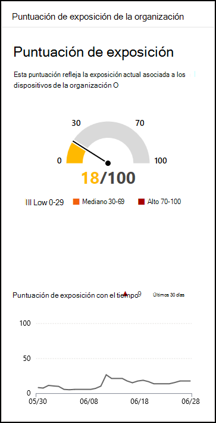

# Puntuación de exposición: administración de amenazas y vulnerabilidadesExposure score - threat and vulnerability management

[!INCLUDE [Microsoft 365 Defender rebranding](../../includes/microsoft-defender.md)]

**Se aplica a:****Applies to:**

- [Microsoft Defender para punto de conexiónMicrosoft Defender for Endpoint](https://go.microsoft.com/fwlink/?linkid=2154037)
- [Administración de amenazas y vulnerabilidadesThreat and vulnerability management](next-gen-threat-and-vuln-mgt.md)
- [Microsoft 365 DefenderMicrosoft 365 Defender](https://go.microsoft.com/fwlink/?linkid=2118804)

>¿Desea experimentar Microsoft Defender para endpoint?Want to experience Microsoft Defender for Endpoint? [Regístrate para obtener una versión de prueba gratuita.Sign up for a free trial.](https://www.microsoft.com/microsoft-365/windows/microsoft-defender-atp?ocid=docs-wdatp-portaloverview-abovefoldlink)

La puntuación de exposición está visible en el panel [de administración](tvm-dashboard-insights.md) de amenazas y vulnerabilidades del Centro de seguridad de Microsoft Defender.Your exposure score is visible in the [Threat and vulnerability management dashboard](tvm-dashboard-insights.md) of the Microsoft Defender Security Center. Refleja lo vulnerable que es su organización a las amenazas de ciberseguridad.It reflects how vulnerable your organization is to cybersecurity threats. Una puntuación de exposición baja significa que los dispositivos son menos vulnerables a la explotación.Low exposure score means your devices are less vulnerable from exploitation.

- Comprenda e identifique rápidamente los resultados de alto nivel sobre el estado de seguridad en su organización.Quickly understand and identify high-level takeaways about the state of security in your organization.
- Detectar y responder a áreas que requieren investigación o acción para mejorar el estado actual.Detect and respond to areas that require investigation or action to improve the current state.
- Comunicarse con compañeros y administración sobre el impacto de los esfuerzos de seguridad.Communicate with peers and management about the impact of security efforts.

La tarjeta te ofrece una vista de alto nivel de la tendencia de puntuación de exposición con el tiempo.The card gives you a high-level view of your exposure score trend over time. Los picos del gráfico le dan una indicación visual de una alta exposición a amenazas de ciberseguridad que puede investigar más a fondo.Any spikes in the chart give you a visual indication of a high cybersecurity threat exposure that you can investigate further.

## Cómo funcionaHow it works

La puntuación de exposición se divide en los siguientes niveles:The exposure score is broken down into the following levels:

- 0–29: puntuación de exposición baja0–29: low exposure score
- 30–69: puntuación de exposición media30–69: medium exposure score
- 70–100: puntuación de exposición alta70–100: high exposure score

Puede corregir los problemas en función de las recomendaciones de seguridad prioritarias [para](tvm-security-recommendation.md) reducir la puntuación de exposición.You can remediate the issues based on prioritized [security recommendations](tvm-security-recommendation.md) to reduce the exposure score. Cada software tiene debilidades que se transforman en recomendaciones y se priorizan en función del riesgo para la organización.Each software has weaknesses that are transformed into recommendations and prioritized based on risk to the organization.

## Reducir la exposición a amenazas y vulnerabilidadesReduce your threat and vulnerability exposure

Reduzca la exposición a amenazas y vulnerabilidades mediante la corrección de [recomendaciones de seguridad](tvm-security-recommendation.md).Lower your threat and vulnerability exposure by remediating [security recommendations](tvm-security-recommendation.md). Para obtener el mayor impacto en la puntuación de exposición, corrija las recomendaciones de seguridad más importantes, que se pueden ver en el panel de administración de amenazas y [vulnerabilidades.](tvm-dashboard-insights.md)Make the most impact to your exposure score by remediating the top security recommendations, which can be viewed in the [threat and vulnerability management dashboard](tvm-dashboard-insights.md).

## Temas relacionadosRelated topics

- [Introducción a la administración de amenazas y vulnerabilidadesThreat and vulnerability management overview](next-gen-threat-and-vuln-mgt.md)
- [Puntuación de seguridad de Microsoft para dispositivosMicrosoft Secure Score for Devices](tvm-microsoft-secure-score-devices.md)
- [Recomendaciones de seguridadSecurity recommendations](tvm-security-recommendation.md)
- [Línea de tiempo de eventosEvent timeline](threat-and-vuln-mgt-event-timeline.md)
