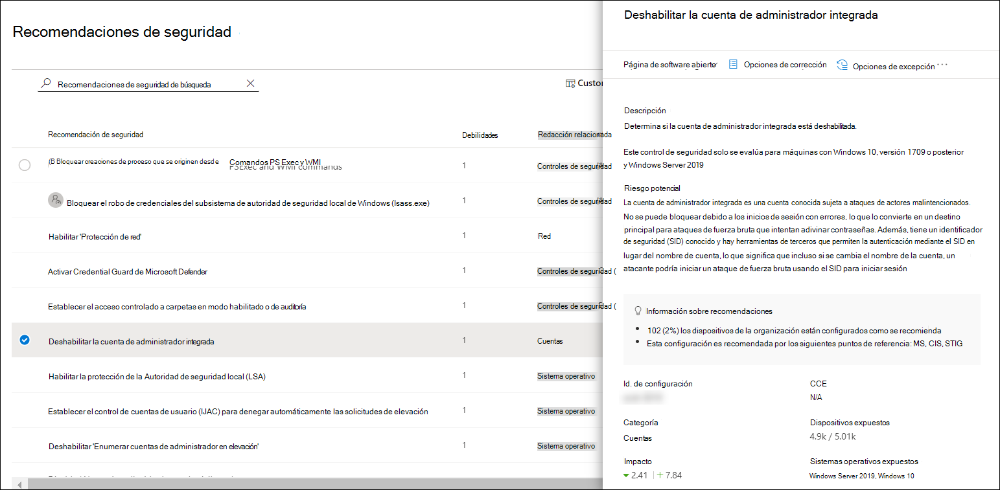

# Puntuación de seguridad de Microsoft para dispositivosMicrosoft Secure Score for Devices

[!INCLUDE [Microsoft 365 Defender rebranding](../../includes/microsoft-defender.md)]

**Se aplica a:****Applies to:**

- [Microsoft Defender para punto de conexiónMicrosoft Defender for Endpoint](https://go.microsoft.com/fwlink/?linkid=2154037)
- [Administración de amenazas y vulnerabilidadesThreat and vulnerability management](next-gen-threat-and-vuln-mgt.md)
- [Microsoft 365 DefenderMicrosoft 365 Defender](https://go.microsoft.com/fwlink/?linkid=2118804)

> ¿Desea experimentar Defender for Endpoint?Want to experience Defender for Endpoint? [Regístrate para obtener una versión de prueba gratuita.Sign up for a free trial.](https://www.microsoft.com/microsoft-365/windows/microsoft-defender-atp?ocid=docs-wdatp-pullalerts-abovefoldlink) 

>[!NOTE]
> La puntuación de configuración ahora forma parte de la administración de amenazas y vulnerabilidades como Puntuación segura de Microsoft para dispositivos.Configuration score is now part of threat and vulnerability management as Microsoft Secure Score for Devices.

La puntuación de los dispositivos está visible en el panel de [administración](tvm-dashboard-insights.md) de amenazas y vulnerabilidades del Centro de seguridad de Microsoft Defender.Your score for devices is visible in the [threat and vulnerability management dashboard](tvm-dashboard-insights.md) of the Microsoft Defender Security Center. Una puntuación segura de Microsoft más alta para dispositivos significa que los puntos de conexión son más resistentes frente a los ataques de amenazas de ciberseguridad.A higher Microsoft Secure Score for Devices means your endpoints are more resilient from cybersecurity threat attacks. Refleja el estado de configuración de seguridad colectiva de los dispositivos en las siguientes categorías:It reflects the collective security configuration state of your devices across the following categories:

- AplicaciónApplication
- Sistema operativoOperating system
- RedNetwork
- CuentasAccounts
- Controles de seguridadSecurity controls

Seleccione una categoría para ir a la [**página Recomendaciones de seguridad**](tvm-security-recommendation.md) y ver las recomendaciones pertinentes.Select a category to go to the [**Security recommendations**](tvm-security-recommendation.md) page and view the relevant recommendations.

## Activar el conector de puntuación segura de MicrosoftTurn on the Microsoft Secure Score connector

Reenvía Microsoft Defender para las señales de punto de conexión, lo que ofrece a Microsoft Secure Score visibilidad en la posición de seguridad del dispositivo.Forward Microsoft Defender for Endpoint signals, giving Microsoft Secure Score visibility into the device security posture. Los datos reenviados se almacenan y procesan en la misma ubicación que los datos de puntuación segura de Microsoft.Forwarded data is stored and processed in the same location as your Microsoft Secure Score data.

Los cambios pueden tardar hasta unas horas en reflejarse en el panel.Changes might take up to a few hours to reflect in the dashboard.

1. En el panel de navegación, vaya a **Configuración**  >  **Características avanzadas**In the navigation pane, go to **Settings** > **Advanced features** 

2. Desplácese hacia abajo **hasta Puntuación segura de Microsoft** y cambie la configuración a **On**.Scroll down to **Microsoft Secure Score** and toggle the setting to **On**.

3. Seleccione **Guardar preferencias**.Select **Save preferences**.

## Cómo funcionaHow it works

>[!NOTE]
> La puntuación segura de Microsoft para dispositivos actualmente admite configuraciones establecidas a través de la directiva de grupo.Microsoft Secure Score for Devices currently supports configurations set via Group Policy. Debido a la compatibilidad parcial actual de Intune, las configuraciones que podrían haber sido configuradas a través de Intune podrían aparecer como mal configuradas.Due to the current partial Intune support, configurations which might have been set through Intune might show up as misconfigured. Póngase en contacto con el administrador de TI para comprobar el estado de configuración real en caso de que su organización use Intune para la administración de configuración segura.Contact your IT Administrator to verify the actual configuration status in case your organization is using Intune for secure configuration management.

Los datos de la tarjeta Puntuación segura de Microsoft para dispositivos son el producto del proceso de detección de vulnerabilidades meticuloso y continuo.The data in the Microsoft Secure Score for Devices card is the product of meticulous and ongoing vulnerability discovery process. Se agrega con evaluaciones de detección de configuración que continuamente:It is aggregated with configuration discovery assessments that continuously:

- Comparar configuraciones recopiladas con los puntos de referencia recopilados para detectar activos mal configuradosCompare collected configurations to the collected benchmarks to discover misconfigured assets
- Asignar configuraciones a vulnerabilidades que se pueden corregir o corregir parcialmente (reducción de riesgos)Map configurations to vulnerabilities that can be remediated or partially remediated (risk reduction)
- Recopilar y mantener indicadores de configuración de procedimientos recomendados (proveedores, fuentes de seguridad, equipos de investigación internos)Collect and maintain best practice configuration benchmarks (vendors, security feeds, internal research teams)
- Recopilar y supervisar los cambios del estado de configuración del control de seguridad de todos los activosCollect and monitor changes of security control configuration state from all assets

## Mejorar la configuración de seguridadImprove your security configuration

Mejore la configuración de seguridad mediante la corrección de problemas de la lista de recomendaciones de seguridad.Improve your security configuration by remediating issues from the security recommendations list. Al hacerlo, la puntuación segura de Microsoft para dispositivos mejora y la organización se vuelve más resistente frente a las amenazas y vulnerabilidades de ciberseguridad.As you do so, your Microsoft Secure Score for Devices improves and your organization becomes more resilient against cybersecurity threats and vulnerabilities.

1. En la tarjeta Puntuación segura de Microsoft para dispositivos en el panel de administración de amenazas y vulnerabilidades, seleccione una de las categorías.From the Microsoft Secure Score for Devices card in the threat and vulnerability management dashboard, select the one of the categories. Verá la lista de recomendaciones relacionadas con esa categoría.You'll view the list of recommendations related to that category. Le llevará a la página Recomendaciones [**de**](tvm-security-recommendation.md) seguridad.It will take you to the [**Security recommendations**](tvm-security-recommendation.md) page. Si desea ver todas las recomendaciones de seguridad, una vez que llegue a la página Recomendaciones de seguridad, desactive el campo de búsqueda.If you want to see all security recommendations, once you get to the Security recommendations page, clear the search field.

2. Seleccione un elemento en la lista.Select an item on the list. El panel desplegable se abrirá con detalles relacionados con la recomendación.The flyout panel will open with details related to the recommendation. Seleccione **Opciones de corrección**.Select **Remediation options**.

   

3. Lea la descripción para comprender el contexto del problema y qué hacer a continuación.Read the description to understand the context of the issue and what to do next. Seleccione una fecha de vencimiento, agregue notas y **seleccione Exportar** todos los datos de actividad de corrección a CSV para poder adjuntarlos a un correo electrónico para su seguimiento.Select a due date, add notes, and select **Export all remediation activity data to CSV** so you can attach it to an email for follow-up.

4. **Enviar solicitud**.**Submit request**. Verá un mensaje de confirmación de que se ha creado la tarea de corrección.You'll see a confirmation message that the remediation task has been created.
   

5. Guarde el archivo CSV.Save your CSV file.
   

6. Envíe un correo electrónico de seguimiento a su administrador de TI y permita el tiempo que haya asignado para que la corrección se propague en el sistema.Send a follow-up email to your IT Administrator and allow the time that you've allotted for the remediation to propagate in the system.

7. Revisa la **tarjeta Puntuación segura de Microsoft para** dispositivos de nuevo en el panel.Review the **Microsoft Secure Score for Devices** card again on the dashboard. El número de recomendaciones de controles de seguridad disminuirá.The number of security controls recommendations will decrease. Cuando selecciona **Controles de seguridad**  para volver a la página Recomendaciones de seguridad, el elemento que ha abordado ya no aparecerá en la lista.When you select **Security controls** to go back to the **Security recommendations** page, the item that you've addressed won't be listed there anymore. La puntuación segura de Microsoft para dispositivos debe aumentar.Your Microsoft Secure Score for Devices should increase.

>[!IMPORTANT]
>Para aumentar las tasas de detección de evaluación de vulnerabilidades, descargue las siguientes actualizaciones de seguridad obligatorias e impleméntelas en la red:To boost your vulnerability assessment detection rates, download the following mandatory security updates and deploy them in your network:
>- Clientes de 19H1 | [KB 4512941](https://support.microsoft.com/help/4512941/windows-10-update-kb4512941)19H1 customers | [KB 4512941](https://support.microsoft.com/help/4512941/windows-10-update-kb4512941)
>- Clientes de RS5 | [KB 4516077](https://support.microsoft.com/help/4516077/windows-10-update-kb4516077)RS5 customers | [KB 4516077](https://support.microsoft.com/help/4516077/windows-10-update-kb4516077)
>- Clientes de RS4 | [KB 4516045](https://support.microsoft.com/help/4516045/windows-10-update-kb4516045)RS4 customers | [KB 4516045](https://support.microsoft.com/help/4516045/windows-10-update-kb4516045)
>- Clientes de RS3 | [KB 4516071](https://support.microsoft.com/help/4516071/windows-10-update-kb4516071)RS3 customers | [KB 4516071](https://support.microsoft.com/help/4516071/windows-10-update-kb4516071)
>
>Para descargar las actualizaciones de seguridad:To download the security updates:
>1. Vaya a [Catálogo de Microsoft Update](https://www.catalog.update.microsoft.com/home.aspx).Go to [Microsoft Update Catalog](https://www.catalog.update.microsoft.com/home.aspx).
>2. Clave en el número KB de actualización de seguridad que necesita descargar y, a continuación, haga clic en **Buscar**.Key-in the security update KB number that you need to download, then click **Search**.  

## Temas relacionadosRelated topics

- [Introducción a la administración de amenazas y vulnerabilidadesThreat and vulnerability management overview](next-gen-threat-and-vuln-mgt.md)
- [PanelDashboard](tvm-dashboard-insights.md)
- [Puntuación de exposiciónExposure score](tvm-exposure-score.md)
- [Recomendaciones de seguridadSecurity recommendations](tvm-security-recommendation.md)
