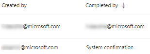
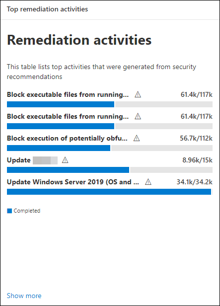

# Corregir vulnerabilidades con la administración de amenazas y vulnerabilidades

[!INCLUDE [Microsoft 365 Defender rebranding](../../includes/microsoft-defender.md)]

**Se aplica a:**
- [Microsoft Defender para punto de conexión](https://go.microsoft.com/fwlink/?linkid=2154037)
- [Administración de amenazas y vulnerabilidades](next-gen-threat-and-vuln-mgt.md)
- [Microsoft 365 Defender](https://go.microsoft.com/fwlink/?linkid=2118804)

>¿Desea experimentar Microsoft Defender para endpoint? [Regístrate para obtener una versión de prueba gratuita.](https://www.microsoft.com/microsoft-365/windows/microsoft-defender-atp?ocid=docs-wdatp-portaloverview-abovefoldlink)

## Corrección de solicitudes

La capacidad de administración de amenazas y vulnerabilidades en Microsoft Defender para endpoints hace que se solucione la diferencia entre los administradores de SEGURIDAD y TI a través del flujo de trabajo de solicitud de corrección. Los administradores de seguridad como usted pueden solicitar al administrador de TI que corrija una vulnerabilidad de las **páginas** de recomendaciones de seguridad a Intune.

### Habilitar la conexión de Microsoft Intune

Para usar esta funcionalidad, habilite las conexiones de Microsoft Intune. En el Centro de seguridad de Microsoft Defender, vaya **a Configuración**  >  **General**  >  **Advanced features**. Desplácese hacia abajo y busque **la conexión de Microsoft Intune**. De forma predeterminada, la alternancia está desactivada. Activar la **alternancia de conexión de Microsoft Intune** . 

**Nota:** Si tienes habilitada la conexión de Intune, obtienes una opción para crear una tarea de seguridad de Intune al crear una solicitud de corrección. Esta opción no aparece si la conexión no está establecida.

Consulta [Usar Intune para corregir las vulnerabilidades identificadas por Microsoft Defender para obtener más](https://docs.microsoft.com/intune/atp-manage-vulnerabilities) información.

### Pasos de solicitud de corrección

1. Vaya al menú de navegación de administración de amenazas y vulnerabilidades en el Centro de seguridad de Microsoft Defender y seleccione [**Recomendaciones de seguridad**](tvm-security-recommendation.md).

2. Seleccione una recomendación de seguridad para la que desea solicitar corrección y, a continuación, seleccione **Opciones de corrección**.

3. Rellene el formulario, incluidos los grupos de dispositivos aplicables, la prioridad, la fecha de vencimiento y las notas opcionales.
    1. Si elige la opción de corrección "atención requerida", la selección de una fecha de vencimiento no estará disponible ya que no hay ninguna acción específica.

4. Seleccione **Enviar solicitud**. Enviar una solicitud de corrección crea un elemento de actividad de corrección dentro de la administración de amenazas y vulnerabilidades, que se puede usar para supervisar el progreso de corrección de esta recomendación. Esto no desencadenará una corrección ni aplicará ningún cambio en los dispositivos.

5. Notifique al administrador de TI acerca de la nueva solicitud y haga que inicie sesión en Intune para aprobar o rechazar la solicitud e iniciar una implementación de paquete.

6. Vaya a la [**página Corrección**](tvm-remediation.md) para ver el estado de la solicitud de corrección.

Si quieres comprobar cómo se muestra el vale en Intune, consulta Usar Intune para corregir las vulnerabilidades identificadas por [Microsoft Defender](https://docs.microsoft.com/intune/atp-manage-vulnerabilities) para endpoint para obtener más información.

>[!NOTE]
>Si la solicitud implica la corrección de más de 10 000 dispositivos, solo podemos enviar 10 000 dispositivos para su corrección a Intune.

Después de identificar y asignar las debilidades de seguridad cibernética de su organización a recomendaciones de seguridad que se pueden [realizar,](tvm-security-recommendation.md)comience a crear tareas de seguridad. Puede crear tareas a través de la integración con Microsoft Intune donde se crean vales de corrección.

Reduzca la exposición de su organización a las vulnerabilidades y aumente la configuración de seguridad mediante la corrección de las recomendaciones de seguridad.

## Ver las actividades de corrección

Cuando envía una solicitud de corrección desde la página Recomendaciones de seguridad, inicia una actividad de corrección. Se crea una tarea de seguridad que se puede  realizar un seguimiento en la página de corrección de la administración de amenazas y vulnerabilidades, y se crea un vale de corrección en Microsoft Intune.

Si elige la opción de corrección "atención requerida", no habrá ninguna barra de progreso, estado de vale o fecha de vencimiento, ya que no hay ninguna acción real que podamos supervisar.

Una vez que se encuentra en la página Corrección, seleccione la actividad de corrección que desea ver. Puede seguir los pasos de corrección, realizar un seguimiento del progreso, ver la recomendación relacionada, exportar a CSV o marcar como completada.

>[!NOTE]
> Hay un período de retención de 180 días para las actividades de corrección completadas. Para mantener el rendimiento óptimo de la página Corrección, la actividad de corrección se quitará 6 meses después de su finalización.

### Completado por columna

Realice un seguimiento de quién cerró la actividad de corrección con la columna "Completado por" en la página Corrección.

- **Dirección de correo** electrónico: el correo electrónico de la persona que completó manualmente la tarea
- **Confirmación del** sistema: la tarea se completó automáticamente (se han corregido todos los dispositivos)
- **N/A:** la información no está disponible porque no sabemos cómo se completó esta tarea anterior

### Principales actividades de corrección en el panel

Ver **las principales actividades de corrección** en el panel de administración de amenazas y [vulnerabilidades.](tvm-dashboard-insights.md) Seleccione cualquiera de las entradas para ir a la **página Corrección.** Puede marcar la actividad de corrección como completada después de que el equipo de administración de TI corrija la tarea.

## Artículos relacionados

- [Introducción a la administración de amenazas y vulnerabilidades](next-gen-threat-and-vuln-mgt.md)
- [Panel](tvm-dashboard-insights.md)
- [Recomendaciones de seguridad](tvm-security-recommendation.md)