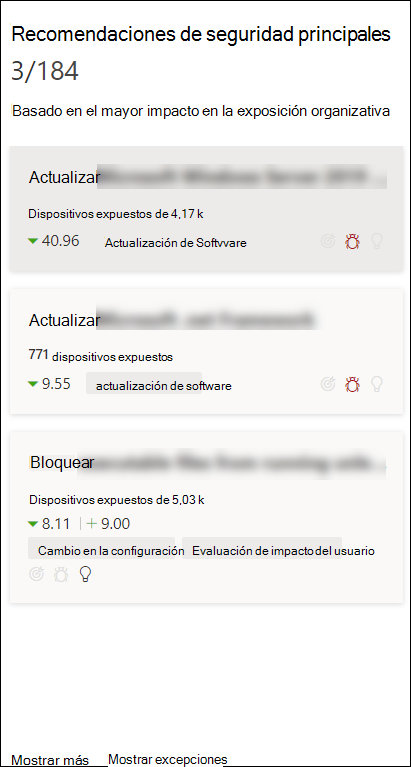
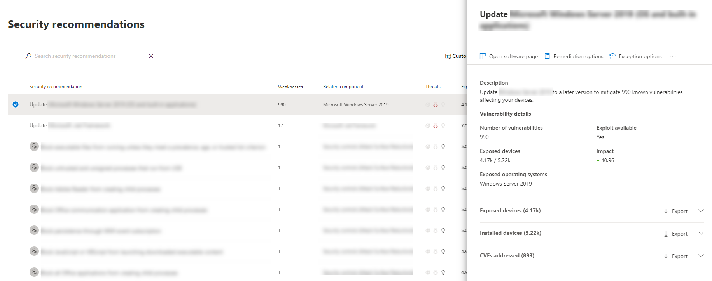
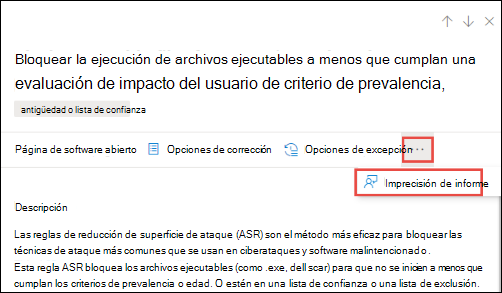

# Recomendaciones de seguridad: administración de amenazas y vulnerabilidades

[!INCLUDE [Microsoft 365 Defender rebranding](../../includes/microsoft-defender.md)]

**Se aplica a:**

- [Microsoft Defender para punto de conexión](https://go.microsoft.com/fwlink/?linkid=2154037)
- [Administración de amenazas y vulnerabilidades](next-gen-threat-and-vuln-mgt.md)
- [Microsoft 365 Defender](https://go.microsoft.com/fwlink/?linkid=2118804)

>¿Desea experimentar Microsoft Defender para endpoint? [Regístrate para obtener una versión de prueba gratuita.](https://www.microsoft.com/microsoft-365/windows/microsoft-defender-atp?ocid=docs-wdatp-portaloverview-abovefoldlink)

Las debilidades de seguridad cibernética identificadas en su organización se asignan a recomendaciones de seguridad que se pueden usar y se priorizan por su impacto. Las recomendaciones prioritarias ayudan a acortar el tiempo para mitigar o corregir las vulnerabilidades e impulsar el cumplimiento.

Cada recomendación de seguridad incluye pasos de corrección que se pueden tomar. Para ayudar con la administración de tareas, la recomendación también se puede enviar con Microsoft Intune y Microsoft Endpoint Configuration Manager. Cuando cambia el panorama de amenazas, la recomendación también cambia a medida que recopila continuamente información del entorno.

>[!TIP]
>Para obtener correos electrónicos sobre nuevos eventos de vulnerabilidad, consulte [Configure vulnerability email notifications in Microsoft Defender for Endpoint](configure-vulnerability-email-notifications.md)

## Cómo funciona

Cada dispositivo de la organización se puntua en función de tres factores importantes para ayudar a los clientes a centrarse en las cosas correctas en el momento adecuado.

- **Amenaza:** características de las vulnerabilidades y vulnerabilidades en los dispositivos de la organización y el historial de infracciones. En función de estos factores, las recomendaciones de seguridad muestran los vínculos correspondientes a alertas activas, campañas de amenazas en curso y sus correspondientes informes analíticos de amenazas.

- **Probabilidad de vulneración:** la posición de seguridad y resistencia de la organización frente a las amenazas

- **Valor empresarial:** activos, procesos críticos y propiedades intelectuales de la organización

## Vaya a la página Recomendaciones de seguridad

Acceda a la página Recomendaciones de seguridad de varias maneras diferentes:

- Menú de navegación de administración de amenazas y vulnerabilidades en el [Centro de seguridad de Microsoft Defender](portal-overview.md)
- Recomendaciones de seguridad principales en el panel de administración de [amenazas y vulnerabilidades](tvm-dashboard-insights.md)

Vea las recomendaciones de seguridad relacionadas en los siguientes lugares:

- Página de software
- Página del dispositivo

### Menú navegación

Vaya al menú de navegación de administración de amenazas y vulnerabilidades y seleccione **Recomendaciones de seguridad.** La página contiene una lista de recomendaciones de seguridad para las amenazas y vulnerabilidades encontradas en su organización.

### Recomendaciones de seguridad principales en el panel de administración de amenazas y vulnerabilidades

En un día determinado como administrador de seguridad,  puedes echar un vistazo  al panel de administración de amenazas y vulnerabilidades para ver la puntuación de exposición en paralelo con la puntuación segura de Microsoft para [dispositivos.](tvm-microsoft-secure-score-devices.md) El objetivo es reducir **la** exposición de la  organización frente a vulnerabilidades y aumentar la seguridad del dispositivo de la organización para que sea más resistente frente a los ataques de amenazas de ciberseguridad. La lista de recomendaciones de seguridad superior puede ayudarle a lograr ese objetivo.

Las recomendaciones de seguridad principales incluyen las oportunidades de mejora priorizadas en función de los factores importantes mencionados en la sección anterior: amenaza, probabilidad de vulneración y valor. La selección de una recomendación le llevará a la página de recomendaciones de seguridad con más detalles.

## Introducción a las recomendaciones de seguridad

Vea recomendaciones, número de puntos débiles encontrados, componentes relacionados, información sobre amenazas, número de dispositivos expuestos, estado, tipo de corrección, actividades de corrección, impacto en la puntuación de exposición y Puntuación segura de Microsoft para dispositivos y etiquetas asociadas.

El color del gráfico de **dispositivos expuestos** cambia a medida que cambia la tendencia. Si el número de dispositivos expuestos va en aumento, el color cambia a rojo. Si hay una disminución en el número de dispositivos expuestos, el color del gráfico cambiará a verde.

>[!NOTE]
>La administración de amenazas y vulnerabilidades muestra los dispositivos que estaban en uso hasta **hace 30** días. Esto es diferente del resto de Microsoft Defender para Endpoint, donde si un dispositivo no ha estado en uso durante más de 7 días tiene un estado "Inactivo".

### Iconos

Los iconos útiles también llaman rápidamente la atención sobre:
-  posibles alertas activas
-  vulnerabilidades públicas asociadas
-  recomendaciones

### Explorar opciones de recomendación de seguridad

Seleccione la recomendación de seguridad que desea investigar o procesar.

En el menú desplegable, puede elegir cualquiera de las siguientes opciones:

- **Página de software abierto:** abra la página de software para obtener más contexto en el software y cómo se distribuye. La información puede incluir contexto de amenaza, recomendaciones asociadas, debilidades detectadas, número de dispositivos expuestos, vulnerabilidades detectadas, nombres y detalles de dispositivos con el software instalado y distribución de versiones.

- [**Opciones de corrección:**](tvm-remediation.md) envíe una solicitud de corrección para abrir un vale en Microsoft Intune para que el administrador de TI pueda recoger y dirigirse. Realice un seguimiento de la actividad de corrección en la página Corrección.

- [**Opciones de excepción:**](tvm-exception.md) envíe una excepción, proporcione una justificación y establezca la duración de la excepción si aún no puede corregir el problema.

>[!NOTE]
>Cuando se realiza un cambio de software en un dispositivo, normalmente los datos tardan dos horas en reflejarse en el portal de seguridad. Sin embargo, a veces puede tardar más tiempo. Los cambios de configuración pueden tardar entre 4 y 24 horas.

### Investigar los cambios en la exposición o el impacto del dispositivo

If there is a large jump in the number of exposed devices, or a sharp increase in the impact on your organization exposure score and Microsoft Secure Score for Devices, then that security recommendation is worth investigating.

1. Seleccione la recomendación y **la página Abrir software**
2. Seleccione la **pestaña Escala de tiempo** de eventos para ver todos los eventos de impacto relacionados con ese software, como nuevas vulnerabilidades o nuevas vulnerabilidades públicas. [Más información sobre la escala de tiempo de eventos](threat-and-vuln-mgt-event-timeline.md)
3. Decidir cómo abordar el aumento o la exposición de su organización, como enviar una solicitud de corrección

## Corrección de solicitudes

La capacidad de corrección de la administración de amenazas y vulnerabilidades separa la brecha entre los administradores de SEGURIDAD y TI a través del flujo de trabajo de solicitud de corrección. Los administradores de seguridad como puede solicitar al administrador de TI que corrija una vulnerabilidad desde la página Recomendación **de** seguridad a Intune. [Más información sobre las opciones de corrección](tvm-remediation.md)

### Cómo solicitar corrección

Seleccione una recomendación de seguridad para la que desea solicitar corrección y, a continuación, seleccione **Opciones de corrección**. Rellene el formulario y seleccione **Enviar solicitud**. Vaya a la [**página Corrección**](tvm-remediation.md) para ver el estado de la solicitud de corrección. [Obtenga más información sobre cómo solicitar corrección](tvm-remediation.md#request-remediation)

## Archivo para excepción

Como alternativa a una solicitud de corrección cuando una recomendación no es relevante en este momento, puede crear excepciones para las recomendaciones. [Más información sobre las excepciones](tvm-exception.md)

Solo los usuarios con permisos de "control de excepciones" pueden agregar excepciones. [Obtenga más información sobre los roles RBAC](user-roles.md).

Cuando se crea una excepción para una recomendación, la recomendación ya no está activa. El estado de recomendación cambiará a **Excepción completa** o **Excepción parcial** (por grupo de dispositivos).

### Cómo crear una excepción

Seleccione una recomendación de seguridad para la que quiera crear una excepción y, a continuación, seleccione **Opciones de excepción**.  

Rellene el formulario y envíelo. Para ver todas las excepciones (actuales  y pasadas), vaya a la página Corrección en el menú Administración de vulnerabilidades de **threat &** y seleccione la pestaña **Excepciones.** Obtenga más información sobre cómo crear [una](tvm-exception.md#create-an-exception) excepción

## Imprecisión de informe

Puede informar de un falso positivo cuando vea información imprecisa, inexacta, incompleta o que ya haya corregido la recomendación de seguridad.

1. Abra la recomendación seguridad.

2. Seleccione los tres puntos junto a la recomendación de seguridad que desea notificar y, a continuación, seleccione **Informar de imprecisión.**

    

3. En el panel desplegable, seleccione la categoría de imprecisión en el menú desplegable, rellene su dirección de correo electrónico y detalles sobre la imprecisión.

4. Seleccione **Enviar**. Sus comentarios se envían inmediatamente a los expertos en administración de amenazas y vulnerabilidades.

## Artículos relacionados

- [Introducción a la administración de amenazas y vulnerabilidades](next-gen-threat-and-vuln-mgt.md)
- [Panel](tvm-dashboard-insights.md)
- [Puntuación de exposición](tvm-exposure-score.md)
- [Puntuación de seguridad de Microsoft para dispositivos](tvm-microsoft-secure-score-devices.md)
- [Corregir puntos vulnerables](tvm-remediation.md)
- [Crear y ver excepciones para recomendaciones de seguridad](tvm-exception.md)
- [Línea de tiempo de eventos](threat-and-vuln-mgt-event-timeline.md)
