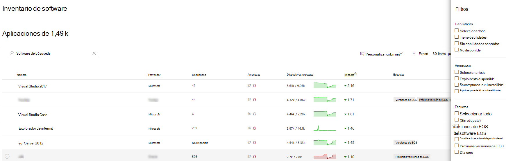
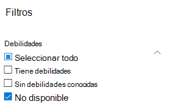

# Inventario de software: Administración de amenazas y vulnerabilidades

[!INCLUDE [Microsoft 365 Defender rebranding](../../includes/microsoft-defender.md)]

**Se aplica a:**
- [Microsoft Defender para punto de conexión](https://go.microsoft.com/fwlink/?linkid=2154037)
- [Amenaza y administración de vulnerabilidades](next-gen-threat-and-vuln-mgt.md)
- [Microsoft 365 Defender](https://go.microsoft.com/fwlink/?linkid=2118804)

>¿Desea experimentar Defender for Endpoint? [Regístrate para obtener una versión de prueba gratuita.](https://www.microsoft.com/microsoft-365/windows/microsoft-defender-atp?ocid=docs-wdatp-portaloverview-abovefoldlink)

El inventario de software en Administración de amenazas y vulnerabilidades es una lista de software conocido en su organización con enumeraciones de plataforma [común (CPE) oficiales.](https://nvd.nist.gov/products/cpe) Los productos de software sin CPE oficiales no tienen vulnerabilidades publicadas. También incluye detalles como el nombre del proveedor, el número de debilidades, las amenazas y el número de dispositivos expuestos.

## Cómo funciona

En el campo de la detección, estamos aprovechando el mismo conjunto de señales responsables de la detección y evaluación de vulnerabilidades en Microsoft Defender para la detección de puntos de conexión y las capacidades [de respuesta.](overview-endpoint-detection-response.md)

Dado que es en tiempo real, en cuestión de minutos, verá información de vulnerabilidad a medida que se descubran. El motor captura automáticamente información de varias fuentes de seguridad. De hecho, verás si un software determinado está conectado a una campaña de amenazas en directo. También proporciona un vínculo a un informe de Análisis de amenazas tan pronto como esté disponible.

## Vaya a la página Inventario de software

Para obtener acceso a la página Inventario de software, seleccione **Inventario** de software en el menú Administración de amenazas y vulnerabilidades navegación de la [Centro de seguridad de Microsoft Defender](portal-overview.md).

Ver software en dispositivos específicos en las páginas de dispositivos individuales de la [lista de dispositivos](machines-view-overview.md).

>[!NOTE]
>Si busca software con la búsqueda global de Microsoft Defender para endpoint, asegúrese de colocar un carácter de subrayado en lugar de un espacio. Por ejemplo, para obtener los mejores resultados de búsqueda, escribirías "windows_10" en lugar de "Windows 10".

## Introducción al inventario de software

La **página** Inventario de software se abre con una lista de software instalado en la red, incluido el nombre del proveedor, las debilidades encontradas, las amenazas asociadas a ellos, los dispositivos expuestos, el impacto en la puntuación de exposición y las etiquetas.

Puede filtrar la vista de lista en función de las debilidades encontradas en el software, las amenazas asociadas con ellos y las etiquetas como si el software ha llegado al final de la compatibilidad.

Seleccione el software que desea investigar. Se abrirá un panel desplegable con una vista más compacta de la información de la página. Puede profundizar en la investigación y seleccionar Abrir **página de software,** o marcar cualquier incoherencia técnica seleccionando **Imprecisión de informe.**

### Software que no es compatible

El software que actualmente no es compatible con amenazas & administración de vulnerabilidades puede estar presente en la página Inventario de software. Como no se admite, solo estarán disponibles datos limitados. Filtra por software no compatible con la opción "No disponible" en la sección "Debilidad".

Lo siguiente indica que no se admite un software:

- El campo Debilidades muestra "No disponible"
- El campo Dispositivos expuestos muestra un guión
- Texto informativo agregado en el panel lateral y en la página de software
- La página de software no tendrá las recomendaciones de seguridad, vulnerabilidades detectadas ni secciones de escala de tiempo de eventos

Actualmente, los productos sin CPE no se muestran en la página de inventario de software, solo en el inventario de software de nivel de dispositivo.

## Inventario de software en dispositivos

En el panel Centro de seguridad de Microsoft Defender navegación, vaya a la **[lista Dispositivos](machines-view-overview.md)**. Selecciona el nombre de un dispositivo para abrir la página  del dispositivo (como Computer1) y luego selecciona la pestaña Inventario de software para ver una lista de todo el software conocido presente en el dispositivo. Seleccione una entrada de software específica para abrir el menú desplegable con más información.

El software puede estar visible en el nivel del dispositivo incluso si actualmente no es compatible con Administración de amenazas y vulnerabilidades. Sin embargo, solo estarán disponibles datos limitados. Sabrás si el software no es compatible porque dirá "No disponible" en la columna "Debilidad".

El software sin CPE también puede aparecer en este inventario de software específico del dispositivo.

### Pruebas de software

Consulta la evidencia de dónde hemos detectado un software específico en un dispositivo desde el registro, el disco o ambos. Puedes encontrarlo en cualquier dispositivo en el inventario de software del dispositivo.

Seleccione un nombre de software para abrir el menú desplegable y busque la sección denominada "Evidencia de software".

## Páginas de software

Puede ver las páginas de software de varias maneras diferentes:

- Página de inventario de > Seleccione un nombre de software > Página Seleccionar **software abierto** en el control desplegable
- [Página recomendaciones de](tvm-security-recommendation.md) seguridad > Seleccionar una recomendación > Página Seleccionar **software abierto** en el control desplegable
- [Página](threat-and-vuln-mgt-event-timeline.md) escala de tiempo de eventos > Seleccione un evento > Seleccione el nombre de software con hipervínculo (como Visual Studio 2017) en la sección denominada "Componente relacionado" en el control desplegable

 Aparecerá una página completa con todos los detalles de un software específico y la siguiente información:

- Panel lateral con información del proveedor, prevalencia del software en la organización (incluido el número de dispositivos en los que está instalado y dispositivos expuestos que no están parcheados), si está disponible y la vulnerabilidad de vulnerabilidad y el impacto en la puntuación de exposición.
- Visualizaciones de datos que muestran el número y la gravedad de vulnerabilidades y configuraciones erróneas. Además, gráficos con el número de dispositivos expuestos.
- Pestañas que muestran información como:
    - Recomendaciones de seguridad correspondientes para las debilidades y vulnerabilidades identificadas.
    - CVEs con nombre de vulnerabilidades detectadas.
    - Dispositivos que tienen instalado el software (junto con el nombre del dispositivo, el dominio, el sistema operativo y mucho más).
    - Lista de versiones de software (incluido el número de dispositivos en los que está instalada la versión, el número de vulnerabilidades detectadas y los nombres de los dispositivos instalados).

    

## Imprecisión de informe

Informe de un falso positivo cuando vea información imprecisa, inexacta o incompleta. También puede informar sobre las recomendaciones de seguridad que ya se han corregido.

1. Abra el control desplegable de software en la página Inventario de software.
2. Seleccione **Error de informe**.
3. En el panel desplegable, seleccione la categoría de imprecisión en el menú desplegable, rellene la dirección de correo electrónico y los detalles sobre la imprecisión.
4. Seleccione **Enviar**. Sus comentarios se envían inmediatamente a los Administración de amenazas y vulnerabilidades expertos.

## Artículos relacionados

- [Información general sobre amenazas administración de vulnerabilidades amenazas](next-gen-threat-and-vuln-mgt.md)
- [Recomendaciones de seguridad](tvm-security-recommendation.md)
- [Línea de tiempo de eventos](threat-and-vuln-mgt-event-timeline.md)
- [Ver y organizar la lista de Microsoft Defender para dispositivos de punto de conexión](machines-view-overview.md)
